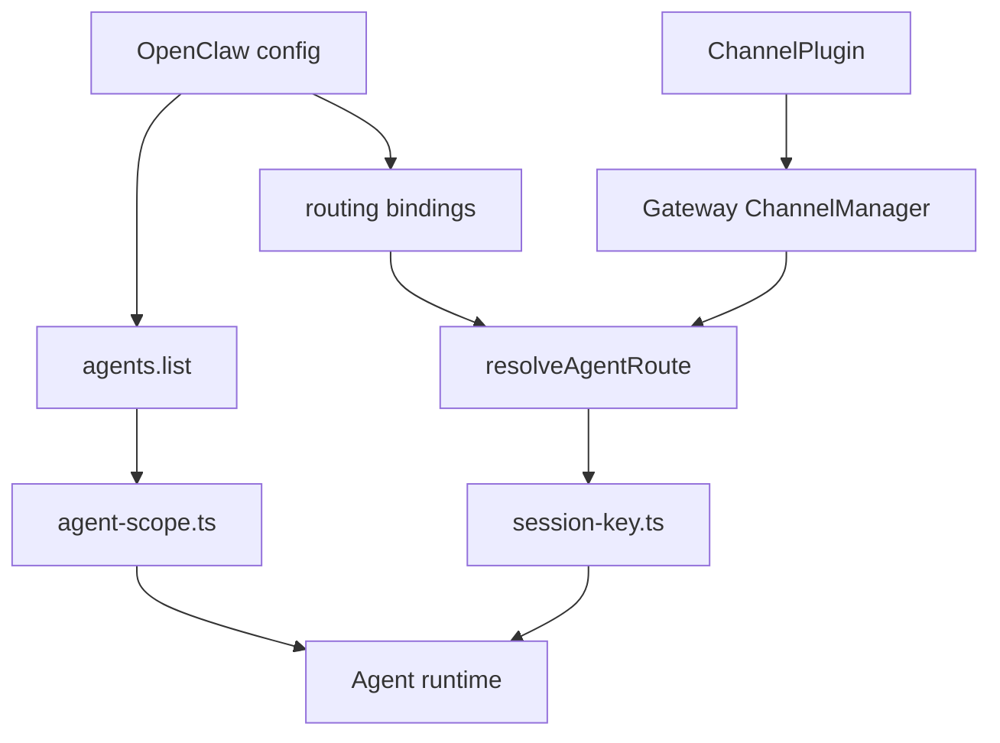
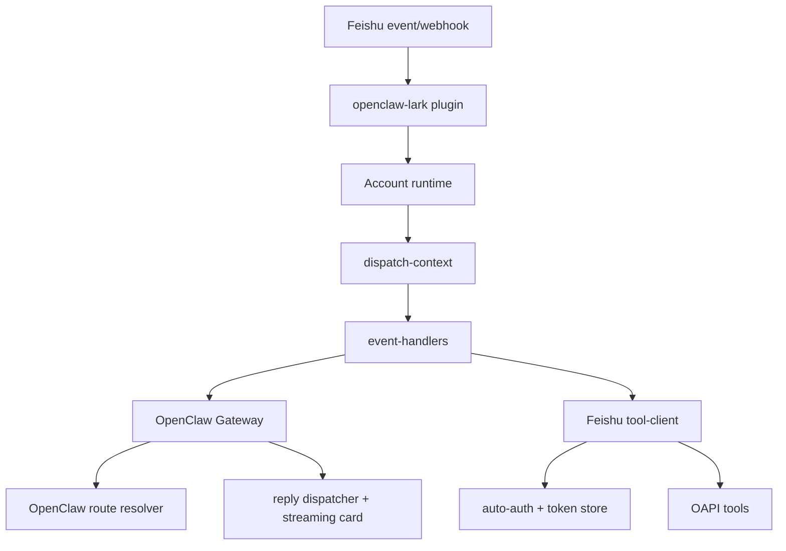
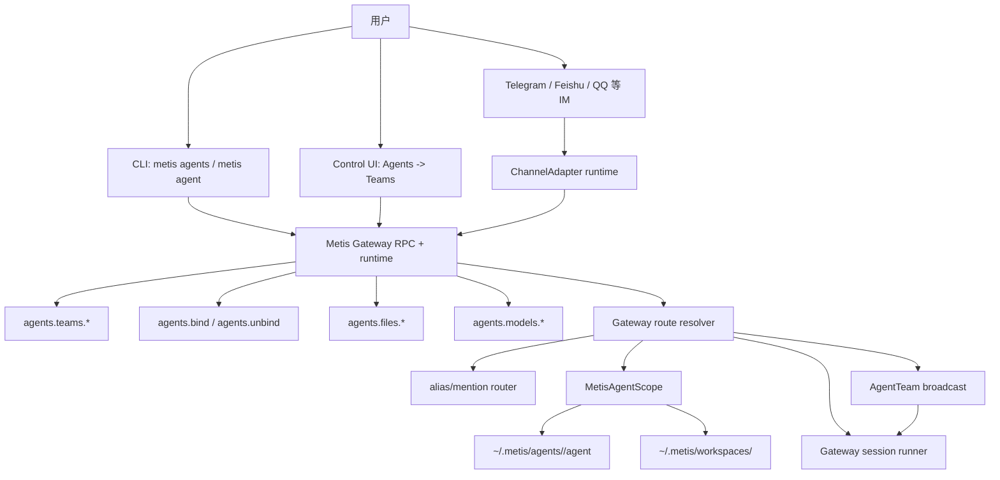

# Metis Agent Team 系列 11：Phase 0-9 后源码复查、GAP 量化与补齐计划

日期：2026-05-14

基线提交：`f105bf7 Complete AgentTeam Feishu OpenClaw parity phases`

历史基线：

- `develop_steps/metis-agent-team-series-10-feishu-openclaw-source-recheck-gap-quantification-and-landing-plan-2026-05-14.md`
- `develop_steps/metis-agent-team-series-09-prioritized-implementation-plan-2026-05-14.md`

## 1. 范围与证据规则

本文重新复查飞书 Claw、OpenClaw、OpenClaw-Lark 与当前 Metis 在 Agent Team 方向上的实现状态。本文只做分析、使用说明、GAP 识别和补齐计划，不修改代码。

证据规则：

- 本文所有 GAP 均以网页信息或源码事实为依据，不使用文件名印象、历史记忆或产品预期直接下结论。
- OpenClaw-Lark 源码目录 `/Users/l3gi0n/work/workspace_cangjie/openclaw-lark/src` 当前共有 192 个 TypeScript 文件，源码行数 45199 行。
- OpenClaw 主项目较大，本文聚焦 Agent Team scope、routing、session key 与 Gateway channel 生命周期相关文件。
- Metis 证据基于当前本地 `main` 的 `f105bf7` 之后状态。
- 只通过 fake/local test 覆盖、尚未接入真实飞书应用验证的能力，会明确标注为“未 live 验证”。

## 2. 网页证据

飞书官方 Agent Team 文章：

- `https://www.feishu.cn/content/article/7629286303804329160`
- 文章描述的是一个飞书群内可部署多个专业智能体的 Agent Team：不同 agent 分工、任务拆解、协作交接、最终通过 IM 输出。
- 文章还描述了可视化管理系统，包含版本管理、模型管理、agent 配置、飞书频道配置和自动问题诊断。

飞书官方 OpenClaw-Lark 插件文章：

- `https://www.feishu.cn/content/article/7613711414611463386`
- 文章描述飞书插件通过用户授权访问飞书消息、文档、日历、多维表格等资源。
- 文章提到 `/feishu auth`、`/feishu start`、streaming card 配置、footer 配置、`channels.feishu.threadSession`、群策略，以及广泛的飞书 OAPI 能力。

对 Metis 的含义：

- Agent Team 不只是“多份 agent 配置”。用户可感知目标应包括：可管理的专业 agent 团队、每个 agent 独立模型与 profile 文件、独立 workspace、IM channel binding、飞书 OAuth/OAPI、rich reply/streaming card，以及可视化管理页面。

## 3. OpenClaw 与 OpenClaw-Lark 源码架构

### 3.1 OpenClaw Core：agent scope、route 与 Gateway channel

源码事实：

- `openclaw/src/agents/agent-scope.ts:57-80` 读取 agent 列表，并 fallback 到 `main`。
- `openclaw/src/agents/agent-scope.ts:83-95` 解析默认 agent。
- `openclaw/src/agents/agent-scope.ts:129-159` 解析每个 agent 的 workspace、agentDir、model、skills、subagents、sandbox、tools、identity、groupChat。
- `openclaw/src/agents/agent-scope.ts:271-292` 将非默认 agent 的 workspace 隔离到默认 workspace 或 state dir 下。
- `openclaw/src/agents/agent-scope.ts:350-362` 在未显式配置时将 `agentDir` 解析为 `<state>/agents/<agentId>/agent`。
- `openclaw/src/routing/session-key.ts:118-174` 生成 `agent:<agentId>:...` 形态的 main、DM、channel、account、peer session key。
- `openclaw/src/routing/session-key.ts:234-253` 增加 thread session suffix。
- `openclaw/src/routing/resolve-route.ts:631-708` 归一化 channel、account、peer 并生成 resolved route。
- `openclaw/src/routing/resolve-route.ts:743-830` 按 peer、parent peer、peer wildcard、guild+roles、guild、team、account、channel、default 的顺序匹配 route。
- `openclaw/src/gateway/server-channels.ts:144-156` 定义 `ChannelManager` 作为 channel plugin 生命周期入口。
- `openclaw/src/gateway/server-channels.ts:258-374` 逐个启动 plugin account。
- `openclaw/src/gateway/server-channels.ts:553-591` 输出 account runtime snapshot。

OpenClaw core 架构图：



### 3.2 OpenClaw-Lark：飞书插件、OAuth/OAPI 与 CardKit

源码事实：

- `openclaw-lark/src/channel/plugin.ts:78-126` 解析 account、client、OAuth 状态、receive mode 和 Gateway account runtime。
- `openclaw-lark/src/channel/plugin.ts:167-201` 启动 account runtime 并将事件 handler 接入 Gateway。
- `openclaw-lark/src/channel/plugin.ts:318-338` 输出 account state snapshot。
- `openclaw-lark/src/core/config-schema.ts:157-201` 定义 Feishu app、账号、OAuth、streaming card、threadSession 等配置。
- `openclaw-lark/src/messaging/inbound/dispatch-context.ts:102-115` 建立 inbound dispatch context。
- `openclaw-lark/src/messaging/inbound/dispatch-context.ts:161-201` 生成 route context 与事件上下文。
- `openclaw-lark/src/channel/event-handlers.ts:49-65` 注册飞书事件 handler。
- `openclaw-lark/src/channel/event-handlers.ts:71-167` 处理消息、reaction、card action、群成员、文档评论、VC、Bitable 等事件。
- `openclaw-lark/src/core/tool-client.ts:139-250` 统一处理 OAPI token mode、scope、offline_access、client 调用与错误。
- `openclaw-lark/src/tools/auto-auth.ts:1-30` 定义 auto auth helper。
- `openclaw-lark/src/tools/auto-auth.ts:53-117` 发起 OAuth 并管理用户授权提示。
- `openclaw-lark/src/tools/auto-auth.ts:131-245` 处理 app scope 与 user scope 引导。
- `openclaw-lark/src/core/tool-scopes.ts:57-167` 映射 action 到所需 scope。
- `openclaw-lark/src/tools/oapi/index.ts:46-94` 注册 OAPI tool actions。
- `openclaw-lark/src/card/reply-dispatcher.ts:40-103` 创建和管理 card reply。
- `openclaw-lark/src/card/reply-dispatcher.ts:129-178` 输出最终消息与 fallback。
- `openclaw-lark/src/card/streaming-card-controller.ts:1-11`、`83-128`、`139-274` 处理 streaming card 生命周期。
- `openclaw-lark/src/card/builder.ts:215-270` 构建 card body、footer、metrics。
- `openclaw-lark/src/card/flush-controller.ts:18-140` 做节流、flush、abort、finalize 控制。

OpenClaw-Lark 架构图：



## 4. Metis 当前 Agent Team 架构

### 4.1 Metis 源码事实

Agent scope 与隔离：

- `src/core/config/metis_agent_scope.cj:979-1080` 解析 agent scope、workspace、agentDir、modelsJsonPath、authProfilesPath、sessionsDir。
- `src/core/config/metis_agent_scope.cj:1083-1134` 输出 per-agent scope JSON。
- `src/gateway/runtime/gateway_server_methods_agents.cj:1880-2145` 支持 team template、成员 agent 自动创建、team create、binding 预检、冲突拒绝。
- `src/gateway/runtime/gateway_server_methods_agents.cj:2145-2285` 支持 team update/delete、aliases apply、broadcast 保存。
- `src/gateway/runtime/gateway_server_methods_agents.cj:3150-3230` 注册 `agents.files.*`、`agents.models.*`、`agents.teams.*` RPC。

Route 与 IM session：

- `src/gateway/core/gateway_agent_route_resolver.cj:7-24` 定义 route input/result。
- `src/gateway/core/gateway_agent_route_resolver.cj:436-535` 实现 binding apply、冲突检测和 config 输出。
- `src/gateway/core/gateway_agent_route_resolver.cj:641-748` 进行 route 匹配并生成 `agent:<agentId>:...` session key。
- `src/gateway/core/gateway_agent_alias_router.cj:126-154` 读取 `agents.list[].groupChat.mentionPatterns`，用 alias/mention 匹配 explicit agent。
- `src/gateway/core/gateway_im_route_session_context.cj:49-78` 将 alias route 与 route resolver 合并，得到 turnContext。
- `src/gateway/session/coordinator.cj:701-742` 优先使用 request agent，再使用 route agent，并记录 matchedBy。

Team broadcast：

- `src/gateway/core/gateway_agent_team_broadcast.cj:136-154` 解析 team broadcast plan。
- `src/gateway/core/gateway_agent_team_broadcast.cj:258-270` 生成 selected agent turns。
- `src/gateway/core/gateway_agent_team_broadcast.cj:451-501` 生成 aggregate reply 和 delivery status。

Gateway channel：

- `src/gateway/core/gateway_channel_runtime.cj:14-34` 记录 channel runtime lifecycle 状态。
- `src/gateway/core/gateway_channel_runtime.cj:72-88` 输出 account runtime row。
- `src/gateway/core/gateway_channel_runtime.cj:90-122` 聚合 channel accounts。
- `src/gateway/core/gateway_channel_runtime.cj:179-220` 维护 channel start/stop/error 状态。

Telegram 与 Feishu：

- `src/gateway/core/gateway_service.cj:943-994` 处理 Telegram `/focus`、`/unfocus`、`/agents`、`/subagents` 等 native command。
- `src/gateway/core/gateway_service.cj:1756-1770` 将 Telegram native command 分发到 thread binding 或 subagents handler。
- `src/gateway/channels/feishu/feishu_accounts.cj:32-148` 解析 Feishu accounts。
- `src/gateway/channels/feishu/feishu_adapter.cj:318-340` 构建 Feishu account runtime。
- `src/gateway/channels/feishu/feishu_adapter.cj:589-693` 处理入站消息。
- `src/gateway/channels/feishu/feishu_adapter.cj:757-850` 转换 Feishu 消息上下文、群、thread 与 metadata。
- `src/gateway/channels/feishu/feishu_adapter.cj:1112-1168` 支持 native `/feishu ...` 命令。
- `src/gateway/channels/feishu/feishu_adapter.cj:1755` 将 aliasCandidates 放入上下文。
- `src/gateway/channels/feishu/feishu_cards.cj:98-166`、`238-380` 提供 card payload 与 lifecycle。
- `src/gateway/channels/feishu/feishu_auth.cj:150-413` 提供 OAuth start、token 状态、刷新和脱敏。
- `src/gateway/runtime/gateway_server_methods_channels.cj:2297-2305` 暴露 `channels.feishu.auth.start` RPC。
- `src/gateway/tools/gateway_feishu_oapi_client.cj:805-1088` 映射 Feishu OAPI action。
- `src/gateway/tools/gateway_feishu_oapi_toolset.cj:110-336` 暴露 38 个 `feishu_` tool entrypoint。

Control UI：

- `ui/src/ui/navigation.ts:1-41` 定义主导航中 `agents` 页。
- `ui/src/ui/app-view-state.ts:183-190` 保存 Agents 子页状态，包含 `teams`。
- `ui/src/ui/views/agents.ts:142-360` 渲染 Agents 页和子页切换。
- `ui/src/ui/views/agents-panel-teams.ts:81-122` 渲染 Teams 页面整体布局。
- `ui/src/ui/views/agents-panel-teams.ts:183-236` 渲染团队列表。
- `ui/src/ui/views/agents-panel-teams.ts:237-460` 渲染团队编辑、members、aliases、broadcast。
- `ui/src/ui/views/agents-panel-teams.ts:580-663` 渲染 Binding Builder。
- `ui/src/ui/views/agents-panel-teams.ts:680-767` 渲染 Workspace Profiles。
- `ui/src/ui/views/agents-panel-teams.ts:768-889` 渲染 Model Editor。
- `ui/src/ui/views/agents-panel-teams.ts:890-1077` 渲染 Feishu Settings 与 capability gaps。
- `ui/src/ui/views/agents-panel-teams.ts:1078-1224` 渲染 Feishu Auth & Doctor。
- `ui/src/ui/views/agents-panel-teams.ts:1225-1290` 渲染本地 doctor 面板。

Metis 当前架构图：



## 5. 用户如何启用和使用 Agent Team

### 5.1 基础启动

Agent Team 的管理与运行都依赖统一 Gateway main runtime。用户应先启动 Gateway：

```bash
source /Users/l3gi0n/cangjie100/envsetup.sh
export DYLD_LIBRARY_PATH="/opt/homebrew/opt/openssl@3/lib:$DYLD_LIBRARY_PATH"
metis gateway run
```

在源码开发目录中也可以使用：

```bash
cjpm run --skip-build --name metis --run-args "gateway run"
```

另开一个终端检查 Gateway：

```bash
metis gateway status
metis gateway health
```

打开 Control UI：

```bash
metis dashboard
```

如果用户只想跑一次本地调试 turn，可以用 `metis agent --local --message "..."`，但这不是 Gateway Agent Team 的主路径。

### 5.2 CLI 中如何创建、启用和使用

CLI 的事实边界：

- `metis agents team ...` 管理团队定义。
- `metis agents bind/unbind ...` 管理 channel/account route binding。
- `metis agent --message ... --agent <agentId>` 可以直接让某个团队成员 agent 工作。
- 当前 CLI 没有 `metis agents team enable` 这种单独启用命令。团队是否生效由 team 定义、route binding、defaultAgentId、broadcast 配置和 Gateway runtime 决定。

创建一个模板团队：

```bash
metis agents team create --team content --name "Content Team" --template pm-writer-reviewer
metis agents team list
metis agents team get --team content
```

`pm-writer-reviewer` 模板会创建：

```text
content-pm
content-writer
content-reviewer
```

创建自定义团队：

```bash
metis agents team create \
  --team support \
  --name "Support Team" \
  --member support-triage:triage:"Support Triage" \
  --member support-reply:reply:"Support Reply" \
  --alias "/agent triage=support-triage" \
  --alias "@reply=support-reply"
```

更新团队：

```bash
metis agents team update --team content --name "Content Ops Team"
metis agents team update --team content --alias "/agent writer=content-writer"
```

删除团队：

```bash
metis agents team delete --team content
```

绑定 Telegram 或 Feishu account 到某个成员：

```bash
metis agents bind --agent content-writer --bind telegram:bot-a
metis agents bind --agent content-reviewer --bind feishu:default
metis agents bindings --agent content-writer
```

更细粒度的 channel/account/peer/thread/team/role binding 需要使用 JSON route binding：

```bash
metis gateway call agents.teams.update '{
  "id": "content",
  "bindings": [
    {
      "type": "route",
      "agentId": "content-writer",
      "match": {
        "channel": "telegram",
        "accountId": "bot-a",
        "peer": { "kind": "group", "id": "-100_content" }
      },
      "comment": "content writer telegram group"
    }
  ]
}'
```

直接让一个团队成员工作：

```bash
metis agent --message "请审查这段发布文案" --agent content-reviewer
metis agent --message "请写一个初稿" --agent content-writer --session-id agent:content-writer:main
```

如果要把结果发到 IM，需要使用已有 delivery 参数：

```bash
metis agent --message "总结今天的进展并发到群里" \
  --agent content-pm \
  --deliver \
  --reply-channel telegram \
  --reply-account bot-a \
  --reply-to group:-100_content
```

CLI 的验收口径：

- `metis agents team list/get` 能看到团队。
- `metis agents list` 能看到 team member agent。
- `metis agents bindings` 能看到 channel/account route。
- `metis agent --message ... --agent <member>` 走对应 member 的 workspace、agentDir、models.json 和 sessions。

### 5.3 Control UI 中如何创建、启用和使用

Control UI 入口：

1. 启动 Gateway。
2. 运行 `metis dashboard`，或打开 Gateway 输出的 Control UI 地址。
3. 在左侧主导航中找到“代理”分组。英文界面里该分组名是 `Agent`，中文界面里显示为“代理”。
4. 展开“代理”分组后，点击其中的“代理”页签。英文界面里该页签名是 `Agents`，中文界面里显示为“代理”。该页签对应 URL path 是 `/agents`。
5. 进入代理页面后，在页面顶部的子页签中点击 `Teams`。当前源码中这些子页签仍是英文硬编码，`Teams` 没有翻译成中文。

如果左侧导航处于折叠状态，只会显示图标，不会显示 `Agents` 或“代理”文字；需要点击左侧顶部的展开按钮，或直接访问 Gateway Control UI 的 `/agents` 路径。

Teams 页面当前由这些区域组成：

- `Guided workflow`：展示 Create/Edit、Members、Default、Bindings、Profiles、Models、Feishu、Broadcast 的配置状态。
- `Agent Teams`：团队列表，包含 `Refresh`、`New`。
- Team editor：团队编辑器，包含 `Team key`、`Display name`、`Template`、`Default member`、`Members`、`Aliases`、`Broadcast`、高级 JSON。
- `Binding Builder`：构建 route binding。
- `Workspace Profiles`：编辑每个成员的 profile 文件。
- `Model Editor`：编辑每个成员的 `models.json`。
- `Feishu Settings`：展示 Feishu account 和 runtime status。
- `Metis capabilities`：展示当前 Metis-owned 能力清单。
- `Feishu Auth & Doctor`：展示 OAuth、doctor、OAPI readiness，并提供 `Start OAuth via Gateway`。
- `Doctor`：本地 UI readiness 检查。

在 Control UI 创建团队：

1. 点击左侧“代理”分组下的“代理”页签；英文界面是 `Agent` group 下的 `Agents`。
2. 点击子页签 `Teams`。
3. 点击 `New`。
4. 在 `Team key` 输入团队 id，例如 `content`。
5. 在 `Display name` 输入展示名，例如 `Content Team`。
6. 在 `Template` 选择 `PM / Writer / Reviewer`，或者选择 `Custom members`。
7. 如果使用自定义成员，点击 `Add Member`，填写：
   - `Agent id`：例如 `content-writer`
   - `Role`：例如 `writer`
   - `Name`：例如 `Writer`
8. 在 `Default member` 选择默认成员。
9. 点击 `Create Team`。

在 Control UI 配置 alias：

1. 在 Team editor 中找到 `Aliases`。
2. 点击 `Add Alias`。
3. `Alias` 输入 `@writer` 或 `/agent writer`。
4. `Member` 选择 `content-writer`。
5. 点击 `Save Team`。

在 Control UI 配置 broadcast：

1. 在 Team editor 中找到 `Broadcast`。
2. 勾选 `Broadcast enabled`。
3. 选择参与 fan-out 的成员，或点击 `Select all members`。
4. 点击 `Save Team`。

当前 broadcast 是 Gateway 保存的 fan-out plan；运行时 fan-out 已有 fake-test 覆盖，但真实 IM 体验仍要继续 live 验证。

在 Control UI 绑定 IM：

1. 在 `Binding Builder` 的 `Member` 选择目标成员。
2. 在 `Action` 选择 `Apply` 或 `Remove`。
3. 简单绑定选择 `Payload type = Simple binding`，在 `Simple binding` 输入 `telegram:bot-a` 或 `feishu:tenant-a`。
4. 结构化绑定选择 `Payload type = JSON route binding`，填写：
   - `Channel`：`telegram` 或 `feishu`
   - `Account`：账号 id
   - `Peer kind`：`group`、`direct`、`thread`
   - `Peer id`：群、私聊或 thread id
   - `Thread`：话题或 thread id
   - `Group`：群 id
   - `Team`：团队 id
   - `Roles`：例如 `writer,reviewer`
   - `Comment`：路由说明
5. 点击 `Preview`。
6. 检查 preview 中的 apply payload。
7. 点击 `Apply Binding`。

在 Control UI 编辑成员 profile：

1. 在 `Workspace Profiles` 的 `Member` 选择成员。
2. 点击 `List Files`。
3. 在 `Profile file` 选择当前 Teams 页面支持的 `SOUL.md`、`TOOLS.md`、`IDENTITY.md` 或 `USER.md`。
4. 点击 `Load`。
5. 修改文本后点击 `Save`。

源码中 `ui/src/ui/controllers/agent-teams.ts:105-110` 的 `AGENT_TEAM_PROFILE_FILES` 只列出了这四个文件。更完整的 profile 文件支持可以通过 Gateway `agents.files.*` 能力扩展，但 Teams 页面当前不应被描述为已经提供全量文件下拉。

在 Control UI 编辑成员模型：

1. 在 `Model Editor` 的 `Member` 选择成员。
2. 点击 `Load Model`。
3. 修改 `Primary model ref` 或 `Runtime primary model ref`，例如 `dashscope:qwen-plus`。
4. 修改 `models.json state` 时不要写入 API key。
5. 点击 `Save Model`。

在 Control UI 处理 Feishu：

1. 在 `Feishu Settings` 查看 default account、threadSession、groups、accounts。
2. 在 `Feishu Auth & Doctor` 查看 OAuth、Doctor、OAPI 状态。
3. 点击 `Start OAuth via Gateway` 只能发起 OAuth start；后续 poll、complete、revoke 仍是后续 GAP。
4. 如果 panel 显示 `Auth status RPC missing`、`Doctor status RPC missing` 或 `OAPI status RPC missing`，表示 Gateway status contract 还没有完整暴露对应字段。

Control UI 的安全边界：

- 浏览器只通过 Gateway RPC 操作。
- 浏览器不直接写 `~/.metis`、token 文件、app secret、bot token 或 provider key。
- profile markdown 中不要保存密钥。

### 5.4 Telegram 中如何使用

Telegram 的事实边界：

- 当前没有 `/team enable`、`/agent-team enable` 或自然语言“启用 agent team”的专用命令。
- Telegram 用户正常发送消息，Gateway 根据已配置的 route binding、alias mention、thread/topic/session context 决定交给哪个 agent。
- `/agents` 是查看当前 thread/topic 绑定情况的 native command。
- `/focus`、`/unfocus` 是把当前 Telegram thread/topic/conversation 绑定到 session target，不是创建团队。
- `/subagents ...` 是后台 subagent 能力，不是 Agent Team CRUD。

Telegram 使用前提：

1. Gateway 正在运行。
2. Telegram bot account 已配置并启动。
3. 已通过 CLI、Control UI 或 RPC 将 Telegram channel/account/peer/thread 绑定到团队成员。

普通路由使用：

```text
请总结这个群今天的讨论
```

如果当前 Telegram group/topic 已绑定到 `content-writer`，这条消息会进入 `content-writer` 的 agent scope。

alias/mention 路由使用：

```text
@writer 请根据这段内容写一个发布初稿
/agent writer 请把这段文案改得更正式
```

前提是团队或 agent 配置中已存在 alias/mention pattern，例如 `@writer` 或 `/agent writer` 映射到 `content-writer`。源码中 alias router 会读取 `agents.list[].groupChat.mentionPatterns` 并匹配消息文本。

查看当前 Telegram thread/topic 绑定：

```text
/agents
```

将当前 Telegram thread/topic 绑定到某个 session target：

```text
/focus agent:content-writer:main
/unfocus
```

注意：`/focus` 是 session/thread binding 工具，不是 team create/update。团队成员、alias、broadcast、route binding 仍应通过 CLI、Control UI 或 Gateway RPC 配置。

Telegram broadcast 使用：

1. 先在团队中启用 broadcast，并选择成员。
2. 让 Telegram 入站消息命中该团队 route/broadcast plan。
3. Gateway 按选中的成员生成 fan-out turn，并汇总结果。

当前 broadcast 真实 IM 体验仍应作为 live smoke 项继续验证。

### 5.5 Feishu 中如何使用

Feishu 的事实边界：

- 当前 native `/feishu ...` 命令用于 Feishu channel 启动、诊断和授权，不用于创建或启用 Agent Team。
- Feishu 用户正常在群、thread 或私聊中发送消息，Gateway 根据 Feishu account、group、thread、route binding 和 aliasCandidates 路由到对应 agent。
- Agent Team 的创建、成员、alias、broadcast、binding 仍通过 CLI、Control UI 或 Gateway RPC 管理。

Feishu 可用 native 命令：

```text
/feishu start
/feishu doctor
/feishu auth
/feishu info --all
/feishu help
```

这些命令的用途：

- `/feishu start`：启动或检查 Feishu channel。
- `/feishu doctor`：诊断 account、receive mode、group policy、threadSession、media 等状态。
- `/feishu auth`：检查或启动用户授权路径。
- `/feishu info --all`：查看脱敏账号和运行信息。
- `/feishu help`：查看命令帮助。

Feishu 使用前提：

1. Gateway 正在运行。
2. Feishu app credentials、receive mode、event subscription 已配置。
3. Feishu account 在 Gateway 中可见。
4. 已通过 CLI、Control UI 或 RPC 将 Feishu account/group/thread 绑定到团队成员。
5. 如果要使用 OAPI 工具，必须完成 OAuth 并授权所需 scope。

普通路由使用：

```text
请 review 这份 PRD 的风险点
```

如果当前 Feishu 群或 thread 已绑定到 `content-reviewer`，这条消息会进入 `content-reviewer`。

alias/mention 路由使用：

```text
@writer 请基于这段讨论写一个初稿
/agent review 请检查这份方案
```

前提是 Feishu 入站事件把对应文本或 aliasCandidates 带到 Gateway，并且团队 alias 已保存到 agent mention patterns。

Feishu OAuth/OAPI 使用：

1. 在 Control UI 的“代理”分组 -> “代理”页签 -> `Teams` -> `Feishu Auth & Doctor` 点击 `Start OAuth via Gateway`，或在飞书会话中使用 `/feishu auth`。英文界面是 `Agent` group -> `Agents` tab -> `Teams`。
2. 用户在授权页完成授权。
3. 后续 OAPI 工具通过 Gateway Feishu OAPI toolset 调用，不从 Control UI 直接请求飞书 API。
4. 如果返回 `auth_required`，先完成 OAuth；如果返回 `scope_missing`，补齐飞书 app/user scope 后重新授权。

### 5.6 CLI、Control UI、IM 的职责边界

| 入口 | 用户做什么 | 真实源码入口 | 当前边界 |
| --- | --- | --- | --- |
| CLI | 创建团队、更新成员、绑定 channel/account、直接运行某个 member agent | `metis agents team ...`、`metis agents bind ...`、`metis agent --agent ...` | 没有单独的 team enable 命令；team 生效依赖 Gateway route/broadcast |
| Control UI | 可视化创建团队、编辑 members/aliases/broadcast、预览和应用 binding、编辑 profile/model、查看 Feishu readiness | 中文界面为“代理”分组 -> “代理”页签 -> `Teams` 子页签；英文界面为 `Agent` group -> `Agents` tab -> `Teams` subtab；页面调用 `agents.teams.*`、`agents.bind`、`agents.files.*`、`agents.models.*`、`channels.feishu.auth.start` | UI 不直接写本地 secret/token/config 文件 |
| Telegram | 正常聊天、用 alias mention 指向成员、用 `/agents` 查看 thread binding、用 `/focus` 管理当前 thread/session | Telegram adapter -> Gateway route/session；native command 在 `gateway_service.cj` | 没有 `/team enable`；团队配置不在 Telegram 内完成 |
| Feishu | 正常聊天、用 `/feishu ...` 做 channel/auth/doctor、用 alias mention 指向成员 | Feishu adapter -> Gateway route/session；native `/feishu ...` 在 Feishu adapter | `/feishu ...` 不做 team CRUD；OAuth/OAPI live 闭环仍需补齐 |

## 6. 当前完成度量化

量化口径分两层：

- fake-test-backed 完成度：看本地 fake transport、unit test、UI test 是否覆盖配置、RPC、路由、binding、profile/model、基础事件。
- live-production parity 完成度：看真实飞书 app、真实 OAuth、真实 OAPI、真实 card patch、真实 IM 事件是否跑通过。

当前完成度：

| 维度 | 完成度 | 依据 |
| --- | --- | --- |
| Agent scope/workspace/model/session 隔离 | 90% | `MetisAgentScope`、`agents.models.*`、`agents.files.*`、session key、相关测试已覆盖 |
| Team CRUD 与成员自动创建 | 90% | `agents.teams.*`、模板成员、update/delete、alias apply 已有源码和测试 |
| Route binding 与冲突保护 | 88% | route resolver、binding apply、conflict test、UI preview/apply 已实现 |
| Telegram Agent Team 使用路径 | 82% | Telegram route、alias、topic/session、native `/agents`、fake tests 覆盖较多 |
| Feishu Agent Team 使用路径 | 72% | Feishu adapter、account、thread、native command、auth start、fake event 已有；live OAuth/OAPI/CardKit 未闭环 |
| Control UI 管理能力 | 78% | Teams 页、Binding Builder、Profile、Model、Feishu Auth & Doctor 已有；Miaoda-like wizard 还不完整 |
| OAuth/UAT/TAT/OAPI | 58% | token/status/toolset 已有基础实现；真实 poll/save/revoke、app-scope checker、live smoke 不完整 |
| Streaming card/rich event | 55% | card lifecycle fake path 已有；OpenClaw-Lark CardKit 深度和真实 patch/finalize/abort 未完成 |
| 产品化 Agent Team 协作语义 | 65% | fan-out plan 和 aggregation 已有；manager delegation、用户可理解的协作模式还需产品化 |

综合结论：

- fake-test-backed 完成度约 `82%`。
- live-production parity 完成度约 `74%`。
- 相比 series-10 的 `66%` 基线，当前主干约提升 `16` 个百分点。


| 问题                                          | 当前 Metis 支持情况                                          |
| --------------------------------------------- | ------------------------------------------------------------ |
| Agent Team 下是否支持多个 agent               | 支持。Team 有 members 数组，也支持模板自动生成多个成员，例如 PM / Writer / Reviewer。 |
| 每个 agent 是否支持分别编辑 AGENT.md 等       | 部分支持。每个 managed agent 会有独立 agentDir/AGENT.md，但当前 Gateway/Control UI 的安全编辑接口主要是编辑 workspace 下的 AGENTS.md、SOUL.md、TOOLS.md、IDENTITY.md、USER.md、HEARTBEAT.md、BOOTSTRAP.md、MEMORY.md。也就是说，Feishu Claw 风格的 SOUL/IDENTITY/USER/TOOLS 是支持按 agent 单独编辑的；直接在 UI/RPC 里编辑 agentDir/AGENT.md 目前不是一等能力。 |
| 每个 agent 是否支持单独配置 Feishu / Telegram | 支持“单独绑定/路由”，不支持“agent 内独立持有 channel 凭据”。Feishu/Telegram 的真实账号、token、appId/appSecret 仍在 Gateway channel 配置里统一管理；每个 agent 可以通过 route binding 绑定到不同的 telegram:<accountId> 或 feishu:<accountId>。 |
| 每个 agent 是否支持单独配置大模型             | 支持。每个 agent 有独立 models.json、auth-profiles.json 路径，也支持 agents.models.get/set 单独读写模型状态。 |


## 7. 当前源码确认后的真实 GAP

### GAP 1：Feishu OAuth 生命周期没有完整闭环

源码事实：

- OpenClaw-Lark 在 `auto-auth.ts` 和 `tool-client.ts` 中覆盖 OAuth start、scope 检查、offline_access、用户授权提示。
- Metis 已有 `feishu_auth.cj`，Control UI 也能调用 `channels.feishu.auth.start`。
- Metis 当前 Control UI 只暴露 start，未形成 status、poll、complete、revoke 的完整用户操作闭环。

需要补齐：

- 增加 `channels.feishu.auth.status`、`channels.feishu.auth.poll`、`channels.feishu.auth.complete`、`channels.feishu.auth.revoke`。
- Control UI 将 OAuth start result、授权 URL/user code、poll 状态、complete/revoke 串起来。
- 所有 token、secret、Authorization 字段继续脱敏。

验收项：

- 用户无需手动编辑 token 文件即可完成授权。
- start/poll/complete/revoke 都有 fake transport 测试。
- 日志、RPC、UI 不暴露 access token、refresh token、app secret。

### GAP 2：真实 app scope、UAT/TAT 行为未充分验证

源码事实：

- OpenClaw-Lark 在 `tool-client.ts:202-227` 区分 app granted scopes、offline_access 和 UAT 调用前置条件。
- Metis 测试中已有 `auth_required`、`scope_missing`、`app_scope_missing` 的 fake path。
- Metis tool request 已携带 `tokenMode`，但真实 app-scope 与 token-mode 组合还未 live 验证。

需要补齐：

- 增加 app granted-scope checker seam。
- Doctor 和 Control UI readiness 中区分 app scope、user scope、offline_access、tokenMode。
- 先选择一批 UAT/TAT action 做 fake + live smoke。

验收项：

- 缺 app scope 与缺 user scope 的错误不同。
- Control UI 可以显示“应用配置问题”还是“用户授权问题”。
- live smoke 输出脱敏请求/响应摘要。

### GAP 3：OAPI action matrix 覆盖不完整

源码事实：

- Metis 目前在 `gateway_feishu_oapi_toolset.cj` 暴露 38 个 `feishu_` tool entrypoint。
- `gateway_feishu_oapi_client.cj` 已映射大量 action 到 path/method/body/query/scope。
- 当前测试覆盖首批核心 action，但没有做到每个 action family 的表驱动覆盖。

需要补齐：

- 为每个已支持 action family 增加 path、method、query、body、header、scope 测试。
- 统一 Feishu OAPI 成功、非 0 code、HTTP 失败、非法 JSON、unsupported action 的响应归一化。
- 增加默认不跑的 live smoke harness。

验收项：

- 每个暴露的 Feishu tool action 都有 fake transport 断言。
- 默认 `cjpm test` 不访问真实飞书。
- 用户提供测试 app 后可以运行 live smoke。

### GAP 4：Streaming card/CardKit 与 OpenClaw-Lark 仍有深度差距

源码事实：

- OpenClaw-Lark 有 CardKit state、image resolver、reasoning state、unavailable guard、flush controller、table/rate-limit fallback、session metric footer。
- Metis 已有 Feishu card lifecycle 与 fake tests，但未达到完整 CardKit entity mode 和真实 Feishu patch 验证。

需要补齐：

- 增加 throttle 配置、table/rate-limit fallback 分类。
- image/media resolver 必须走现有 Feishu media 边界。
- 增加 live create、patch、finalize、abort、fallback smoke。

验收项：

- streaming 只创建一张 card，持续 patch chunk，最终 finalize，abort 时不会丢最终答案。
- fallback 分支 fake test 覆盖。
- live smoke 证明 Feishu card API payload shape 可用。

### GAP 5：Miaoda-like 管理 UI 不够完整

源码事实：

- 飞书文章展示了模型管理、agent 配置、飞书频道配置、诊断和可视化管理系统。
- Metis Control UI 已有 Teams 页、Binding Builder、Model Editor、Workspace Profiles、Feishu Settings、Auth & Doctor。
- 当前 UI 仍偏“工程控制台”，不是完整向导式团队管理产品。

需要补齐：

- 增加 Team Wizard：模板选择、成员、默认成员、模型、profile、binding、Feishu readiness。
- 增加团队模板导入/导出，使用 Metis-owned schema。
- 将 doctor/status 结果变成可操作修复项。

验收项：

- 非代码用户可以通过 UI 创建一个可用的 Telegram 或 Feishu Agent Team。
- UI 不要求用户手写大段 JSON。
- UI 不写 token、secret 或本地凭据文件。

### GAP 6：多智能体协作产品语义还需明确

源码事实：

- 飞书文章描述 manager-agent 任务拆解、handoff 和最终汇总。
- Metis 当前已支持选中成员 fan-out 和确定性 aggregation。
- Metis 还没有完整产品化的 manager delegation 模式。

需要补齐：

- 明确默认体验：fan-out、manager delegation，或两者并存。
- 如果实现 manager delegation，应在现有 Gateway/session 边界内做 policy，不引入绕开 Metis 架构的新 runtime。

验收项：

- 团队可以配置为 deterministic fan-out 或 manager delegation。
- 输出中清楚展示哪个 agent 做了什么、使用哪个 session/workspace/model。

## 8. Phase 0-9 后续补齐计划

### Phase 0：证据与回归基线

工作：

- 保留本文作为 `f105bf7` 后的源码基线。
- 标记 route、binding、Feishu events、auth、OAPI、card、UI、broadcast 的保护测试。

验收项：

- 文档引用明确源码文件和行号范围。
- 进入代码补齐前主工作区干净。

AgentTeam Phase 0/9 docs+fake-E2E worker update（分支 `work/agentteam-e2e-docs`）：

- 已保留本文作为 `f105bf7` 后的基线文档，并在本分支补充 Phase 0/9 落地证据；未修改 Feishu auth、OAPI、card 或 UI 实现文件。
- 当前团队创建与成员模板证据：`src/gateway/runtime/gateway_server_methods_agents.cj:1894-1902` 生成 `pm-writer-reviewer` 成员，`src/gateway/runtime/gateway_server_methods_agents.cj:2099-2162` 处理 `agents.teams.create`，`src/gateway/runtime/gateway_server_methods_agents.cj:2165-2229` 处理 `agents.teams.update`、bindings 与 broadcast。
- 当前 route/binding 证据：`src/program/cli_local_flows.cj:372-458` 将 CLI `metis agents team ...` 映射为 `agents.teams.*` RPC；`src/gateway/core/gateway_agent_route_resolver.cj:641-748` 归一化 legacy/structured binding；`src/gateway/core/gateway_im_route_session_context.cj:45-109` 将 IM route 合入 Gateway session context。
- 当前 deterministic fan-out 证据：`src/gateway/core/gateway_agent_team_broadcast.cj:156-171` 读取 selected members，`src/gateway/core/gateway_agent_team_broadcast.cj:451-499` 生成 per-agent broadcast turns。
- 新增保护测试基线：`src/gateway/runtime/gateway_server_methods_agents_test.cj:1382-1455` fake Telegram/Feishu route + broadcast plan；`scripts/cli-agent-gateway-regression.sh:236-273` CLI team create、Telegram binding、Gateway RPC Feishu binding、broadcast persistence。
- 本分支已运行的回归基线：`scripts/cli-agent-gateway-regression.sh` 通过，脚本内执行 `cjpm build -i` 并使用临时 `METIS_HOME`；`cjpm test src/gateway/runtime --filter GatewayServerMethodsAgentsTest.agentTeamFakeImE2eCoversTelegramFeishuRoutesAndBroadcast` 通过（297 total，1 passed，296 skipped）。

预计工作量：0.5 人日。

### Phase 1：OAuth 生命周期闭环

工作：

- 增加 `channels.feishu.auth.status`、`poll`、`complete`、`revoke` Gateway RPC。
- UI 的 OAuth button 串联 status/poll/complete/revoke。
- fake tests 覆盖 device-flow 成功、超时、拒绝、过期、重试状态。

验收项：

- 用户无需手动创建或修改 token 文件。
- 所有 RPC、UI、日志、测试均脱敏。

预计工作量：1.5 到 2.5 人日。

### Phase 2：App scope 与 token mode 强化

工作：

- 增加 app granted-scope checker seam。
- Doctor/status 增加 app scopes、user scopes、offline_access、tokenMode 字段。
- fake tests 覆盖 app-scope missing 与 user-scope missing。

验收项：

- 应用配置错误和用户授权错误可以区分。
- Feishu readiness panel 显示明确的缺失项。

预计工作量：1 到 2 人日。

### Phase 3：OAPI action matrix 强化

工作：

- 将 action map 测试扩展为每个 supported action family 的表驱动测试。
- 增加 success、Feishu non-zero code、HTTP failure、invalid JSON、unsupported action 的响应归一化。

验收项：

- `GatewayFeishuOapiToolset` 暴露的每类工具都有 path/method/scope 测试。
- unknown action 返回 `unsupported_action` 和 supported actions。

预计工作量：1.5 到 3 人日。

### Phase 4：真实 Feishu OAPI smoke harness

工作：

- 增加显式 env gate 的 live test harness。
- 默认 `cjpm test` 不运行 live tests。
- 对 IM、chat、user、docs/wiki/drive、sheets 首批 action 记录脱敏证据。

验收项：

- 默认测试只用 fake transport。
- 用户提供测试 app 和测试 tenant 后可以证明真实 Feishu API 可用。

预计工作量：1 到 2 人日，另需用户提供测试 app、tenant 和 scopes。

### Phase 5：Streaming card live parity

工作：

- 增加 rate/table-limit fallback 分类。
- 增加 image/media resolver，但必须经过现有 Feishu media boundary。
- 增加 create、patch、finalize、abort、fallback 的 opt-in live smoke。

验收项：

- fake tests 覆盖 fallback 分支。
- live smoke 证明真实 Feishu card API shape 可用。

预计工作量：1.5 到 2.5 人日。

### Phase 6：Feishu event live replay samples

工作：

- 增加 message、reaction、card action、drive comment、bot membership、VC invitation、Bitable field changed、malformed/unknown events 的 replay fixture。
- 增加可选 live event capture/replay workflow，落盘前必须脱敏。

验收项：

- 事件 shape drift 能在测试阶段被发现。
- 不提交真实消息内容或用户 token。

预计工作量：1 到 2 人日。

### Phase 7：Miaoda-like Team Wizard

工作：

- 在 Control UI 增加模板化团队创建向导。
- 增加 Metis-owned team template import/export。
- 增加模型、profile、binding、Feishu readiness 的引导步骤。

验收项：

- 用户可在 UI 中完成团队创建，不需要手写 raw JSON。
- UI tests、build、browser smoke 通过。

预计工作量：2 到 3 人日。

### Phase 8：Doctor 与 Repair UX

工作：

- 将 AgentTeam/Feishu diagnostics 转为可操作 UI rows。
- 对非 secret 配置增加安全 repair action。
- token/secret/auth 操作仍走 Gateway RPC。

验收项：

- missing OAuth、missing app scope、missing user scope、missing channel account、disabled group policy、missing binding 都有清楚的 UI 指引。

预计工作量：1 到 2 人日。

### Phase 9：产品语义与端到端验收

工作：

- 文档化默认团队协作模式：fan-out、manager delegation，或两者并存。
- 增加 CLI、Telegram、Feishu 的 fake E2E。
- 更新中文和英文 runbook。

验收项：

- `cjpm clean && cjpm build -i && cjpm test` 通过。
- 如涉及 UI，`npm --prefix ui run build` 和浏览器 smoke 通过。
- 用户提供飞书测试 app 后，live smoke checklist 可执行。

AgentTeam Phase 9 docs+fake-E2E worker update（分支 `work/agentteam-e2e-docs`）：

- 默认产品语义已在 `docs/user/agent-team.md`、`develop_steps/metis-agent-team-runbook-zh-2026-05-14.md`、`develop_steps/metis-agent-team-runbook-en-2026-05-14.md` 写明：普通请求走确定性单 agent route；`broadcast.enabled=true` 时走 deterministic fan-out；manager delegation 当前是普通 manager agent + profile/route 配置模式，不是独立产品化 runtime。
- CLI 使用路径已写明：`metis agents team create/list/get/update/delete` 覆盖常规团队生命周期，`metis agents bind/unbind` 覆盖简单 `channel[:account]`，复杂 peer/thread/team/role binding 与 broadcast 使用 `metis gateway call agents.teams.update ...`。
- Telegram 使用路径已写明：配置内置 Telegram channel 后绑定 `telegram:<accountId>` 或结构化 group/topic route；native `/focus`、`/unfocus`、`/agents`、`/subagents` 仍进入统一 Gateway route/session。
- Feishu 使用路径已写明：配置 Feishu account/app 后通过 `/feishu start`、`/feishu doctor`、`/feishu auth`、`/feishu info --all` 和 Gateway RPC 检查；绑定 `feishu:<accountId>` 或结构化 group/thread route；OAuth/OAPI/card 不写浏览器本地文件。
- Control UI 使用路径已写明：Agents -> Teams 作为 Gateway RPC client，负责团队、成员、alias、binding preview/apply、profile/model 状态与 Feishu readiness/doctor 展示。
- Fake E2E/regression 明确不使用真实 Telegram/Feishu 网络、不读写真实 `~/.metis`；live smoke 仍需用户提供 Feishu test app、tenant、scopes 和测试群。

预计工作量：1.5 到 2.5 人日。

## 9. 剩余工作量估算

达到 fake-test-backed 90%：

- 预计 5 到 8 人日。
- 主要工作：OAuth 生命周期闭环、app-scope checker、OAPI 表驱动覆盖、Feishu event fixture replay、UI doctor polish。

达到 live-production 90%：

- 预计 8 到 13 人日。
- 主要工作：上面所有 fake-test 工作，加真实 Feishu OAuth/OAPI/card/event smoke。

达到更完整的 OpenClaw-Lark OAPI/live parity：

- 预计 13 到 18 人日。
- 主要工作：每个 action family 的 live validation、响应形态强化、CardKit/image/reasoning parity。

用户需要补充的 live 验证输入：

- 本地配置 Feishu test app id 和 app secret，不要粘贴到聊天中。
- 一个可授权 `offline_access` 和首批 OAPI scopes 的测试 tenant/user。
- 首批 live OAPI 域确认。建议从 IM、chat、user、docs/wiki/drive、sheets 开始。
- 一个测试飞书群，用于 message、reaction、card action、threadSession、streaming card smoke。

## 10. 当前优先级建议

推荐顺序：

1. 先补 OAuth 生命周期闭环，因为它阻塞可靠的 live OAPI。
2. 再补 app-scope checker 与 token-mode hardening，避免扩大 OAPI 后错误不可诊断。
3. 扩展 OAPI 表驱动测试，再做 live smoke。
4. 用户提供测试飞书 app 和 tenant 后，跑有限 live smoke。
5. 然后把 Control UI 做成更接近 Miaoda 的团队管理向导。
6. 所有实现继续保留在 Metis 现有 Gateway、ChannelAdapter、SessionRunner、Gateway tools、Gateway RPC、Control UI 边界内。

不要把 Metis 改写成 OpenClaw 的 JS plugin 架构。当前 Metis-native 架构在行为层已经接近，剩余差距主要是 OAuth/OAPI/live validation/product UX，而不是核心 AgentTeam route 架构。
