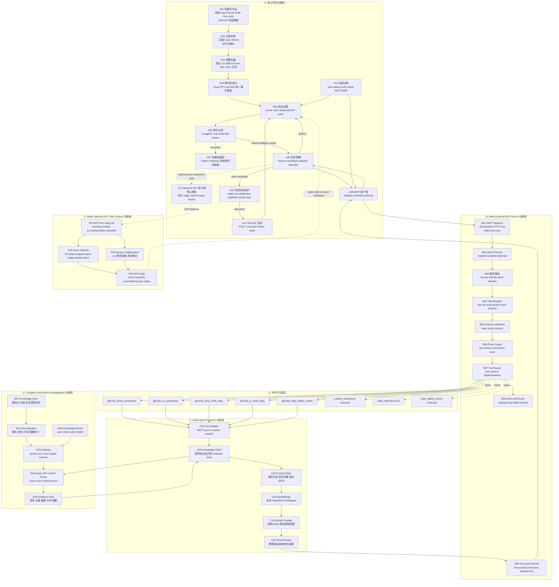
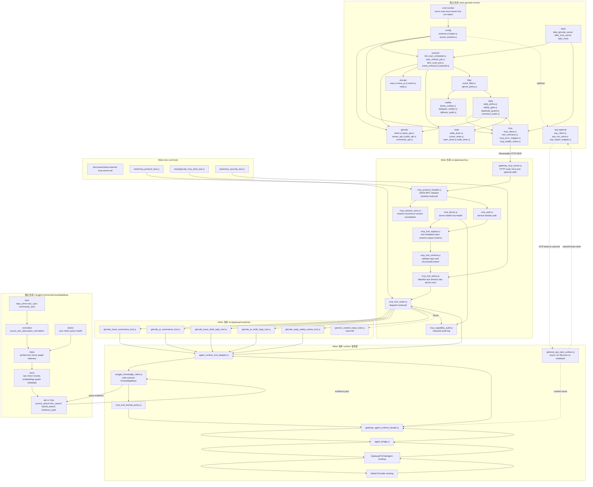
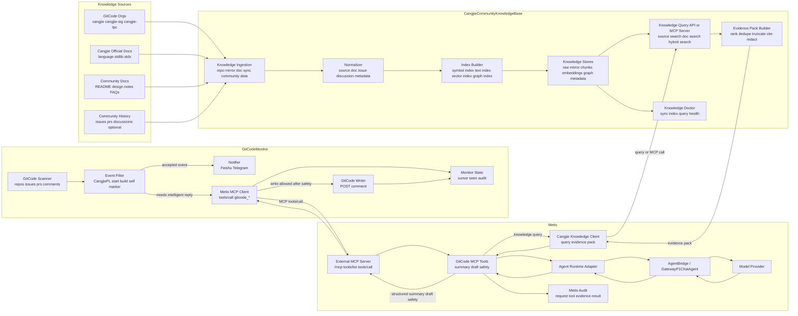
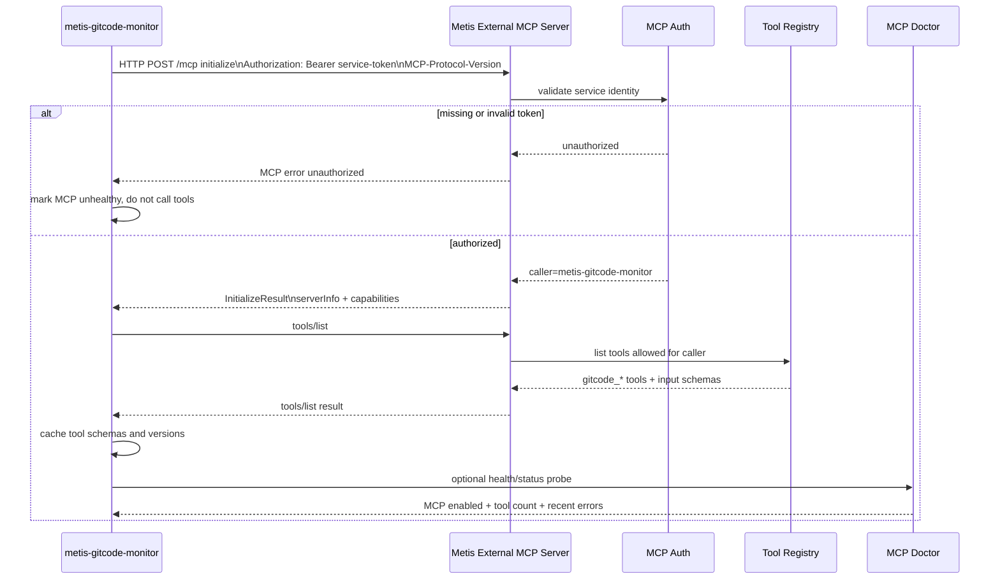
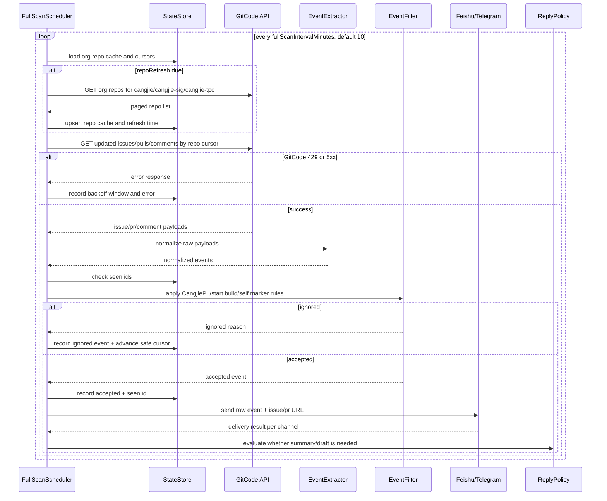
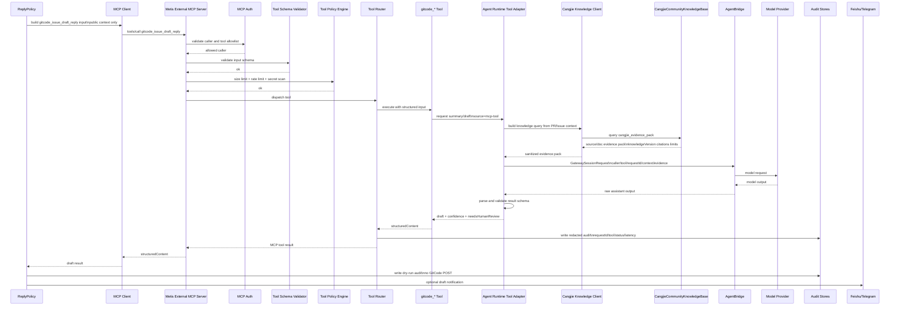
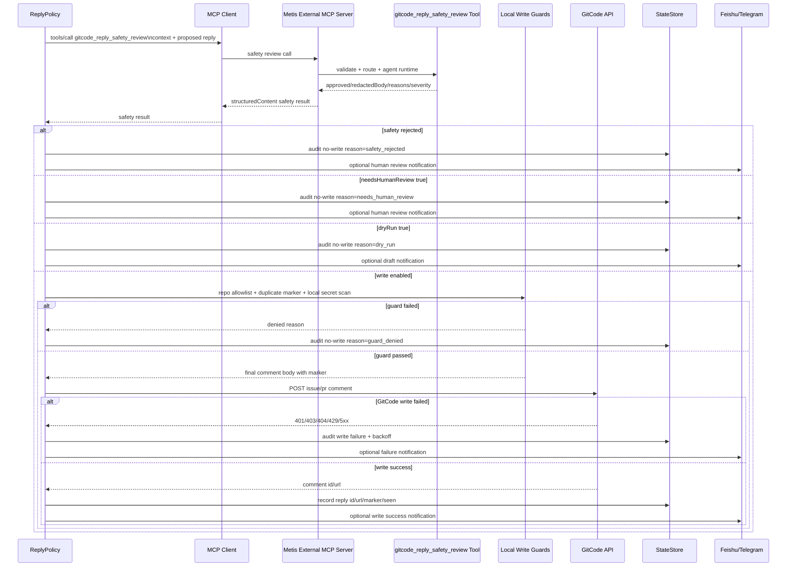
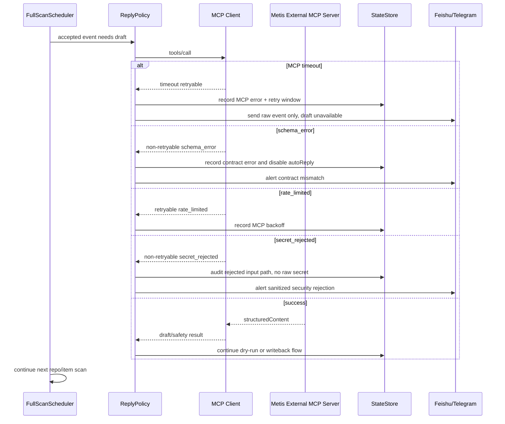
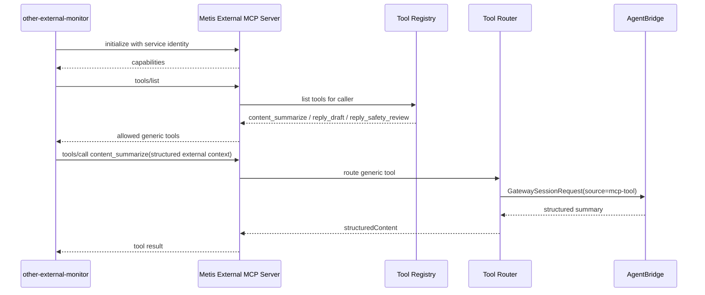

# GitCodeMonitor、Metis External MCP Server 与 CangjieCommunityKnowledgeBase 完整方案

Date: 2026-05-16

Current implementation status and hard constraints:

- 独立项目 GitCodeMonitor 已初始化，目录为 `/Users/l3gi0n/work/workspace_cangjie/GitCodeMonitor`。证据：本机目录检查和 `git -C /Users/l3gi0n/work/workspace_cangjie/GitCodeMonitor rev-parse --show-toplevel` 均确认该目录是独立 git 仓库。
- 独立项目 CangjieCommunityKnowledgeBase 已初始化，目录为 `/Users/l3gi0n/work/workspace_cangjie/CangjieCommunityKnowledgeBase`。证据：本机目录检查和 `git -C /Users/l3gi0n/work/workspace_cangjie/CangjieCommunityKnowledgeBase rev-parse --show-toplevel` 均确认该目录是独立 git 仓库。
- Metis 当前工作分支为 `main`。证据：`git branch --show-current` 返回 `main`。本方案只记录治理要求，不代表现在立即切分支。
- Metis 项目内与本特性相关的 MCP Server、Agent Runtime adapter、tool schema、测试和正式代码改动，必须在用户明确允许后新建独立分支完成。
- 在功能完成、全部自动化测试和手工验收通过之前，任何本特性代码都绝对不允许合入 Metis `main` 分支。
- 三个项目是三个独立 git 仓库；后续代码开发必须分别管理分支、提交、测试和合入边界，不能把跨项目改动当成单仓库改动处理。
- 本文档更新只落盘方案，不实现代码、不切分支、不合入主线。

## 0. 依据索引

本方案每个架构判断都必须能追溯到已存在的证据。后续章节使用下表中的证据编号作为设计依据。

| 证据编号 | 类型 | 依据 | 支撑结论 |
| --- | --- | --- | --- |
| EVID-GCM-001 | 本地项目 | `/Users/l3gi0n/work/workspace_cangjie/GitCodeMonitor` 已存在，`test -d` 返回 `GitCodeMonitor_exists`。 | GitCode 平台监控、扫描、过滤、通知、写回应落在独立项目，而不是 Metis main 工程。 |
| EVID-CKB-LOCAL-001 | 本地项目 | `/Users/l3gi0n/work/workspace_cangjie/CangjieCommunityKnowledgeBase` 已存在，且是独立 git 仓库。 | 仓颉社区知识库的同步、存储、索引、检索和 evidence pack 服务应落在独立项目，而不是 Metis 或 GitCodeMonitor 工程。 |
| EVID-METIS-001 | 本地代码 | `README.md` 明确 Metis 支持 MCP integration，并在项目布局中列出 `src/mcp/` for MCP bridge and server support；`docs/mcp.md` 说明 MCP server 管理、工具和数据源扩展。 | Metis 已有 MCP 方向的工程边界，External MCP Server 是对外能力面的自然延伸。 |
| EVID-METIS-002 | 本地代码 | `src/gateway/core/agent_bridge.cj` 定义 `AgentBridge`；`src/gateway/core/agent_bridge_runtime_test.cj` 覆盖 AgentBridge runtime、prompt、模型配置、鉴权配置等行为。 | Metis 的大模型调用应通过既有 AgentBridge/runtime 链路，不应由新 MCP tool 直接 new model provider client。 |
| EVID-METIS-003 | 本地代码 | `src/core/tools/cangjie_toolset.cj` 暴露 `cangjieRetrieveDocuments`；`src/core/tools/cj_utils/cangjie_doc_agent.cj` 使用 Context7 MCP 获取 `/websites/cangjie-lang_cn_1_0_0` 和 `/dyingchinese/cangjie-stdx` 文档，并提供 fallback。 | Metis 已有“查询仓颉文档再回答”的能力模式，但它是工具调用和文档检索入口，不是完整仓颉社区知识库生命周期。 |
| EVID-METIS-004 | 本地代码 | `src/core/agents/cangjie_code_agent.cj` 要求 Cangjie 相关问题以 `CangjieToolset._cangjieRetrieveDocuments` 作为基础信息源。 | GitCode PR/Issue 智能回复需要证据输入，不能只依赖模型先验。 |
| EVID-RAG-001 | 本地文档/数据 | `cj-rag/README.md` 标题为 `Graph RAG for Cangjie Documentation`，描述 JSONL 数据、GraphRAGRetriever、chunk/retrieve/evaluate；`cj-rag/data/cangjiedoc.jsonl` 已存在。 | 仓颉文档 RAG 具备已有基础，但生产级社区知识库应独立管理源码、文档、社区历史、索引和版本。 |
| EVID-CJCODE-001 | 本地代码 | `src/core/tools/code_compression/cangjie_analyzer/` 下已有仓颉代码分析相关模块。 | 知识库需要 symbol/source 维度时，应复用或参考已有仓颉代码分析思路，但不把 mirror/index 生命周期塞入 Metis Gateway。 |
| EVID-CANGJIE-WEB-001 | 官方网页 | 仓颉官网 `https://cangjie-lang.cn/`、文档入口 `https://cangjie-lang.cn/docs`、英文文档入口 `https://cangjie-lang.cn/en/docs`、版本文档站 `https://docs.cangjie-lang.cn/docs/1.0.0/`。 | CangjieCommunityKnowledgeBase 必须把仓颉官网、官方文档站、版本文档、下载/工具链/社区页面纳入权威知识源。 |
| EVID-WEB-SEARCH-001 | 互联网检索 | 搜索可发现官方文档、API reference、download、release notes、技术文章、论文和社区讨论等外部资料；这些资料来源质量不同。 | 互联网搜索信息可以作为候选知识源，但必须按来源可信度分级、保留 URL/抓取时间/证据片段，并经过白名单或人工审查后才能进入可用于自动回复的主索引。 |
| EVID-MCP-001 | 官方文档 | MCP 官方文档 `https://modelcontextprotocol.io/docs/getting-started/intro` 将 MCP 定义为连接 AI 应用与外部系统、数据源、工具和 workflows 的开放标准。 | 外部项目调用 Metis 智能能力优先采用 MCP，而不是发明 GitCode 专用私有 RPC。 |
| EVID-MCP-002 | 官方规范 | MCP 规范 `https://modelcontextprotocol.io/specification/2025-03-26/index` 定义 JSON-RPC、hosts/clients/servers、resources、prompts、tools、capability negotiation、security guidance 等。 | `initialize`、`tools/list`、`tools/call`、Streamable HTTP/stdio、schema 和错误响应应按 MCP 语义设计。 |
| EVID-ACP-001 | 官方文档 | ACP 官方站点 `https://agentcommunicationprotocol.dev/` 定位为 agent interoperability 协议，支持同步/异步、streaming、stateful/stateless、discovery、long running tasks。 | ACP 更适合长任务、离线知识归纳、跨 agent 协作；不作为 GitCodeMonitor 在线调用 Metis 的主链路。 |
| EVID-GITCODE-001 | 官方网页 | GitCode 平台主页 `https://gitcode.com/`；GitCode/AtomGit API 文档 `https://docs.atomgit.com/docs/apis/` 说明 API 版本 `/api/v5`、Authorization/PRIVATE-TOKEN/access_token 认证、状态码、分页等。 | GitCode API 细节需要由独立 GitCodeMonitor 项目通过 probe/fixture 固化，不能在 Metis 内猜测字段。 |
| EVID-CLI-001 | 参考项目 | `https://atomgit.com/gitcode-ai/atomgit_cli`、`https://gitcode.com/openeuler/ag-cli` 可作为 API 调用和认证形态参考。 | CLI 可用于理解 GitCode/AtomGit API 行为，但本方案生产链路不依赖 CLI 进程。 |

## 1. 最终头脑风暴结论

最终架构采用三项目解耦：

```text
GitCodeMonitor
  -> owns GitCode API, scanning, filtering, notification, dry-run audit, writeback
  -> calls Metis through MCP tools/call for online production loop
  -> may call Metis ACP only for explicitly enabled async advanced tasks

Metis
  -> owns External MCP Server, capability governance, Agent Runtime adapter, summary/draft/safety generation
  -> may expose ACP task/run surface for optional async advanced tasks
  -> calls CangjieCommunityKnowledgeBase for evidence

CangjieCommunityKnowledgeBase
  -> owns Cangjie community source/doc/history sync, normalization, indexes, evidence pack
  -> exposes MCP Server first; HTTP Query API can be an implementation fallback
```

主链路结论：

1. **GitCodeMonitor -> Metis 的在线生产闭环使用 MCP**；显式启用的高级异步长任务可预留 ACP，但不得进入默认 scan path，也不得直接写回 GitCode。依据：MCP 官方定义 tools/resources 和标准 transport，ACP 官方定位长任务/agent 协作，Metis README/docs 已存在 MCP integration 方向（EVID-MCP-001、EVID-MCP-002、EVID-ACP-001、EVID-METIS-001）。
2. **Metis -> Agent Runtime 复用 AgentBridge**。依据：Metis 已有 `AgentBridge` 和 runtime 测试，模型调用不应旁路既有 runtime（EVID-METIS-002）。
3. **Metis -> CangjieCommunityKnowledgeBase 优先使用 MCP**。依据：知识检索和 evidence pack 是标准 tools/resources 能力，适合 MCP；知识库如先实现 HTTP Query API，也必须保持可迁移到 MCP 的 schema（EVID-MCP-001、EVID-RAG-001）。
4. **CangjieCommunityKnowledgeBase -> Metis 的离线知识归纳可使用 ACP**。依据：ACP 面向 agent 协作和任务状态，更适合 repo 摘要、FAQ 聚合、Issue/PR 结论提取等长任务（EVID-ACP-001）。
5. **GitCode 写回永远由 GitCodeMonitor 执行**。依据：GitCode 凭证、扫描 cursor、dedup、writeback audit 属于独立项目边界；Metis 只产出结构化智能结果（EVID-GCM-001、EVID-METIS-002）。
6. **仓颉社区知识库不放进 Metis**。依据：Metis 已有 Cangjie 文档检索工具和 cj-rag 基础，但源码 mirror、文档同步、embedding/index、社区历史版本管理是数据平台生命周期，不应与 Gateway/Agent Runtime 混在一起（EVID-METIS-003、EVID-METIS-004、EVID-RAG-001、EVID-CJCODE-001）。

关键收敛图：

```text
GitCodeMonitor
  -> MCP Client
    -> Metis External MCP Server
      -> MCP tools/list + tools/call
        -> Metis Capability Registry
          -> Capability Policy/Auth/Audit
            -> Agent Runtime Capability Adapter
              -> GatewayAgentRuntimeFacade
                -> AgentBridge / GatewayP1ChatAgent
                  -> Model Provider

GitCodeMonitor
  -> optional ACP Client, disabled by default
    -> Metis ACP Task Surface
      -> long-running triage/report/human collaboration only
      -> result returns to GitCodeMonitor audit or human review
      -> no direct GitCode writeback

Metis Agent Runtime Adapter
  -> Cangjie Knowledge Client
    -> CangjieCommunityKnowledgeBase MCP tools or Query API
      -> evidence pack with source/doc/community citations
```

## 2. 最终边界

| 模块 | 职责 |
| --- | --- |
| GitCodeMonitor 独立项目 | 已初始化于 `/Users/l3gi0n/work/workspace_cangjie/GitCodeMonitor`。负责 GitCode API、repo 枚举、默认 10 分钟全量仓库增量扫描、cursor、dedup、filter、Feishu/Telegram 通知、dry-run audit、最终 POST comment 写回 GitCode。依据：EVID-GCM-001、EVID-GITCODE-001。 |
| Metis External MCP Server | 对外提供标准 MCP server：tool discovery、tool invocation、Streamable HTTP、本地 stdio 可选、service auth、schema 校验、审计。依据：EVID-MCP-001、EVID-MCP-002、EVID-METIS-001。 |
| Metis ACP Task Surface，可选预留 | 只服务显式启用的异步高级任务，例如大型 PR 深度分析、批量 triage、社区周报、历史回溯、多轮人工协作；不进入默认 scan path，不直接写 GitCode。依据：EVID-ACP-001、EVID-GCM-001。 |
| Metis Capability Governance | MCP Server 内部实现层：capability registry、allowed callers、size limit、rate limit、secret scan、structured audit。依据：MCP 只提供协议框架，业务鉴权和审计必须由实现方补齐，见 EVID-MCP-002。 |
| Metis Agent Runtime | 通过现有 AgentBridge/GatewayP1ChatAgent/Model Provider 生成总结、草稿、安全审查结果。依据：EVID-METIS-002。 |
| CangjieCommunityKnowledgeBase 独立项目 | 负责仓颉源码 mirror、官方/社区文档同步、issue/PR 历史归档、chunk、symbol/text/vector/graph index、evidence pack、knowledge version。依据：EVID-RAG-001、EVID-METIS-003、EVID-METIS-004、EVID-CJCODE-001。 |
| Metis Cangjie Knowledge Client | Metis 内部只保留轻量 client，按 request 取 evidence pack；不持有知识库数据生命周期。依据：EVID-METIS-003、EVID-RAG-001。 |
| Metis IM channel | 仍处理 Feishu/Telegram 用户对话，不作为 GitCode 事件导入通道。依据：IM channel 是用户会话入口，GitCode 事件是外部系统事件，不应混入聊天 session。 |
| Metis Gateway toolset | 可选保留，只做 Metis 内部或 IM 用户手动调用辅助；不承载生产 monitor，不作为外部项目接入 Metis 的通道。依据：生产接入统一走 MCP tools/call，见 EVID-MCP-002。 |

明确禁止：

- 不把 GitCode 实现成 Metis IM Channel。
- 不把 GitCode monitor 放进 Metis 用户 cron。
- 不通过 Feishu/Telegram inbound 伪装导入 GitCode Issue/PR。
- 不暴露裸 `agent.invoke` 给外部项目。
- 不让独立项目绕过 MCP tools/call 直接访问 AgentBridge。
- 不让 GitCodeMonitor 用 ACP 替代在线 `gitcode_*` MCP tools。
- 不让 ACP task/run 的 final draft 或 final report 直接 POST GitCode comment。
- 不让 Metis 保存 GitCode token/cookie/password。
- 不让 Metis POST GitCode comment。
- 不让 Metis 内置 GitCode repo scan lifecycle、cursor、dedup、backoff。
- 不让 Metis 内置 CangjieCommunityKnowledgeBase 的源码 mirror、embedding/vector index 或社区历史数据仓。
- 不让 MCP tool 返回未受 schema 约束的自然语言大段结果作为生产协议。
- 本特性在 Metis 中不得直接修改或合入 `main`；必须先在独立分支完成实现、测试和验收，再通过明确评审流程合入。

## 3. 协议与边界取舍依据

### 3.1 MCP 替代自定义 MECS 作为对外协议

| 维度 | 自定义 MECS | Metis External MCP Server | 结论与依据 |
| --- | --- | --- | --- |
| 行业标准 | Metis 自定义协议。 | MCP 是开放协议，用于连接 AI 应用与上下文/工具。 | MCP 更合理，依据 EVID-MCP-001。 |
| 能力发现 | 需要自定义 registry/list 接口。 | MCP 定义 `tools/list`。 | MCP 更合理，依据 EVID-MCP-002。 |
| 能力调用 | 需要自定义 invoke envelope。 | MCP 定义 `tools/call`。 | MCP 更合理，依据 EVID-MCP-002。 |
| 多客户端兼容 | 只有 Metis 客户端能直接理解。 | MCP client/host 生态可复用。 | MCP 更合理，依据 EVID-MCP-001。 |
| 安全治理 | 必须自建。 | MCP 提供协议框架，但业务鉴权、allowlist、secret scan、audit 仍需 Metis 补强。 | MCP + Metis 治理。 |
| Metis 架构边界 | 可以保持清晰，但会形成 Metis 私有协议负担。 | 可以保持清晰，只要不把 MCP server 做成 IM channel 或裸 agent invoke。 | MCP 更合理。 |
| GitCode 写回边界 | 可禁止。 | 可通过 tool metadata 和内部 policy 禁止。 | 持平；写回仍留在 GitCodeMonitor。 |
| 长期扩展 | 容易变成 GitCode 专用 API。 | 可以演进为通用 Metis AI capability server。 | MCP 更合理。 |

因此，MECS 不再作为对外协议名称，只保留为历史分析中的内部治理概念。本文后续统一使用这些名称：

```text
External protocol: MCP
Internal governance: capability registry + auth + policy + audit + AgentBridge adapter
```

### 3.2 ACP 的位置

ACP 不承担 GitCodeMonitor 在线调用 Metis 的主链路。原因是在线链路要求低延迟、确定 schema、可重试、可 safety gate、可由 GitCodeMonitor 执行最终写回；这与 MCP tools/call 更匹配。ACP 适合两类场景：第一类是 CangjieCommunityKnowledgeBase 发起的离线长任务，例如 repo 摘要、FAQ 聚合、Issue/PR 结论提取和知识入库前审查；第二类是 GitCodeMonitor 显式启用的高级异步任务，例如大型 PR 深度分析、批量 triage、社区周报、历史回溯、多轮人工协作。第二类任务只产出报告、审计或人工待确认草稿，不直接进入 GitCode 写回。依据：EVID-ACP-001、EVID-GCM-001。

### 3.3 AtomGit CLI 和 ag-cli 的位置

`atomgit_cli` 和 `ag-cli` 作为 API 与认证行为参考，不作为运行时依赖。原因：

1. GitCodeMonitor 需要长期运行的 monitor lifecycle、cursor、dedup、backoff、dry-run audit 和写回 guard，CLI 子进程不适合作为生产核心依赖。
2. API 字段、分页、错误码和认证头应在 GitCodeMonitor 项目中通过 probe/fixture matrix 固化，而不是由 Metis 或 CLI 隐式承担。
3. CLI 可辅助确认接口行为，但生产路径应由 GitCodeMonitor 自己的 GitCode API client 执行。依据：EVID-CLI-001、EVID-GITCODE-001。

## 4. 目标与非目标

目标：

1. 独立项目通过 GitCode API 监控 `cangjie`、`cangjie-sig`、`cangjie-tpc` 三个组织下所有公开 repo 的 Issue、PR 和评论。
2. 默认每 10 分钟调度一次全量仓库增量扫描；允许 scheduler 抖动不超过 30 秒；上一轮扫描未结束时跳过本轮并记录 `skipped_overlapping_scan`；频率通过独立项目配置项 `fullScanIntervalMinutes` 控制，生产最小值为 5 分钟。
3. 过滤 `CangjiePL` 的回复和正文精确等于 `start build` 的回复。
4. 未过滤事件同时发送到 Feishu bot 和 Telegram bot。
5. 需要智能总结或回复草稿时，GitCodeMonitor 作为 MCP client 调用 Metis External MCP Server。
6. Metis MCP Server 通过现有 AgentBridge/runtime 生成 summary、reply draft、safety review，并返回结构化 tool result。
7. 独立项目根据策略 dry-run 或最终写回 GitCode。
8. Metis MCP Server 设计为通用外部能力服务；除 GitCodeMonitor 外，GitHub/Gitee/CI/工单/邮件 monitor 等外部项目必须通过相同的 MCP service auth、caller allowlist、tools/list 和 tools/call 契约接入。
9. Metis 侧所有相关变更必须在特性分支中推进，禁止在功能完成和测试验收通过前合入 `main`。
10. 仓颉源码、文档、社区历史和 derived knowledge 由 CangjieCommunityKnowledgeBase 独立管理，Metis 只消费 evidence pack。
11. 可选高级能力允许 GitCodeMonitor 调用 Metis ACP task/run，但仅限异步长任务、批量分析、人工协作，不属于第一版自动回复闭环的必做目标。

非目标：

- Metis 不持有 GitCode token/cookie/password。
- Metis 不直接 POST GitCode comment。
- Metis 不负责 GitCode cursor、dedup、backoff、rate limit。
- 独立项目不绕过 Metis agent runtime 直接调用模型 provider。
- 不把 PR/Issue context 通过 IM channel 导入 Metis。
- 不暴露无约束的通用 prompt 执行接口给外部项目。
- 不把 ACP 作为 GitCodeMonitor 默认 scan path、在线 summary/draft/safety path 或直接写回 path。
- 不在 Metis `main` 分支上直接完成本特性开发或提前合入未验收代码。
- 不在 Metis 内建设仓颉开源社区知识库的数据采集、索引和存储生命周期。

## 5. MCP 接入边界

### 5.1 在线生产闭环的唯一接入渠道

GitCode monitor 和未来类似外部项目的**在线、低延迟、结构化工具调用闭环**接入 Metis 的唯一生产渠道是：

```text
Metis External MCP Server
```

这句话的范围只覆盖在线 `summary/draft/safety`、tool discovery、schema validation、dry-run/writeback gating 相关链路。显式启用的异步高级任务可以走 Metis ACP Task Surface，但 ACP 不属于在线生产闭环，不能替代 MCP `gitcode_*` tools，也不能直接写 GitCode。

推荐 transport：

```text
Streamable HTTP MCP transport
POST /mcp
Accept: application/json, text/event-stream
Authorization: Bearer <service-token>
MCP-Protocol-Version: <supported-version>
```

可选 transport：

```text
stdio
```

stdio 只用于本机开发、调试、内网受控部署，不作为跨机器生产 monitor 的默认方式。

### 5.1.1 三项目代码生命周期治理

三个项目目录分别是独立 git 仓库，后续开发必须按“独立分支、独立提交、独立测试、契约联调、统一验收记录”的方式管理。一个上下文可以协调三边开发，但不能混用分支、提交和测试边界。

| 治理项 | Metis | GitCodeMonitor | CangjieCommunityKnowledgeBase | 硬性措施 |
| --- | --- | --- | --- | --- |
| 仓库根目录 | `/Users/l3gi0n/work/workspace_cangjie/Metis` | `/Users/l3gi0n/work/workspace_cangjie/GitCodeMonitor` | `/Users/l3gi0n/work/workspace_cangjie/CangjieCommunityKnowledgeBase` | 每次执行 git/build/test 必须使用 `git -C <repo>` 或显式 `workdir=<repo>`，禁止在错误目录执行跨项目命令。 |
| 分支创建时机 | 当前只记录规则；真正进入 Metis 代码实现前，必须先获得用户明确允许，再创建 Metis 特性分支。 | 进入 GitCodeMonitor 代码实现前，也必须先获得用户明确允许，再创建该仓库特性分支。 | 进入 CKB 代码实现前，也必须先获得用户明确允许，再创建该仓库特性分支。 | 不允许因为三项目联调方便而擅自切任何项目分支；切分支前先报告当前三仓库 `branch/status`。 |
| 分支命名 | 建议 `feature/gitcode-mcp-tools` 或按实际阶段命名。 | 建议 `feature/gitcode-monitor-core`、`feature/gitcode-monitor-mcp-client` 等。 | 建议 `feature/cangjie-knowledgebase-core`、`feature/cangjie-evidence-api` 等。 | 分支名必须能反映项目和阶段；不同项目不要求同名，但必须在联调记录中建立对应关系。 |
| worktree 使用 | 涉及并行子任务或多人/多 agent 并行时，为 Metis 创建独立 worktree，避免污染主工作区。 | 涉及 scanner、notifier、writer、MCP client 并行开发时，为各子任务创建 GitCodeMonitor worktree。 | 涉及 sync、normalizer、index、api/mcp 并行开发时，为各子任务创建 CKB worktree。 | worktree 目录必须位于各自项目外的明确路径，例如 `/Users/l3gi0n/work/worktree/...`；每个 worktree 只写自己负责的模块。 |
| 提交边界 | 只提交 Metis MCP Server、Agent Runtime adapter、tool schema、Metis tests/docs。 | 只提交 GitCode API、scanner、state、filter、notify、MCP client、writer、GitCodeMonitor tests/docs。 | 只提交 source sync、storage、normalizer、index、evidence API/MCP、CKB tests/docs。 | 禁止一个 commit 同时声称修改多个项目；三项目必须分别提交，提交信息必须带项目名前缀，例如 `metis: ...`、`gcm: ...`、`ckb: ...`。 |
| 契约文件 | 拥有 Metis MCP tool schema、result schema、AgentBridge adapter 契约。 | 固化 GitCode API probe/fixture、event model、MCP client input fixture。 | 固化 evidence pack schema、knowledge status schema、knowledgeVersion 规则。 | 跨项目契约先写 schema/fixture，再写实现；契约变更必须同步更新三边 fixture 和文档。 |
| 测试边界 | 运行 `cjpm build -i`、Metis MCP unit/integration、AgentBridge adapter、secret/audit/schema tests。 | 运行 GitCodeMonitor unit/integration/fake GitCode、scheduler、filter、notify、MCP client、writeback gate tests。 | 运行 CKB sync/normalizer/index/query/evidence/doctor tests。 | 单项目测试通过不代表整体通过；跨项目功能必须额外跑联调测试和第 15 节手工验收。 |
| 联调边界 | 提供 MCP server 和 mock/real CKB client；不保存 GitCode 凭证，不写 GitCode。 | 作为 MCP client 调 Metis；持有 GitCode 凭证和写回 gate；不构建 CKB 索引。 | 提供 evidence pack API/MCP；不生成最终 GitCode 回复，不写 GitCode。 | 联调必须通过 endpoint/schema/version 连接，禁止通过本地文件路径互读其他项目内部数据。 |
| 状态汇报 | 汇报 Metis branch、status、build/test。 | 汇报 GitCodeMonitor branch、status、build/test。 | 汇报 CKB branch、status、build/test。 | 每轮跨项目开发结束必须分别列出三项目状态，不能只说“整体通过”。 |
| 合入前置 | Metis build、MCP 自动化测试、契约测试、手工验收通过；确认无 GitCode 凭证和写回代码进入 Metis。 | GitCodeMonitor 自动化测试、fake GitCode 测试、dry-run/writeback gate 验收通过；确认不会绕过 Metis MCP 直接调模型。 | CKB 自动化测试、索引重建、evidence query、update SLA 验收通过；确认不生成最终回复、不写 GitCode。 | 三项目各自满足合入前置后，才能分别发起合入评审；Metis `main` 必须最后合入或至少在端到端验收全部通过后合入。 |

跨项目开发时必须保留一份联调记录，至少包含：

1. 三个仓库的分支名、commit sha、dirty status。
2. 使用的 MCP tool schema version、evidence pack schema version、GitCode event fixture version。
3. 三个项目各自运行的测试命令和结果。
4. 端到端联调输入、输出、audit/requestId/knowledgeVersion。
5. 未通过项、阻塞项、是否允许进入下一阶段。

### 5.1.2 两两联调与三项目联调时机

联调分为四类：契约联调、真实服务联调、端到端 dry-run、端到端测试写回。契约联调用 mock/fake 服务验证 schema、鉴权、错误码和降级；真实服务联调用长期运行进程验证真实网络调用；端到端 dry-run 验证完整智能链路但不写 GitCode；端到端测试写回只允许写测试 repo。

| 联调组合 | 第一次联调时机 | 联调性质 | 前置条件 | 联调内容 | 通过标准 |
| --- | --- | --- | --- | --- | --- |
| Metis <-> CangjieCommunityKnowledgeBase | Phase 3 做契约联调；Phase 10 做真实服务联调。 | Phase 3 使用 mock CKB/evidence fixture；Phase 10 使用 CKB 常驻服务和 active `knowledgeVersion`。 | Phase 3 前置：Metis `cangjie_knowledge_client` contract、evidence pack schema fixture。Phase 10 前置：CKB 完成 bootstrap sync、normalize、index、smoke query、Evidence Pack API/MCP。 | Metis 根据 PR/Issue context 生成 query plan，调用 CKB 获取 evidence pack；验证 timeout、empty evidence、secret/path redaction、knowledgeVersion audit。 | Phase 3：mock CKB 下 Metis 可降级和审计。Phase 10：真实 CKB 返回 source/doc/community evidence，Metis audit 记录 `knowledgeVersion/hitCount/truncated`，CKB 不暴露本地 mirror/index 路径。 |
| GitCodeMonitor <-> Metis | Phase 7 第一次真实联调；Phase 8 在测试 repo 写回前再次联调。 | Phase 7 是 dry-run 联调；Phase 8 是 writeback gate 前联调。 | 前置：Metis Phase 1-4 完成 `/mcp`、auth、tools/list、五个 `gitcode_*` tools、schema、AgentBridge adapter；GitCodeMonitor Phase 5-6 完成 scanner、filter、notification、audit skeleton。 | GitCodeMonitor 调 Metis MCP `initialize`、`tools/list`、`tools/call`；把 accepted event 映射成 tool input；获取 summary/draft/safety；MCP down 时不影响扫描和通知。 | Phase 7：dry-run audit 有 structured result，不写 GitCode。Phase 8：safety/local guard/allowlist/duplicate/secret scan 全通过后才允许测试 repo 写回。 |
| GitCodeMonitor <-> CangjieCommunityKnowledgeBase | 不做生产功能联调；Phase 10 做边界隔离验证。 | 禁止直接业务调用。GitCodeMonitor 生产链路不得直接查询 CKB。 | 前置：CKB Phase 10 可提供 evidence；GitCodeMonitor Phase 7 可调用 Metis；Metis knowledge client 可调用 CKB。 | 验证 GitCodeMonitor 配置、代码、MCP input、audit 中不包含 CKB endpoint、CKB 本地路径、evidence pack 数据；验证 GitCodeMonitor 只通过 Metis 获得结构化智能结果。 | GitCodeMonitor 不携带知识库职责；无直接 CKB client；无 CKB mirror/index 路径；GitCodeMonitor 输入不含 evidence pack；Metis audit 才出现 `knowledgeVersion`。 |
| 三项目一起联调 | Phase 10 首次做完整 dry-run；Phase 8 写回能力已完成后，Phase 10 之后再做完整测试写回验收。 | 先三项目 dry-run，再测试 repo 写回。真实目标组织只能 dry-run 观察后再启用。 | 前置：GitCodeMonitor Phase 5-7 完成；Metis Phase 1-4 完成；CKB Phase 10 已发布 active `knowledgeVersion`。若要写回，还要求 GitCodeMonitor Phase 8 完成且只开启测试 repo allowlist。 | GitCodeMonitor 扫描 accepted event -> 调 Metis MCP -> Metis 调 CKB evidence -> Metis 生成 summary/draft/safety -> GitCodeMonitor 写 dry-run audit/通知；测试写回阶段再经过 local gates POST GitCode comment。 | Dry-run：Feishu/Telegram 收到通知，GitCode 无新增评论，audit 串起 eventId/requestId/knowledgeVersion。测试写回：只在 allowlist 测试 repo 写一条带 marker 回复，下一轮 self-filter 不重复触发。 |

Phase 顺序上的关键说明：

1. Phase 7 的 GitCodeMonitor <-> Metis 联调可以先使用 mock CKB 或空 evidence 降级，不等待 CKB 完整落地。
2. Phase 8 的写回 gate 可以先用 mock/fixture evidence 在测试 repo 验证副作用安全，但不能作为最终生产验收。
3. Phase 10 发布第一个 active `knowledgeVersion` 后，必须重新跑三项目端到端 dry-run；这是“真实仓颉知识参与回复”的第一次完整验收。
4. 如果 Phase 8 已完成写回能力，则 Phase 10 之后还必须在测试 repo 重新跑一次三项目端到端测试写回，才能考虑真实组织 dry-run。
5. GitCodeMonitor <-> CangjieCommunityKnowledgeBase 没有直接生产调用；任何新增直接调用都必须先修改本文档、能力矩阵和验收项。

### 5.2 MCP Server 不是哪些东西

| 不是 | 原因 |
| --- | --- |
| 不是 IM Channel | 外部系统事件不是用户聊天消息，不能进入 Telegram/Feishu inbound 会话链路。 |
| 不是用户 cron job | GitCode monitor lifecycle 属于独立项目，Metis 不调度外部平台扫描。 |
| 不是 Gateway toolset | Toolset 面向 agent 内部工具调用或用户手动能力，不承担外部系统生产接入。 |
| 不是裸 `agent.invoke` | 外部项目不能提交任意 prompt；只能调用已注册 MCP tool。 |
| 不是 GitCode 专用 RPC | GitCode 是第一个 MCP client 场景，不是 Metis 对外协议特例。 |
| 不是 GitCode 写回代理 | GitCode 回复写回必须留在独立 monitor 项目。 |

### 5.3 MCP 调用 Metis Agent Runtime

Metis External MCP Server 对外暴露 MCP tools，对内复用 Metis 现有 agent runtime：

```text
MCP Streamable HTTP / stdio Surface
  -> MCP Session / Protocol Handler
  -> MCP Auth
  -> tools/list / tools/call
  -> Tool Schema Validator
  -> Capability Policy Engine
  -> Capability Router
  -> Agent Runtime Tool Adapter
  -> GatewayAgentRuntimeFacade
  -> AgentBridge
  -> GatewayP1ChatAgent
  -> Model Provider
```

MCP Server 不直接 new 模型 provider client，不绕过 AgentBridge，不绕过 Metis 现有模型配置、会话构造、日志与错误处理约束。

## 5.4 GitCodeMonitor 调 Metis：MCP vs ACP 协议选择分析

本节记录协议选择的分析过程和依据。这里的 ACP 指 Agent Communication Protocol，即 agent 与 agent/app/human 之间进行任务委托、消息通信、长任务协作的协议。

### 5.4.1 问题定义

GitCodeMonitor 调 Metis 的本质需求是：

```text
给定 GitCode PR/Issue/comment 上下文
  -> 总结 Issue/PR
  -> 生成回复草稿
  -> 做安全审查
  -> 返回结构化结果
```

该需求既可以被建模成 MCP tool call，也可以被建模成 ACP agent task。需要判断当前主链路应采用哪种协议。

### 5.4.2 MCP 与 ACP 的定位差异

| 维度 | MCP | ACP |
| --- | --- | --- |
| 协议定位 | 连接 AI 应用/agent 到外部 tools、resources、workflows。 | agent 与 agent/app/human 之间通信、委托任务、协作。 |
| 抽象单位 | tool/resource/prompt。 | agent/session/run/message/task。 |
| 典型调用 | `tools/list` + `tools/call`，结构化输入输出。 | 创建/驱动 agent run，可能同步、异步、流式、多轮。 |
| 状态复杂度 | 较低，调用方容易做幂等、重试、超时、审计。 | 较高，需要 run lifecycle、会话状态、异步状态和任务取消。 |
| 输出约束 | 天然适合稳定 schema 和 tool result。 | 更偏 agent 任务结果，需要额外约束才能稳定自动写回。 |
| 适合知识库 | 很适合，知识库天然是 tool/resource provider。 | 不适合，知识库不是自治 agent。 |
| 适合自动回复 | 适合，summary/draft/safety 都是明确能力。 | 可行但偏重，容易扩大为开放式 agent 委托。 |
| 适合长任务 | 一般，需要调用方自己编排。 | 更适合长任务、多轮、多 agent 协作和人工介入。 |

### 5.4.3 当前主链路为什么选择 MCP

GitCodeMonitor 当前需要的是可预测、可审计、可重试、可测试的结构化能力：

```text
gitcode_issue_summarize
gitcode_pr_summarize
gitcode_issue_draft_reply
gitcode_pr_draft_reply
gitcode_reply_safety_review
```

这些能力具备明确输入 schema、输出 schema 和安全边界。MCP 的 `tools/list`、`tools/call` 正好匹配这种模型。

选择 MCP 的设计依据：

1. **结构化能力更重要**：自动回复写回前需要明确字段，例如 `draft`、`confidence`、`needsHumanReview`、`approved`、`reasons`，MCP tool result 更适合稳定表达。
2. **幂等与重试更简单**：GitCodeMonitor 已经有 event id、requestId、seen/audit/backoff；MCP call 可以自然绑定这些字段。
3. **安全边界更容易收敛**：MCP tool allowlist、schema validation、secret scan、rate limit 可以在 tool 层统一治理。
4. **不引入额外会话复杂度**：当前自动回复不需要让 Metis 维护一个长期 agent run。
5. **知识库链路也适合 MCP**：`CangjieCommunityKnowledgeBase` 提供 source/doc/hybrid/evidence pack 查询，本质是 tools/resources，不是自治 agent。

当前推荐主链路：

```text
GitCodeMonitor
  -> Metis External MCP Server
    -> gitcode_* MCP tools
      -> Metis Agent Runtime
        -> CangjieCommunityKnowledgeBase MCP tools or Query API
```

### 5.4.4 ACP 适合的 Phase 11 场景

ACP 更适合“把一项复杂任务委托给 Metis 的某个 agent”，而不是调用一个确定 tool。

Phase 11 明确允许 ACP 的场景：

1. **复杂 PR 深度分析**：需要 Metis 长时间分析源码、测试、历史 issue、文档，再生成完整 triage report。
2. **多轮人工协作**：需要维护者在 Telegram/Feishu/Control UI 中确认、补充信息、修改草稿，再继续 agent run。
3. **多 agent 协作**：源码分析 agent、文档检索 agent、review agent、回复 agent 分工协作。
4. **异步任务管理**：一个任务可能持续数分钟到数小时，需要查询状态、取消、恢复、流式输出。
5. **非自动写回场景**：例如生成完整 review report、迁移方案、社区周报，这类任务不需要 GitCodeMonitor 立即做安全 gate 和写回。

Phase 11 可选 ACP 链路：

```text
GitCodeMonitor
  -> ACP task/run
    -> Metis GitCode Triage Agent
      -> CangjieCommunityKnowledgeBase via MCP
      -> long-running analysis / human-in-the-loop
      -> final report or draft
```

### 5.4.5 当前结论

当前阶段采用：

```text
GitCodeMonitor -> Metis：MCP for online production loop
Metis -> CangjieCommunityKnowledgeBase：优先 MCP，HTTP Query API 可作为实现备选
```

不采用 ACP 作为当前主链路；GitCodeMonitor 调 Metis ACP 只作为高级异步能力预留，完整规则见 5.4.7。

理由：

- 当前需求是稳定工具调用，不是开放式 agent 委托。
- 自动回复需要强 schema、安全 gate、幂等和可观测性。
- ACP 会引入 run lifecycle、会话、异步状态和人工协作语义，当前阶段增加复杂度大于收益。
- ACP 作为 Phase 11 高级能力引入；Phase 0 到 Phase 10 不依赖 ACP，GitCode 自动回复主链路不得被 ACP 阻塞。

### 5.4.6 决策记录

| 决策项 | 当前选择 | 依据 |
| --- | --- | --- |
| GitCodeMonitor 调 Metis | MCP | 调用 summary/draft/safety 等明确工具能力，要求结构化返回和安全 gate。 |
| Metis 调 CangjieCommunityKnowledgeBase | 优先 MCP | 知识库是工具/资源服务，适合 source/doc/hybrid/evidence tools。 |
| ACP | 暂不作为主链路 | 适合 Phase 11 长任务、多轮协作、异步 agent run，不适合当前自动回复闭环的第一版。 |
| 自动写回 | 仍由 GitCodeMonitor 执行 | ACP/MCP 选择不改变写回边界，Metis 和 KnowledgeBase 都不写 GitCode。 |

### 5.4.7 GitCodeMonitor 调 Metis 的完整协议选择规则

结论需要更精确地表述为：

```text
GitCodeMonitor 的在线生产闭环只调用 Metis MCP。
GitCodeMonitor 可以在明确启用的异步高级能力中调用 Metis ACP。
任何 ACP 结果都不能绕过 GitCodeMonitor 的 dry-run、safety、duplicate、allowlist、secret scan 和 writeback gate。
```

协议选择决策算法：

```text
if 任务需要在一次扫描事件内返回 summary/draft/safety:
  use MCP tools/call
else if 任务输出可能直接影响自动写回:
  use MCP tools/call + GitCodeMonitor local writeback gates
else if 任务需要长时间运行、多轮协作、人工介入、流式进度或可取消 run:
  use ACP task/run
else if 任务是只读知识检索或 evidence pack 查询:
  use MCP tools/call or KnowledgeBase HTTP Query API
else:
  default to MCP, because MCP has simpler schema, retry, timeout and audit
```

GitCodeMonitor 调 Metis 的协议分工：

| GitCodeMonitor 场景 | 协议 | 是否当前必做 | 是否允许自动写回 | 返回形态 | 设计依据 | 验收方式 |
| --- | --- | --- | --- | --- | --- | --- |
| 新 Issue/PR/comment 的在线摘要 | MCP | 是 | 否 | `structuredContent.summary/keyFacts/openQuestions/riskNotes` | 输出 schema 明确，适合 `tools/call`；EVID-MCP-002。 | `gitcode_issue_summarize`、`gitcode_pr_summarize` fixture。 |
| 新 Issue/PR/comment 的在线回复草稿 | MCP | 是 | 仅 GitCodeMonitor 通过本地 gates 后允许 | `draft/confidence/needsHumanReview/reason` | 自动回复需要低延迟、幂等、安全 gate；EVID-MCP-002、EVID-GCM-001。 | dry-run audit 和 writeback gate 测试。 |
| 回复草稿安全审查 | MCP | 是 | 否，安全审查只产生判定 | `approved/redactedBody/reasons/severity` | safety 是确定 tool 能力，不是开放式 agent 任务；EVID-MCP-002。 | secret、攻击性内容、越权承诺 fixture。 |
| MCP schema/tool 发现 | MCP | 是 | 否 | `tools/list` schema、tool version、capabilities | 外部项目不能硬编码私有 RPC；EVID-MCP-002。 | tools/list schema hash 验收。 |
| 大型 PR 深度分析报告 | ACP | 否，作为高级能力预留 | 默认不允许；只能进入 audit/human review，若要写回必须再过 MCP safety 或本地 safety gate | `runId/status/progress/finalReport/sourceReferences` | 长任务、可取消、可流式进度更适合 ACP；EVID-ACP-001。 | fake ACP run lifecycle：pending/running/succeeded/failed/cancelled。 |
| 社区周报、批量 triage、历史事件回溯总结 | ACP | 否，作为高级能力预留 | 不允许自动写回到 GitCode；只允许通知或人工报告 | `runId/report/items/sourceReferences` | 批处理和跨事件归纳不是单事件在线回复；EVID-ACP-001。 | batch report fixture，确认无 comment writer 调用。 |
| 需要人工参与修改草稿的多轮协作 | ACP | 否，作为高级能力预留 | 不允许直接写回；人工确认后由 GitCodeMonitor 走写回 gate | `runId/messages/approvalState/finalDraft` | 多轮 agent/human collaboration 是 ACP 场景；EVID-ACP-001。 | 人工确认状态和 writeback audit。 |
| GitCodeMonitor 向 Metis 查询 Cangjie evidence | 不直接查，默认由 Metis MCP tool 内部通过 Knowledge Client 查询 CKB | 当前不建议 GitCodeMonitor 直接查 | 否 | GitCodeMonitor 只收到 Metis 的结构化智能结果 | 避免 GitCodeMonitor 携带知识库职责；EVID-RAG-001。 | GitCodeMonitor 输入不含 evidence pack；Metis audit 有 knowledgeVersion。 |

GitCodeMonitor 使用 ACP 的硬性限制：

1. ACP 不能成为默认 monitor scan path；默认 scan path 仍是 GitCode API -> filter -> notify -> MCP dry-run/writeback。
2. ACP 不能用于 `gitcode_issue_draft_reply`、`gitcode_pr_draft_reply`、`gitcode_reply_safety_review` 的在线替代实现。
3. ACP run 的 final report 或 final draft 不能直接 POST GitCode comment。
4. ACP 结果若要进入 GitCode 写回，必须转回 GitCodeMonitor 的本地 reply policy，并重新经过 duplicate guard、repo allowlist、secret scan、dryRun/autoReply switch 和 safety gate。
5. ACP run 必须有 `runId`、`requestId`、source event links、status、timestamps、caller identity、sourceReferences 和 redacted audit。
6. ACP 失败、取消或超时不得阻塞 GitCodeMonitor 的下一轮 10 分钟 full scan。

因此，“GitCodeMonitor 只会调用 Metis MCP 吗”的准确答案是：

- 当前核心功能和第一版生产链路：**是，只调用 MCP**。
- Phase 11 高级异步能力：**可以调用 ACP**，但 ACP 只处理长任务/多轮协作/批量报告，不处理在线自动回复闭环，也不直接写回 GitCode。

## 6. 逻辑架构图

这张图表达生产边界、数据所有权和调用方向。核心原则是：GitCode monitor 是独立进程；Metis 只暴露 External MCP Server；GitCode 凭证、扫描状态、通知和写回都不进入 Metis。

```mermaid
flowchart LR
  subgraph L1["外部系统层"]
    GitApi["GitCode REST API\nRepos Issues PRs Comments"]
    GitWeb["GitCode Web Links\nIssue PR Comment URL"]
    FeishuBot["Feishu Bot"]
    TelegramBot["Telegram Bot"]
  end

  subgraph L2["独立项目层：metis-gitcode-monitor"]
    Config["Config Loader\norgs interval notify mcp reply"]
    Secret["Secret Resolver\nGitCode token or cookie\n只在本进程使用"]
    GitClient["GitCode API Client\n分页 条件查询 错误归一化"]
    RepoRefresh["Repo Refresh\n三组织仓库列表缓存"]
    Scheduler["Full Scan Scheduler\n默认每 10 分钟一轮"]
    Store["State Store\nrepo cache cursor seen audit backoff"]
    Extract["Event Extractor\nIssue PR Comment 标准化"]
    Dedup["Dedup and Ordering\n按 repo item comment 去重"]
    Filter["Event Filter\nCangjiePL start build self marker"]
    Notify["Notification Dispatcher\n原始事件和链接"]
    ReplyPolicy["Reply Policy\ndryRun autoReply allowlist rate limit"]
    McpClient["MCP Client\ninitialize tools/list tools/call"]
    AcpClient["Optional ACP Client\ndisabled by default\nasync triage report human review"]
    LocalGuard["Local Write Guards\nsafety duplicate marker secret scan"]
    Writer["GitCode Comment Writer\n只在独立项目写回"]
    MonitorDoctor["Monitor Doctor\nscan notify mcp writeback"]
  end

  subgraph L3["Metis 项目边界：External MCP Server"]
    McpEndpoint["MCP Transport\nPOST /mcp Streamable HTTP\nstdio 仅本机开发"]
    McpProtocol["MCP Protocol Handler\ninitialize tools/list tools/call"]
    McpAuth["MCP Auth\nservice token local trusted"]
    ToolRegistry["Tool Registry\ngitcode tools generic tools"]
    ToolSchema["Tool Schema Validator\ninput output schema"]
    ToolPolicy["Tool Policy\nallowlist size timeout rate secret scan"]
    ToolRouter["Tool Router\n按 tool name 分发"]
    ToolAudit["Capability Audit\nrequestId caller tool status latency"]
  end

  subgraph L4["Metis 项目边界：Agent Runtime"]
    AcpTaskSurface["Optional ACP Task Surface\nlong-running async tasks\nno direct writeback"]
    AgentAdapter["Agent Runtime Tool Adapter\nsource mcp-tool"]
    KnowledgeClient["Cangjie Knowledge Client\n调用独立知识库获取 evidence"]
    RuntimeFacade["GatewayAgentRuntimeFacade"]
    AgentBridge["AgentBridge GatewayP1ChatAgent"]
    ModelProvider["Model Provider"]
    ManualToolset["Optional Gateway Toolset\n仅手动或内部使用"]
  end

  subgraph L5["独立项目：CangjieCommunityKnowledgeBase"]
    KnowledgeApi["Knowledge API or MCP Server\nsource doc hybrid evidence"]
    KnowledgeIndex["Knowledge Indexes\nsymbol text vector graph"]
    KnowledgeSync["Knowledge Sync\nrepo mirror doc sync"]
    KnowledgeDoctor["Knowledge Doctor\nsync index query health"]
  end

  Config --> Secret
  Config --> Scheduler
  Config --> Notify
  Config --> McpClient
  Secret --> GitClient
  Scheduler --> RepoRefresh
  RepoRefresh --> GitClient
  GitClient --> GitApi
  Scheduler --> Extract
  Extract --> GitClient
  Extract --> Dedup
  Store --> Dedup
  Dedup --> Filter
  Filter -->|ignored event| Store
  Filter -->|accepted event| Notify
  GitWeb -.links.-> Notify
  Notify --> FeishuBot
  Notify --> TelegramBot
  Filter -->|needs summary or reply| ReplyPolicy
  ReplyPolicy -->|dryRun or autoReply| McpClient
  ReplyPolicy -.explicit async advanced task.-> AcpClient
  McpClient -->|MCP standard calls| McpEndpoint
  AcpClient -.ACP task/run.-> AcpTaskSurface
  AcpTaskSurface -.report or human review draft.-> AcpClient
  AcpTaskSurface -.uses runtime.-> RuntimeFacade
  McpEndpoint --> McpProtocol
  McpProtocol --> McpAuth
  McpAuth --> ToolRegistry
  ToolRegistry --> ToolSchema
  ToolSchema --> ToolPolicy
  ToolPolicy --> ToolRouter
  ToolRouter --> AgentAdapter
  AgentAdapter --> KnowledgeClient
  KnowledgeClient -->|query evidence pack| KnowledgeApi
  KnowledgeApi --> KnowledgeIndex
  KnowledgeSync --> KnowledgeIndex
  KnowledgeIndex --> KnowledgeApi
  KnowledgeApi -->|evidence pack| KnowledgeClient
  KnowledgeClient --> RuntimeFacade
  RuntimeFacade --> AgentBridge
  AgentBridge --> ModelProvider
  ModelProvider --> AgentBridge
  AgentBridge --> RuntimeFacade
  RuntimeFacade --> KnowledgeClient
  KnowledgeClient --> AgentAdapter
  AgentAdapter --> ToolRouter
  ToolRouter --> ToolAudit
  ToolRouter -->|structuredContent| McpProtocol
  McpProtocol --> McpEndpoint
  McpEndpoint --> McpClient
  ReplyPolicy -->|dryRun result| Store
  ReplyPolicy -->|write enabled| LocalGuard
  LocalGuard -->|approved| Writer
  Writer --> GitClient
  Writer -->|reply id url marker| Store
  MonitorDoctor --> Store
  MonitorDoctor --> McpClient
  KnowledgeDoctor --> KnowledgeIndex
  AgentBridge -.manual only.-> ManualToolset
```



逻辑约束：

- `GitCode token/cookie/password` 只允许出现在 `Secret Resolver -> GitCode API Client` 这条独立项目内部链路中。
- `Metis External MCP Server` 只接收公开 Issue/PR/comment 上下文和策略参数，不接收 GitCode 凭证。
- `Optional ACP Client -> Optional ACP Task Surface` 只用于显式启用的异步高级任务；它不是默认 scan path，不替代 MCP `gitcode_*` tools，不直接产生 GitCode 写回。
- `GitCode Comment Writer` 只在独立项目中存在，Metis 中没有任何 GitCode 写回模块。
- `Optional Gateway Toolset` 不在生产链路上，只能作为人工或内部调试能力。
- 仓颉源码仓、仓颉文档库、社区知识索引属于独立项目 `CangjieCommunityKnowledgeBase`；Metis 只保留 knowledge client，在每次 `gitcode_*` MCP tool 执行时根据 PR/Issue context 和 query plan 获取 evidence pack；GitCodeMonitor 不负责构建或携带仓颉知识库。

## 7. 功能架构图

这张图按“能力域”组织，不表达文件结构。每个功能域都有明确输入、输出和验收对象。



功能边界：

- A 域全部属于独立项目，负责 GitCode 平台生命周期。
- A13 是独立项目中的可选高级客户端，默认禁用；它只调用 ACP 长任务，不参与在线自动回复闭环。
- B 域全部属于 Metis Gateway，负责 MCP 标准协议和 tool 治理。
- C 域属于 Metis 现有 agent runtime 适配，只保留 Knowledge Client，不拥有知识库数据生命周期。
- D 域是对外暴露的 MCP tools，其中 GitCode tools 是第一批生产能力，通用 tools 是后续复用能力。
- E 域属于独立项目 `CangjieCommunityKnowledgeBase`，负责知识同步、索引、检索和 evidence pack。
- F 域属于 Metis 可选 ACP task surface，只产出异步报告、人工协作草稿和审计，不写 GitCode，不替代 MCP tools。

## 8. 实现架构图

这张图表达建议模块、文件边界和运行时依赖。命名是落地建议，实际实现时应贴合 Metis 现有目录，但责任边界不能改变。



实现约束：

- 独立项目的 `mcp_client` 只能实现 MCP `initialize`、`tools/list`、`tools/call`，不能调用 Metis 私有 `agent.invoke`。
- 独立项目的 `acp_client` 是可选高级模块，默认禁用；只能实现 ACP run lifecycle、异步报告和人工协作，不得参与默认 scan path 和在线自动回复 MCP tool 替代。
- `optional_acp_task_surface.cj` 不能包含 GitCode comment writer，不能返回可直接写回的最终动作，只能返回 report、human review draft、sourceReferences 和 run status。
- Metis 的 `mcp/tools/*` 只能生成结构化智能结果，不能引入 GitCode API client。
- `agent_runtime_tool_adapter.cj` 是 MCP tool 进入 AgentBridge 的唯一内部桥，不允许各 tool 直接调用模型 provider。
- Metis 只允许通过 `cangjie_knowledge_client.cj` 调用独立 `CangjieCommunityKnowledgeBase`，不在 Metis 内构建源码 mirror、embedding index 或文档索引。
- `CangjieCommunityKnowledgeBase` 只返回 evidence pack，不生成最终维护者回复，不写 GitCode。
- 所有 GitCode 写回代码必须在独立项目 `comment_writer` 中，且只能通过独立项目 GitCode client 执行。

## 9. MCP Tool 设计

### 9.1 Tools 列表

Metis External MCP Server 第一批暴露这些 tools：

| Tool name | 输入 | 输出 | 写 GitCode |
| --- | --- | --- | --- |
| `gitcode_issue_summarize` | issue detail + comments + repo metadata | summary、keyFacts、openQuestions、riskNotes | 否 |
| `gitcode_pr_summarize` | PR detail + comments + diff summary 可选 | summary、reviewFocus、unresolvedQuestions、riskNotes | 否 |
| `gitcode_issue_draft_reply` | issue context + triggering comment + policy | draft、confidence、needsHumanReview、reason | 否 |
| `gitcode_pr_draft_reply` | PR context + triggering comment + policy | draft、confidence、needsHumanReview、reason | 否 |
| `gitcode_reply_safety_review` | context + proposed reply | approved、redactedBody、reasons、severity | 否 |

命名使用下划线，避免不同 MCP client 对点号命名兼容性不一致。内部 capability registry 可保留点号名，例如 `gitcode.issue.draftReply`，但对外 MCP tool name 使用稳定 snake_case。

### 9.2 通用 tools 预留

| Tool name | 用途 |
| --- | --- |
| `content_summarize` | 对外部结构化内容做通用总结。 |
| `content_classify` | 对外部事件做分类和优先级判断。 |
| `reply_draft` | 基于上下文生成通用回复草稿。 |
| `reply_safety_review` | 对任意回复草稿做安全审查。 |

GitCode monitor 生产路径应优先调用 GitCode 专用 tools，因为 GitCode 专用 schema 更清晰、验收更可控。通用 tools 用于未来外部项目复用，不作为 GitCode 首版写回闭环的替代。

ACP 不属于本节 MCP tool surface。GitCodeMonitor 的在线 summary/draft/safety 必须调用本节 `gitcode_*` MCP tools；可选 ACP 只在显式启用的长任务中创建 run，并且 ACP 结果如需进入回复流程，必须回到 GitCodeMonitor 本地 gates。

### 9.3 Tool input schema 示例

```json
{
  "type": "object",
  "required": ["requestId", "repo", "item", "trigger", "comments", "policy"],
  "properties": {
    "requestId": {
      "type": "string"
    },
    "repo": {
      "type": "object",
      "required": ["owner", "name", "url"],
      "properties": {
        "owner": { "type": "string" },
        "name": { "type": "string" },
        "url": { "type": "string" }
      }
    },
    "item": {
      "type": "object",
      "required": ["type", "number", "title", "body", "url", "authorLogin"],
      "properties": {
        "type": { "enum": ["issue", "pr"] },
        "number": { "type": "integer" },
        "title": { "type": "string" },
        "body": { "type": "string" },
        "url": { "type": "string" },
        "authorLogin": { "type": "string" },
        "createdAt": { "type": "string" },
        "updatedAt": { "type": "string" }
      }
    },
    "trigger": {
      "type": "object",
      "required": ["type", "id", "body", "authorLogin", "createdAt"],
      "properties": {
        "type": { "enum": ["issue", "pr", "comment"] },
        "id": { "type": "string" },
        "body": { "type": "string" },
        "authorLogin": { "type": "string" },
        "createdAt": { "type": "string" }
      }
    },
    "comments": {
      "type": "array",
      "items": {
        "type": "object",
        "required": ["id", "authorLogin", "body", "createdAt"],
        "properties": {
          "id": { "type": "string" },
          "authorLogin": { "type": "string" },
          "body": { "type": "string" },
          "createdAt": { "type": "string" }
        }
      }
    },
    "policy": {
      "type": "object",
      "required": ["language", "maxDraftChars", "mustNotInventFacts", "needsHumanReviewWhenUncertain"],
      "properties": {
        "language": { "type": "string" },
        "maxDraftChars": { "type": "integer" },
        "replyStyle": { "type": "string" },
        "mustNotInventFacts": { "type": "boolean" },
        "needsHumanReviewWhenUncertain": { "type": "boolean" }
      }
    }
  }
}
```

### 9.4 Tool result schema 示例

MCP tool result 应返回 `structuredContent`，并可选提供简短 `content` 文本用于调试展示。

```json
{
  "structuredContent": {
    "draft": "建议回复内容",
    "confidence": 0.82,
    "needsHumanReview": false,
    "reason": "基于 issue 正文和最新评论可直接回复",
    "safety": {
      "approved": true,
      "reasons": [],
      "redacted": false
    }
  },
  "content": [
    {
      "type": "text",
      "text": "Draft generated. confidence=0.82"
    }
  ]
}
```

## 10. 安全与治理

### 10.1 Authorization

生产环境推荐：

- Streamable HTTP + Bearer service token。
- 每个外部项目一个 service identity，例如 `metis-gitcode-monitor`。
- 每个 service identity 绑定允许调用的 tool allowlist。
- 只有当出现“人类用户委托 Metis 代表个人调用外部服务”的明确需求时，才进入独立设计评审并引入 OAuth 2.1 authorization code flow；本 GitCodeMonitor 服务到服务链路不引入该能力。

GitCode monitor 是机器到机器调用，优先使用 client credentials 风格的 service token，不需要冒充某个人类用户。

### 10.2 Transport 安全

Streamable HTTP MCP Server 必须：

- 校验 `Origin` header。
- 本地部署时默认只绑定 `127.0.0.1`。
- 生产跨机器部署必须启用鉴权。
- 支持 `MCP-Protocol-Version` 协议版本协商。
- 支持 request timeout 和 cancellation。

### 10.3 Secret 防护

MCP tool input 不得包含：

- GitCode token。
- GitCode cookie。
- GitCode password。
- Authorization header 原值。
- Feishu/Telegram bot token。
- 本地用户私密路径内容。

Tool validator 和 audit logger 都必须做 secret pattern scan。命中后返回 `secret_rejected`，并且日志只记录脱敏后的字段路径。

### 10.4 Tool 安全

所有 GitCode 首批 tools 必须声明为只读智能能力：

- 不写 GitCode。
- 不写 Feishu。
- 不写 Telegram。
- 不读本地用户文件。
- 不执行 shell。
- 不调用任意外部 URL。
- 不返回凭证。

自动回复真正的写回动作只允许由独立 GitCode monitor 在通过 safety、duplicate、dry-run、repo allowlist 检查后执行。

## 11. 仓颉开源社区知识库独立项目逻辑架构

GitCodeMonitor 提供 PR/Issue 事件事实；Metis 负责 Agent Runtime 和回复生成；仓颉源码、仓颉文档、社区知识、索引、检索、证据包生成属于第三类问题：**仓颉开源社区知识库问题**。

结论：仓颉开源社区知识库不应建设在 Metis 项目内部，也不应建设在 GitCodeMonitor 内部，应独立为第三个项目。

暂定项目名：

```text
CangjieCommunityKnowledgeBase
```

### 11.1 三项目边界结论

```text
GitCodeMonitor
  负责 GitCode 事件监控、过滤、通知、写回

CangjieCommunityKnowledgeBase
  负责仓颉开源社区源码、文档、历史知识的采集、索引、检索、证据包生成

Metis
  负责 External MCP Server、Agent Runtime、大模型推理、回复生成、安全审查
```

职责边界：

| 项目 | 拥有的数据 | 核心职责 | 明确不做 |
| --- | --- | --- | --- |
| GitCodeMonitor | GitCode credentials、repo scan cursor、seen events、notification/writeback audit。 | 监控 GitCode、过滤事件、通知 Feishu/Telegram、调用 Metis、按策略写回 GitCode。 | 不建设仓颉知识库，不做源码/文档索引，不直接调用大模型生成最终回复。 |
| CangjieCommunityKnowledgeBase | 仓颉源码 mirror、仓颉文档、社区知识索引、向量/符号/图索引、knowledge version。 | 同步知识源、构建索引、执行检索、生成 evidence pack。 | 不写 GitCode，不管理 GitCode scan cursor，不生成最终维护者回复。 |
| Metis | MCP tool schema、Agent Runtime、prompt policy、模型配置、回复生成审计。 | 暴露 MCP tools、调用知识库获取证据、调用 Agent Runtime 生成 summary/draft/safety。 | 不持有 GitCode 凭证，不写 GitCode，不维护仓颉知识库的数据生命周期。 |

### 11.2 逻辑架构图



### 11.3 核心链路

智能回复主链路：

```text
GitCodeMonitor
  -> accepted PR/Issue/comment event
  -> Metis MCP tools/call gitcode_issue_draft_reply
Metis
  -> 根据 PR/Issue context 生成 knowledge query
  -> 调 CangjieCommunityKnowledgeBase
CangjieCommunityKnowledgeBase
  -> source/doc/hybrid search
  -> evidence pack
Metis
  -> Agent Runtime + evidence pack
  -> structured draft/safety
GitCodeMonitor
  -> dry-run audit 或 GitCode writeback
```

知识更新链路：

```text
CangjieCommunityKnowledgeBase
  -> 定时或手动同步 GitCode 组织源码仓
  -> 同步仓颉官方文档、stdx 文档、社区文档
  -> normalize source/doc/community metadata
  -> build symbol/text/vector/graph indexes
  -> publish knowledge version
```

### 11.4 CangjieCommunityKnowledgeBase 内部逻辑模块

| 模块 | 职责 | 关键输出 |
| --- | --- | --- |
| Source Sync | 同步 `cangjie`、`cangjie-sig`、`cangjie-tpc` 组织下需要纳入知识库的源码仓。 | repo mirror、commit SHA、branch/tag metadata。 |
| Documentation Sync | 同步仓颉官方文档、stdlib、stdx、社区 README/design/FAQ。 | doc raw files、doc version、source URL。 |
| Normalizer | 把源码、文档、讨论内容统一成 chunk/document/code entity 结构。 | normalized documents、code entities、metadata。 |
| Source Indexer | 建立 repo/path/symbol/function/class/struct/interface/enum/test/example 索引。 | source index、symbol index。 |
| Doc Indexer | 建立 doc title/section/snippet/example/API 索引。 | doc index、example index。 |
| Vector/Hybrid Indexer | 建立 embedding/vector index，并支持 keyword + vector + symbol hybrid ranking。 | vector index、hybrid search metadata。 |
| Knowledge Query API | 对外提供 source search、doc search、hybrid search、evidence pack 查询。 | query result、evidence candidates。 |
| Evidence Pack Builder | 根据 Metis 的 query plan 合并源码和文档证据，排序、去重、截断、脱敏。 | evidence pack。 |
| Knowledge Doctor | 汇报 sync 状态、index version、repo count、doc count、last build、query health。 | health/status/report。 |

### 11.5 对外接口形态

优先方案：CangjieCommunityKnowledgeBase 也暴露 MCP Server。

```text
Metis as MCP client
  -> CangjieCommunityKnowledgeBase MCP Server
    -> tools/list
    -> tools/call cangjie_source_search
    -> tools/call cangjie_doc_search
    -> tools/call cangjie_hybrid_search
    -> tools/call cangjie_evidence_pack
```

首批建议 tools：

| Tool | 输入 | 输出 |
| --- | --- | --- |
| `cangjie_source_search` | repo、paths、symbols、keywords、commit/ref、limit。 | source snippets、repo/path/range/symbol/score。 |
| `cangjie_doc_search` | query、doc kind、language/stdx filter、limit。 | doc snippets、title/url/section/example/score。 |
| `cangjie_hybrid_search` | natural language query + optional repo/path/symbol filters。 | mixed source/doc candidates。 |
| `cangjie_evidence_pack` | PR/Issue context 或 Metis query plan、budget、ranking policy。 | ranked evidence pack with citations。 |
| `cangjie_knowledge_status` | optional scope。 | index version、last sync、health、coverage。 |

备选方案：HTTP Query API。  
如果 MCP Server 对知识库过重，可以先提供 HTTP API，但长期仍建议 MCP 化，因为 Metis 已经采用 MCP 作为外部能力协议。

### 11.6 Evidence Pack 边界

KnowledgeBase 返回 evidence，不返回最终回复。

Evidence Pack 示例：

```json
{
  "knowledgeVersion": "ckb-2026-05-16T10:00:00Z",
  "queryId": "q-123",
  "sourceEvidence": [
    {
      "repo": "cangjie/foo",
      "commit": "abc123",
      "path": "src/parser/foo.cj",
      "range": "120-168",
      "symbol": "FooParser",
      "score": 0.91,
      "snippet": "..."
    }
  ],
  "docEvidence": [
    {
      "doc": "cangjie-lang",
      "version": "1.0.0",
      "title": "Named parameters",
      "url": "https://...",
      "section": "Function calls",
      "score": 0.86,
      "snippet": "..."
    }
  ],
  "limits": {
    "maxEvidenceChars": 12000,
    "truncated": false
  }
}
```

Metis 使用 Evidence Pack 的规则：

- 生成回复时必须基于 PR/Issue context + evidence pack。
- Evidence 不足时返回 `needsHumanReview=true`。
- 不能把 KnowledgeBase 的内部索引路径、本地 mirror 路径暴露给 GitCodeMonitor 或 GitCode 评论。
- 回复中如需要引用事实，应引用 repo/path/range 或 doc title/url，而不是 Metis/KnowledgeBase 本地路径。

### 11.7 为什么不能放在 Metis 内部

| 问题 | 放在 Metis 内部的风险 | 独立项目的收益 |
| --- | --- | --- |
| 数据生命周期 | 源码 mirror、文档同步、embedding/index build 会让 Metis 变成数据平台。 | KnowledgeBase 独立管理同步、索引、版本和存储。 |
| 复用性 | 只能服务 Metis。 | 可服务 Metis、GitCodeMonitor、CLI、Web search、其他 bot。 |
| 运维边界 | Metis Gateway 运行问题会和知识索引问题混在一起。 | KnowledgeBase 可独立 doctor、扩容、重建索引。 |
| 安全边界 | Metis 会持有大量源码 mirror、本地路径和索引细节。 | Metis 只消费脱敏 evidence。 |
| 演进速度 | RAG/index 技术变化会频繁影响 Metis 主工程。 | KnowledgeBase 可独立迭代检索和索引策略。 |

### 11.8 知识范围定义

CangjieCommunityKnowledgeBase 需要明确定义知识边界，不能无限制采集。

完整知识范围分为“权威源、源码源、社区协作源、互联网候选源、派生知识源”五类。默认策略是：权威源和三组织公开源码可以进入主索引；互联网候选源只能先进入 candidate/review 区，经过来源白名单、去重、可信度标注和人工/规则审查后，才能进入可用于自动回复的主索引。

| 知识域 | 内容 | 优先级 | 默认入库层级 | 用途 | 来源依据 |
| --- | --- | --- | --- | --- | --- |
| 仓颉官网 | `https://cangjie-lang.cn/` 下首页、下载、文档入口、学习材料、工具链、社区、公告、FAQ、版本入口等公开页面。 | P0 | 主索引 | 回答官网发布的信息、下载入口、文档入口、工具链和社区入口问题。 | EVID-CANGJIE-WEB-001。 |
| 官方语言文档站 | `https://cangjie-lang.cn/docs`、`https://cangjie-lang.cn/en/docs`、`https://docs.cangjie-lang.cn/docs/1.0.0/` 等官方版本文档，含语法、类型系统、泛型、并发、包管理、编译、测试。 | P0 | 主索引 | 回答仓颉语言规则、语法、行为边界和版本差异。 | EVID-CANGJIE-WEB-001、EVID-METIS-003、EVID-RAG-001。 |
| std/stdx 文档 | 官方/Context7/仓库文档中的 std、stdx、JSON、HTTP、TLS、日志、序列化、压缩、加密、URL、测试扩展等。 | P0 | 主索引 | 回答标准库和扩展库 API 使用问题。 | EVID-METIS-003、EVID-CANGJIE-WEB-001。 |
| `cangjie` 组织所有公开 repo 全量源码 | `https://gitcode.com/cangjie` 组织下所有公开 repo 的全部 source code、README、docs、tests、examples、build scripts、配置文件、CI 文件。 | P0 | 主索引 | 回答核心仓库实现、模块职责、源码行为、测试用例、构建规则。 | EVID-GITCODE-001、EVID-CJCODE-001。 |
| `cangjie-sig` 组织所有公开 repo 全量源码 | `https://gitcode.com/cangjie-sig` 组织下所有公开 repo 的全部 source code、README、docs、tests、examples、build scripts、配置文件、CI 文件。 | P0 | 主索引 | 回答 SIG 生态项目、组件实现、维护规则和测试约定。 | EVID-GITCODE-001、EVID-CJCODE-001。 |
| `cangjie-tpc` 组织所有公开 repo 全量源码 | `https://gitcode.com/cangjie-tpc` 组织下所有公开 repo 的全部 source code、README、docs、tests、examples、build scripts、配置文件、CI 文件。 | P0 | 主索引 | 回答 TPC/三方库移植、生态库、兼容性和构建问题。 | EVID-GITCODE-001、EVID-CJCODE-001。 |
| Release 与变更记录 | 官网公告、GitCode release、tag notes、breaking changes、版本兼容说明、迁移指南。 | P0 | 主索引 | 判断版本差异、兼容性、废弃 API、迁移路径。 | EVID-CANGJIE-WEB-001、EVID-GITCODE-001。 |
| Issue/PR 历史 | 三组织所有公开 repo 的 open/closed issue、open/merged/closed PR、评论、维护者结论、重复问题链接。 | P1 | 主索引，敏感字段脱敏 | 复用历史结论，避免重复回答和重复争论。 | EVID-GITCODE-001。 |
| 社区 FAQ 与讨论 | 仓库 FAQ、README、design notes、讨论区、维护者约定、高频问题沉淀。 | P1 | 主索引或 derived index | 形成社区知识沉淀和常见问题回复。 | EVID-GITCODE-001、EVID-RAG-001。 |
| 构建与工具链知识 | cjpm、cjc、LSP、格式化、CI、测试约定、仓库贡献流程、下载和安装步骤。 | P0 | 主索引 | 回答构建失败、测试失败、贡献流程、安装使用类问题。 | EVID-CANGJIE-WEB-001、EVID-GITCODE-001。 |
| 互联网搜索候选源 | 搜索引擎发现的技术博客、教程、论坛讨论、论文、会议材料、问答网站、镜像站、第三方示例代码。 | P2 | candidate/review，默认不进自动回复主索引 | 补充官方资料未覆盖的背景、案例和经验，但不能作为未经审查的事实源。 | EVID-WEB-SEARCH-001。 |
| 派生知识 | agent 生成的 repo 摘要、模块摘要、FAQ、维护者结论提取、release 解读、迁移建议。 | P1 | derived index，必须带 source references 和 reviewState | 提升检索效率和回答一致性。 | EVID-ACP-001、EVID-RAG-001。 |

明确不纳入：

- 私有仓库内容。
- GitCode、Feishu、Telegram、Metis、KnowledgeBase 的 token/cookie/password。
- 未脱敏日志。
- 个人隐私信息。
- 未经证据支撑的模型总结作为事实源。
- 与仓颉开源社区无关的通用互联网内容。
- 互联网搜索发现但无法确认来源、发布时间、作者、URL、授权或与仓颉相关性的内容。
- 未经 review 的互联网候选源不得进入自动回复主索引；只能作为 candidate evidence，且默认触发 `needsHumanReview=true`。

### 11.9 知识来源与更新策略

知识来源分层和更新 SLA：

所有时间均按 `Asia/Shanghai` 解释。实现时允许通过配置覆盖，但默认值必须与下表一致；如果生产环境修改默认值，doctor 必须显示实际值。

| 来源层 | 来源 | 获取方式 | 更新策略 | 失败重试 | 发布规则 |
| --- | --- | --- | --- | --- | --- |
| 权威官网源 | 仓颉官网、下载页、文档入口、工具链页面、社区页面、公告。 | 站点 crawler、sitemap/链接发现、HTML/PDF/Markdown 抽取、人工 pin URL。 | 轻量变更探测每 6 小时一次：`00:20`、`06:20`、`12:20`、`18:20`；完整 crawl 每天 `03:20`；发现 content hash 变化后 30 分钟内触发 normalized rebuild。 | 单 URL 失败重试 3 次，间隔 5 分钟、15 分钟、60 分钟；连续 24 小时失败进入 degraded，保留上一版。 | raw crawl 成功后生成 candidate knowledgeVersion；normalized/index 全部通过后原子切换为 active。 |
| 权威文档源 | 仓颉官方版本文档、stdlib/stdx 文档、release notes。 | Git clone、文档站 mirror、Context7、官方 API、人工导入。 | 轻量变更探测每 6 小时一次：`00:40`、`06:40`、`12:40`、`18:40`；完整 mirror 每天 `03:40`；检测到新版本号、tag、release note 后立即触发全量 doc rebuild。 | 单源失败重试 3 次，间隔 5 分钟、15 分钟、60 分钟；版本文档源失败不删除上一版本索引。 | 新版本文档先以 `reviewState=candidate` 发布给人工/测试查询；通过 smoke query 后升为 `trusted`。 |
| 全量源码源 | `cangjie`、`cangjie-sig`、`cangjie-tpc` 三组织所有公开 repo 的全部 source code 和仓内文档/测试/示例/CI。 | GitCode API 枚举 repo，Git mirror/fetch，默认 all-public-repos scope，支持 denylist。 | 组织 repo 列表每 6 小时刷新一次：`00:00`、`06:00`、`12:00`、`18:00`；active repo 每 30 分钟 fetch；inactive repo 每 6 小时 fetch；全量 clean mirror 校验每周日 `02:00`。active repo 定义为最近 14 天有 commit、issue/PR 更新或被 GitCodeMonitor 命中过。inactive repo 定义为最近 14 天无更新。 | 单 repo fetch 失败重试 3 次，间隔 5 分钟、15 分钟、60 分钟；连续 3 次调度失败标记 repo degraded，但保留上一 commit 索引。 | commit 级增量 normalize/index 成功后发布；全量 clean mirror 只在全部校验通过后替换 active knowledgeVersion。 |
| 社区协作源 | Issue、PR、讨论、README、design notes、FAQ、维护者评论。 | GitCode API 增量同步。 | active item 每 10 分钟同步一次；recent closed item 每 6 小时同步一次；archived item 每 7 天同步一次。active item 定义为 open item、最近 30 天更新 item、或被 GitCodeMonitor 最近 30 天命中的 item。recent closed item 定义为关闭/合并后 30 天内的 item。archived item 定义为关闭/合并超过 30 天且 30 天内无更新。 | API 429 按 `Retry-After`，无该头时退避 10 分钟；5xx 重试 3 次，间隔 5/15/60 分钟；单 item 失败不阻塞同 repo 其他 item。 | 评论增量先进入 raw store；维护者结论变化触发 derived rebuild queue，最长 2 小时内开始处理。 |
| 互联网搜索候选源 | 搜索引擎或外部检索 API 发现的仓颉相关文章、教程、论坛、问答、论文、第三方示例。 | Search API、URL allowlist、domain trust policy、人工提交 URL。 | 主题搜索每周日 `04:00` 执行；高优先级关键词每 24 小时执行一次；已收录 candidate 每 30 天 recrawl；人工提交 URL 在 2 小时内抓取。高优先级关键词包括 `Cangjie language release`、`仓颉 编程语言 release`、`cangjie stdx`、三组织 repo 名称和近 7 天 GitCodeMonitor 高频错误词。 | 搜索 API 失败重试 2 次，间隔 30 分钟、2 小时；单 URL 抓取失败重试 3 次，间隔 10/60/360 分钟。 | 默认 `reviewState=candidate`、`trustLevel=web_candidate`；只有 domain allowlist + 人工或规则审查通过后才能进入 reviewed index；永不自动升为 trusted。 |
| 派生知识源 | agent 生成的 repo 摘要、模块摘要、FAQ、维护者结论提取。 | ACP 委托 Metis Knowledge Curator Agent。 | 增量派生任务队列每 30 分钟调度一次；repo summary 在 repo commit 变化后 2 小时内排队；FAQ 聚合每天 `04:30`；release 解读在检测到 release 后 2 小时内排队；全量派生重建每周日 `05:00`。 | ACP task 失败重试 2 次，间隔 30 分钟、2 小时；仍失败则进入 manual review backlog。 | 派生知识必须带 source references；默认 `reviewState=candidate`，人工抽检或规则校验通过后才进入 derived index。 |

索引构建和发布 SLA：

| 操作 | 默认策略 | 验收口径 |
| --- | --- | --- |
| 增量 normalized build | 每个 sync batch 完成后立即执行；如果 30 分钟内累计变更超过 1000 条，则合并成一个 batch。 | raw record 到 normalized record 的延迟 P95 不超过 30 分钟。 |
| 增量 index build | normalized batch 完成后立即执行；text/symbol/metadata 先构建，vector/graph 可异步但 P95 不超过 2 小时。 | trusted official/source/community evidence 在 2 小时内可被 query 命中。 |
| 全量 index rebuild | 每周日 `02:30` 开始；不得覆盖 active index；新索引全部 smoke test 通过后原子切换。 | full rebuild 失败时 active index 仍可查询，doctor 显示 failed candidate version。 |
| smoke query | 每次发布前执行固定查询集：语法、std/stdx API、源码符号、官网入口、issue/PR 历史、web candidate 隔离。 | 任一 P0 查询失败不得发布为 active knowledgeVersion。 |
| knowledgeVersion 发布 | 格式 `ckb-YYYYMMDD-HHMMSS-<shortHash>`；每次发布记录 source counts、index counts、failed sources、schema version。 | Metis audit 能记录并回放对应 knowledgeVersion。 |
| stale 数据告警 | 官网/文档超过 24 小时未成功同步告警；active repo 超过 2 小时未成功 fetch 告警；community active item 超过 30 分钟未同步告警；web candidate 超过 45 天未 recrawl 告警。 | doctor/status 明确显示 stale source 和 lastSuccessAt。 |

### 11.9.1 ACP 长流程中的即时知识刷新

默认更新 SLA 解决常规新鲜度问题，但某些 ACP 长流程需要更强的新鲜度。例如“分析某个 Issue 中的程序 bug”“分析大型 PR 的真实影响范围”“生成迁移方案”时，如果 CKB 当前 active `knowledgeVersion` 没有目标 repo 的最新 commit、目标 PR head sha 或最近评论结论，直接分析会产生过时结论。

结论：**ACP 长流程可以请求 CKB 做 scoped just-in-time refresh，但刷新执行权只属于 CangjieCommunityKnowledgeBase。** Metis 和 GitCodeMonitor 不能自己拉源码、不能写 CKB 本地存储、不能绕过 CKB 的 raw/normalized/index/knowledgeVersion 规则。

ACP 任务输入必须声明 `freshnessPolicy`：

| freshnessPolicy | 使用场景 | CKB 行为 | ACP 行为 | 约束 |
| --- | --- | --- | --- | --- |
| `use_active` | 默认策略；社区周报、历史回溯、低风险总结。 | 直接使用当前 active `knowledgeVersion`，不触发即时刷新。 | 立即开始分析。 | 结果必须记录使用的 `knowledgeVersion`。 |
| `ensure_recent` | Issue bug 分析、构建失败分析、需要当前 repo 最新默认分支的任务。 | 如果目标 repo 最近一次 successful fetch 超过 10 分钟，或目标 issue/PR 最近一次同步超过 10 分钟，则触发 scoped incremental refresh。 | 等待 CKB 返回 fresh/candidate/timeout 状态后继续。 | 单 repo 即时刷新冷却时间 5 分钟；不能触发全组织全量同步。 |
| `ensure_ref` | PR 深度分析、指定 commit/tag/release 的分析。 | 检查目标 `repo + ref/headSha/baseSha` 是否已在 metadata/index 中；缺失时立即 fetch 目标 ref 并构建 scoped candidate evidence。 | 如果 ref 可用则使用该 ref 的 evidence；不可用则返回 blocked 或 needsHumanReview。 | 必须在 audit 记录 requestedRef、resolvedRef、knowledgeVersion。 |
| `force_candidate` | 人工诊断、管理员手动修复知识库、紧急问题复盘。 | 触发指定 source 的 candidate refresh，不自动升 active。 | 只能生成人工报告或 review queue，不允许进入自动写回。 | 需要管理员权限；不得由默认 GitCodeMonitor scan path 触发。 |

即时刷新流程：

```text
ACP task starts
  -> Metis ACP Task Surface reads freshnessPolicy
  -> Metis calls CKB knowledge_status for target repo/ref/item
  -> if active knowledge is fresh enough:
       use active knowledgeVersion
     else:
       request CKB scoped refresh
       CKB fetches raw source
       CKB normalizes changed records
       CKB builds scoped indexes/evidence
       CKB publishes candidate or active knowledgeVersion by normal rules
  -> Metis continues analysis with returned evidence pack
  -> ACP result records knowledgeVersion and freshness result
```

即时刷新发布规则：

1. scoped refresh 只能刷新目标 repo、目标 ref、目标 issue/PR、目标文档 URL 或目标 web candidate，不允许扩大成全组织全量刷新。
2. raw sync 成功后先生成 candidate `knowledgeVersion`；只有 normalized/index/smoke query 通过后，才能成为 active。
3. ACP 长流程可以读取 candidate evidence，但结果必须标注 `reviewState=candidate`，且不能直接进入自动写回。
4. 如果 `ensure_recent` 或 `ensure_ref` 在任务超时时间内无法取得新 evidence，ACP 任务必须返回 `freshnessStatus=stale_or_unavailable`，并设置 `needsHumanReview=true` 或 `blocked=true`。
5. CKB 需要对即时刷新做限流：单 repo 5 分钟冷却；单 ACP run 最多触发 5 个 repo refresh；超过限制必须返回 `refresh_limited`。
6. 所有即时刷新必须写入 CKB audit：`runId`、`requestId`、caller、sourceType、repo、ref、oldKnowledgeVersion、newKnowledgeVersion、freshnessPolicy、startedAt、finishedAt、status。

设计依据：

- ACP 面向长任务、状态管理、取消和多轮协作，适合等待 scoped refresh；依据 EVID-ACP-001。
- CKB 拥有知识同步、存储、索引和发布生命周期，刷新执行权必须留在 CKB；依据 EVID-RAG-001、EVID-CKB-LOCAL-001。
- GitCodeMonitor 的 10 分钟 scan 不能被 ACP 长任务阻塞；即时刷新不能进入默认 scan path；依据 EVID-GCM-001。
- 自动回复在线链路仍走 MCP tools/call；ACP 即时刷新只服务显式启用的长流程，不替代在线 summary/draft/safety；依据 EVID-MCP-002。

每条知识必须带版本元数据：

```json
{
  "sourceType": "repo|website|doc|issue|pr|web_candidate|summary",
  "sourceUrl": "https://gitcode.com/cangjie/foo/...",
  "repo": "cangjie/foo",
  "commit": "abc123",
  "docVersion": "1.0.0",
  "crawlAt": "2026-05-16T09:55:00Z",
  "indexedAt": "2026-05-16T10:00:00Z",
  "knowledgeVersion": "ckb-2026-05-16T10:00:00Z",
  "trustLevel": "official|community|web_candidate|derived",
  "reviewState": "trusted|reviewed|candidate|rejected",
  "license": "unknown|declared-license-id",
  "derivedFrom": ["source-id-1", "source-id-2"]
}
```

更新原则：

- 原始源码和文档先入 raw store，再做归一化和索引。
- 派生总结不能覆盖原始事实，只能作为辅助检索材料。
- GitCode 三组织 public repo 默认全量纳入，使用 denylist 排除归档、二进制超大、无关或合规风险仓库；不使用 allowlist 缩小默认范围。
- 仓颉官网和官方文档站属于权威源，必须保留 URL、页面标题、版本、抓取时间和内容 hash。
- 互联网搜索候选源必须先进入 candidate/review，不能直接进入自动回复主索引。
- 更新失败不得污染上一版可用索引。
- Evidence Pack 必须返回 knowledgeVersion，方便 Metis 审计和回溯。

### 11.10 知识形态、存储与 RAG 策略

CangjieCommunityKnowledgeBase 需要 RAG，但不能只有向量 RAG。仓颉问题经常涉及精确符号、API、路径、错误码和版本差异，因此应采用 hybrid RAG。

知识存储分层：

| 层 | 内容 | 作用 |
| --- | --- | --- |
| Raw Store | 原始源码、官网 HTML/Markdown/PDF、原始文档、GitCode API JSON、issue/PR 快照、release notes、web candidate 原始抓取。 | Git mirror + 原始文件目录 + 原始 JSON 文件。 | 保留事实源，支持重建索引和审计。 |
| Normalized Store | 统一后的 document、chunk、code entity、comment record、web evidence candidate。 | JSONL 起步；数据量增大后可迁移 Parquet。 | 为索引和检索提供统一数据模型。 |
| Metadata DB | repo、commit、path、symbol、doc version、source URL、crawlAt、indexedAt、trustLevel、reviewState、knowledgeVersion。 | SQLite 起步；多人/服务化部署可迁移 PostgreSQL。 | 支持过滤、版本追踪、引用和审计。 |
| Text Index | BM25/关键词倒排索引。 | Tantivy/Lucene/Meilisearch 等索引文件。 | 精确命中文件名、错误码、API 名、术语。 |
| Vector Index | embedding 向量索引。 | LanceDB/Qdrant/FAISS 等向量库或索引文件。 | 语义检索自然语言问题和相近表述。 |
| Symbol Index | function/class/struct/interface/enum/package/module/test/example。 | SQLite/PostgreSQL 表或专用 symbol index 文件。 | 精确回答代码实体和 API 相关问题。 |
| Graph Index | repo、文件、符号、文档章节、issue/PR、release 之间的关系。 | SQLite/PostgreSQL 边表起步；后续可迁移轻量图数据库。 | 支持 graph expansion 和上下文关联。 |
| Derived Knowledge | repo 摘要、模块摘要、FAQ、维护者结论、release 解读、迁移建议。 | Markdown + JSON metadata，或 JSONL。 | 供人工审查和检索加速；不得覆盖原始事实。 |
| Evidence Pack Cache | 常见查询的 evidence pack。 | JSON 文件或 SQLite 表。 | 降低在线调用延迟，保证重复问题稳定。 |

推荐落盘目录：

```text
CangjieCommunityKnowledgeBase/
  data/
    raw/
      git_mirrors/
        cangjie/
        cangjie-sig/
        cangjie-tpc/
      websites/
        cangjie-lang.cn/
        docs.cangjie-lang.cn/
      gitcode_api/
        issues/
        prs/
        comments/
        releases/
      web_candidates/
    normalized/
      documents.jsonl
      chunks.jsonl
      code_entities.jsonl
      discussions.jsonl
      web_candidates.jsonl
    metadata/
      knowledge.sqlite
    indexes/
      text/
      vector/
      symbol/
      graph/
    derived/
      repo_summaries/
      module_summaries/
      faq/
      release_notes/
    cache/
      evidence_pack/
```

落盘原则：

- 不把知识库主体做成 Markdown。Markdown 只用于人工编辑、审查和派生知识展示；事实源和检索数据必须结构化。
- 不只依赖数据库。源码 mirror、官网页面、原始文档、GitCode API JSON 必须保留原始文件，保证可追溯和可重建。
- Raw/Normalized/Metadata 是事实和审计基础，不能随意删除；Text/Vector/Symbol/Graph indexes 是派生产物，允许删除重建。
- SQLite + JSONL 是首版推荐组合；数据量或并发上来后再迁移 PostgreSQL、Parquet、Qdrant/LanceDB 等。
- 每个文件或记录必须能通过 `sourceId`、`knowledgeVersion`、`sourceUrl`、`trustLevel`、`reviewState` 回溯到来源。

推荐检索流程：

```text
query normalization
  -> keyword search
  -> vector search
  -> symbol/path search
  -> graph expansion
  -> rerank
  -> evidence pack build
```

设计依据：

- 单纯向量检索不适合精确 API、错误码、路径和符号。
- 单纯关键词检索不适合自然语言问题。
- 单纯源码索引不能回答语言规范问题。
- Evidence Pack 必须把检索结果变成可被 Metis 直接消费的、带引用的证据结构。

### 11.11 归纳、总结、索引与 ACP 调 Metis

CangjieCommunityKnowledgeBase 自己负责确定性知识工程；智能归纳任务可以通过 ACP 委托 Metis。

确定性处理，由 KnowledgeBase 自己完成：

- repo mirror / fetch。
- 文档同步。
- 文件路径和元数据解析。
- chunk。
- symbol extraction。
- text/vector/graph index build。
- 去重。
- knowledgeVersion 管理。

智能归纳处理，可通过 ACP 调 Metis：

| 任务 | 为什么适合 ACP | 输出 |
| --- | --- | --- |
| Repo 摘要 | 可能扫描大量文件，属于长任务。 | repo summary、模块说明、关键路径。 |
| 模块职责总结 | 需要多文件上下文和推理。 | module summary、主要类型/函数说明。 |
| Issue/PR 结论提取 | 需要理解多轮讨论和维护者回复。 | conclusion、decision、duplicate links、resolution reason。 |
| FAQ 聚合 | 需要跨 issue/PR 聚类和归纳。 | FAQ entry、canonical answer、source links。 |
| Release/breaking change 解读 | 需要结合文档、源码、PR。 | migration note、compatibility note。 |
| Evidence rerank 辅助 | 某些复杂问题可能需要 LLM 判断证据相关性。 | rerank score、reason。 |

离线知识整理推荐链路：

```text
CangjieCommunityKnowledgeBase
  -> ACP task/run
    -> Metis Knowledge Curator Agent
      -> read source/doc/issue candidates supplied by KnowledgeBase
      -> summarize / classify / extract conclusion
      -> return derived knowledge with source references
  -> KnowledgeBase validates and stores derived knowledge
```

为什么这里适合 ACP：

- 任务可能长时间运行。
- 需要任务状态、重试、取消、审计。
- 可能需要多轮分析。
- 可能需要人工审查后入库。
- 这不是在线低延迟查询，而是离线知识工程。

为什么在线查询仍然不走 ACP：

- Metis 生成 GitCode 回复时只需要快速获取 evidence pack。
- 在线链路需要低延迟、可缓存、可重试、结构化结果。
- MCP tool/query API 更适合 `cangjie_evidence_pack` 这种只读检索能力。

最终协议分工：

| 调用方向 | 协议 | 用途 |
| --- | --- | --- |
| GitCodeMonitor -> Metis | MCP | 在线 summary/draft/safety tools。 |
| GitCodeMonitor -> Metis | ACP，可选预留 | 显式启用的长任务、多轮人工协作、批量报告、历史回溯总结；不进入默认在线 scan path，不直接写 GitCode。 |
| Metis -> CangjieCommunityKnowledgeBase | MCP 或 HTTP Query API | 在线 evidence pack 查询。 |
| CangjieCommunityKnowledgeBase -> Metis | ACP | 离线知识归纳、总结、FAQ、结论提取、长任务。 |

### 11.12 当前方案调整结论

当前方案应调整为四个明确边界：

1. GitCodeMonitor：GitCode 事件生命周期和写回。
2. CangjieCommunityKnowledgeBase：仓颉开源社区知识库生命周期、索引和 evidence pack。
3. Metis External MCP Server：对 GitCodeMonitor 暴露智能回复 tools。
4. Metis Agent Runtime：使用 KnowledgeBase evidence 生成结构化 summary/draft/safety。

`CangjieCommunityKnowledgeBase` 的实现范围已经拆入能力矩阵 `CKB-00` 到 `CKB-08`、Phase 10 和手工验收 `MAN-18` 到 `MAN-25`、`MAN-27`；实现时必须覆盖：

- 项目目录和技术栈。
- 知识源范围。
- 同步和增量更新策略。
- 索引结构。
- MCP tools/API schema。
- Evidence ranking。
- 数据版本和一致性。
- 测试矩阵和手工验收。

## 12. 重点特性时序图

### 12.1 MCP 启动、鉴权与工具发现

这个时序用于验收独立项目能否通过标准 MCP 协议发现 Metis 暴露的能力，而不是依赖私有接口。



验收点：

- 未授权请求不得进入 `tools/list` 或 AgentBridge。
- `tools/list` 只返回 caller allowlist 内的 tools。
- 独立项目必须缓存并校验 `gitcode_*` tool schema；schema 不匹配时进入 degraded 状态，不生成自动回复。

### 12.2 GitCode 全量仓库增量扫描与事件过滤

这个时序定义 GitCode monitor 自己的生命周期。Metis 不参与扫描，也不保存扫描状态。



验收点：

- 默认 `fullScanIntervalMinutes=10`，生产最小值为 5 分钟；scheduler 抖动不得超过 30 秒；上一轮扫描未结束时跳过本轮并记录 `skipped_overlapping_scan`。
- 过滤事件不通知、不调用 MCP、不写 GitCode。
- GitCode 429/5xx 只影响对应扫描窗口，并进入 backoff，不导致状态损坏。

### 12.3 智能回复 dry-run 链路

这个时序覆盖“获取 Issue/PR 信息 -> 调 MCP tool -> Agent Runtime -> 草稿审计”的主链路。



验收点：

- MCP tool input 中不得包含 GitCode token/cookie/password。
- GitCodeMonitor 不传仓颉源码和文档；Metis 通过 Knowledge Client 调独立 CangjieCommunityKnowledgeBase 获取 evidence pack。
- evidence pack 不得包含 KnowledgeBase 本地 mirror 路径、Metis 本地绝对路径、凭证或整仓源码。
- dry-run 模式必须只写 audit，不调用 GitCode POST comment。
- Agent Runtime 日志中应能看到 `source=mcp-tool`、tool name、requestId。

### 12.4 安全审查与 GitCode 写回闭环

这个时序覆盖从草稿到真实写回的所有 gate。写回只发生在独立项目内。



验收点：

- `safety.approved=false`、`needsHumanReview=true`、`dryRun=true` 任一成立都不能写 GitCode。
- 写回前必须通过 repo allowlist、duplicate marker、本地 secret scan。
- 写回成功后必须记录 marker，下一轮扫描必须被 self marker 过滤。

### 12.5 MCP 错误、降级与恢复

这个时序定义 MCP 不可用或 tool 调用失败时，GitCode monitor 如何继续扫描和通知，避免把智能回复故障扩大成监控故障。



验收点：

- MCP 故障不影响 GitCode 扫描和 Feishu/Telegram 原始事件通知。
- `schema_error` 应触发合约错误告警，并阻止自动回复。
- `secret_rejected` 的日志和通知只包含脱敏字段路径。

### 12.6 外部项目复用 MCP Server

这个时序说明为什么采用 MCP Server 而不是 GitCode 专用 RPC：其他外部 monitor 只需要换 tool schema 和 caller allowlist。



验收点：

- 新外部项目不需要新增 Metis 专用 RPC endpoint。
- 新外部项目只能看到自己 allowlist 内的 tools。
- 通用 tools 仍然经过同一套 auth、schema、policy、audit、AgentBridge 链路。

## 13. 能力矩阵

矩阵使用规则：

- `能力 ID` 是后续实现、测试、验收和进度统计的最小追踪单元。
- `来源依据` 必须引用第 0 节的证据编号；没有依据的能力不得进入实现。
- `验收证据` 不是一句口号，必须能落到自动化测试、fake server、doctor/status、audit log、手工验收记录或渲染产物。
- Phase 测试项通过前缀继承实现项依据，例如 `P3-T18` 继承 `P3-I06` 的来源依据，并覆盖 `MCP-13`、`MCP-14`、`CKB-04`。

| ID | 能力 | 归属 | 状态 | 来源依据 | 验收证据 |
| --- | --- | --- | --- | --- | --- |
| MCP-00 | External MCP Server surface | Metis | planned | EVID-METIS-001、EVID-MCP-001、EVID-MCP-002 | `/mcp` Streamable HTTP 可 initialize；未授权拒绝；不进入 IM channel；doctor 显示 MCP enabled。 |
| MCP-01 | MCP protocol handler | Metis | planned | EVID-MCP-002 | 支持 initialize、tools/list、tools/call、JSON-RPC 错误响应；malformed JSON 有 parse error。 |
| MCP-02 | Tool registry | Metis | planned | EVID-MCP-002、EVID-METIS-001 | 能列出已注册 tool、版本、schema、allowed callers；重复 tool name 启动失败。 |
| MCP-03 | Caller auth | Metis | planned | EVID-MCP-002 | service token/local trusted auth；错误 token 返回 unauthorized；tools/list 不泄露工具清单。 |
| MCP-04 | Schema validation | Metis | planned | EVID-MCP-002 | 缺字段、类型错误、未知 tool、版本不匹配返回结构化错误，含字段路径。 |
| MCP-05 | Secret rejection | Metis | planned | EVID-MCP-002、EVID-GCM-001 | token/cookie/password/Authorization 原值命中后拒绝，日志和 audit 脱敏。 |
| MCP-06 | Policy and quota | Metis | planned | EVID-MCP-002 | size limit、timeout、rate limit、caller allowlist 生效；doctor 显示限流计数。 |
| MCP-07 | Tool router | Metis | planned | EVID-MCP-002、EVID-METIS-002 | 按 tool name 路由到正确 adapter；未知 tool 不进入 AgentBridge。 |
| MCP-08 | Agent runtime tool adapter | Metis | planned | EVID-METIS-002 | 通过 GatewayAgentRuntimeFacade/AgentBridge 调模型，不直接 new provider client；runtime request 带 `source=mcp-tool`。 |
| MCP-09 | Structured tool result | Metis | planned | EVID-MCP-002 | 成功和失败响应都可被外部项目稳定解析；result schema failure 有明确错误码。 |
| MCP-10 | Capability audit | Metis | planned | EVID-MCP-002、EVID-METIS-002 | 记录 requestId、caller、tool、latency、result status，不记录敏感原文。 |
| MCP-11 | GitCode tool set | Metis | planned | EVID-GITCODE-001、EVID-MCP-002 | 五个 `gitcode_*` tools 均完成 schema、prompt policy、结构化结果；全部只读。 |
| MCP-12 | Generic tool namespace | Metis | planned | EVID-MCP-001、EVID-MCP-002 | `content_*`、`reply_*` 命名空间预留并文档化；默认对新 caller deny。 |
| MCP-13 | Cangjie knowledge client | Metis | planned | EVID-METIS-003、EVID-METIS-004、EVID-RAG-001 | 只调用外部 CangjieCommunityKnowledgeBase evidence API/MCP tool；Metis 不落源码 mirror、不建索引。 |
| MCP-14 | Evidence-aware prompt policy | Metis | planned | EVID-METIS-004、EVID-RAG-001 | summary/draft/safety 输入包含 evidence pack；证据不足时返回 `needsHumanReview=true`。 |
| IND-00 | GitCode API fixture/probe matrix | GitCodeMonitor | planned | EVID-GCM-001、EVID-GITCODE-001、EVID-CLI-001 | 成功/失败 fixture；字段矩阵；分页/认证/状态码记录；无凭证泄露。 |
| IND-01 | GitCode config/secret resolver | GitCodeMonitor | planned | EVID-GCM-001、EVID-GITCODE-001 | tokenFile/cookieFile/env 读取、脱敏、doctor；Metis input 不含凭证。 |
| IND-02 | GitCode API client | GitCodeMonitor | planned | EVID-GITCODE-001、EVID-CLI-001 | fake server 验证 endpoint/header/query/error；401/403/404/429/5xx 映射稳定。 |
| IND-03 | Repo refresh | GitCodeMonitor | planned | EVID-GITCODE-001 | 三组织 repo cache、分页、lastRefreshAt；单组织失败不清空其他组织缓存。 |
| IND-04 | 10 分钟 full scan | GitCodeMonitor | planned | 用户需求、EVID-GCM-001 | `fullScanIntervalMinutes=10` 默认值、生产最小值 5、scheduler 抖动不超过 30 秒；fake clock 验证；扫描不并发重入并记录 skipped。 |
| IND-05 | Cursor/dedup/backoff | GitCodeMonitor | planned | EVID-GCM-001、EVID-GITCODE-001 | 重启不重复；乱序事件稳定处理；429/5xx backoff。 |
| IND-06 | Filter | GitCodeMonitor | planned | 用户需求、EVID-GCM-001 | CangjiePL、start build、self marker 全部 ignored；ignored 不通知不调用 MCP。 |
| IND-07 | Feishu/Telegram notify | GitCodeMonitor | planned | 用户需求、EVID-GCM-001 | 双通道通知、独立失败、转义、脱敏；delivery audit 可查询。 |
| IND-08 | MCP client | GitCodeMonitor | planned | EVID-MCP-002、EVID-GCM-001 | initialize、tools/list、tools/call；处理 timeout/retry/error；schema hash 变化告警。 |
| IND-09 | Reply policy/dry-run | GitCodeMonitor | planned | 用户需求、EVID-GCM-001 | dry-run 只 audit，不 POST；草稿、safety、write decision 可追溯。 |
| IND-10 | GitCode comment writer | GitCodeMonitor | planned | EVID-GITCODE-001、EVID-GCM-001 | fake server 验证 POST、marker、重复防护；Metis 无 GitCode writer。 |
| IND-11 | Monitor doctor/status | GitCodeMonitor | planned | EVID-GCM-001 | repo count、last scan、accepted/ignored/error、backoff、delivery、MCP health、writeback switch 可见。 |
| IND-12 | Optional ACP async client | GitCodeMonitor | reserved | EVID-ACP-001、EVID-GCM-001 | 仅用于显式启用的长任务/多轮协作/批量报告；不进入默认 scan path；结果不能直接写回 GitCode。 |
| CKB-00 | Knowledge source scope | CangjieCommunityKnowledgeBase | planned | EVID-RAG-001、EVID-GITCODE-001、EVID-METIS-003、EVID-CANGJIE-WEB-001、EVID-WEB-SEARCH-001 | 三组织所有公开 repo 的全部 source code、仓颉官网/官方文档站、std/stdx、release、issue/PR 历史、FAQ、受治理互联网候选源，范围可配置且有排除清单。 |
| CKB-01 | Source/doc/community sync | CangjieCommunityKnowledgeBase | planned | EVID-RAG-001、EVID-GITCODE-001、EVID-CANGJIE-WEB-001、EVID-WEB-SEARCH-001 | raw store 保留 source URL、repo、commit、docVersion、crawlAt、indexedAt、knowledgeVersion、trustLevel、reviewState。 |
| CKB-02 | Normalization | CangjieCommunityKnowledgeBase | planned | EVID-RAG-001、EVID-CJCODE-001 | 源码、文档、issue/PR 历史归一成 document/chunk/code entity/comment record。 |
| CKB-03 | Hybrid index | CangjieCommunityKnowledgeBase | planned | EVID-RAG-001、EVID-CJCODE-001 | text、vector、symbol、graph index 可独立重建；失败不污染上一版索引。 |
| CKB-04 | Evidence pack API/MCP | CangjieCommunityKnowledgeBase | planned | EVID-MCP-002、EVID-RAG-001 | 返回 sourceEvidence、docEvidence、communityEvidence、knowledgeVersion、truncated、citations，不返回最终回复。 |
| CKB-05 | Knowledge doctor/status | CangjieCommunityKnowledgeBase | planned | EVID-RAG-001 | 展示 sync 状态、repo/doc/chunk 数、index version、last build、query health。 |
| CKB-06 | ACP offline curation | CangjieCommunityKnowledgeBase + Metis | planned | EVID-ACP-001、EVID-METIS-002 | repo 摘要、FAQ 聚合、Issue/PR 结论提取作为离线任务；derived knowledge 带 source references。 |
| CKB-07 | Storage layout | CangjieCommunityKnowledgeBase | planned | EVID-RAG-001、EVID-CJCODE-001、EVID-WEB-SEARCH-001 | Raw Store 用 Git mirror/原始文件，Normalized Store 用 JSONL/Parquet，Metadata DB 用 SQLite/PostgreSQL，索引用独立索引文件/向量库，Derived Knowledge 用 Markdown+JSON metadata 或 JSONL，Evidence Cache 用 JSON/SQLite。 |
| CKB-08 | Update SLA and publishing | CangjieCommunityKnowledgeBase | planned | EVID-RAG-001、EVID-GITCODE-001、EVID-CANGJIE-WEB-001、EVID-WEB-SEARCH-001 | 官网/文档 6 小时探测、每日完整同步；repo 列表 6 小时刷新，active repo 30 分钟 fetch；active issue/PR 10 分钟同步；web candidate 每周搜索、30 天 recrawl；weekly full rebuild 原子发布。 |
| CKB-09 | ACP triggered scoped refresh | CangjieCommunityKnowledgeBase + Metis | reserved | EVID-ACP-001、EVID-RAG-001、EVID-CKB-LOCAL-001、EVID-GCM-001 | ACP 长流程可声明 `freshnessPolicy`，由 CKB 执行 scoped just-in-time refresh；Metis/GitCodeMonitor 不直接拉源码或写 CKB 存储；candidate evidence 不得直接自动写回。 |

### 13.1 章节级头脑风暴审计矩阵

| 章节 | 核心问题 | 取舍结论 | 可执行产物 | 验收方式 | 来源依据 |
| --- | --- | --- | --- | --- | --- |
| 0 依据索引 | 所有设计是否有事实来源。 | 先定义证据，再引用证据。 | `EVID-*` 表。 | 新增设计若无证据编号则不得进入 Phase。 | 本地代码、官方网页、本地项目。 |
| 1 最终结论 | 大框架是否稳定。 | 三项目架构不变：GitCodeMonitor、Metis、CangjieCommunityKnowledgeBase。 | 三项目职责链路。 | 架构图和能力矩阵均体现三项目边界。 | EVID-GCM-001、EVID-METIS-001、EVID-RAG-001。 |
| 2 最终边界 | 谁拥有数据和副作用。 | GitCode 凭证/写回归 GitCodeMonitor；模型推理归 Metis；知识生命周期归 CKB。 | 禁止路径清单。 | 代码实现中无 Metis GitCode writer、无 Metis CKB mirror/index。 | EVID-GCM-001、EVID-METIS-002、EVID-RAG-001。 |
| 3 协议取舍 | MCP、ACP、CLI 的位置。 | 在线调用用 MCP；GitCodeMonitor 的高级异步长任务可显式启用 ACP；CKB 离线归纳用 ACP；CLI 只做参考。 | 协议决策表和 5.4.7 协议选择规则。 | GitCodeMonitor 不依赖 CLI 子进程；默认在线链路不走 ACP；ACP 结果不能直接写回 GitCode。 | EVID-MCP-002、EVID-ACP-001、EVID-CLI-001。 |
| 4 目标非目标 | 范围是否会外溢。 | 目标覆盖扫描、通知、智能回复、知识 evidence；非目标禁止 Metis 持有 GitCode 凭证和知识库生命周期。 | 目标/非目标清单。 | Phase 和能力矩阵不出现冲突项。 | 用户需求、EVID-GCM-001。 |
| 5 MCP 接入边界 | 外部项目如何进入 Metis，以及三项目代码生命周期如何隔离。 | 唯一生产入口是 External MCP Server；三个独立仓库分别管理分支、提交、测试和合入边界。 | `/mcp` transport、三项目生命周期治理表、禁止入口。 | 未授权不能 tools/list；IM channel 不接收 GitCode 事件；跨项目联调记录包含三项目 branch/status/test/schema version。 | EVID-MCP-002、EVID-METIS-001、EVID-GCM-001、EVID-CKB-LOCAL-001。 |
| 6 逻辑架构图 | 运行时责任是否能读懂。 | 用逻辑层展示 monitor、MCP、runtime、CKB、通知、写回。 | Mermaid 逻辑图。 | Mermaid 渲染通过；图中无 Metis 写 GitCode。 | 本文架构约束、EVID-METIS-002。 |
| 7 功能架构图 | 功能域是否可拆工。 | 按 A/B/C/D/E 域拆分。 | 功能域 Mermaid 图。 | 每个域可对应能力矩阵 ID。 | EVID-GCM-001、EVID-MCP-002、EVID-RAG-001。 |
| 8 实现架构图 | 文件/模块边界是否可落地。 | 给出建议目录，但不突破现有 Metis 架构。 | 实现 Mermaid 图和约束列表。 | 模块依赖方向只从 GitCodeMonitor 到 Metis 到 CKB。 | EVID-METIS-002、EVID-CJCODE-001。 |
| 9 MCP Tool 设计 | 对外契约是否稳定。 | 只暴露结构化只读智能 tools。 | tool list、input schema、result schema。 | schema validation 和 result validation 可自动测。 | EVID-MCP-002、EVID-GITCODE-001。 |
| 10 安全治理 | 凭证和副作用如何防住。 | auth、transport、secret scan、tool safety 四层治理。 | 安全规则和拒绝条件。 | secret_rejected、forbidden、rate_limited、timeout 均可测。 | EVID-MCP-002、EVID-GCM-001。 |
| 11 知识库 | 仓颉知识从哪里来、怎么管、怎么落盘。 | CKB 独立，返回 evidence，不生成最终回复；Raw/Normalized/Metadata/Index/Derived/Cache 分层落盘。 | CKB 逻辑架构、知识范围、storage layout、sync/index/RAG/ACP。 | MAN-18 到 MAN-25、MAN-27 验收。 | EVID-RAG-001、EVID-METIS-003、EVID-CJCODE-001。 |
| 12 时序图 | 关键链路是否完整。 | 启动、扫描、dry-run、写回、错误、复用六条链路。 | Mermaid sequence diagrams。 | Mermaid 渲染通过；每条链路有验收点。 | EVID-MCP-002、用户需求。 |
| 13 能力矩阵 | 进度如何量化。 | MCP/IND/CKB 三类能力 ID。 | 能力矩阵。 | 每个能力有来源依据和验收证据。 | 第 0 节证据索引。 |
| 14 Phase | 怎么实施。 | Phase 0-10，先边界再协议，再 runtime，再 monitor，再写回，再 CKB。 | Phase 表。 | 每个实现项有多条测试项，测试项继承来源依据。 | 能力矩阵和第 0 节证据。 |
| 15 手工验收 | 用户如何验收。 | 每项给前置、操作、标准、证据。 | MAN-01 到 MAN-27。 | 验收记录能作为合入前置。 | 用户需求、能力矩阵。 |
| 16 原方案处置 | 旧设计怎么处理。 | 停止 Metis 内置 monitor/RPC/MECS/知识库。 | 废弃清单和保留清单。 | 搜索代码变更不得新增废弃方向。 | EVID-GCM-001、EVID-MCP-002。 |
| 17 推荐路径 | 下一步顺序是什么。 | 先 Metis MCP，再 GCM，再 CKB evidence，再 dry-run，再测试写回。 | 10 步路径。 | 合入前满足 build、测试、手工验收。 | 全部证据和 Phase 完成标准。 |

### 13.1 当前仓颉化 baseline 后的继续推进顺序

本节记录 2026-05-19 之后的真实代码起点，避免后续实现继续引用已废弃的 Python 原型或只按口头顺序推进。

当前已落地的本地 `main` 起点：

| 项目 | 当前本地提交 | 已完成内容 | 仍未完成内容 |
| --- | --- | --- | --- |
| Metis | `43ebec9 metis: document cangjie project defaults`，以及既有 `15c423c metis: add gitcode mcp tool baseline` | 已有 GitCode MCP read-only baseline；`AGENTS.md` 已明确默认工作语言为仓颉，目录边界为 `src/`、`docs/`、`test/`。 | MCP tool 仍需接入真实 AgentBridge adapter、prompt policy、CKB evidence client、schema/policy/audit 强化。 |
| GitCodeMonitor | `d25b9ad gcm: rewrite monitor baseline in cangjie` | 已删除 Python baseline，改为仓颉项目；已有离线 config、filter、scheduler/state、fake GitCode、notifier audit、MCP client skeleton、writeback gate、ACP optional skeleton、CLI smoke。 | 仍需接真实 GitCode API、真实 Feishu/Telegram 通知、真实 Metis `/mcp` dry-run、测试 repo 写回。 |
| CangjieCommunityKnowledgeBase | `7324dc0 ckb: rewrite knowledge baseline in cangjie` | 已删除 Python baseline，改为仓颉项目；已有离线 source scope、storage layout、models、normalizer/index、scheduler SLA、evidence API、freshness、ACP curation queue、CLI smoke。 | 仍需接真实 GitCode 组织源码、官网、官方文档、issue/PR 历史同步；仍需真实索引落盘、服务化查询和 Metis 联调。 |

后续实现必须从上述仓颉 baseline 继续，不得恢复 Python 核心实现。推进顺序如下：

| 顺序 | 推进项 | 对应 Phase/能力 | 工程目标 | 验收门槛 |
| --- | --- | --- | --- | --- |
| 1 | 补 GitCodeMonitor 真实 GitCode API | Phase 5、Phase 6、Phase 8；IND-01 到 IND-10 | 在现有仓颉 `GitCodeMonitor` 中把 fake transport 扩展为可注入真实 transport，完成 repo list、issue/PR list、comment list、分页、认证、限流、cursor、状态持久化；dry-run 默认开启。 | fake transport 回归仍通过；真实 API probe 固化 fixture；doctor 不泄露 token/cookie；10 分钟 full scan cadence 可观测；过滤事件不通知、不调 MCP。 |
| 2 | 补 CKB 真实知识同步 | Phase 10；CKB-00 到 CKB-08 | 在现有仓颉 `CangjieCommunityKnowledgeBase` 中同步三组织公开 repo、仓颉官网、官方文档、issue/PR 历史；建立 raw/normalized/metadata/index/derived/cache 的真实落盘。 | doctor 展示各 source 的 `nextRunAt/lastSuccessAt/stale/degraded`；raw 与 normalized 可重建 index；web candidate 默认不进入自动回复主 evidence。 |
| 3 | 补 Metis MCP 到 Agent Runtime 真实链路 | Phase 1 到 Phase 4；MCP-00 到 MCP-14 | 在 Metis 现有 GitCode MCP baseline 上接入 AgentBridge adapter、prompt policy、output parser、tool schema validation、policy/audit、CKB evidence client。 | `gitcode_*` tool 只能经 AgentBridge；未知 tool 不进 runtime；无 evidence 或 CKB timeout 时 `needsHumanReview=true`；Metis 不新增 GitCode 写回代码。 |
| 4 | 做 GitCodeMonitor <-> Metis 两两联调 | Phase 7、Phase 8 前置 | GitCodeMonitor 通过 MCP `initialize`、`tools/list`、`tools/call` 调 Metis；MCP down 时仍保留原始通知和扫描。 | dry-run audit 中有 requestId、tool schema version、MCP result；不写 GitCode；MCP 异常不阻塞 scan。 |
| 5 | 做 Metis <-> CKB 两两联调 | Phase 3、Phase 10 | Metis 根据 PR/Issue context 构造 query plan，调用 CKB 获取 evidence pack；CKB 不知道 GitCode 写回策略。 | Metis audit 记录 `knowledgeVersion/hitCount/truncated`；CKB 不暴露本地 mirror/index 绝对路径；CKB 不生成最终 GitCode 回复。 |
| 6 | 做三项目端到端 dry-run | Phase 7、Phase 9、Phase 10 | GitCodeMonitor 扫真实或测试 GitCode event -> 通知 Feishu/Telegram -> 调 Metis MCP -> Metis 调 CKB evidence -> 返回 summary/draft/safety -> 只写 dry-run audit。 | Feishu/Telegram 收到未过滤事件通知；GitCode 无新增评论；audit 串起 eventId/requestId/knowledgeVersion/writeDecision。 |
| 7 | 最后做测试 repo 写回 | Phase 8 | 仅在 allowlist 测试仓库开启 `dryRun=false` 和 `autoReply.enabled=true`；通过 safety、duplicate、secret、self-marker gates 后写测试评论。 | 只写测试 repo；拒绝场景均不写；下一轮扫描识别 self marker，不再次触发 MCP 或写回。 |
| 8 | 再考虑 ACP 高级异步能力 | Phase 11；IND-12、CKB-09 | 只在 Phase 0 到 Phase 10 主链路稳定后，实现 deep PR analysis、batch triage、weekly report、history retrospective、human review draft 等可选长任务。 | 默认关闭；ACP failure 不影响 scan；ACP 结果只进 audit/human review，不直接写 GitCode；freshnessPolicy 只能触发 CKB scoped refresh。 |

上述顺序不是替代 Phase 表，而是基于当前仓颉 baseline 对 Phase 表的执行排序。任何新代码任务如果偏离该顺序，必须先更新本文档和能力矩阵，再开始实现。

## 14. 分阶段落地方案

### 14.0 Phase 设计方法

本节按 Superpower brainstorm 的方式拆解：先列设计约束，再给出实现决策，最后把每个实现项映射到多条测试项。测试项必须覆盖业务路径、边界路径、失败路径、安全路径和观测路径。一个实现项通常对应多条测试，不能用单个 happy path 代表完成。

依据引用规则：每个 Phase 的“设计依据”必须能回到第 0 节证据索引；每个实现项的测试项必须覆盖能力矩阵中的一个或多个能力 ID。后续真正开发时，若发现实现项无法对应证据或能力矩阵，应先更新本文档，再写代码。

测试类型标记：

| 标记 | 含义 |
| --- | --- |
| BIZ | 业务路径测试，验证真实用例能跑通。 |
| BOUND | 边界测试，验证空值、超长、重复、乱序、配置边界。 |
| FAIL | 失败测试，验证外部依赖、网络、协议、状态失败时的行为。 |
| SEC | 安全测试，验证鉴权、凭证、越权、敏感信息、写回保护。 |
| OBS | 观测测试，验证日志、审计、doctor/status、指标是否可用于排障。 |

### 14.1 Phase 到能力矩阵的映射

| Phase | 关闭的主要能力 | 必须产生的工程产物 | 不允许出现的产物 | 验收门槛 | 来源依据 |
| --- | --- | --- | --- | --- | --- |
| Phase 0 | MCP-00、IND-00、CKB-00 的边界定义 | 更新后的方案文档、禁止路径清单、三项目代码生命周期治理规则、三项目边界图。 | Metis `main` 上的功能代码改动；Metis 内置 GitCode monitor；Metis 内置 CKB；跨项目混合提交。 | 文档搜索和图表能证明唯一生产入口是 MCP，GitCode 写回在 GitCodeMonitor，知识库在 CKB；三项目分支/提交/测试/合入边界可检查。 | EVID-GCM-001、EVID-CKB-LOCAL-001、EVID-METIS-001、EVID-RAG-001。 |
| Phase 1 | MCP-00、MCP-01、MCP-02、MCP-03、MCP-07、MCP-09 | `/mcp` endpoint、initialize、tools/list、mock tools/call、auth、error mapper、doctor 初版。 | 真实模型调用、GitCode API client、写回逻辑。 | 未授权拒绝；授权 caller 可 list/call mock tool；未知 tool 不进 runtime。 | EVID-MCP-002、EVID-METIS-001。 |
| Phase 2 | MCP-04、MCP-05、MCP-06、MCP-10 | tool metadata registry、input/result schema validator、policy engine、secret scan、redacted audit。 | 任意 prompt passthrough；日志保存 token/cookie/body 大段原文。 | schema、secret、quota、audit 四类测试通过。 | EVID-MCP-002。 |
| Phase 3 | MCP-08、MCP-13、MCP-14 | `agent_runtime_tool_adapter.cj`、prompt policy、output parser、knowledge client contract、mock CKB 测试。 | tool 直接 new model provider client；Metis 建源码 mirror/index。 | AgentBridge spy/mock 证明调用链；CKB 不可用时 `needsHumanReview=true`。 | EVID-METIS-002、EVID-METIS-004、EVID-RAG-001。 |
| Phase 4 | MCP-11、MCP-14 | 五个 GitCode tools、schema fixture、prompt fixture、safety fixture、knowledge-aware policy。 | GitCode 写回代码；无 schema 的自然语言响应。 | summarize/draft/safety fixture 覆盖正常、边界、失败、安全输入。 | EVID-MCP-002、EVID-GITCODE-001、EVID-RAG-001。 |
| Phase 5 | IND-00、IND-01、IND-02、IND-03、IND-04、IND-05 | GitCodeMonitor config、secret resolver、GitCode API client、repo refresh、scheduler、state store。 | MCP 调用、通知、写回。 | fake GitCode 验证分页、认证、状态码、cursor、10 分钟周期。 | EVID-GCM-001、EVID-GITCODE-001、EVID-CLI-001。 |
| Phase 6 | IND-06、IND-07、IND-09 | filter、Feishu notifier、Telegram notifier、delivery audit、dry-run audit skeleton。 | GitCode 写回；过滤事件调用 MCP。 | CangjiePL/start build/self marker ignored；普通事件双通道通知。 | 用户需求、EVID-GCM-001。 |
| Phase 7 | IND-08、IND-09、MCP-11 | MCP client、tools/list schema cache、event-to-tool mapper、dry-run report；第一次 GitCodeMonitor <-> Metis dry-run 联调记录。 | dry-run=false 写回；绕过 tools/list 的硬调用。 | accepted event 能生成 dry-run draft；MCP down 不影响原始通知；联调记录包含 requestId、tool schema version、MCP result。 | EVID-MCP-002、EVID-GCM-001。 |
| Phase 8 | IND-09、IND-10 | write switches、safety gate、duplicate guard、secret scan、GitCode comment writer、self-filter；测试 repo 写回联调记录。 | Metis POST GitCode comment；非 allowlist 写回。 | 只在测试 repo 写回；拒绝场景均不写；写回后不自触发；Phase 10 后必须用真实 CKB evidence 重跑一次测试写回验收。 | EVID-GITCODE-001、EVID-GCM-001。 |
| Phase 9 | MCP-10、MCP-12、IND-11、CKB-05 | Metis MCP doctor、GitCodeMonitor doctor、配置文档、故障文档、手工验收记录。 | 无状态可查的黑盒服务。 | 用户可按第 15 节完成 dry-run、写回、回滚和排障。 | EVID-MCP-002、EVID-GCM-001。 |
| Phase 10 | CKB-00 到 CKB-08、MCP-13、MCP-14 | CKB source scope、update SLA、sync、storage layout、raw store、normalizer、hybrid index、evidence API/MCP、ACP offline curation；第一次 Metis <-> CKB 真实服务联调；第一次三项目真实 knowledge dry-run 联调。 | CKB 生成最终 GitCode 回复；GitCodeMonitor 携带知识库数据；Metis 内建索引；使用“定期/按需”等未定义频率；GitCodeMonitor 直接调用 CKB。 | MAN-18 到 MAN-25、MAN-27 通过；Metis 能基于 evidence 生成或保守降级；doctor 显示每类 source 的 nextRunAt、lastSuccessAt、stale 状态；端到端 audit 串起 eventId/requestId/knowledgeVersion。 | EVID-RAG-001、EVID-CJCODE-001、EVID-ACP-001。 |
| Phase 11，可选高级阶段 | IND-12、CKB-09 | GitCodeMonitor optional ACP async client、run lifecycle、human review report、batch report、ACP audit、ACP triggered scoped refresh。 | 默认 scan path 使用 ACP；ACP final draft 直接写 GitCode；ACP failure 阻塞 full scan；Metis 或 GitCodeMonitor 直接拉源码/写 CKB 存储。 | ACP run pending/running/succeeded/failed/cancelled 可验收；结果只进 audit/human review，不直接写回；`freshnessPolicy=ensure_recent/ensure_ref` 可触发 CKB scoped refresh 并记录 knowledgeVersion。 | EVID-ACP-001、EVID-GCM-001、EVID-RAG-001。 |

### Phase 0：架构边界、协议契约与不可变约束冻结

目标：先把项目边界和协议契约冻结，避免后续实现时把 GitCode monitor 塞回 Metis lifecycle，或为了省事绕过 MCP tools/call。

设计依据：

- GitCodeMonitor 独立项目已经存在，GitCode monitor 是外部平台生命周期管理问题；依据 EVID-GCM-001、EVID-GITCODE-001。
- Metis 已有 MCP integration 方向，MCP 官方协议定义 tools/list 和 tools/call；依据 EVID-METIS-001、EVID-MCP-001、EVID-MCP-002。
- Metis 的核心是 AgentBridge/runtime 和 tool 能力服务，不是 GitCode cursor/writeback；依据 EVID-METIS-002。
- 仓颉知识库已有文档检索和 RAG 基础，但完整社区知识生命周期应独立；依据 EVID-METIS-003、EVID-METIS-004、EVID-RAG-001。
- 凭证和写回是外部平台 side effect，必须留在独立项目；依据 EVID-GCM-001。
- 架构边界必须先冻结，否则后续 phase 的测试无法判断哪些行为属于越界。

| 实现项 | 设计细化 | 设计依据 | 测试项 |
| --- | --- | --- | --- |
| P0-I01 边界决策记录 | 在方案文档中固定五条边界：GitCodeMonitor 拥有 GitCode API/cursor/notify/writeback；Metis 只提供 External MCP Server 和 Agent Runtime；CangjieCommunityKnowledgeBase 拥有源码/文档/社区知识生命周期；IM channel 不接收 GitCode 事件；Gateway toolset 不作为生产接入。记录独立项目目录 `/Users/l3gi0n/work/workspace_cangjie/GitCodeMonitor` 和 `/Users/l3gi0n/work/workspace_cangjie/CangjieCommunityKnowledgeBase`。 | 先冻结边界，避免后续为实现方便引入隐式耦合；依据 EVID-GCM-001、EVID-CKB-LOCAL-001、EVID-METIS-001、EVID-RAG-001。 | P0-T01 SEC：全文搜索确认不存在“GitCode monitor 进入 Metis cron/lifecycle”的新设计。P0-T02 SEC：全文搜索确认 GitCode token/cookie 只归属独立项目。P0-T03 BIZ：架构图能说明 GitCode event 到 MCP tool 的唯一链路。P0-T04 OBS：文档中有 doctor/status 责任归属。P0-T16 BIZ：文档明确记录 GitCodeMonitor 已初始化目录。P0-T20 BOUND：能力矩阵中 CKB 能力不归属 Metis。P0-T22 BIZ：文档明确记录 CangjieCommunityKnowledgeBase 已初始化目录。 |
| P0-I02 MCP transport 契约 | 明确生产默认 Streamable HTTP `/mcp`，stdio 只用于本机开发；要求 `MCP-Protocol-Version`、Authorization、JSON-RPC 请求/响应。 | GitCode monitor 是独立项目，生产部署可能跨进程或跨机器，stdio 不适合默认生产链路。 | P0-T05 BIZ：契约中能找到 initialize/tools/list/tools/call 的调用路径。P0-T06 BOUND：契约说明 stdio 的限制条件。P0-T07 SEC：契约说明未授权请求不能进入 tools/list/tools/call。 |
| P0-I03 GitCode tool 契约 | 固定五个首批 MCP tools：`gitcode_issue_summarize`、`gitcode_pr_summarize`、`gitcode_issue_draft_reply`、`gitcode_pr_draft_reply`、`gitcode_reply_safety_review`。 | GitCode 专用 schema 比通用 `reply_draft` 更容易验收，也能避免 prompt 自由拼接。 | P0-T08 BIZ：五个 tool 都有输入、输出和写回属性。P0-T09 BOUND：tool name 使用 snake_case，避免 MCP client 对点号命名兼容性不一致。P0-T10 SEC：五个 tool 的写外部系统能力均为否。 |
| P0-I04 禁止路径清单 | 明确禁止 IM channel、Feishu/Telegram inbound、Gateway toolset、裸 `agent.invoke`、Metis GitCode 写回。 | 禁止路径是架构验收的红线，不是实现建议。 | P0-T11 SEC：静态检查文档和后续实现中外部项目不调用 `agent.invoke`。P0-T12 SEC：Metis 代码不新增 GitCode comment writer。P0-T13 BIZ：时序图中智能回复只经过 MCP tools/call。 |
| P0-I05 旧方案处置 | 明确旧 Metis 内置 GitCode monitor 方案保留为历史分析，停止推进内部 monitor/client/cursor/writeback；旧 Metis 内置知识库 mirror/index 方案也停止推进，改为独立 CangjieCommunityKnowledgeBase。 | 避免团队并行推进两个互相冲突的方向；依据 EVID-GCM-001、EVID-RAG-001。 | P0-T14 OBS：文档中有旧方案处置章节。P0-T15 SEC：能力矩阵不再把 Metis 内部 GitCode client 作为生产能力。P0-T21 SEC：能力矩阵不把源码 mirror/vector index 归属 Metis。 |
| P0-I06 Metis 分支治理 | 文档记录分支规则：当前阶段不擅自切分支；真正进入 Metis 代码实现前，必须先获得用户明确允许，再新建特性分支；功能完成、自动化测试和手工验收通过前禁止合入 `main`。 | MCP Server 会影响 Metis Gateway 和 Agent Runtime 边界，必须通过分支隔离降低误合入风险，同时分支操作必须由用户授权。 | P0-T17 SEC：开始 Metis 代码实现前，确认已获用户授权且当前分支不是 `main`。P0-T18 OBS：方案文档包含分支创建时机和合入前置条件。P0-T19 SEC：合入前检查清单包含“Metis 不包含 GitCode 凭证和 GitCode 写回代码”。 |
| P0-I07 三项目代码生命周期治理 | 文档记录三个独立仓库的分支、worktree、提交、契约文件、测试、联调、状态汇报和合入前置规则。跨项目联调必须通过 schema/version/endpoint，不允许通过本地路径互读内部数据。 | 三项目在同一上下文中开发时，最大风险是把单仓库习惯带入跨仓库协作，导致提交、测试和合入边界混乱；依据 EVID-GCM-001、EVID-CKB-LOCAL-001、EVID-METIS-001。 | P0-T23 OBS：文档包含三项目 lifecycle table。P0-T24 SEC：合入前检查清单要求分别检查三项目 branch/status/test。P0-T25 BOUND：联调记录要求包含三项目 commit sha、schema version、测试命令和端到端 requestId/knowledgeVersion。P0-T26 SEC：禁止一个 commit 同时声明覆盖多个项目。 |

Phase 0 完成标准：文档、架构图、时序图、能力矩阵能够共同证明“外部项目通过 MCP Server 调 Metis 智能能力，GitCode 生命周期仍在独立项目”；同时能够证明三个独立仓库各自拥有独立分支、提交、测试和合入边界。

### Phase 1：Metis External MCP Server 基础服务面

目标：在 Metis Gateway 内提供最小但标准的 MCP server 骨架，先支持协议握手、工具发现、工具调用分发和鉴权，不接入真实模型。

设计依据：

- 先实现 MCP 协议骨架，可以让独立项目提前对接，不被模型输出质量阻塞；依据 EVID-MCP-002。
- 鉴权必须在 protocol handler 之后、tools/list 之前完成，避免未授权 caller 看到 tool surface。
- tools/call 基础分发先接 mock tool，能单独验证协议层、路由层和错误结构。

| 实现项 | 设计细化 | 设计依据 | 测试项 |
| --- | --- | --- | --- |
| P1-I01 `/mcp` transport endpoint | 在 Metis Gateway 增加 `/mcp` Streamable HTTP endpoint；支持 POST；为 stdio 预留接口但默认不启用生产。 | 生产 monitor 是进程间调用，HTTP transport 更适合部署、鉴权和观测。 | P1-T01 BIZ：POST `/mcp` initialize 返回 MCP JSON-RPC 结果。P1-T02 BOUND：非 POST 或不支持 content type 返回协议错误。P1-T03 FAIL：malformed JSON 返回 parse error。P1-T04 OBS：访问日志记录 requestId 或 JSON-RPC id。 |
| P1-I02 MCP initialize | 返回 serverInfo、protocol version、capabilities；记录 session/protocol version。 | MCP client 需要通过 initialize 建立能力协商，后续才能 tools/list。 | P1-T05 BIZ：合法 initialize 返回 serverInfo 和 capabilities。P1-T06 BOUND：缺少 protocol version 时返回明确错误或兼容策略。P1-T07 FAIL：重复 initialize 不应污染 session。P1-T08 OBS：doctor 能展示最近 initialize 成功时间。 |
| P1-I03 MCP tools/list | 返回 caller 可见 tool 列表、description、inputSchema、outputSchema 或 structuredContent schema。 | 外部项目不能硬编码 Metis 私有 API，必须通过 tools/list 发现能力。 | P1-T09 BIZ：授权 caller 能看到 `gitcode_*` tools。P1-T10 SEC：未授权 caller 看不到 tools/list。P1-T11 BOUND：返回顺序稳定，便于 snapshot 测试。P1-T12 OBS：日志记录 caller 和 tool count。 |
| P1-I04 MCP tools/call 基础分发 | 支持按 tool name 分发到 mock tool；未知 tool 返回标准错误；不接 AgentBridge。 | 先验证协议分发，不把 runtime 问题混入协议层。 | P1-T13 BIZ：mock tool 返回 structuredContent。P1-T14 FAIL：未知 tool 返回 tool_not_found，不进入 runtime。P1-T15 BOUND：缺少 arguments 返回 schema_error。P1-T16 OBS：审计记录 toolName/status/latency。 |
| P1-I05 Service auth | 支持 bearer service token 或 local trusted auth；把 caller identity 注入后续上下文。 | 外部项目是机器到机器调用，必须能区分服务身份并绑定 tool allowlist。 | P1-T17 SEC：无 token 返回 unauthorized。P1-T18 SEC：错误 token 返回 unauthorized。P1-T19 SEC：正确 token 绑定 caller。P1-T20 BOUND：token 前后空白、大小写前缀按规则处理。P1-T21 OBS：失败鉴权日志脱敏，不打印 token。 |
| P1-I06 MCP error response | 定义统一错误映射：parse_error、unauthorized、tool_not_found、schema_error、internal_error。 | 独立项目需要稳定地判断重试、降级和告警策略。 | P1-T22 BIZ：每个错误都有 code/message/retryable。P1-T23 FAIL：内部异常被包成 internal_error，不泄露 stack。P1-T24 OBS：错误审计可按 code 统计。 |

Phase 1 完成标准：不接模型也能完成 initialize、tools/list、mock tools/call、鉴权、错误响应和基础审计。

### Phase 2：Tool schema、策略治理与审计脱敏

目标：把 MCP tool 从“能调用”升级为“可治理、可限制、可审计、可安全拒绝”的生产服务面。

设计依据：

- MCP 是协议标准，不自动解决业务安全。Metis 必须在工具层补齐 allowlist、size limit、timeout、rate limit、secret scan；依据 EVID-MCP-002。
- Schema validation 必须先于 Agent Runtime，避免任意自然语言 prompt 进入模型。
- 审计必须脱敏，否则 monitor 传入的 issue 内容或误传凭证会污染日志。

| 实现项 | 设计细化 | 设计依据 | 测试项 |
| --- | --- | --- | --- |
| P2-I01 Tool metadata registry | 为每个 tool 注册 name、version、description、inputSchema、resultSchema、allowedCallers、timeoutMs、maxInputBytes、auditLevel。 | registry 是 tools/list、schema validation、policy enforcement 的单一事实源。 | P2-T01 BIZ：tools/list 从 registry 生成。P2-T02 BOUND：重复 tool name 启动失败。P2-T03 BOUND：缺 schema 的 tool 不能注册。P2-T04 OBS：doctor 展示 tool version 和 enabled 状态。 |
| P2-I02 Input schema validation | 对 tools/call arguments 做必填字段、类型、枚举、数组长度、字符串长度校验。 | 防止 prompt 注入式自由输入，也让独立项目能快速定位契约错误。 | P2-T05 BIZ：合法 GitCode issue input 通过。P2-T06 BOUND：空 comments 数组按 schema 允许或拒绝。P2-T07 BOUND：超长 body 被拒绝或截断策略明确。P2-T08 FAIL：缺 item.title 返回字段路径。P2-T09 OBS：schema_error 记录 tool 和字段路径。 |
| P2-I03 Result schema validation | Tool 实现返回前校验 structuredContent，失败时返回 model_result_parse_error 或 tool_result_schema_error。 | 外部项目依赖结构化结果，不能让不稳定自然语言直接进入写回决策。 | P2-T10 BIZ：合法 draft result 通过。P2-T11 FAIL：缺 confidence 返回 result schema error。P2-T12 BOUND：confidence 超出 0..1 被拒绝。P2-T13 OBS：审计记录 result validation failure。 |
| P2-I04 Caller allowlist | 每个 service identity 只能调用允许的 tools；`metis-gitcode-monitor` 只允许 GitCode tools 和必要 generic tools。 | 防止一个外部项目越权调用其他场景的工具。 | P2-T14 SEC：未授权 tool 对正确 token 仍返回 forbidden。P2-T15 SEC：tools/list 不显示 forbidden tool。P2-T16 BOUND：caller 无配置时默认 deny。P2-T17 OBS：forbidden 审计不泄露 token。 |
| P2-I05 Size、timeout、rate limit | 按 caller/tool 限制输入大小、执行时间、调用频率；超限要结构化返回。 | 防止 monitor bug 或恶意输入拖垮 Gateway/LLM。 | P2-T18 BOUND：超过 maxInputBytes 返回 payload_too_large。P2-T19 FAIL：tool 超时返回 timeout 且释放资源。P2-T20 FAIL：连续超频返回 rate_limited。P2-T21 OBS：status 显示 rate limit 命中次数。 |
| P2-I06 Secret scan | 在 input 和 audit 前扫描 token/cookie/password/Authorization/bot token 模式，命中返回 secret_rejected。 | 用户曾经把凭证发到对话中，系统必须默认防止凭证进入日志和模型。 | P2-T22 SEC：Authorization 字段原值被拒绝。P2-T23 SEC：cookie 风格字符串被拒绝。P2-T24 SEC：bot token 模式被拒绝。P2-T25 OBS：日志只记录字段路径和 hash/长度，不记录原值。 |
| P2-I07 Redacted audit | 审计记录 requestId、caller、tool、status、latency、errorCode、inputSize、outputSize，不记录完整正文和凭证。 | 排障需要足够元数据，但不能把 issue 内容和秘密扩散到日志。 | P2-T26 OBS：成功调用有 audit。P2-T27 OBS：失败调用有 errorCode。P2-T28 SEC：审计中不出现 body 原文大段内容。P2-T29 BOUND：超长字段被摘要化。 |

Phase 2 完成标准：MCP tools/call 在进入业务 tool 前已经完成鉴权、schema、限额、secret scan 和审计。

### Phase 3：Agent Runtime Tool Adapter

目标：建立 MCP tool 到 Metis 现有 Agent Runtime 的唯一内部桥，确保不新增旁路模型调用。

设计依据：

- Metis 的模型调用、配置、错误处理应继续收敛在 AgentBridge/GatewayP1ChatAgent；依据 EVID-METIS-002。
- MCP tool 是外部结构化能力，不是聊天消息；需要 adapter 把结构化 input 变成受控 runtime request。
- 模型输出必须被解析回 schema，而不是直接作为生产结果。
- 仓颉相关回复需要证据支撑，Metis 已有 Cangjie 文档检索工具和 query-first 约束；依据 EVID-METIS-003、EVID-METIS-004。

| 实现项 | 设计细化 | 设计依据 | 测试项 |
| --- | --- | --- | --- |
| P3-I01 `agent_runtime_tool_adapter.cj` | 统一接收 toolName、requestId、caller、validatedInput、promptPolicy，生成 GatewaySessionRequest 或等价 runtime request。 | 集中桥接可以避免每个 tool 自己拼 runtime 请求。 | P3-T01 BIZ：mock runtime 下 adapter 收到完整上下文。P3-T02 BOUND：缺 requestId 被拒绝。P3-T03 OBS：runtime request 带 source=mcp-tool。 |
| P3-I02 Prompt policy | 每个 tool 绑定固定 prompt policy：事实边界、禁止编造、语言、输出 JSON schema、遇不确定时 needsHumanReview。 | 生成回复不能靠自由 prompt；prompt policy 是 tool 语义的一部分。 | P3-T04 BIZ：draft tool prompt 包含必须基于输入事实。P3-T05 SEC：prompt 不包含 GitCode 凭证字段。P3-T06 BOUND：语言配置 zh-CN/en-US 生效。P3-T07 FAIL：未知 replyStyle 使用默认安全风格。 |
| P3-I03 Runtime 调用复用 | Adapter 只能调用 GatewayAgentRuntimeFacade/AgentBridge，不能 new provider client。 | 保持 Metis 现有架构边界和配置统一。 | P3-T08 SEC：静态检查无直接 provider client 构造。P3-T09 BIZ：调用链经过 AgentBridge spy/mock。P3-T10 FAIL：AgentBridge 抛错时转成 model_call_error。 |
| P3-I04 Output parser | 从模型输出解析 JSON/structured result，校验 result schema；不合格返回 parse error。 | 外部 monitor 后续可能写回 GitCode，不能消费不稳定自然语言。 | P3-T11 BIZ：合法 JSON draft 被解析。P3-T12 FAIL：非 JSON 输出返回 model_result_parse_error。P3-T13 BOUND：多余字段按策略保留或拒绝。P3-T14 SEC：输出包含 secret 模式时 safety 拒绝或 redacted。 |
| P3-I05 Cancellation and timeout | 把 MCP tool timeout 传入 runtime；超时后停止等待并返回 retryable timeout。 | 避免模型慢调用阻塞 scan 循环。 | P3-T15 FAIL：runtime 超时返回 timeout。P3-T16 FAIL：取消后不再写 audit success。P3-T17 OBS：latency 和 timeout 计数可见。 |
| P3-I06 Cangjie knowledge client | Adapter 在调用 AgentBridge 前，根据 PR/Issue context 构造 knowledge query，调用独立 `CangjieCommunityKnowledgeBase` 获取 evidence pack。Metis 不构建源码 mirror、embedding index 或文档索引。 | GitCodeMonitor 只提供事件上下文；仓颉知识库生命周期属于独立项目；Metis 只消费 evidence。 | P3-T18 BIZ：语法/API 类 issue 触发 knowledge query 并得到 doc evidence。P3-T19 BIZ：提到源码路径或符号时得到 source evidence。P3-T20 BOUND：KnowledgeBase 不可用时降级且 needsHumanReview=true。P3-T21 SEC：Metis 日志不暴露 KnowledgeBase 本地 mirror 路径。P3-T22 OBS：audit 记录 knowledgeVersion、hit count、truncated。 |

Phase 3 完成标准：所有 MCP tool 的智能生成都只能通过 adapter 进入 AgentBridge；需要仓颉知识时通过 Knowledge Client 调独立 CangjieCommunityKnowledgeBase 获取 evidence pack；最终返回 schema 校验过的 structuredContent。

### Phase 4：GitCode MCP Tools 语义实现

目标：实现首批五个 GitCode tools 的业务语义、schema、prompt policy 和 fixture，不产生任何外部写副作用。

设计依据：

- GitCode 专用 tools 能表达 Issue/PR/comment 的结构，不需要把上下文压扁成自然语言 prompt。
- summarize、draft、safety 分离，便于 dry-run、人工审查和写回 gating。
- Tool 本身必须只读；写 GitCode 属于独立项目的 policy 决策。
- Tool 生成仓颉回复时必须消费 CangjieCommunityKnowledgeBase evidence pack；依据 EVID-RAG-001、EVID-METIS-004。

| 实现项 | 设计细化 | 设计依据 | 测试项 |
| --- | --- | --- | --- |
| P4-I01 `gitcode_issue_summarize` | 输入 issue detail、trigger、comments、repo；输出 summary、keyFacts、openQuestions、riskNotes。 | issue 摘要是后续草稿和人工通知的基础能力。 | P4-T01 BIZ：普通 issue 返回四个字段。P4-T02 BOUND：无 comments 也能摘要。P4-T03 BOUND：超长 body 触发截断或拒绝策略。P4-T04 SEC：输出不能包含凭证模式。 |
| P4-I02 `gitcode_pr_summarize` | 输入 PR detail、comments、可选 diff summary；输出 summary、reviewFocus、unresolvedQuestions、riskNotes。 | PR 与 issue 不同，需要关注变更风险和 review focus。 | P4-T05 BIZ：带 diff summary 的 PR 返回 reviewFocus。P4-T06 BOUND：无 diff summary 时不编造代码变更。P4-T07 FAIL：PR type 错传 issue 返回 schema_error。 |
| P4-I03 `gitcode_issue_draft_reply` | 输入 issue context、trigger、policy；输出 draft、confidence、needsHumanReview、reason。 | 回复草稿必须可被 policy 判断是否能自动写回。 | P4-T08 BIZ：简单问答生成中文维护者风格回复。P4-T09 BOUND：信息不足时 needsHumanReview=true。P4-T10 SEC：不得承诺未验证事实。P4-T11 BOUND：draft 长度不超过 maxDraftChars。 |
| P4-I04 `gitcode_pr_draft_reply` | 输入 PR context、trigger、policy；输出 draft、confidence、needsHumanReview、reason。 | PR 回复可能涉及 review 立场，必须更保守。 | P4-T12 BIZ：对补充信息请求生成可回复草稿。P4-T13 SEC：不擅自 approve/merge/reject PR。P4-T14 BOUND：未知测试结果时 needsHumanReview=true。 |
| P4-I05 `gitcode_reply_safety_review` | 输入 context、proposedReply；输出 approved、redactedBody、reasons、severity。 | 自动写回前必须有独立 safety gate。 | P4-T15 BIZ：普通安全回复 approved=true。P4-T16 SEC：含 token 的回复 approved=false 或 redacted。P4-T17 SEC：攻击性/越权承诺被拒绝。P4-T18 BOUND：空 proposedReply 返回 rejected。 |
| P4-I06 Tool fixture suite | 为五个 tool 建立 deterministic fixture：典型 issue、典型 PR、无评论、长评论、恶意输入、模型异常。 | 后续重构和模型切换需要稳定回归样本。 | P4-T19 BIZ：fixture snapshot 稳定。P4-T20 FAIL：模型 mock 返回坏 JSON 时 fixture 覆盖。P4-T21 SEC：恶意 fixture 覆盖 prompt injection 和 secret。P4-T22 OBS：测试失败能定位 tool 和 fixture id。 |
| P4-I07 Knowledge-aware tool policy | 五个 GitCode tools 在生成 summary/draft/safety 时必须显式使用 evidence pack；证据不足时返回 `needsHumanReview=true` 或在 summary 中标注 unknown。 | 仓颉项目回答需要 PR/Issue + 源码 + 文档三类证据，避免模型凭空生成维护者回复。 | P4-T23 BIZ：issue 涉及仓颉语法时，draft 引用 doc evidence。P4-T24 BIZ：PR 涉及实现文件时，summary 引用 source evidence。P4-T25 BOUND：无 source/doc 命中时 needsHumanReview=true。P4-T26 SEC：reply 不暴露 KnowledgeBase 本地 mirror 路径或 Metis 本地路径。P4-T27 FAIL：证据冲突时要求人工确认。 |

Phase 4 完成标准：GitCode tools 可被 MCP client 稳定调用，输出结构化结果，能使用仓颉源码/文档 evidence 生成回答，且没有任何 GitCode/Feishu/Telegram 写副作用。

### Phase 5：独立 GitCode monitor 底座

目标：在独立项目中建立 GitCode 只读扫描、状态、配置和 API fixture 底座，先不触发智能回复。

设计依据：

- 独立项目必须先证明能可靠发现事件，否则 MCP 智能链路无从验收；依据 EVID-GCM-001。
- GitCode API 结构、分页、错误码应通过 fixture/probe matrix 固化，避免实现依赖猜测；依据 EVID-GITCODE-001、EVID-CLI-001。
- 状态存储要先具备 cursor/seen/backoff，否则一旦接入通知或写回会重复触发。

| 实现项 | 设计细化 | 设计依据 | 测试项 |
| --- | --- | --- | --- |
| P5-I01 项目骨架 | 独立项目已初始化于 `/Users/l3gi0n/work/workspace_cangjie/GitCodeMonitor`，后续在该项目内补齐 config、domain、gitcode、scanner、state、tests、cmd/monitor。 | 独立项目是架构边界的物理体现。 | P5-T01 BIZ：`/Users/l3gi0n/work/workspace_cangjie/GitCodeMonitor` 存在且可作为独立项目根目录。P5-T02 BIZ：项目能 build/test。P5-T03 OBS：`monitor --help` 显示 serve/scan-once/doctor。P5-T04 SEC：repo 默认不包含真实凭证文件。 |
| P5-I02 Config schema | 配置 orgs、fullScanIntervalMinutes、repoRefreshInterval、GitCode auth、notify、MCP endpoint、reply policy。`fullScanIntervalMinutes` 默认 10、生产最小值 5；scheduler 抖动上限 30 秒。 | 所有生产行为都应可显式配置，不依赖硬编码。 | P5-T04 BIZ：默认三组织和 10 分钟周期生效。P5-T05 BOUND：interval 小于最小值被拒绝或提升，scheduler jitter 不超过 30 秒。P5-T06 FAIL：缺 MCP endpoint 在 dry-run 智能模式下报配置错误。P5-T07 SEC：doctor 脱敏显示 auth present。 |
| P5-I03 Secret resolver | 支持 tokenFile/cookieFile/env，读取后只传给 GitCode client，不写日志。 | GitCode 凭证必须留在独立项目，且避免出现在配置展示和日志中。 | P5-T08 SEC：日志不出现 token/cookie 原值。P5-T09 BOUND：文件不存在返回清晰错误。P5-T10 BIZ：env 和 file 优先级按文档。P5-T11 SEC：Metis MCP input fixture 不含凭证。 |
| P5-I04 GitCode API client | 封装 GET/POST、auth header、分页、query、错误映射；先实现只读接口。 | 后续 scanner 和 writer 都必须走同一 client，避免重复处理错误。 | P5-T12 BIZ：fake server 验证 repo list 分页。P5-T13 BIZ：fake server 验证 issue/pr/comment 查询参数。P5-T14 FAIL：401/403/404/429/5xx 映射稳定。P5-T15 OBS：请求日志脱敏且带 endpoint/status。 |
| P5-I05 Repo refresh | 定时获取三组织公开 repo，写入 repo cache、lastRefreshAt、pagination cursor。 | 组织 repo 会变化，不能只启动时加载一次。 | P5-T16 BIZ：三组织 repo 全部入库。P5-T17 BOUND：空组织返回 repoCount=0 不崩溃。P5-T18 FAIL：单组织失败不清空其他组织缓存。P5-T19 OBS：doctor 显示每组织 repo count。 |
| P5-I06 Full scan scheduler | 默认每 10 分钟触发 full scan；支持 fake clock；支持 scan-once；上一轮未结束时跳过下一轮并记录 `skipped_overlapping_scan`。 | 用户明确要求 10 分钟全量仓库扫描且可配置。 | P5-T20 BIZ：fake clock 10 分钟触发一次且 scheduler jitter 不超过 30 秒。P5-T21 BOUND：配置 15 分钟按 15 分钟触发。P5-T22 FAIL：扫描运行中下一轮不并发重入且记录 skipped。P5-T23 OBS：lastFullScanAt 更新。 |
| P5-I07 StateStore | 存储 repo cache、item cursor、seen event、backoff、accepted/ignored/audit。 | 去重、恢复和写回防循环都依赖稳定状态。 | P5-T24 BIZ：重启后 seen event 不重复。P5-T25 BOUND：乱序事件按 updatedAt/id 处理。P5-T26 FAIL：状态文件损坏有诊断和备份策略。P5-T27 OBS：doctor 显示 cursor 和 seen count 摘要。 |

Phase 5 完成标准：独立项目能在 fake GitCode 下稳定扫描三组织 repo 和事件，维护状态，且不调用 MCP、不通知、不写回。

### Phase 6：事件过滤、通知与 dry-run 审计

目标：把扫描出的事件变成可通知、可忽略、可审计的业务事件，但仍不生成智能回复。

设计依据：

- 用户要求 CangjiePL 和 `start build` 必须忽略，这是业务过滤红线。
- Feishu 和 Telegram 通知是并列输出，一个失败不应阻断另一个。
- Dry-run audit 必须在写回前就建立，后续所有智能结果都要可追溯。
- 过滤、通知和写回审计属于 GitCodeMonitor 独立项目生命周期；依据 EVID-GCM-001。

| 实现项 | 设计细化 | 设计依据 | 测试项 |
| --- | --- | --- | --- |
| P6-I01 CangjiePL 过滤 | 按作者 identity 过滤来自 `https://gitcode.com/CangjiePL` 或等价 login 的回复。 | 用户明确要求忽略官方账号回复。 | P6-T01 BIZ：CangjiePL comment ignored。P6-T02 BOUND：大小写/URL 尾斜杠按规则归一化。P6-T03 SEC：ignored 事件不调用 MCP。P6-T04 OBS：ignored reason=CangjiePL。 |
| P6-I02 `start build` 过滤 | 对评论正文 trim 后精确匹配 `start build`，是否大小写敏感需文档固定。 | 构建触发命令不是需要通知或回复的业务问题。 | P6-T05 BIZ：正文仅 `start build` ignored。P6-T06 BOUND：前后空白仍 ignored。P6-T07 BOUND：`please start build` 不 ignored。P6-T08 OBS：ignored reason=start_build。 |
| P6-I03 self marker 过滤 | 自动回复写入固定 marker；扫描时识别 marker 并忽略。 | 防止自动回复触发下一轮自动回复。 | P6-T09 BIZ：带 marker 的 comment ignored。P6-T10 BOUND：marker 在引用块中是否忽略按规则测试。P6-T11 SEC：self marker 事件不调用 MCP。 |
| P6-I04 Feishu notifier | 发送原始事件摘要、作者、时间、repo、issue/pr 链接、评论摘要。 | 用户要求所有未过滤回复发 Feishu。 | P6-T12 BIZ：普通事件发送 Feishu。P6-T13 BOUND：长正文摘要截断。P6-T14 FAIL：Feishu 失败记录 delivery error。P6-T15 SEC：通知不包含 GitCode token/cookie。 |
| P6-I05 Telegram notifier | 与 Feishu 并列发送，支持失败隔离。 | 用户调整要求同时发 Feishu 和 Telegram。 | P6-T16 BIZ：普通事件发送 Telegram。P6-T17 FAIL：Telegram 失败不影响 Feishu。P6-T18 BOUND：Markdown/HTML 特殊字符转义。P6-T19 SEC：bot token 不进日志。 |
| P6-I06 Delivery audit | 记录每个事件每个通道的 delivery status、错误、重试状态。 | 排查“为什么没收到通知”需要通道级审计。 | P6-T20 OBS：成功/失败均有通道状态。P6-T21 FAIL：重试后状态更新。P6-T22 BOUND：重复通知由 event id 去重。 |
| P6-I07 Dry-run audit schema | 定义 requestId、event link、accepted/ignored、draft、safety、write decision、reason。 | 后续智能回复和写回都要落入统一审计表。 | P6-T23 BIZ：accepted event 创建 audit skeleton。P6-T24 BOUND：同 event 重复不会创建多条 active audit。P6-T25 OBS：doctor 能统计 dry-run pending/success/fail。 |

Phase 6 完成标准：未过滤事件能稳定双通道通知，过滤事件完全不通知不调用 MCP，所有事件都有可追踪审计。

### Phase 7：独立项目 MCP client 与智能回复 dry-run

目标：把 accepted event 转换成 MCP tool input，调用 Metis MCP Server 获取 summary/draft/safety，并只进入 dry-run 审计和通知，不写 GitCode。

设计依据：

- 智能回复链路必须先 dry-run，因为模型输出质量和 safety gate 都需要人工观察。
- 独立项目应通过 tools/list 校验 schema，避免服务端升级后客户端仍按旧契约写回；依据 EVID-MCP-002。
- MCP 故障不能影响原始事件通知和后续扫描。

| 实现项 | 设计细化 | 设计依据 | 测试项 |
| --- | --- | --- | --- |
| P7-I01 MCP initialize client | 启动时或首次需要智能能力时 initialize，保存 serverInfo/protocol/capabilities。 | 标准 MCP client 不应硬调用 tools/call。 | P7-T01 BIZ：合法 MCP server initialize 成功。P7-T02 FAIL：unauthorized 进入 degraded。P7-T03 BOUND：protocol version 不兼容禁用 autoReply。P7-T04 OBS：doctor 显示 MCP serverInfo。 |
| P7-I02 tools/list schema cache | 拉取 tools/list，校验 GitCode tools 存在和 schema version。 | 防止客户端和 Metis tool 契约不一致。 | P7-T05 BIZ：五个 GitCode tools 存在。P7-T06 FAIL：缺 tool 时 autoReply disabled。P7-T07 BOUND：schema hash 变化记录告警。P7-T08 OBS：doctor 显示 tool version/hash。 |
| P7-I03 tools/call client | 实现 request id、timeout、retry、错误映射；只调用允许 tools。 | monitor 需要根据 MCP error 决定重试、降级或告警。 | P7-T09 BIZ：draft tool 调用成功。P7-T10 FAIL：timeout 记录 retryable。P7-T11 FAIL：schema_error 记录 non-retryable 并禁用写回。P7-T12 SEC：客户端不发送 GitCode 凭证字段。 |
| P7-I04 Event to tool input mapper | 把 GitCode event、item、comments、policy 转换为 GitCode tool input。 | 数据转换集中实现，便于 schema 测试和脱敏。 | P7-T13 BIZ：issue comment 转 issue draft input。P7-T14 BIZ：PR comment 转 PR draft input。P7-T15 BOUND：缺 author/body/url 时按 schema 失败。P7-T16 SEC：token/cookie 不出现在 input snapshot。 |
| P7-I05 Summary/draft/safety dry-run | 调 summarize/draft/safety，把结果写 audit，可选通知草稿。 | 人工验收需要看到模型建议，但不能写 GitCode。 | P7-T17 BIZ：普通 issue 生成 draft audit。P7-T18 BOUND：needsHumanReview=true 时 audit reason 明确。P7-T19 FAIL：MCP failure 不影响 raw notification。P7-T20 OBS：dry-run report 可按 repo/event 查询。 |
| P7-I06 Duplicate intelligent action guard | 同一 event 不重复调用 MCP 或重复生成草稿，除非手动 reset。 | 扫描是周期性的，必须防止重复消耗模型和重复通知。 | P7-T21 BIZ：同 event 第二轮不再 tools/call。P7-T22 BOUND：更新后的新 comment 触发新 requestId。P7-T23 OBS：audit 记录 skipped_duplicate。 |

Phase 7 完成标准：智能回复闭环可 dry-run 观察，MCP 异常不影响扫描/通知，且不会发生任何 GitCode 写回。

### Phase 8：GitCode 写回闭环

目标：在测试仓库受控开启自动回复写回，写回前必须经过 MCP safety、本地 guard、repo allowlist、duplicate marker 和 secret scan。

设计依据：

- 写 GitCode 是不可逆外部副作用，必须比 dry-run 多一层本地保护。
- safety review 来自 Metis，但最终是否写回应由独立项目策略决定。
- 写回必须只在测试 repo 先开启，真实组织必须先 dry-run。
- GitCode 写回边界属于 GitCodeMonitor，不属于 Metis；依据 EVID-GCM-001。

| 实现项 | 设计细化 | 设计依据 | 测试项 |
| --- | --- | --- | --- |
| P8-I01 Write switches | 配置 `autoReply.enabled`、`dryRun`、repo allowlist、maxRepliesPerRepoPerHour。 | 写回必须显式启用且默认关闭。 | P8-T01 SEC：默认 dryRun=true 不写回。P8-T02 SEC：autoReply=false 不写回。P8-T03 BOUND：repo 不在 allowlist 不写回。P8-T04 OBS：doctor 显示写回开关状态。 |
| P8-I02 Safety gate | 写回前检查 `approved=true`、`needsHumanReview=false`、severity 未超过阈值。 | MCP safety 是自动回复的第一道语义安全门。 | P8-T05 BIZ：approved 且无需人工可进入下一 gate。P8-T06 SEC：approved=false 不写回。P8-T07 SEC：needsHumanReview=true 不写回。P8-T08 OBS：audit 记录 no_write reason。 |
| P8-I03 Local duplicate guard | 检查 event seen、reply audit、GitCode comment marker，防止重复回复和循环。 | 周期扫描会重复看到自己写的评论。 | P8-T09 BIZ：首次写回通过。P8-T10 BOUND：同 event 重复不写。P8-T11 BOUND：已有 marker 评论不写。P8-T12 OBS：skipped_duplicate 可查询。 |
| P8-I04 Local secret scan | 写回前再次扫描 comment body 中的 token/cookie/password/Authorization/本地路径。 | 即使 MCP safety 漏掉，本地写回前仍要兜底。 | P8-T13 SEC：含 token 模式不写回。P8-T14 SEC：含 cookie 模式不写回。P8-T15 BOUND：普通 URL 不被误判为 secret。P8-T16 OBS：日志只记录字段路径。 |
| P8-I05 GitCode POST comment | 通过独立项目 GitCode client 写 issue/pr comment，附带 marker，记录 id/url。 | 写回责任只属于独立项目，Metis 不接触 GitCode API。 | P8-T17 BIZ：测试 issue 写回成功。P8-T18 BIZ：测试 PR 写回成功。P8-T19 FAIL：401/403/404 映射清晰。P8-T20 FAIL：429/5xx 进入 backoff。P8-T21 OBS：reply id/url/marker 入 audit。 |
| P8-I06 Post-write self-filter | 下一轮扫描识别刚写的 marker，不触发 MCP 或再次写回。 | 自动回复系统最常见风险是自触发循环。 | P8-T22 BIZ：下一轮扫描 self marker ignored。P8-T23 SEC：self marker ignored 不调用 MCP。P8-T24 OBS：ignored reason=self_marker。 |

Phase 8 完成标准：只在测试仓库写回成功，所有拒绝场景都不会写 GitCode，写回后不会自触发循环。

### Phase 9：运维、文档、手工验收与长期扩展

目标：把能力变成可运维、可排障、可手工验收、可扩展到其他外部项目的生产方案。

设计依据：

- 监控系统的问题通常发生在外部依赖、配置、凭证、限流、通知和写回，doctor/status 必须覆盖这些点。
- MCP Server 是长期外部能力入口，不能只为 GitCode 写死；需要通用 tools 和 caller allowlist 模型；依据 EVID-MCP-001、EVID-MCP-002。
- 手工验收必须能被用户逐条执行，不依赖阅读源码。
- 知识库健康也必须可验收，至少能检查 sync/index/query/evidence pack 状态；依据 EVID-RAG-001。

| 实现项 | 设计细化 | 设计依据 | 测试项 |
| --- | --- | --- | --- |
| P9-I01 Monitor doctor/status | 展示 config summary、auth present、repo count、last scan、accepted/ignored/error、delivery、MCP health、writeback state。 | 用户手工验收和生产排障都需要一条命令看到状态。 | P9-T01 BIZ：doctor 显示 dryRun 和 autoReply。P9-T02 OBS：显示每组织 repo count。P9-T03 FAIL：MCP down 显示 degraded。P9-T04 SEC：doctor 不显示 token/cookie。 |
| P9-I02 Metis MCP doctor/status | 展示 MCP enabled、protocol version、registered tools、auth mode、recent errors、audit counters。 | 独立项目和 Metis 之间的问题需要双侧诊断。 | P9-T05 BIZ：Metis status 显示五个 GitCode tools。P9-T06 OBS：recent schema_error/rate_limited 可见。P9-T07 SEC：auth config 脱敏显示。 |
| P9-I03 文档 | 编写 Metis MCP Server 文档、GitCode monitor 配置文档、dry-run 到写回操作文档、故障处理文档。 | 文档是后续其他模型或工程师落地的输入。 | P9-T08 BIZ：按文档能启动 dry-run。P9-T09 BOUND：文档包含最小配置和完整配置。P9-T10 FAIL：文档包含常见错误码处理。P9-T11 SEC：文档提醒凭证文件权限和脱敏。 |
| P9-I04 手工验收脚本/清单 | 把第 15 节手工验收拆成可执行命令、预期输出、回滚方式。 | 用户明确要求手工测试验收。 | P9-T12 BIZ：MAN-01 到 MAN-27 均有操作方法。P9-T13 OBS：每项有可观察证据。P9-T14 FAIL：失败时有排查路径。 |
| P9-I05 Generic MCP tools 预留 | 文档化 `content_summarize`、`reply_draft`、`reply_safety_review` 的用途、schema 方向、默认 disabled 策略。 | MCP Server 的价值是外部项目复用，而不是 GitCode 专用 RPC。 | P9-T15 BIZ：tools/list 对 GitCode caller 不默认暴露未启用 generic write-like tools。P9-T16 SEC：新 caller 默认 deny。P9-T17 BOUND：新增 caller 不需要新增 endpoint。 |
| P9-I06 全量回归 | 对 Metis 执行 `cjpm build -i` 和 MCP 相关测试；对独立项目执行 unit/integration/fake server 测试。 | 架构方案必须落到可验证构建和测试。 | P9-T18 BIZ：Metis build 通过。P9-T19 BIZ：独立项目测试通过。P9-T20 FAIL：fake GitCode 429/5xx 覆盖。P9-T21 SEC：secret scan 测试通过。P9-T22 OBS：Mermaid 文档图可渲染。 |

Phase 9 完成标准：用户可以只按文档完成 dry-run、测试仓库写回、故障排查和回滚；未来外部项目可以复用同一个 MCP Server，而不是新增专用 RPC。

### Phase 10：CangjieCommunityKnowledgeBase 独立项目落地

目标：把仓颉开源社区知识库从概念边界落成独立、可同步、可索引、可查询、可审计的 evidence 服务，使 Metis 生成 GitCode 回复时有源码、文档、社区历史三类证据输入。

设计依据：

- Metis 已有 Cangjie 文档检索和 query-first 约束，但不是完整社区知识库；完整知识库需要覆盖官网、官方文档、三组织全量公开源码、社区协作历史和受治理互联网候选源；依据 EVID-METIS-003、EVID-METIS-004、EVID-CANGJIE-WEB-001、EVID-GITCODE-001、EVID-WEB-SEARCH-001。
- `cj-rag` 已存在 Graph RAG for Cangjie Documentation 和 JSONL 数据基础，可作为知识库设计参考；依据 EVID-RAG-001。
- 仓颉源码问题需要精确 symbol/path/source evidence，Metis 已有 Cangjie analyzer 相关代码可参考，但 mirror/index 生命周期应独立；依据 EVID-CJCODE-001。
- 离线归纳适合 ACP，在线 evidence 查询适合 MCP 或 HTTP Query API；依据 EVID-MCP-002、EVID-ACP-001。

| 实现项 | 设计细化 | 设计依据 | 测试项 |
| --- | --- | --- | --- |
| P10-I01 项目边界与目录 | 建立独立 `CangjieCommunityKnowledgeBase` 项目边界，目录至少区分 sync、normalize、index、store、api/mcp、doctor、tests。Metis 只通过 `cangjie_knowledge_client.cj` 调用，不直接读其本地存储。 | 数据生命周期、索引生命周期和 Gateway runtime 解耦；依据 EVID-RAG-001。 | P10-T01 BIZ：项目目录和职责文档存在。P10-T02 SEC：Metis 不引用 KnowledgeBase 本地 mirror/index 路径。P10-T03 OBS：doctor 命令/API 设计存在。 |
| P10-I02 知识源范围配置 | 默认覆盖仓颉官网、官方版本文档、std/stdx、`cangjie`/`cangjie-sig`/`cangjie-tpc` 三组织所有公开 repo 全量源码、release、issue/PR 历史、FAQ、受治理互联网候选源；同时配置 denylist、domain trust policy、review policy、排除私有仓/凭证/未脱敏日志。 | 知识范围必须可审计，默认应覆盖全量公开源码和权威官网，同时防止互联网候选源污染主索引；依据 EVID-GITCODE-001、EVID-CANGJIE-WEB-001、EVID-WEB-SEARCH-001、EVID-RAG-001。 | P10-T04 BIZ：默认 source scope 包含三组织 all-public-repos，而不是 only active/allowlist repos。P10-T05 BIZ：官网和官方文档站 URL 被纳入权威源。P10-T06 SEC：私有仓、凭证模式、未审查互联网候选源默认排除出自动回复主索引。P10-T07 BOUND：空 source scope 不构建索引并返回诊断。 |
| P10-I03 Storage layout | 建立 `data/raw`、`data/normalized`、`data/metadata`、`data/indexes`、`data/derived`、`data/cache` 目录；Raw 用 Git mirror/原始文件/JSON，Normalized 用 JSONL/Parquet，Metadata 用 SQLite/PostgreSQL，Index 用独立索引文件/向量库，Derived 用 Markdown+JSON metadata 或 JSONL，Cache 用 JSON/SQLite。 | 知识库不能只靠 Markdown 或单一数据库；事实源、结构化数据、索引和缓存生命周期不同；依据 EVID-RAG-001、EVID-CJCODE-001。 | P10-T08 BIZ：目录结构存在且 doctor 能报告各层路径。P10-T09 SEC：Metis 不读取 CKB 本地路径。P10-T10 BOUND：删除 indexes 后可从 raw/normalized/metadata 重建。P10-T11 OBS：storage doctor 显示 raw/normalized/index/cache 统计。 |
| P10-I04 Update scheduler and SLA | 实现每类 source 的固定调度：官网/文档 6 小时探测、每日完整同步；repo list 6 小时刷新；active repo 30 分钟 fetch；active item 10 分钟同步；web candidate 每周搜索、30 天 recrawl；weekly full rebuild 原子发布。doctor 必须展示 nextRunAt、lastStartedAt、lastSuccessAt、lastFailureAt、stale、degraded。 | “定期更新”不可执行，必须有明确时间表、失败重试和发布规则；依据 EVID-RAG-001、EVID-GITCODE-001、EVID-CANGJIE-WEB-001。 | P10-T12 BIZ：fake clock 验证各 source 按默认 SLA 触发。P10-T13 FAIL：失败按 5/15/60 分钟或对应策略退避。P10-T14 OBS：doctor 显示 stale/degraded/nextRunAt。P10-T15 SEC：未 review web candidate 不进入 active evidence。 |
| P10-I05 Raw store 与版本元数据 | 原始源码、官网页面、文档、issue/PR 快照、web candidate 先进入 raw store，每条记录带 sourceType、sourceUrl、repo、commit、docVersion、crawlAt、indexedAt、knowledgeVersion、trustLevel、reviewState、license、derivedFrom。 | Evidence 必须可追溯，派生知识不能覆盖原始事实，互联网候选源必须可审查；依据 EVID-RAG-001、EVID-WEB-SEARCH-001。 | P10-T16 BIZ：源码记录包含 repo/commit/path。P10-T17 BIZ：官网/文档记录包含 sourceUrl/docVersion/crawlAt/contentHash。P10-T18 BOUND：重复 sourceId 去重。P10-T19 OBS：可按 knowledgeVersion/trustLevel/reviewState 回溯。 |
| P10-I06 Normalizer | 把源码、官网页面、文档、issue/PR 历史、web candidate 归一成 document、chunk、code entity、comment record、web evidence candidate，并保留引用、trustLevel、reviewState。 | 索引和 evidence pack 需要统一数据模型；依据 EVID-RAG-001、EVID-CJCODE-001、EVID-WEB-SEARCH-001。 | P10-T20 BIZ：文档/官网 chunk 保留标题/章节/URL。P10-T21 BIZ：源码 entity 保留 repo/path/range/symbol。P10-T22 BOUND：超长文件和网页按 chunk budget 分割。P10-T23 FAIL：解析失败文件或网页进入 error report，不中断全量构建。 |
| P10-I07 Hybrid index | 建立 text、vector、symbol、graph 四类索引；支持按 sourceType/trustLevel/reviewState 过滤；支持独立重建和版本切换；构建失败不能污染上一版可用索引。 | 仓颉问题既有自然语言语义，也有 API、错误码、路径、符号精确匹配；互联网候选源需要检索隔离；依据 EVID-RAG-001、EVID-CJCODE-001、EVID-WEB-SEARCH-001。 | P10-T24 BIZ：关键词能命中文档/API 名。P10-T25 BIZ：symbol 能命中源码实体。P10-T26 BIZ：自然语言能命中官网/文档/源码相近内容。P10-T27 SEC：web_candidate 默认不进入自动回复 evidence。P10-T28 FAIL：新索引构建失败仍可查询上一版。P10-T29 OBS：doctor 显示各索引版本和数量。 |
| P10-I08 Evidence Pack API/MCP | 提供 `cangjie_source_search`、`cangjie_doc_search`、`cangjie_website_search`、`cangjie_web_candidate_search`、`cangjie_hybrid_search`、`cangjie_evidence_pack`、`cangjie_knowledge_status`；返回 sourceEvidence、docEvidence、websiteEvidence、communityEvidence、webCandidateEvidence、knowledgeVersion、truncated、citations、trustLevel。 | Metis 需要结构化 evidence，而不是知识库生成最终回复；互联网候选 evidence 必须显式标记，默认触发人工审查；依据 EVID-MCP-002、EVID-WEB-SEARCH-001。 | P10-T30 BIZ：语法问题返回 docEvidence。P10-T31 BIZ：源码路径问题返回 sourceEvidence。P10-T32 BIZ：官网入口问题返回 websiteEvidence。P10-T33 BOUND：budget 不足时 truncated=true。P10-T34 SEC：不返回本地 mirror 路径；webCandidateEvidence 默认 `requiresReview=true`。P10-T35 OBS：返回 queryId、knowledgeVersion、trustLevel。 |
| P10-I09 Metis knowledge client contract | Metis `cangjie_knowledge_client.cj` 只接受 PR/Issue context 和 query plan，返回 evidence pack；KnowledgeBase 不知道 GitCode 写回策略。 | 保持 Metis 和 KnowledgeBase 的职责边界；依据 EVID-METIS-002、EVID-RAG-001。 | P10-T36 BIZ：Metis tool 能在 mock CKB 下拿到 evidence。P10-T37 FAIL：CKB timeout 时 draft 返回 needsHumanReview。P10-T38 SEC：CKB response secret scan 生效。P10-T39 OBS：Metis audit 记录 knowledgeVersion/hitCount。 |
| P10-I10 ACP 离线归纳 | KnowledgeBase 对 repo 摘要、模块总结、FAQ 聚合、Issue/PR 结论提取发起 ACP task 给 Metis Knowledge Curator Agent；入库前保留 source references 和审查状态。 | 这些任务是长任务、可重试、可人工审查，适合 ACP；依据 EVID-ACP-001。 | P10-T40 BIZ：repo summary task 有 pending/running/succeeded/failed 状态。P10-T41 BOUND：任务取消后不入库。P10-T42 SEC：派生知识不能无 source references 入库。P10-T43 OBS：doctor 显示 ACP task backlog。 |
| P10-I11 知识库手工验收 | 增加 update SLA、storage layout、sync、index、query、evidence、Metis 集成、降级、版本回溯验收项。 | 用户需要人工验收完整特性，不只验收 GitCodeMonitor 和 Metis MCP。 | P10-T44 BIZ：MAN-18 到 MAN-25、MAN-27 可逐项执行。P10-T45 FAIL：CKB 停止服务时 Metis 降级可见。P10-T46 OBS：所有验收项都有可观察输出。 |

Phase 10 完成标准：CangjieCommunityKnowledgeBase 能独立同步/索引/查询仓颉社区知识，Metis 通过 knowledge client 获取 evidence pack，GitCodeMonitor 不携带知识库数据，自动回复在证据不足时保守降级。

### Phase 11：GitCodeMonitor 可选 ACP 高级异步能力

目标：在不改变第一版在线 MCP 自动回复闭环的前提下，为 GitCodeMonitor 增加可选 ACP async client，用于大型 PR 深度分析、批量 triage、社区周报、历史回溯总结和多轮人工协作；同时允许 ACP 长流程声明 `freshnessPolicy`，由 CKB 执行有边界的 scoped just-in-time refresh。

设计依据：

- ACP 官方定位支持 agent interoperability、异步/长任务、streaming、状态管理和 discovery，适合 run lifecycle，而不是低延迟 tool call；依据 EVID-ACP-001。
- GitCodeMonitor 的默认 10 分钟 full scan、通知、dry-run、写回 gate 不能被长任务阻塞；依据 EVID-GCM-001。
- ACP 结果如果要影响 GitCode 回复，必须回到 GitCodeMonitor 本地 gates，不能绕过 MCP safety 和本地 guard。
- 某些长流程需要更高知识新鲜度，但知识刷新执行权属于 CKB；Metis 和 GitCodeMonitor 只能请求、等待和审计，不能直接拉代码或写 CKB 存储；依据 EVID-RAG-001、EVID-CKB-LOCAL-001。

| 实现项 | 设计细化 | 设计依据 | 测试项 |
| --- | --- | --- | --- |
| P11-I01 ACP feature flag | 配置 `acp.enabled=false` 默认关闭；只有显式配置 ACP endpoint、service token、allowedTasks 后才启用。 | ACP 是高级可选能力，不属于第一版必需闭环。 | P11-T01 SEC：默认配置不会发起 ACP 请求。P11-T02 BOUND：缺 endpoint/token/allowedTasks 时 doctor 报 degraded。P11-T03 OBS：doctor 显示 ACP disabled/enabled。 |
| P11-I02 ACP run lifecycle client | 支持 create run、poll/status、cancel、timeout、final result、error mapping；每个 run 绑定 source event links 和 requestId。 | ACP 适合长任务和可取消任务。 | P11-T04 BIZ：fake ACP run 从 pending 到 succeeded。P11-T05 FAIL：failed/cancelled/timeout 不影响下一轮 full scan。P11-T06 OBS：audit 记录 runId/status/duration。 |
| P11-I03 Async task allowlist | 只允许 `deep_pr_analysis`、`batch_triage_report`、`weekly_report`、`history_retrospective`、`human_review_draft` 这类任务。 | 防止 ACP 退化成开放式任意 agent.invoke。 | P11-T07 SEC：未知 task 被拒绝。P11-T08 SEC：在线 `gitcode_issue_draft_reply` 不能走 ACP。P11-T09 BOUND：批量任务必须有 repo/time/item limit。 |
| P11-I04 ACP result gate | ACP finalReport/finalDraft 只进入 audit、notification 或 human review queue；若要写回 GitCode，必须重新经过 GitCodeMonitor local gates。 | ACP 不能直接写回 GitCode。 | P11-T10 SEC：ACP finalDraft 不直接调用 comment_writer。P11-T11 BIZ：人工确认后仍走 duplicate/allowlist/secret/dryRun/safety。P11-T12 OBS：audit 记录 resultSource=acp。 |
| P11-I05 Batch triage report | 对一批 Issue/PR 生成分类、优先级、重复项、建议动作和 sourceReferences，不逐条自动评论。 | 批量 triage 是跨事件长任务。 | P11-T13 BIZ：报告包含每条 item 的 category/priority/reason/link。P11-T14 SEC：报告不会触发 GitCode POST comment。P11-T15 BOUND：超过 batch limit 被拒绝或分页处理。 |
| P11-I06 ACP freshness policy | ACP task input 支持 `use_active`、`ensure_recent`、`ensure_ref`、`force_candidate`；Metis 根据策略调用 CKB `knowledge_status` 和 scoped refresh API/MCP tool。 | 长流程可以等待知识刷新，但刷新生命周期必须留在 CKB。 | P11-T16 BIZ：`ensure_recent` 在 repo fetch 超过 10 分钟时触发 scoped refresh。P11-T17 BIZ：`ensure_ref` 缺失 headSha 时触发目标 ref fetch。P11-T18 BOUND：单 repo 5 分钟冷却生效。P11-T19 SEC：Metis/GitCodeMonitor 无直接 git fetch 或 CKB 存储写入。P11-T20 OBS：audit 记录 old/new knowledgeVersion、freshnessStatus。 |
| P11-I07 Candidate evidence gate | ACP 可以读取 candidate evidence，但 candidate 结果不能自动写回 GitCode；必须进入 human review 或返回 `needsHumanReview=true`。 | 即时刷新可能尚未完成全部 smoke/review，不能污染自动回复链路。 | P11-T21 SEC：candidate evidence 不触发 comment_writer。P11-T22 BIZ：active evidence 可进入报告。P11-T23 FAIL：刷新 timeout 返回 `freshnessStatus=stale_or_unavailable`。P11-T24 OBS：doctor 显示 scoped refresh backlog 和 refresh_limited。 |

Phase 11 完成标准：GitCodeMonitor 能在显式启用时调用 Metis ACP 完成异步报告或人工协作任务；ACP failure 不影响 scan；ACP 结果不能直接写 GitCode；`freshnessPolicy` 只能触发 CKB scoped refresh，不能触发 Metis/GitCodeMonitor 直接拉源码；默认配置下系统行为与 Phase 0-10 完全一致。

## 15. 手工验收清单

手工验收记录必须保存以下信息：执行时间、执行人、环境、配置摘要、输入 fixture 或真实链接、命令/操作、实际输出、日志/audit 截图或文本摘录、通过/失败结论。任何失败项必须记录失败原因、是否阻塞合入、修复后复验结果。

| ID | 条目 | 前置条件 | 操作方法 | 验收标准 | 来源依据 |
| --- | --- | --- | --- | --- | --- |
| MAN-01 | MCP 鉴权 | Metis MCP Server 已启动；准备空 token、错误 token、正确 service token。 | 分别调用 `/mcp initialize`，请求体使用同一 JSON-RPC id，仅替换 Authorization。 | 空 token 和错误 token 返回 `unauthorized`；正确 token 返回 initialize result；未授权请求没有 `tools/list` 内容和 AgentBridge audit。 | MCP-00、MCP-03；EVID-MCP-002。 |
| MAN-02 | MCP initialize | MAN-01 正确 token 通过。 | 调用 `initialize`，记录 `serverInfo`、`protocolVersion`、`capabilities`。 | 返回 serverInfo、tools capability、协议版本；Metis doctor 能看到最近 initialize 成功时间。 | MCP-01；EVID-MCP-002。 |
| MAN-03 | MCP tools/list | caller 配置允许 GitCode tools。 | 调用 `tools/list` 两次，保存响应并比较 tool name 顺序和 schema hash。 | 返回五个 `gitcode_*` tools；顺序稳定；每个 tool 有 description、input schema、result schema 或 structuredContent schema。 | MCP-02、MCP-11；EVID-MCP-002。 |
| MAN-04 | MCP unknown tool | MAN-03 通过。 | 调用不存在的 tool name，例如 `gitcode_non_existing_tool`。 | 返回 `tool_not_found` 或等价结构化错误；audit status=failed；AgentBridge 无调用记录。 | MCP-07、MCP-09；EVID-MCP-002、EVID-METIS-002。 |
| MAN-05 | MCP schema validation | 准备 GitCode draft fixture。 | 删除 `item.title` 或把 `item.number` 改成字符串后调用 `gitcode_issue_draft_reply`。 | 返回 `schema_error`，错误包含字段路径；不进入 AgentBridge；audit 记录 schema_error。 | MCP-04、MCP-11；EVID-MCP-002。 |
| MAN-06 | MCP secret rejection | 准备带伪 token/cookie/password/Authorization 的 fixture。 | 将伪凭证放入 body、comment、header-like 字段各调用一次。 | 返回 `secret_rejected`；Metis 日志和 audit 不出现原值，只出现字段路径或脱敏摘要。 | MCP-05、MCP-10；EVID-MCP-002、EVID-GCM-001。 |
| MAN-07 | MCP AgentBridge 链路 | 模型 provider/mock runtime 可用；GitCode summarize fixture 合法。 | 调用 `gitcode_issue_summarize`，同时观察 Metis runtime/audit。 | 返回结构化 summary；runtime request 带 `source=mcp-tool`；调用链经过 AgentBridge；无直接 provider client 旁路。 | MCP-08、MCP-09；EVID-METIS-002。 |
| MAN-08 | GitCodeMonitor 配置加载 | GitCodeMonitor 项目存在；配置 GitCode 凭证文件、三组织、Feishu/Telegram、MCP endpoint。 | 启动 `doctor` 或等价状态命令。 | doctor 显示 auth present、三组织配置、MCP reachable、dryRun=true；不显示 token/cookie 原值。 | IND-01、IND-11；EVID-GCM-001、EVID-GITCODE-001。 |
| MAN-09 | Repo refresh | MAN-08 通过；GitCode API 或 fake server 可用。 | 手动触发 repo refresh 或运行 `scan-once --refresh-repos`。 | 三组织 repo count 正常；lastRefreshAt 更新；分页记录完整；单组织失败时其他组织缓存保留。 | IND-02、IND-03；EVID-GITCODE-001。 |
| MAN-10 | 10 分钟 full scan | 配置 `fullScanIntervalMinutes=10`；fake clock 或可观察日志可用。 | 启动 scheduler，观察两轮 scan；或用 fake clock 推进 10 分钟；再模拟单轮扫描耗时超过 10 分钟。 | full scan 每 10 分钟调度一次，scheduler 抖动不超过 30 秒；scan 运行中不并发重入，下一轮记录 `skipped_overlapping_scan`；lastFullScanAt 更新；配置小于 5 分钟时被拒绝或提升到 5 分钟。 | IND-04、IND-05；用户需求、EVID-GCM-001。 |
| MAN-11 | Issue/PR/comment 发现 | 测试仓库或 fake GitCode 已准备 issue、PR、comment。 | 创建或模拟 issue、PR、普通评论，运行下一轮 scan。 | 生成 accepted event；event 包含 repo、item、trigger、author、createdAt/updatedAt、url；重复 scan 不重复 accepted。 | IND-02、IND-05；EVID-GITCODE-001。 |
| MAN-12 | 过滤 | MAN-11 通过；准备 CangjiePL、`start build`、self marker 三类事件。 | 分别扫描三类事件。 | 三类事件均 ignored；不通知 Feishu/Telegram；不调用 MCP；ignored reason 分别可见。 | IND-06；用户需求、EVID-GCM-001。 |
| MAN-13 | 双通道通知 | Feishu 和 Telegram bot 配置可用；准备普通 accepted event。 | 扫描普通评论事件，观察两端消息和 delivery audit。 | Feishu/Telegram 同时收到原始事件摘要和 issue/PR 链接；任一通道失败不阻断另一个；消息不含凭证。 | IND-07；用户需求。 |
| MAN-14 | Draft dry-run | MAN-13 通过；Metis MCP Server 可用；autoReply=true、dryRun=true。 | 扫描普通 accepted event，触发 summarize/draft/safety。 | MCP 调用成功；dry-run audit 保存 summary/draft/safety；GitCode 无新增评论。 | IND-08、IND-09、MCP-11；EVID-MCP-002。 |
| MAN-15 | 测试仓库写回 | 只对测试 repo allowlist 开启 dryRun=false；safety approved。 | 扫描测试事件或手动触发 write candidate。 | GitCode 测试 issue/PR 出现一条带 marker 的自动回复；audit 记录 reply id/url；非 allowlist repo 不写。 | IND-10、IND-09；EVID-GITCODE-001、EVID-GCM-001。 |
| MAN-16 | self-filter | MAN-15 已产生 marker comment。 | 等待或触发下一轮 full scan。 | marker comment 被 ignored；不再次通知；不再次调用 MCP；不重复写回。 | IND-06、IND-10；EVID-GCM-001。 |
| MAN-17 | 凭证安全 | 完成 MAN-01 到 MAN-16。 | 检查 Metis、GitCodeMonitor、通知、audit、doctor 输出。 | 无 token/cookie/password/Authorization 原值；无 GitCode 凭证进入 Metis MCP input；无 bot token 进入通知日志。 | MCP-05、IND-01、IND-07；EVID-GCM-001。 |
| MAN-18 | KnowledgeBase sync | CKB 项目和 source scope 配置完成；可访问 GitCode、仓颉官网/文档站或 fake source。 | 启动 CKB sync 或 dry-run sync，记录 source summary。 | 能看到仓颉官网/官方文档站、三组织 all-public-repos 全量源码、配置范围内 issue/PR 历史和 web candidate 的 sync 结果；失败项进入 error report；raw record 带 sourceUrl、repo/commit 或 crawlAt、trustLevel、reviewState。 | CKB-00、CKB-01；EVID-RAG-001、EVID-GITCODE-001、EVID-CANGJIE-WEB-001、EVID-WEB-SEARCH-001。 |
| MAN-19 | KnowledgeBase storage layout | MAN-18 至少有 raw records。 | 检查 `data/raw`、`data/normalized`、`data/metadata`、`data/indexes`、`data/derived`、`data/cache`，运行 storage doctor。 | raw 中有 Git mirror/官网原始文件/GitCode API JSON；normalized 有 JSONL；metadata 有 SQLite 或等价 DB；indexes 可删除重建；derived 使用 Markdown+JSON metadata 或 JSONL；doctor 能报告各层统计。 | CKB-07；EVID-RAG-001、EVID-CJCODE-001。 |
| MAN-20 | KnowledgeBase index | MAN-19 通过。 | 触发 index build，观察 index version 和 doctor。 | text/vector/symbol/graph 按当前实现范围生成版本号；构建失败不覆盖上一版可用索引。 | CKB-02、CKB-03、CKB-05、CKB-07；EVID-RAG-001、EVID-CJCODE-001。 |
| MAN-21 | Evidence query | MAN-20 通过。 | 对仓颉语法、std/stdx API、源码路径/符号、官网入口/下载、互联网候选资料各发起一次 evidence query。 | 返回对应 docEvidence/sourceEvidence/websiteEvidence/communityEvidence/webCandidateEvidence；每条 evidence 有 citation、score、knowledgeVersion、trustLevel；webCandidateEvidence 默认 `requiresReview=true`；budget 不足时 truncated=true。 | CKB-04；EVID-MCP-002、EVID-RAG-001、EVID-CANGJIE-WEB-001、EVID-WEB-SEARCH-001。 |
| MAN-22 | Metis evidence 集成 | MAN-21 通过；Metis knowledge client 指向 CKB。 | 调用 `gitcode_issue_draft_reply`，输入一个需要仓颉知识的问题。 | Metis audit 显示 knowledgeVersion、hit count、truncated；draft 基于 evidence；证据不足时 `needsHumanReview=true`。 | MCP-13、MCP-14、CKB-04；EVID-METIS-004、EVID-RAG-001。 |
| MAN-23 | KnowledgeBase 降级 | MAN-22 通过；准备停止 CKB 或模拟 timeout。 | 关闭 CKB 或让 evidence query timeout，再调用 draft tool。 | Metis 不崩溃；返回可解析错误或 `needsHumanReview=true`；GitCodeMonitor 不写回。 | MCP-13、IND-09；EVID-RAG-001、EVID-GCM-001。 |
| MAN-24 | KnowledgeBase 路径安全 | MAN-22 通过；CKB 使用本地 mirror/index。 | 检查 Metis、GitCodeMonitor、CKB 日志、draft、通知内容。 | 不出现 CKB 本地 mirror/index 绝对路径，不出现 CKB 本地 SQLite/JSONL/index 文件路径；不出现凭证；回复引用 repo/path/range 或 doc URL。 | CKB-04、CKB-07、MCP-05；EVID-RAG-001。 |
| MAN-25 | ACP 离线归纳 | CKB 和 Metis ACP 任务通道可用或有 fake ACP server。 | 发起 repo summary 或 FAQ 聚合离线任务，观察状态和入库流程。 | 任务有 pending/running/succeeded/failed 状态；输出带 source references；未审查派生知识不进入自动回复主索引。 | CKB-06；EVID-ACP-001、EVID-METIS-002。 |
| MAN-26 | GitCodeMonitor 可选 ACP 高级任务 | GitCodeMonitor `acp.enabled=true`；fake ACP server 或 Metis ACP Task Surface 可用；准备一批测试 Issue/PR。 | 发起 `batch_triage_report` 或 `deep_pr_analysis`，观察 run lifecycle、audit、notification/human review queue。 | run 有 pending/running/succeeded/failed/cancelled 状态；报告包含 sourceReferences；不调用 GitCode comment writer；ACP 失败不阻塞下一轮 full scan；默认关闭 ACP 时不会发起任何 ACP 请求。 | IND-12；EVID-ACP-001、EVID-GCM-001。 |
| MAN-27 | KnowledgeBase update SLA | CKB scheduler 支持 fake clock；配置使用默认 update SLA；准备官网、文档、repo、issue/PR、web candidate fake sources。 | 用 fake clock 推进 10 分钟、30 分钟、6 小时、24 小时、7 天，分别观察 source sync、normalized build、index build、weekly full rebuild、stale/degraded 状态。 | active issue/PR 10 分钟同步；active repo 30 分钟 fetch；官网/文档 6 小时探测且每日完整同步；web candidate 每周搜索且 30 天 recrawl；weekly full rebuild 不覆盖 active index；doctor 显示 nextRunAt、lastSuccessAt、stale、degraded。 | CKB-08；EVID-RAG-001、EVID-GITCODE-001、EVID-CANGJIE-WEB-001、EVID-WEB-SEARCH-001。 |

## 16. 对原方案的处置

原 `metis-gitcode-cangjie-pr-issue-monitor-autoreply-plan-2026-05-14.md` 保留为历史分析。采用本方案后，应停止推进其中这些 Metis 内置能力：

- Metis 内部 `GitCodeMonitorLifecycle`。
- Metis 内部 `GitCodeApiClient` 承担生产 monitor。
- Metis 内部 GitCode cursor/state/backoff。
- Metis 内部自动 POST GitCode comment。
- Metis 内部仓颉源码 mirror、文档 mirror、embedding/vector index、社区历史数据仓。
- GitCode 专用 `GitCode Agent Runtime RPC` 作为唯一垂直接口。
- 自定义 MECS HTTP/RPC envelope 作为对外协议。
- ACP 作为默认 scan path、在线自动回复 path 或直接写回 path。

可保留或重定义：

- `GatewayAgentRuntimeFacade`：作为 MCP tool 到 agent runtime 的内部适配链路。
- `GatewayGitCodeToolset`：可选，手动查询/总结，不做生产 monitor，不默认写评论，不作为外部项目接入渠道。
- Capability registry/policy/audit：作为 MCP Server 内部治理层，而不是自定义外部协议。
- `Optional ACP Task Surface`：可选高级能力，只做异步长任务、批量报告和人工协作，不替代 MCP tools，不写 GitCode。
- `CangjieToolset.cangjieRetrieveDocuments`、`CangjieDocAgent`、`cj-rag`：作为 CangjieCommunityKnowledgeBase 设计依据或可复用参考，不等同于生产级社区知识库。
- Doctor/status：Metis 只报告 MCP Server 健康和 tool 健康；GitCode monitor 细节由独立项目报告。

## 17. 当前推荐路径

1. 当前阶段只记录方案和治理规则，不擅自切分支；真正进入任一项目代码实现前，必须先获得用户明确允许，再在对应仓库新建特性分支。Metis、GitCodeMonitor、CangjieCommunityKnowledgeBase 必须分别管理分支、提交、测试和合入边界，禁止跨项目混合提交，禁止在未验收前合入任一项目 `main`。
2. 先在 Metis 中设计并实现 External MCP Server，而不是 GitCode 专用 RPC 或自定义 MECS 协议。
3. 在 MCP Server 中注册 GitCode 第一组 tools：summary、draft reply、safety review。
4. 在已初始化的 `/Users/l3gi0n/work/workspace_cangjie/GitCodeMonitor` 独立项目中完成 GitCode 只读 full scan、filter、Feishu/Telegram 通知。
5. 建设独立 CangjieCommunityKnowledgeBase，先提供 evidence pack API/MCP，使 Metis 能获取源码、文档、社区历史证据。
6. 独立项目 GitCodeMonitor 作为 MCP client 调用 Metis MCP Server 的 `gitcode_*` tools。
7. Metis 通过 Cangjie knowledge client 调用 CangjieCommunityKnowledgeBase，基于 evidence 生成 summary/draft/safety。
8. 独立项目先 dry-run，人工验收通过后，只在测试仓库开启写回。
9. 真实目标组织首次启用必须先 dry-run 观察。
10. 可选高级阶段再实现 GitCodeMonitor -> Metis ACP async client，只用于 `batch_triage_report`、`deep_pr_analysis`、社区周报、历史回溯和人工协作；默认关闭，不阻塞 Phase 0-10。
11. 只有 Metis build、MCP 自动化测试、GitCodeMonitor 自动化测试、CangjieCommunityKnowledgeBase 测试和手工验收全部通过后，才能发起向 Metis `main` 的合入评审；如果启用了可选 ACP 阶段，还必须额外通过 MAN-26。
