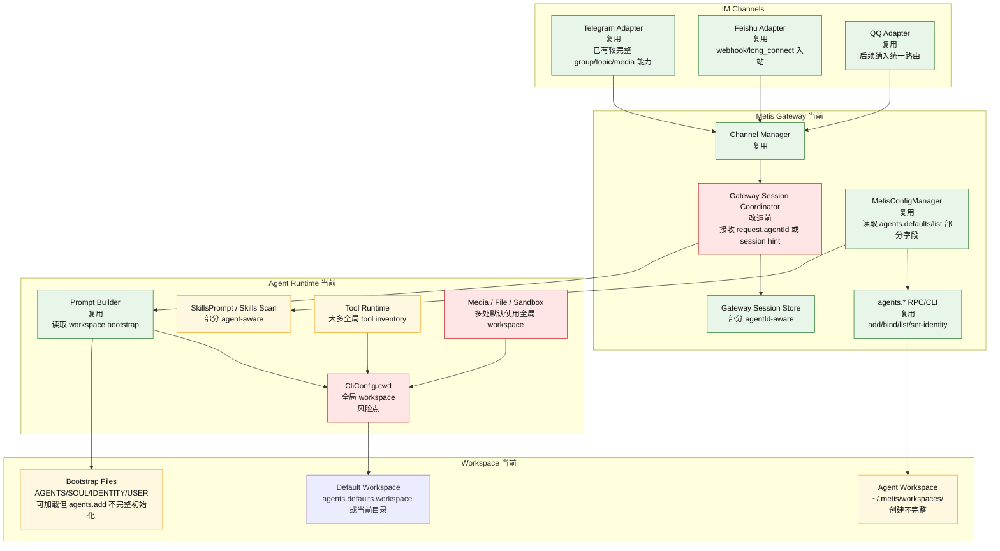
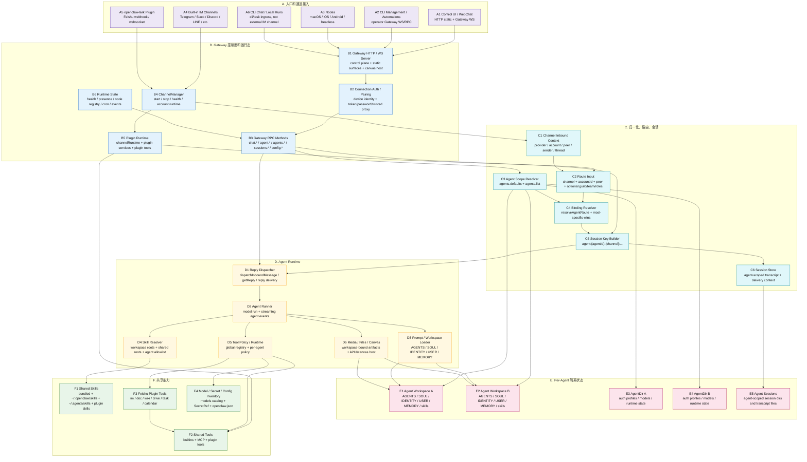
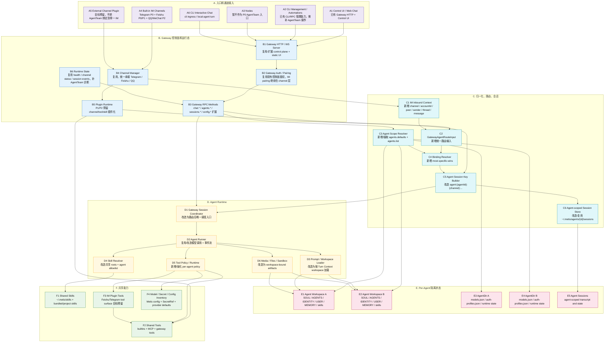
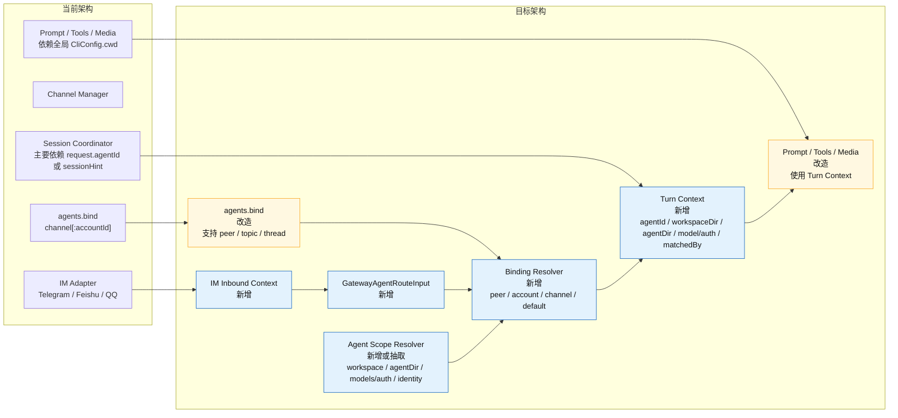
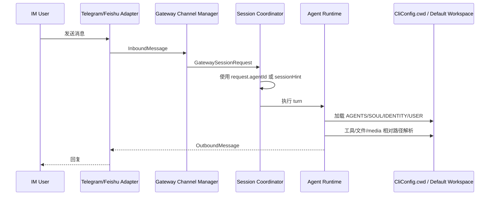
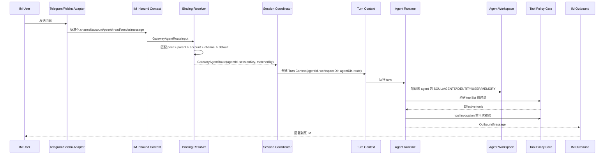
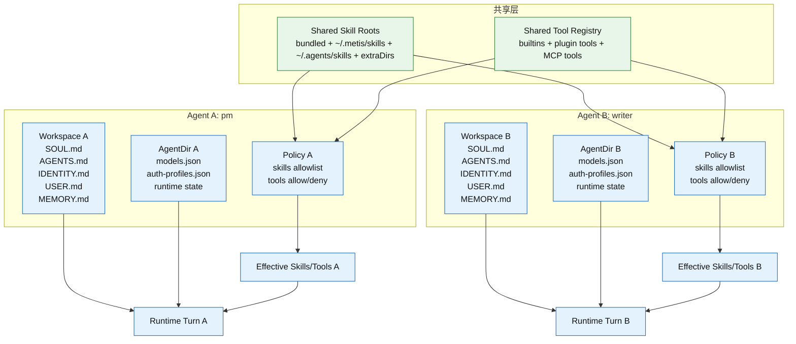

# Metis IM 智能体团队详细设计与落地方案

日期：2026-05-11

## 0. 文档目的

本文件补充并替代前一版偏概要、且过度聚焦飞书的英文分析：

- `develop_steps/metis-feishu-agent-team-openclaw-lark-architecture-analysis-2026-05-11.md`

本文件按 Superpowers 的头脑风暴方法重新整理：

1. 先明确用户真正想要的产品能力；
2. 基于网页和源码识别 OpenClaw / openclaw-lark 的实现边界；
3. 给出 3 种可选落地路线及取舍；
4. 在 Metis 当前架构边界内给出推荐设计；
5. 将每个功能拆成明确模块、数据结构、调用链、风险点、验收项和测试项；
6. 只制定方案，不修改业务代码。

重要修订：

- 本能力不是“飞书专属能力”，而是 Metis Gateway 层的 **IM 智能体团队能力**。
- Telegram 和飞书是第一优先级适配对象。
- QQ Bot、微信、钉钉、Discord、Slack 等应通过同一套 Channel Adapter / Binding Resolver 模型后续接入。
- 飞书文章和 `openclaw-lark` 是优秀参考实现，但不能把 Metis 架构设计限定为 Feishu-only。

2026-05-12 复核修订：

- 新增源代码级对齐复核文档：`develop_steps/metis-agent-team-openclaw-design-audit-2026-05-12.md`。
- 明确 OpenClaw AgentTeam 不只隔离 workspace，还隔离 `agentDir` 和 `sessions`。
- 明确 `agentDir` 的目标内容：`models.json`、`auth-profiles.json`、legacy `auth.json`、runtime state。
- 明确 Metis 需要补 per-agent model/auth runtime，不能只依赖全局 `~/.metis/models.json` 或全局 provider config。
- 明确新 AgentTeam agent 的目标默认路径应对齐 OpenClaw：`~/.metis/agents/<agentId>/agent`；旧 Metis custom agent 布局只兼容，不静默破坏。

## 1. 需求澄清

用户关注的不是普通 IM 机器人，也不是单 Agent 接入某个 IM，而是类似飞书 AgentTeam、同时可推广到 Telegram / QQ Bot / 其他 IM 的多智能体团队能力：

- 一次部署得到多个智能体；
- 每个智能体有独立且可编辑的：
  - `SOUL.md`
  - `AGENTS.md`
  - `IDENTITY.md`
  - `USER.md`
  - `MEMORY.md`
  - workspace
  - session history
  - agentDir / auth / runtime state
- skill 和 tool 是公用的；
- 可按 IM 渠道、账号、群/私聊、用户、话题/thread、@提及或别名，把消息路由到不同智能体；
- 在一个 IM 群聊或团队空间中，多个智能体可以像团队成员一样协作；
- 不能破坏 Metis 现有 Gateway / Channel / Session / Agent / Tool 架构边界。

本需求的关键不是“增加一个 Feishu 工具”或“增加一个 Telegram 命令”，而是把 Metis 的多 Agent 配置、路由、工作区、提示词注入、工具权限和多 IM 入口统一起来。

第一优先级：

1. Telegram：已有 Telegram 能力较完整，适合作为通用 IM route resolver 的第一条验证链路。
2. 飞书：有官方 OpenClaw / openclaw-lark 参考实现，且产品形态最接近 AgentTeam。

第二优先级：

- QQ Bot：已有 Metis channel 基础，待统一 route resolver 后接入。
- 其他 IM：通过同一套 `GatewayAgentRouteInput` 和 `bindings` 模型接入。

## 2. 网页与源码结论

### 2.1 飞书网页侧

用户给出的文章：

- https://www.feishu.cn/content/article/7613711414611463386

该文章主要介绍飞书官方 OpenClaw 插件如何把 OpenClaw Agent 接入飞书，强调消息、文档、多维表格、日历、任务等飞书能力。

另一个更直接描述 AgentTeam 的飞书文章：

- https://www.feishu.cn/content/article/7629286303804329160

该文章明确描述：

- AgentTeam 可以在飞书中创建多个不同职责的智能体；
- 多个智能体可以在一个飞书群中协作；
- 一个 OpenClaw 应用可以创建多个 Agent；
- Agent 可以基于模板初始化角色、能力、记忆等。

因此，飞书 AgentTeam 的产品效果可以抽象为通用 IM AgentTeam 效果：

```text
IM 群/用户/话题
  -> IM Adapter 解析消息
  -> OpenClaw/Metis 路由到某个 Agent
  -> Agent 使用自己的 workspace 和身份文件
  -> Agent 调用共享 tool/skill
  -> 回复回对应 IM
```

## 3. OpenClaw / openclaw-lark 实现拆解

### 3.1 openclaw-lark 负责什么

`openclaw-lark` 是飞书插件，不是多 Agent 核心。

源码证据：

| 能力 | 源码位置 | 说明 |
| --- | --- | --- |
| 飞书插件描述 | `openclaw-lark/README.zh.md:9-31` | 插件提供消息、文档、多维表格、日历、任务、卡片、权限、群组配置 |
| 插件清单 | `openclaw-lark/openclaw.plugin.json:1-49` | 注册 `feishu` channel、skills、Feishu tool contracts |
| 飞书工具 | `openclaw-lark/openclaw.plugin.json:15-47` | 包含 `feishu_calendar_*`、`feishu_task_*`、`feishu_im_*`、`feishu_doc_*` 等 |
| 配置 schema | `openclaw-lark/src/core/config-schema.ts:133-146` | 群配置有 `tools`、`skills`、`systemPrompt` |
| Agent 配置辅助 | `openclaw-lark/src/core/agent-config.ts:5-13` | 明确读取 top-level `agents.list`，不是插件内部独立维护 agent |
| Agent 名称/技能/工具策略 | `openclaw-lark/src/core/agent-config.ts:47-155` | 解析 agent display name、skills filter、tools policy |
| 入站路由 | `openclaw-lark/src/messaging/inbound/dispatch-context.ts:101-117` | 调用 `core.channel.routing.resolveAgentRoute` |
| 上下文构造 | `openclaw-lark/src/messaging/inbound/dispatch-builders.ts:104-130` | 注入 `SessionKey`、`AccountId`、`SenderName`、`Provider`、`Surface` |
| 群技能过滤 | `openclaw-lark/src/messaging/inbound/dispatch.ts:533-557` | 群配置可以缩小 skillFilter |
| 多账号隔离诊断 | `openclaw-lark/src/core/security-check.ts:36-67` | 检测多飞书账号共用默认 Agent 的风险 |
| 隔离修复命令 | `openclaw-lark/src/core/security-check.ts:155-174` | 生成 `agents.list` 和 `bindings` 修复命令 |
| DM session 隔离 | `openclaw-lark/src/core/security-check.ts:92-104` | 推荐 `session.dmScope=per-account-channel-peer` |

结论：

- openclaw-lark 把飞书事件转成 OpenClaw 标准入站上下文；
- 它不直接创建多 Agent；
- 它依赖 OpenClaw 核心的 `agents.list`、`bindings`、`resolveAgentRoute`、session key、workspace、tool/skill 体系。

### 3.2 OpenClaw 核心负责什么

源码证据：

| 能力 | 源码位置 | 说明 |
| --- | --- | --- |
| 多 Agent 概念 | `openclaw/docs/concepts/multi-agent.md:10-18` | Agent 是独立 brain，有 workspace、agentDir、sessions |
| 独立 workspace / agentDir / sessions | `openclaw/docs/concepts/multi-agent.md:17-37` | 明确不要复用 agentDir，否则 auth/session 冲突 |
| 默认路径 | `openclaw/docs/concepts/multi-agent.md:57-58` | workspace、agentDir、sessions 路径约定 |
| Agent wizard | `openclaw/docs/concepts/multi-agent.md:89-120` | `openclaw agents add` 创建独立 agent，然后配置 bindings |
| 人设隔离 | `openclaw/docs/concepts/multi-agent.md:140` | 多 Agent 有不同 `AGENTS.md`、`SOUL.md` |
| 路由规则 | `openclaw/docs/concepts/multi-agent.md:231-240` | most-specific wins：peer、parentPeer、guild+roles、account、channel、default |
| Agent workspace 解析 | `openclaw/src/agents/agent-scope.ts:260-282` | `agents.list[].workspace` > default workspace > `workspace-<agentId>` |
| AgentDir 解析 | `openclaw/src/agents/agent-scope.ts:318-326` | `agents.list[].agentDir` > `~/.openclaw/agents/<id>/agent` |
| default agent 规则 | `openclaw/src/agents/agent-scope.ts:83-95` | 无 `agents.list` 时为 `main`；多个 default 警告；否则第一个 `default=true` 或第一项 |
| agentId 规范化 | `openclaw/src/routing/session-key.ts:23-27`、`:89-116` | 路径安全、最长 64、非法字符折叠 |
| Workspace 文件集 | `openclaw/src/agents/workspace.ts:12-20` | `AGENTS.md`、`SOUL.md`、`TOOLS.md`、`IDENTITY.md`、`USER.md` 等 |
| Workspace 初始化 | `openclaw/src/agents/workspace.ts:340-435` | 创建 workspace 并写入 bootstrap 文件 |
| Workspace + sessions 初始化 | `openclaw/src/commands/onboard-helpers.ts:166-179` | `agents add` 后确保 workspace 和 `agents/<id>/sessions` |
| Auth profile 显式复制 | `openclaw/src/commands/agents.commands.add.ts:239-258` | 交互式创建 agent 时询问是否从默认 agent 复制 auth profiles，不自动共享 |
| Bootstrap 加载 | `openclaw/src/agents/workspace.ts:463-528` | 读取 workspace bootstrap 文件 |
| 安全读取 | `openclaw/src/agents/workspace.ts:44-77` | boundary-safe read，限制在 workspace root 内 |
| Identity 文件解析 | `openclaw/src/agents/identity-file.ts:38-88` | 从 `IDENTITY.md` 提取 name/emoji/theme/creature/vibe/avatar，并过滤占位值 |
| Identity avatar 校验 | `openclaw/src/config/validation.ts:367-420` | avatar 必须是 workspace-relative、http(s) URL 或 data URI，且 workspace-relative 不能逃逸 workspace |
| Per-agent model runtime | `openclaw/src/agents/models-config.ts:135-183` | `ensureOpenClawModelsJson` 在 `agentDir/models.json` 写入模型目录，`agentDir` 权限 `0700`，文件权限 `0600` |
| Per-agent auth runtime | `openclaw/docs/concepts/oauth.md:54-66` | `auth-profiles.json` 和 legacy `auth.json` 位于 `~/.openclaw/agents/<agentId>/agent/` |
| 模型解析使用 agentDir | `openclaw/src/agents/pi-embedded-runner/model.ts:564-612`、`:614-705` | `resolveModel` / `resolveModelAsync` 通过 `agentDir` 发现 auth storage 和 model registry |
| per-agent model fallbacks | `openclaw/src/agents/agent-scope.ts:185-220` | agent model 可以是 primary/fallbacks；空 fallbacks 是显式禁用全局 fallback |
| per-agent runtime defaults | `openclaw/src/config/zod-schema.agent-runtime.ts:773-815` | agent entry 支持 thinking/reasoning/fastMode、memorySearch、identity、groupChat、subagents、sandbox、tools、runtime |
| `/models` agent 视角 | `openclaw/src/auto-reply/reply/directive-handling.model.ts:279-315` | `/models` 使用 `${agentDir}/models.json`，并显示 `Agent` 与 `Auth file` |
| 路由实现 | `openclaw/src/routing/resolve-route.ts:91-109`、`:760-814` | 生成 `agentId`、`sessionKey`、`mainSessionKey`、`matchedBy` |
| Session key | `openclaw/src/routing/session-key.ts:98-169` | `agent:<agentId>:...` 结构，支持不同 DM scope |
| last-route 策略 | `openclaw/src/routing/resolve-route.ts:39-60`、`:64-76` | route 输出 `lastRoutePolicy`，决定 inbound lastRoute 写 main 还是当前 session |
| main DM owner pin | `openclaw/docs/channels/channel-routing.md:45-56`、`openclaw/src/channels/session.test.ts:109-125` | `session.dmScope=main` 时，如果 allowFrom 可推断唯一 owner，非 owner DM 不覆盖 main session 的 `lastRoute` |
| accountId 语义 | `openclaw/docs/concepts/multi-agent.md:243-247`、`openclaw/src/commands/agents.bindings.ts:10-14`、`:237-262`、`openclaw/src/routing/account-id.ts:3-59` | 省略 `accountId` 匹配默认账号；`accountId:"*"` 才是 channel-wide fallback；accountId 需要统一规范化 |
| channel default account | `openclaw/src/channels/plugins/helpers.ts:7-15`、`openclaw/src/routing/bindings.ts:105-114` | channel 默认账号优先取 plugin defaultAccountId，其次第一个 account，最后 `default`；有绑定账号时 outbound/preferred account 优先使用绑定账号 |
| account-scoped DM security | `openclaw/src/channels/plugins/helpers.ts:34-69`、`openclaw/docs/channels/pairing.md:41-54`、`openclaw/docs/gateway/security/index.md:625-631` | DM allowFrom/pairing store 按 account 分文件，不能和 agent auth profiles 混淆 |
| binding apply 语义 | `openclaw/src/commands/agents.bindings.ts:75-159` | apply 时区分 added/updated/skipped/conflicts，并支持同 agent 账号范围升级 |
| binding 类型 | `openclaw/src/config/types.agents.ts:38-59`、`openclaw/src/config/bindings.ts:6-27`、`openclaw/src/routing/bindings.ts:17-18` | binding 有 `route` 和 `acp` 两类；未写 type 兼容为 `route`；普通 route resolver 只读取 route binding |
| Provider/account 展示 | `openclaw/src/commands/agents.commands.list.ts:45-72`、`:102-133`、`openclaw/src/commands/agents.providers.ts:46-93` | agents list 展示 route/provider/account 状态 |
| 群聊 mention / history | `openclaw/docs/channels/groups.md:250-275` | `agents.list[].groupChat.mentionPatterns` 是安全、大小写不敏感 regex；群历史上下文是 pending-only，可用 historyLimit 关闭 |
| Telegram 群安全/话题继承 | `openclaw/docs/channels/telegram.md:155-168`、`:480-492` | Telegram groupAllowFrom 与 DM pairing store 分离；topic 继承 group 设置，但 `agentId` 是 topic-only |
| Broadcast groups | `openclaw/docs/channels/broadcast-groups.md:153-177`、`:284-305` | broadcast 对同一消息触发多个 agent，优先级高于 bindings，但不绕过 channel allowlist 或 mention/activation gate |
| Skill 位置 | `openclaw/docs/tools/skills.md:15-34` | shared roots + workspace roots |
| Skill allowlist | `openclaw/docs/tools/skills.md:44-68`、`openclaw/src/agents/skills/agent-filter.ts:1-25` | `agents.defaults.skills` 共享基线，`agents.list[].skills` 替换 |
| Tool policy | `openclaw/docs/concepts/multi-agent.md:552-605` | tools 全局注册，按 agent 策略收窄 |
| Per-agent sandbox/tools/subagents/memorySearch | `openclaw/docs/concepts/multi-agent.md:145-180`、`:557-607`、`openclaw/src/config/zod-schema.agent-runtime.ts:787-813` | 默认隔离，显式配置才跨 agent 搜索/委派；sandbox 和 tools 可 per-agent |

结论：

OpenClaw 的 AgentTeam 能力本质是：

```text
共享 Gateway
  + 共享 plugin/skill/tool inventory
  + 多个 agents.list 条目
  + 每个 agent 独立 workspace/agentDir/session
  + bindings 把不同会话路由到不同 agent
```

## 4. Metis 当前状态

### 4.1 Metis 已具备的基础

| 能力 | Metis 源码 | 当前状态 |
| --- | --- | --- |
| 默认 workspace | `src/core/config/metis_config_manager.cj:880-887` | 读取 `agents.defaults.workspace` |
| 全局 cwd | `src/core/config/cli_config.cj:47-62` | `CliConfig.cwd` 是全局工作区 |
| Workspace 路径 | `src/core/config/metis_paths.cj:70-80` | 默认取当前目录或 `~/.metis` |
| Workspace bootstrap 文件 | `src/core/prompting/metis_workspace_bootstrap.cj:8-16` | 已支持 `AGENTS.md`、`SOUL.md`、`IDENTITY.md`、`USER.md` 等 |
| Bootstrap 加载 | `src/core/prompting/metis_workspace_bootstrap.cj:42-101` | 能按 workspace 读取上下文文件 |
| Agent skills | `src/core/config/metis_config_manager.cj:995-1040`、`:1270-1387` | 已支持默认/agent 级 skills、memorySearch 读取 |
| Agent 管理 CLI | `src/program/cli_local_flows.cj:1312-1757` | 支持 list/add/bind/unbind/set-identity/delete |
| Agent 管理 RPC | `src/gateway/runtime/gateway_server_methods_agents.cj:1446-1535` | 支持 `agents.*` 方法 |
| Agent 默认 workspace | `src/gateway/runtime/gateway_server_methods_agents.cj:502` | `~/.metis/workspaces/<agentId>` |
| Agent add | `src/gateway/runtime/gateway_server_methods_agents.cj:795-839` | 创建 workspace、agentDir、`AGENT.md` |
| Session context | `src/gateway/session/coordinator.cj:147-174`、`:553-583` | 有 session key 和 agentId 入口 |
| Feishu 入站 | `src/gateway/channels/feishu/feishu_adapter.cj:320-378` | 飞书消息映射为 `InboundMessage` |
| Feishu topic/group scope | `src/gateway/channels/feishu/feishu_adapter.cj:640-710` | 支持 group/topic/sender session scope |
| Telegram 入站路由基础 | `src/gateway/channels/telegram/telegram_adapter.cj`、`src/gateway/channels/telegram/telegram_adapter_test.cj:2064-2089` | 已有 group/topic `agentId` 规则测试基础，适合作为第一优先级适配 |
| QQ Channel 基础 | `src/gateway/channels/qq/qq_adapter.cj` | 已有 QQ adapter，后续可接入同一 route resolver |

### 4.2 Metis 当前主要缺口

1. `agents.bind` 只支持 `channel[:accountId]`，不支持通用 IM peer、用户、话题/thread、@别名。
2. Telegram / Feishu 入站消息还没有统一通过 Gateway binding resolver 自动解析 `agentId`。
3. `CliConfig.cwd` 是全局工作区，不能保证并发请求按 agent workspace 隔离。
4. `agents.add` 只创建 `AGENT.md`，没有完整创建 `SOUL.md`、`AGENTS.md`、`IDENTITY.md`、`USER.md`。
5. Skill 虽然可按 agent 读取，但“共享 skill + 可选 agent allowlist”的产品语义需要明确化。
6. Tool policy 目前更多体现在状态/报告和部分运行时，不是完整的 per-agent invocation gate。
7. Control UI 尚未提供 AgentTeam 视图、身份文件编辑、Telegram/飞书绑定编辑。
8. 缺少多 Telegram bot / 多飞书账号 / 多群共用默认 agent 的安全诊断。
9. per-agent model/auth runtime 尚未成型：`src/core/config/metis_paths.cj:118-120` 当前模型运行态路径是全局 `~/.metis/models.json`；`src/cliapp/models_command.cj:261-267` 也明确是 CLI chat 的全局/运行时状态。
10. `agents.add` 当前默认 `agentDir` 是 `~/.metis/agents/<agentId>`，OpenClaw 目标布局是 `~/.openclaw/agents/<agentId>/agent`；Metis 需要目标布局和旧 custom agent 布局的兼容/诊断策略。
11. default agent、agentId 规范化、多个 default 冲突诊断还没有统一冻结。
12. binding 的 `accountId` 缺省/通配语义不完整：缺省应是默认账号，`"*"` 才是所有账号 fallback。
13. binding apply 当前更接近 append/冲突判断，缺少 OpenClaw 的 added/updated/skipped/conflicts 语义和同 agent 账号范围升级。
14. identity avatar 的 workspace 边界校验尚未作为 AgentTeam 文件编辑验收项。
15. Agent Scope 还没有完整承载 thinking/reasoning/fastMode、groupChat、subagents、sandbox、memorySearch、runtime 等 OpenClaw agent entry 字段。
16. `/agents list` / Control UI 还缺少 provider/account 状态视图，用户无法从 agent 列表直接看出哪个 agent 绑定了哪个 IM 账号。

## 5. 头脑风暴：三种落地路线

### 路线 A：只做单一 IM 侧多 Agent 路由

内容：

- 给 Telegram 或 Feishu adapter 增加独立 `agentId` 配置；
- 每个群、话题或账号手工配置 agent；
- 运行时仍使用全局 workspace。

优点：

- 1-2 天可做出表面效果；
- 对现有代码影响小。

缺点：

- 不满足用户要求的 `SOUL.md/AGENTS.md/IDENTITY.md/USER.md/workspace` 隔离；
- 容易出现多个 agent 共用 workspace、memory、auth 的数据串扰；
- 以后还要返工。

结论：不推荐。

### 路线 B：按 OpenClaw 核心语义补齐 Metis 多 Agent 底座

内容：

- 实现通用 `gatewayResolveAgentRoute`；
- 扩展 `bindings` match 模型；
- 每次请求按 `agentId` 解析 workspace；
- `agents.add` 初始化完整 workspace 文件；
- tool/skill 共享注册，按 agent 策略收窄；
- Telegram、飞书、QQ 都只是这个路由体系的 channel adapter。

优点：

- 与 OpenClaw 架构一致；
- 满足用户要求；
- 能优先复用到 Telegram 和飞书，再扩展到 QQ、未来微信/钉钉；
- 不破坏 Metis Gateway/Channel/Session 边界。

缺点：

- 需要梳理 `CliConfig.cwd` 的全局状态使用；
- 测试量比路线 A 大。

结论：推荐。

### 路线 C：实现完整 AgentTeam 产品层

内容：

- 路线 B 的全部内容；
- 增加 AgentTeam 模板、主管 Agent、成员 Agent、群内 @别名路由；
- Control UI 提供团队创建向导；
- Telegram inline button / 飞书卡片支持选择或切换 agent；
- 可能加入团队协作协议，例如 supervisor 委派 subagent。

优点：

- 产品体验最接近飞书 AgentTeam；
- 对用户最友好。

缺点：

- 工作量更大；
- 必须先有路线 B 的底座。

结论：作为第二阶段产品化，不作为第一阶段底座。

## 6. 推荐方案

采用路线 B，保留路线 C 的扩展点。

推荐目标：

```text
第一阶段目标：
  Metis 支持多 Agent 隔离：
    - 每个 agent 独立 workspace / agentDir / session
    - 每个 agent 可编辑 SOUL.md / AGENTS.md / IDENTITY.md / USER.md
    - Telegram 群/私聊/topic、飞书群/用户/账号/话题可以路由到不同 agent
    - skill/tool 默认共享，但可按 agent 收窄

第二阶段目标：
  在第一阶段基础上，做 AgentTeam 产品化：
    - 团队模板
    - Telegram @bot/命令/按钮路由、飞书 @别名路由
    - supervisor/member 协作
    - Control UI 向导
```

## 7. 目标配置模型

### 7.1 agents 配置

建议 Metis 对齐 OpenClaw 语义：

```json
{
  "agents": {
    "defaults": {
      "workspace": "~/.metis/workspaces",
      "skills": ["telegram", "feishu-task", "feishu-im-read"],
      "tools": {
        "deny": []
      }
    },
    "list": [
      {
        "id": "pm",
        "name": "项目经理",
        "workspace": "~/.metis/workspaces/pm",
        "agentDir": "~/.metis/agents/pm/agent",
        "identity": {
          "name": "项目经理",
          "emoji": "📋",
          "avatar": "avatars/pm.png"
        },
        "skills": ["telegram", "feishu-task", "feishu-im-read"],
        "tools": {
          "allow": ["telegram_*", "feishu_*", "sessions_*", "message"]
        }
      },
      {
        "id": "writer",
        "name": "文案同学",
        "workspace": "~/.metis/workspaces/writer",
        "agentDir": "~/.metis/agents/writer/agent"
      }
    ]
  }
}
```

### 7.2 bindings 配置

建议支持 OpenClaw 风格 match：

```json
{
  "bindings": [
    {
      "agentId": "pm",
      "match": {
        "channel": "feishu",
        "accountId": "default",
        "peer": {
          "kind": "group",
          "id": "oc_xxx"
        }
      }
    },
    {
      "agentId": "ops",
      "match": {
        "channel": "telegram",
        "accountId": "main-bot",
        "peer": {
          "kind": "group",
          "id": "-1001234567890"
        }
      }
    },
    {
      "agentId": "reviewer",
      "match": {
        "channel": "telegram",
        "accountId": "main-bot",
        "peer": {
          "kind": "topic",
          "id": "-1001234567890:topic:42"
        }
      }
    },
    {
      "agentId": "writer",
      "match": {
        "channel": "feishu",
        "accountId": "default",
        "peer": {
          "kind": "direct",
          "id": "ou_xxx"
        }
      }
    }
  ]
}
```

### 7.3 AgentTeam 扩展配置

第一阶段不必强依赖，但设计上预留：

```json
{
  "agentTeams": [
    {
      "id": "marketing",
      "name": "市场团队",
      "channels": ["telegram", "feishu"],
      "defaultAgentId": "pm",
      "members": [
        { "agentId": "pm", "aliases": ["项目经理", "PM"] },
        { "agentId": "writer", "aliases": ["文案", "写手"] },
        { "agentId": "reviewer", "aliases": ["审核", "Review"] }
      ],
      "bindings": [
        { "channel": "telegram", "accountId": "main-bot", "peer": { "kind": "group", "id": "-1001234567890" } },
        { "channel": "feishu", "accountId": "default", "peer": { "kind": "group", "id": "oc_xxx" } }
      ]
    }
  ]
}
```

该配置只作为产品化层，底层仍落到 `agents.list` 和 `bindings`。

## 8. 架构设计图

本节用于严谨对比“当前 Metis 架构”和“目标 IM AgentTeam 架构”的差异。

图例：

- `复用`：已有模块，目标方案继续使用；
- `改造`：已有模块，但需要改变输入、输出或职责边界；
- `新增`：当前缺失，需要新增；
- `P0/P1`：第一优先级，Telegram + 飞书；
- `P2`：后续接入，QQ Bot / 其他 IM。

### 8.1 当前架构图

当前 Metis 已经有 Gateway、Channel Adapter、Session Coordinator、Agent 管理、Workspace Bootstrap、Tool/Skill 基础，但关键问题是：IM 入站没有统一走 agent route resolver，运行时 workspace 仍强依赖全局 `CliConfig.cwd`。



当前架构的核心限制：

1. Telegram / 飞书 / QQ 入站消息没有统一转换成 `GatewayAgentRouteInput`。
2. `agents.bind` 只能表达 `channel[:accountId]`，不能表达 group/direct/topic/thread。
3. `GatewaySessionCoordinator` 不能基于 binding 自主选择 agent。
4. prompt、tool、media、sandbox 运行时仍可能读取全局 `CliConfig.cwd`。
5. `agents.add` 创建了 agent workspace，但没有完整初始化 `SOUL.md`、`AGENTS.md`、`IDENTITY.md`、`USER.md` 等团队身份文件。

### 8.2 目标架构图

本节先画 OpenClaw / openclaw-lark 的参考架构，再画 Metis 目标架构。两张图使用相同分组、相同编号、相同数据流方向，方便逐层对比。编号规则如下：

1. `A*`：入口和通道接入。
2. `B*`：Gateway 控制面和运行态。
3. `C*`：归一化、路由、会话。
4. `D*`：Agent runtime。
5. `E*`：隔离状态。
6. `F*`：共享能力。

对比重点是：OpenClaw 已经把 Gateway 作为长期运行的核心进程，Gateway 拥有 channel connections、WebSocket control plane、ChannelManager、plugin runtime、routing/session/runtime；`openclaw-lark` 是挂到 OpenClaw Gateway 的 Feishu channel plugin，不直接拥有多 Agent 状态。Metis 的目标是把同类能力放进现有 Gateway/Core，并优先接入 Telegram + 飞书。

#### 8.2.1 OpenClaw 参考架构图

OpenClaw 的架构中，Gateway 是中心。`openclaw-lark` 作为外部 channel plugin 接入 Gateway 的 `ChannelManager` / plugin runtime；它把飞书事件标准化后，通过 `core.channel.routing.resolveAgentRoute` 进入 OpenClaw 的 routing/session/reply runtime。OpenClaw core 根据 `agents.list` 和 `bindings` 选择 agent，再解析 workspace、agentDir、skills、tools policy。



OpenClaw 参考架构的关键点：

1. Gateway 是 OpenClaw 的核心长期进程，拥有 channel connections、HTTP/WS control plane、Control UI 静态服务、nodes 接入和 canvas host。
2. `ChannelManager` 是 channel 生命周期入口，内置 channel 和外部 plugin channel 都挂到 Gateway，而不是绕过 Gateway。
3. CLI 在 OpenClaw 中需要分成两类：`openclaw agents/config/health/tasks` 这类管理命令是 control plane operator，走 Gateway WS/RPC；CLI 发起的 agent/chat/task run 是本地 ingress/task 来源，不等同于 Telegram/Feishu 这种外部 IM channel。
4. `openclaw-lark` 是 Feishu channel plugin；它调用 `core.channel.routing.resolveAgentRoute`，不自己实现 multi-agent core。
5. `resolveAgentRoute` 是统一路由中心，`bindings` 决定 agent；session key 统一使用 `agent:{agentId}:...` 形态。
6. agent workspace、agentDir、session store 都按 agent 隔离；skills/tools 是共享 inventory，再通过 agent allowlist / policy 收窄。
7. 参考证据：`openclaw/docs/gateway/protocol.md:12-13` 说明 Gateway WS 是 single control plane + node transport，`openclaw/docs/gateway/protocol.md:166` 将 `operator` 定义为 CLI/UI/automation；`openclaw/docs/channels/channel-routing.md:16` 的 channel 列表包含 Telegram/WhatsApp/Discord/Slack/Signal/iMessage/LINE 等，并说明 `webchat` 是内部 UI channel；`openclaw/docs/automation/tasks.md:20-28`、`:79` 将 CLI operations 归为 task/cli 来源；`openclaw/docs/concepts/architecture.md` 描述 Gateway 拥有 messaging surfaces、WS control plane、nodes、canvas host；`openclaw/src/gateway/server.impl.ts` 组装 `createChannelManager`、`createGatewayRuntimeState`、`attachGatewayWsHandlers`、`startGatewaySidecars`；`openclaw/src/gateway/server-startup.ts` 启动 channels；`openclaw/src/gateway/server-channels.ts` 将 plugin channel runtime 接入 Gateway；`openclaw-lark/src/messaging/inbound/dispatch-context.ts` 调用 `core.channel.routing.resolveAgentRoute`。

辅助说明：OpenClaw 中 CLI、WebChat、外部 IM channel 的区别

| 入口 | 技术归属 | 是否走 ChannelManager | 说明 |
| --- | --- | --- | --- |
| Control UI / WebChat | Gateway HTTP/WS control surface + internal WebChat channel语义 | 否，WebChat 是内部 UI channel，不是外部 IM adapter | 用户在网页里操作或聊天，连接 Gateway 控制面，再进入选中 agent 的 session/runtime。 |
| CLI 管理命令 | Gateway WS/RPC operator | 否 | `agents`、`config`、`health`、`sessions`、`tasks` 等命令是短连接/一次性控制面操作。 |
| CLI agent/chat/task run | local cli/task ingress | 通常不作为外部 IM channel 交给 ChannelManager 管理 | 它可以产生 agent turn 或 task，但没有外部平台账号、webhook/polling、IM 出站投递生命周期。 |
| Telegram/Slack/Discord/LINE 等内置 IM | built-in channel runtime | 是 | 需要 ChannelManager 管理连接、账号、入站事件、重试、出站发送和 health。 |
| openclaw-lark / Feishu | external channel plugin runtime | 是 | 插件 channel 通过 Gateway plugin runtime 接入 ChannelManager，再进入统一 routing/session/runtime。 |

#### 8.2.2 Metis 目标架构图

目标架构把 AgentTeam 下沉为 Gateway 核心能力。Telegram 和飞书都只负责解析/发送 IM 消息；agent 选择、workspace 选择、session 隔离、skill/tool 策略都由 Gateway / Agent Runtime 统一处理。图中节点编号与 OpenClaw 图保持一致，便于逐项判断“已具备 / 复用 / 新增 / 改造 / 缺失”。



目标架构的关键性质：

1. AgentTeam 是 Gateway 通用能力，不属于 Telegram adapter 或 Feishu adapter。
2. Metis Gateway 需要像 OpenClaw Gateway 一样成为入口聚合点：Control UI 和 CLI 管理命令走 Gateway RPC；CLI 交互式聊天作为 `cli` ingress / local agent turn 进入 routing/session/runtime；Telegram/Feishu/QQ/WeChat 这类外部 IM 走 ChannelManager；最终统一进入 routing/session/runtime。
3. Telegram / 飞书第一优先级接入同一套 `GatewayAgentRouteInput`。
4. `Binding Resolver` 是唯一选择 agent 的地方，避免各 IM adapter 分散硬编码。
5. `Turn Context` 是 runtime 的唯一上下文入口，避免通过全局 `CliConfig.cwd` 切换 workspace。
6. skill/tool inventory 共享，实际可见性和调用权限按 agent 策略收窄。

辅助说明：Metis 中 Gateway RPC、ChannelManager、CLI ingress 的技术区别

| 项 | Gateway RPC | ChannelManager | CLI ingress / local agent turn |
| --- | --- | --- | --- |
| 技术角色 | Gateway 的控制面 API，面向 request/response 操作。 | Gateway 的通道运行时管理器，面向长驻 IM channel 生命周期和事件流。 | 本地命令发起的一次 agent turn 或任务来源，语义上是 `cli` 来源，不是外部 IM channel。 |
| 典型调用方 | Control UI、CLI 管理命令、自动化脚本、WebChat 控制面。 | Telegram adapter、Feishu adapter、QQ/WeChat adapter，以及后续外部 channel plugin。 | `metis agent`、`metis chat`、一次性本地 agent run、chat-backed CLI task。 |
| 生命周期 | 一次调用一次响应，例如 `agents.list`、`agents.add`、`sessions.list`、`config.set`。 | 随 Gateway 常驻运行，负责启动/停止 channel、监听 polling/webhook、维护账号状态、处理重试和出站投递。 | 一次命令或一个本地交互会话；不管理外部平台连接。 |
| 输入数据 | 用户操作、管理命令、配置变更、查询请求。 | IM 平台消息、webhook/polling event、账号状态、发送队列。 | 本地用户输入、CLI 参数、stdin/TUI 输入。 |
| 主要职责 | 权限校验、参数校验、读写配置、查询状态、触发一次性管理动作。 | IM 协议适配、账号/代理/网络处理、入站消息标准化、出站消息发送、channel health。 | 把本地输入包装成 `source=cli` 的 session/chat 请求，进入 routing/session/runtime。 |
| 与 AgentTeam 的关系 | 给 UI/CLI 提供 agent、binding、session、config、diagnostics 的管理入口。 | 给 Telegram/Feishu/QQ/WeChat 提供消息入口，把 IM 事件转成统一入站上下文。 | 作为本地聊天入口参与 agent/session 路由，但不承担 IM adapter 的账号、webhook、发送队列职责。 |

这不是两套 AgentTeam 实现。它们只是进入 Gateway 的两类入口：

```text
Control UI / CLI management / WebChat control surface
  -> Gateway RPC
  -> agents/config/sessions/chat 管理接口
  -> routing/session/runtime

CLI interactive chat / local agent run
  -> cli ingress
  -> routing/session/runtime

Telegram / Feishu / QQ / WeChat
  -> ChannelManager
  -> channel adapter
  -> IM Inbound Context
  -> routing/session/runtime
```

因此，AgentTeam 核心不能放在 Gateway RPC、CLI 命令实现或某个 IM adapter 里。Gateway RPC 只负责控制面操作，CLI ingress 只负责本地聊天/任务入口，ChannelManager 只负责外部 IM channel 生命周期和消息收发；agent 选择、workspace 选择、session 隔离、model/auth runtime、skill/tool policy 都必须下沉到这些入口共享的 routing/session/runtime 层。

#### 8.2.3 架构图节点和元素说明

| 编号 | 分层 | OpenClaw / openclaw-lark 含义 | Metis 目标含义 | 对比结论 |
| --- | --- | --- | --- | --- |
| A1 | 入口和通道接入 | Control UI / WebChat 由 Gateway HTTP 服务静态资源，并通过 Gateway WS 调用控制面。 | Control UI 已有 Gateway 静态服务和控制面连接，AgentTeam 需要补齐会话、agent、binding 操作入口。 | 设计形态相似，Metis 需要补 AgentTeam UX。 |
| A2 | 入口和通道接入 | CLI 管理命令 / automations 作为 Gateway WS/RPC operator 调用 `agents.*`、`config.*`、`sessions.*`、`health` 等控制面方法。 | Metis CLI 管理命令已有部分能力，需补 `agents.bind`、agent scoped session、diagnostics。 | 这是控制面入口，不是外部 IM channel。 |
| A3 | 入口和通道接入 | Nodes 通过 Gateway WS 接入，提供 canvas、camera、screen、location 等 device capability。 | Metis 当前 AgentTeam P0 不依赖 nodes；后续如引入 canvas/native capability，可按 OpenClaw 方式接入。 | OpenClaw 已具备，Metis P0 暂不纳入。 |
| A4 | 入口和通道接入 | 内置 IM channel 由 Gateway 启动和管理，例如 Telegram / Slack / Discord / LINE。 | Telegram 和飞书作为 P0/P1，QQ、WeChat 和其他 IM 作为 P2；都应进入同一个 ChannelManager。 | 外部 IM 才需要 ChannelManager 管理账号、webhook/polling、重试、出站投递。 |
| A5 | 入口和通道接入 | `openclaw-lark` 是外部 Feishu channel plugin，通过 OpenClaw plugin runtime 接入 Gateway。 | Metis 目标预留外部 channel plugin，但第一优先级先把 Telegram / 飞书纳入现有 Gateway 架构。 | OpenClaw plugin 化更成熟；Metis 可先内部适配，再抽 plugin 边界。 |
| A6 | 入口和通道接入 | CLI agent/chat/task run 是 local cli/task ingress，可以触发 agent turn 或 task，但不具备外部 IM 平台生命周期。 | Metis `GatewayIngressSource.Cli` 已存在，CLI 交互式聊天应以 `source=cli` 进入 routing/session/runtime。 | CLI 聊天语义上像本地 channel/ingress，但技术上不应放进 ChannelManager。 |
| B1 | Gateway 控制面和运行态 | Gateway HTTP / WS server 是中心进程，承载控制面、静态 UI、canvas host。 | 复用 Metis Gateway HTTP / WS server，扩展 AgentTeam 所需 RPC 和静态 UI。 | 两者都应以 Gateway 为中心。 |
| B2 | Gateway 控制面和运行态 | 处理 device identity、pairing、token/password、trusted proxy 等连接鉴权。 | 复用 Metis 控制面鉴权；IM 用户准入仍放在 Telegram / Feishu channel 层。 | 控制面鉴权和 IM 准入不能混在一起。 |
| B3 | Gateway 控制面和运行态 | Gateway RPC methods 承载 `chat.*`、`agent.*`、`agents.*`、`sessions.*`、`config.*`。 | 扩展 `agents.*`、`sessions.*`、`config.*`，让 Control UI/CLI 管理命令能管理 agent、binding、workspace。 | Metis 需要补齐 AgentTeam 管理 RPC，但不能把 AgentTeam core 写死在 RPC handler。 |
| B4 | Gateway 控制面和运行态 | `ChannelManager` 管理内置 channel 和 plugin channel 生命周期、account runtime、health。 | 复用 ChannelManager，并要求 Telegram / Feishu / QQ / WeChat 都产出统一入站上下文。 | 这是外部 IM 对齐 OpenClaw 的关键模块。 |
| B5 | Gateway 控制面和运行态 | Plugin runtime 提供 `channelRuntime`、plugin services、plugin tools/skills 接入点。 | P1/P2 预留 channel/tool/skill 插件化；P0 可先不强行插件化。 | Metis 应保留架构边界，避免把 plugin 能力写死在 IM adapter。 |
| B6 | Gateway 控制面和运行态 | Runtime state 维护 health、presence、node registry、cron、server events。 | 复用 health、channel status、session events，新增 AgentTeam 诊断和冲突告警。 | Metis 需要让 AgentTeam 状态可观测。 |
| C1 | 归一化、路由、会话 | Channel inbound context 把 provider/account/peer/sender/thread 结构化。 | 新增 `IM Inbound Context`，统一 Telegram group/topic/direct 和 Feishu group/thread/direct。 | 两者必须同构，否则后续 routing 会分裂。 |
| C2 | 归一化、路由、会话 | Route input 承载 channel、accountId、peer，以及 guild/team/roles 等扩展路由信息。 | 新增 `GatewayAgentRouteInput`，第一阶段至少包含 channel/accountId/peer/thread/sender。 | Metis 可先覆盖 Telegram/Feishu 需要的字段，再保留扩展位。 |
| C3 | 归一化、路由、会话 | Agent scope resolver 从 `agents.defaults`、`agents.list` 解析 workspace、agentDir、model、skills。 | 新增/抽取 resolver，统一解析 `agents.defaults/list/workspace/agentDir/modelsJsonPath/authProfilesPath/identity`。 | Metis 不能继续依赖散落的默认 workspace 或全局模型状态推导。 |
| C4 | 归一化、路由、会话 | `resolveAgentRoute` 根据 bindings 采用 most-specific-wins 选择 agent。 | 新增 Binding Resolver，支持 peer/topic/thread/account/channel/default 优先级。 | 这是 AgentTeam 的核心选择器。 |
| C5 | 归一化、路由、会话 | Session key 使用 `agent:{agentId}:...` 形态，区分 main、direct、channel、group 等。 | 改造 session key builder，统一 agent-scoped key，避免裸 `main` 和跨 agent 串会话。 | 两边必须形态接近，便于 UI 和 session store 统一处理。 |
| C6 | 归一化、路由、会话 | Session store 保存 agent-scoped transcript、delivery context、usage、model 等状态。 | 改造/复用 `~/.metis/agents/{id}/sessions` 或等价 agent-scoped store。 | Metis 需要彻底避免多 agent 共用同一会话状态。 |
| D1 | Agent Runtime | Reply dispatcher 是入站消息进入 agent run 和出站回复的调度点。 | Gateway Session Coordinator 改造成路由后唯一调度入口。 | 名称可不同，但职责应对应。 |
| D2 | Agent Runtime | Agent runner 执行模型调用，产生 streaming events、usage、tool events。 | 复用/改造 Metis agent runner，接收 Turn Context。 | Metis 重点是把 agent/workspace/route 传入 runner。 |
| D3 | Agent Runtime | Prompt/workspace loader 从 agent workspace 加载 AGENTS/SOUL/IDENTITY/USER/MEMORY。 | Prompt Builder 改为按 Turn Context workspace 加载 bootstrap。 | 这是实现 SOUL/AGENTS/IDENTITY/USER 隔离的入口。 |
| D4 | Agent Runtime | Skill resolver 合并 workspace roots、shared roots，并应用 agent allowlist。 | Skill Resolver 改造为共享 roots + per-agent allowlist。 | Metis 必须区分 skill inventory 和 agent 可见性。 |
| D5 | Agent Runtime | Tool runtime 从全局 registry/MCP/plugin tools 中按 agent policy 收窄。 | Tool Policy Gate 新增/强化，工具构建前过滤、调用前二次校验。 | Metis 需要防止 agent 越权调用共享工具。 |
| D6 | Agent Runtime | Media/files/canvas 都绑定 workspace，canvas host/A2UI 由 Gateway 承载。 | Media/File/Sandbox 先绑定 Turn Context workspace；canvas 可作为后续能力沿同一边界扩展。 | P0 不要求 canvas，但 workspace-bound artifact 边界必须先正确。 |
| E1/E2 | Per-Agent 隔离状态 | 每个 agent 有自己的 workspace 和可编辑 AGENTS/SOUL/IDENTITY/USER/MEMORY/skills。 | 每个 Metis agent 需要独立 workspace，`agents.add` 应完整初始化 bootstrap 文件。 | Agent 人设和工作区必须隔离。 |
| E3/E4 | Per-Agent 隔离状态 | 每个 agent 有自己的 agentDir，放 `models.json`、`auth-profiles.json`、legacy `auth.json`、model/runtime state。 | 每个 Metis agent 需要独立 `~/.metis/agents/{id}/agent` 或兼容映射，模型和凭据读取必须通过 Turn Context agentDir。 | 配置、凭据、模型目录、运行态不能隐式共享。 |
| E5 | Per-Agent 隔离状态 | agent session dirs/transcript files 按 agent 隔离。 | agent-scoped session store 按 agent 隔离 transcript、usage、delivery context。 | 这是避免“多个智能体混在同一会话”的基础设施。 |
| F1 | 共享能力 | bundled、`~/.openclaw/skills`、`~/.agents/skills`、workspace skills 组成共享/局部 skill inventory。 | `~/.metis/skills`、bundled/project skills 作为共享 inventory，再由 agent allowlist 收窄。 | inventory 可共享，visibility 必须 per-agent。 |
| F2 | 共享能力 | builtins、MCP、plugin tools 组成共享 tool inventory。 | builtins、MCP、gateway tools 共享，但要经过 per-agent policy。 | 共享工具不是共享权限。 |
| F3 | 共享能力 | `openclaw-lark` 提供 Feishu im/doc/wiki/drive/task/calendar plugin tools。 | 预留 IM plugin tools；Telegram/Feishu P0 可先用内部 tool surface。 | Metis 后续可把 IM tool surface 插件化。 |
| F4 | 共享能力 | models catalog、SecretRef、`openclaw.json` 为 runtime 提供模型、凭据、配置来源；最终每个 agent 通过自己的 `agentDir/models.json` 和 `agentDir/auth-profiles.json` 使用。 | Metis config、provider config、SecretRef/等价机制作为共享来源；AgentTeam runtime 必须落到 per-agent model/auth view。 | 配置读取应集中，但 agent 的生效模型和凭据必须可隔离。 |

图中颜色含义：

| 颜色 | 含义 |
| --- | --- |
| 紫色 | 入口和通道接入。 |
| 蓝色 | Gateway 控制面和运行态。 |
| 青色 | 归一化、路由、会话。 |
| 黄色 | Agent runtime。 |
| 粉色 | Per-Agent 隔离状态。 |
| 绿色 | 共享能力。 |

### 8.3 架构差异图

这张图只展示“新增/改造点”，用于看清楚改动发生在哪里。



差异清单：

| 编号 | 类型 | 变动 | 目的 |
| --- | --- | --- | --- |
| D1 | 新增 | `IM Inbound Context` | 让 Telegram / 飞书 / QQ 输出统一入站字段 |
| D2 | 新增 | `GatewayAgentRouteInput` | 解耦 IM parser 和 agent route resolver |
| D3 | 新增 | `Binding Resolver` | 统一处理 peer/account/channel/default 路由 |
| D4 | 新增/抽取 | `Agent Scope Resolver` | 统一解析 agent workspace、agentDir、modelsJsonPath、authProfilesPath、identity、skills、tools |
| D5 | 改造 | `GatewaySessionCoordinator` | 不再只依赖 request.agentId，而是调用 resolver |
| D6 | 新增 | `Turn Context` | 每次 turn 显式携带 agentId/workspaceDir/agentDir/model/auth/matchedBy |
| D7 | 改造 | Prompt / Tools / Media / Sandbox | 从全局 workspace 改成 turn workspace |
| D8 | 改造 | `agents.bind` | 从 `channel[:accountId]` 扩展到 peer/topic/thread |
| D9 | 新增 | Diagnostics | 检测多个 IM 会话隐式共享默认 agent 的风险 |

### 8.4 当前入站时序图



当前时序风险：

- 如果 request 没有 agentId，就无法根据 IM 群/话题/用户自动选择 agent。
- workspace 由全局 `CliConfig.cwd` 决定，不能严格保证多 agent 并发隔离。

### 8.5 目标入站时序图



目标时序保证：

- Telegram 和飞书都走同一套 resolver。
- 每次 turn 都有显式 `workspaceDir`。
- tool list 和 tool invocation 两个阶段都能按 agent policy 收窄。
- `matchedBy` 可用于日志、诊断和 Control UI 解释。

### 8.6 Workspace / Skill / Tool 隔离图



隔离规则：

- workspace、agentDir、session、identity 文件按 agent 隔离；
- `models.json`、`auth-profiles.json`、legacy `auth.json` 属于 agentDir，不属于 workspace；
- tool registry、skill roots 默认共享；
- effective skills/tools 是共享 inventory 经过 agent policy 后的视图；
- agent A 的 `SOUL.md` 不能进入 agent B 的 prompt；
- agent A 的相对路径不能默认落到 agent B workspace。

## 9. 模块级设计

### 9.1 Agent Registry

职责：

- 读取 `agents.defaults` 和 `agents.list`；
- 规范化 agentId；
- 解析 default agent；
- 解析 agent workspace；
- 解析 agentDir；
- 解析 `modelsJsonPath`、`authProfilesPath`、`sessionsDir`；
- 解析 agent 默认 modelRef；
- 解析 default agent、agentId 规范化、identity 来源；
- 输出 agent 列表、身份、模型、运行时默认项、技能、工具、sandbox、subagent、memorySearch 策略。

参考 OpenClaw：

- `openclaw/src/agents/agent-scope.ts`
- `openclaw/src/agents/workspace-dir.ts`

Metis 需要新增或强化：

- `src/core/config/metis_agent_scope.cj`
- 或在现有 `MetisConfigManager` 内拆出更清晰的 agent scope helper。

关键接口建议：

```text
listAgentEntries(root): Array<JsonObject>
resolveDefaultAgentId(root): String
resolveAgentEntry(root, agentId): Option<JsonObject>
resolveAgentWorkspaceDir(root, agentId): Path
resolveAgentDir(root, agentId): Path
resolveAgentModelsJsonPath(root, agentId): Path
resolveAgentAuthProfilesPath(root, agentId): Path
resolveAgentSessionsDir(root, agentId): Path
resolveAgentModelRef(root, agentId): String
resolveAgentModelFallbacks(root, agentId): Array<String>
resolveAgentThinkingDefault(root, agentId): String
resolveAgentReasoningDefault(root, agentId): String
resolveAgentFastModeDefault(root, agentId): Bool
resolveAgentIdentity(root, agentId): JsonObject
resolveAgentGroupChat(root, agentId): JsonObject
resolveAgentSkills(root, agentId): Option<Array<String>>
resolveAgentToolsPolicy(root, agentId): JsonObject
resolveAgentSandboxPolicy(root, agentId): JsonObject
resolveAgentSubagentsPolicy(root, agentId): JsonObject
resolveAgentMemorySearch(root, agentId): JsonObject
resolveAgentRuntime(root, agentId): JsonObject
```

验收：

- 空配置默认 agent 为 `main` 或 Metis 当前约定的 `general`，必须统一；
- 配置 agent workspace 时使用配置值；
- 非默认 agent 未配置 workspace 时落到 `~/.metis/workspaces/<agentId>`；
- 非默认 agent 未配置 agentDir 时落到 `~/.metis/agents/<agentId>/agent`；
- `modelsJsonPath` 固定为 `<agentDir>/models.json`；
- `authProfilesPath` 固定为 `<agentDir>/auth-profiles.json`；
- `sessionsDir` 固定为 `~/.metis/agents/<agentId>/sessions` 或配置化等价路径；
- 不允许 agentId 产生路径穿越。

### 9.2 Route Binding Resolver

职责：

- 从 channel/account/peer/thread/role 等上下文选择 agent；
- 生成 agent-scoped session key；
- 记录 matchedBy；
- 输出 lastRoutePolicy 和 account 选择结果，避免 inbound last-route 与 outbound account 走散。

参考 OpenClaw：

- `openclaw/src/routing/resolve-route.ts`
- `openclaw/src/routing/session-key.ts`

Metis 当前：

- `src/gateway/session/coordinator.cj` 已有 session key 构造；
- 但没有通用 binding resolver；
- `agents.bind` 只支持 `channel[:accountId]`。

建议新增：

- `src/gateway/core/gateway_agent_route_resolver.cj`

核心输入：

```text
GatewayAgentRouteInput:
  cfgRoot
  channelName
  accountId
  defaultAccountId
  peerKind: direct | group | channel | topic | thread
  peerId
  parentPeerKind
  parentPeerId
  threadId
  senderId
  guildId
  teamId
  roles
```

核心输出：

```text
GatewayAgentRoute:
  agentId
  channel
  accountId
  preferredAccountId
  sessionKey
  mainSessionKey
  lastRoutePolicy: main | session
  matchedBy
```

Binding 配置语义必须对齐 OpenClaw：

- `type` 缺省时解释为 `route`，保持旧配置兼容；
- `type="route"` 才进入常规 IM routing；
- `type="acp"` 预留给后续 ACP runtime binding，不应被普通 route resolver 当作 route 命中；
- `comment` 作为可读说明保留，不参与匹配；
- `match.accountId` 缺省时只匹配该 channel 的 default account；
- `match.accountId="*"` 才是 channel-wide fallback；
- accountId 需要统一规范化，空值归一为 `default`，非法字符折叠或拒绝策略必须在一个模块内完成；
- 有显式绑定账号时，preferred outbound account 优先使用该绑定账号，否则使用 channel default account。

匹配优先级：

1. `binding.peer`
2. `binding.peer.parent`
3. `binding.peer.wildcard`
4. `binding.account`
5. `binding.channel`
6. `default`

第一阶段无需实现 Discord guild/roles，因为 Metis 当前第一优先级是 Telegram 和飞书；但数据结构应保留扩展字段，避免后续接 QQ/Discord/Slack 时重写 resolver。

Last-route 策略：

- 如果 resolved sessionKey 等于 mainSessionKey，`lastRoutePolicy=main`；
- 否则 `lastRoutePolicy=session`；
- `session.dmScope=main` 时，若 allowFrom 能推断唯一 DM owner，非 owner DM 只能记录 inbound metadata，不能覆盖 main session `lastRoute`；
- 这条规则属于 session/routing 层，不能散落在 Telegram 或 Feishu adapter 内。

验收：

- Telegram 群 `-100_a` 绑定 `ops`，消息路由到 `ops`；
- Telegram topic `-100_a:topic:42` 绑定 `reviewer`，消息路由到 `reviewer`；
- 飞书群 `oc_a` 绑定 `pm`，消息路由到 `pm`；
- 飞书群 `oc_b` 绑定 `writer`，消息路由到 `writer`；
- 飞书 direct `ou_x` 绑定 `assistant-a`，只影响该用户；
- `accountId="bot-a"` 和 `accountId="bot-b"` 可以绑定不同 agent；
- peer binding 优先于 account binding；
- account binding 优先于 channel binding；
- 未命中时走 default agent；
- 绑定未知 agent 时安全 fallback 并给出诊断；
- route binding 和 acp binding 可共存，普通 resolver 只命中 route binding；
- `accountId` 缺省、显式账号、`"*"` 三种语义分别有单测；
- preferredAccountId 在显式绑定账号时优先返回该账号；
- main DM owner pin mismatch 不覆盖 main session `lastRoute`。

### 9.3 Telegram / Feishu 入站路由接入

职责：

- Telegram adapter 和 Feishu adapter 保持 transport/parser 角色；
- Gateway session coordinator 或 channel manager 调用 route resolver；
- 不把 agent/workspace 逻辑塞进具体 IM adapter。

Metis 当前：

- `TelegramAdapter` 已有群、topic、规则配置、媒体、发送等较完整能力，且测试中已有 group/topic `agentId` 规则样例；
- `FeishuAdapter.mapWebhookToInbound` 已解析：
  - `message_id`
  - `chat_id`
  - `sender_id`
  - `chat_type`
  - `root_id`
  - `thread_id`
  - `conversationId`
  - `replyTargetMessageId`
  - `replyInThread`

需要补：

- `InboundMessage` 或 `GatewaySessionRequest` 增加可表达 route peer 的元数据；
- 在统一入口调用 `gatewayResolveAgentRoute`；
- 将 resolved `agentId` 写入 session context；
- session key 使用 `agent:<agentId>:<channel>:...` 或与现有 Metis 兼容的 agent-scoped key；
- Telegram topic、Feishu thread/topic 都映射到统一 `peer.kind=topic|thread` 或 `parentPeer + threadId` 语义。
- Telegram 群安全边界必须区分 DM pairing store 和 group sender allowlist：
  - `groupAllowFrom` 用于群内 sender 授权；
  - 未配置 `groupAllowFrom` 时可回退到 config `allowFrom`；
  - 不继承 DM pairing store；
  - topic 配置继承 group 的 `requireMention`、`allowFrom`、`skills`、`systemPrompt`、`enabled`、`groupPolicy`，但 `agentId` 是 topic-only。
- per-agent 群聊触发词应优先复用 `groupChat.mentionPatterns` 语义：
  - pattern 是安全、大小写不敏感 regex；
  - 无效或不安全 nested repetition pattern 必须忽略并给诊断；
  - 有原生 mention 的渠道优先使用原生 mention，pattern 是 fallback。
- 群聊 history context 是 pending-only：只为被 mention gating 跳过的消息补上下文；`historyLimit=0` 应能关闭。

验收：

- 测试不调用真实 Telegram / 飞书网络；
- 用 fake Telegram update 验证 group/direct/topic route；
- 用 fake Feishu webhook payload 验证 group/direct/topic route；
- 日志包含 `matchedBy`，但不泄漏 token；
- 路由失败时仍可回复明确错误或 fallback；
- Telegram groupAllowFrom 不读取 DM pairing store；
- Telegram topic `agentId` 不从 group 默认值继承；
- 安全 regex mention pattern、非法 pattern、无原生 mention fallback 都有测试；
- `historyLimit=0` 时不注入 pending group history。

### 9.4 Per-Agent Workspace Runtime

职责：

- 每次 agent turn 都以 active `agentId` 解析 workspace；
- prompt、tool、media、sandbox、subagent 都使用该 workspace。

Metis 当前风险：

- `CliConfig.cwd` 是全局；
- 并发请求如果通过修改全局 workspace 切换 agent，会串。

推荐设计：

- 保留 `CliConfig.cwd` 作为 CLI 默认 workspace；
- Gateway turn 新增显式 `workspaceDir`；
- `GatewaySessionContext` 增加 `workspaceDir`；
- `gatewayExecuteSessionRequestTurnForUser` 接收 workspaceDir；
- Prompt builder 使用传入 workspaceDir；
- 文件工具和 media 解析优先使用 turn context workspace。

验收：

- 两个 agent 并发请求分别读取自己的 `SOUL.md`；
- `read/write/edit` 相对路径落在对应 agent workspace；
- 不通过修改全局 `CliConfig.workspaceDirOverride` 来实现 per-agent 切换；
- 测试使用 temp workspace，不碰真实 `~/.metis`。

### 9.5 Workspace Bootstrap 初始化与编辑

职责：

- `agents.add` 创建完整 workspace；
- 每个 agent 的身份文件可编辑；
- 不覆盖已有文件。

参考 OpenClaw：

- `openclaw/src/agents/workspace.ts`
- `openclaw/docs/reference/templates/AGENTS.md`
- `openclaw/docs/reference/templates/SOUL.md`
- `openclaw/docs/reference/templates/IDENTITY.md`
- `openclaw/docs/reference/templates/USER.md`

Metis 当前：

- 已会加载这些文件；
- 但 `agents.add` 只写 `AGENT.md`。

需要新增：

- Metis-owned templates；
- `ensureAgentWorkspace(agentId, workspace, ensureBootstrapFiles=true)`；
- `agents.files.get` / `agents.files.update` 或整合到现有 Control UI agent 文件方法；
- boundary-safe file read/write。

验收：

- `metis agents add --agent pm` 创建：
  - `AGENTS.md`
  - `SOUL.md`
  - `IDENTITY.md`
  - `USER.md`
  - `MEMORY.md` 或空白占位策略
  - `TOOLS.md`
  - `HEARTBEAT.md`
- 已存在文件不被覆盖；
- 编辑 `SOUL.md` 后下一轮请求生效；
- 路径穿越、symlink escape 被拒绝。

### 9.6 Shared Skills

目标语义：

- skill 默认共享；
- agent workspace 可以有自己的技能，但不是必须；
- agent 可以通过 allowlist 收窄可用 skill；
- 不要求为每个 agent 复制 skill。

参考 OpenClaw：

- `openclaw/docs/tools/skills.md:15-34`
- `openclaw/docs/tools/skills.md:44-68`
- `openclaw/src/agents/skills/agent-filter.ts`

Metis 当前：

- `docs/user/skills-guide.md` 已有 shared / workspace skill 描述；
- `MetisConfigManager.readAgentSkills` 已有 per-agent skills。

需要明确：

```text
共享 skill roots:
  - bundled skills
  - ~/.metis/skills
  - ~/.agents/skills
  - skills.load.extraDirs

agent workspace skill roots:
  - <agentWorkspace>/.agents/skills
  - <agentWorkspace>/skills

过滤策略:
  - agents.defaults.skills 未配置：默认不限
  - agents.defaults.skills 配置：作为共享基线
  - agents.list[].skills 配置：替换 defaults，不合并
  - agents.list[].skills = []：禁用所有 model-facing skills
```

验收：

- 两个 agent 默认都能看到共享 Feishu skills；
- 某 agent 配置 `skills: []` 后看不到 model-facing skills；
- 某 agent 配置 `skills: ["feishu-task"]` 后只看到该 skill；
- skill discovery 不重复、不串 workspace。

### 9.6A Memory Search / Cross-Agent Recall Boundary

目标语义：

- 默认情况下，agent 只能搜索自己的 workspace memory 和自己的 session 记忆；
- 如果需要跨 agent 搜索，必须显式配置 `memorySearch` 或等价 extra collections；
- 跨 agent 搜索返回的是受控、裁剪、可审计的结果，不直接暴露另一个 agent 的原始 transcript 文件。

参考 OpenClaw：

- `openclaw/docs/concepts/multi-agent.md:145-180`：cross-agent QMD memory search 通过 `agents.list[].memorySearch.qmd.extraCollections` 或 defaults 显式配置。
- `openclaw/src/config/zod-schema.agent-runtime.ts:787`：agent entry 包含 `memorySearch`。

验收：

- 默认 agent A 不能搜索 agent B 的 sessions/memory。
- 配置 agent A 的 extra collection 后，A 能搜索指定集合，但不会获得原始未裁剪 transcript。
- doctor 能指出跨 agent memorySearch 是显式共享边界。

### 9.7 Shared Tools + Per-Agent Tool Policy

目标语义：

- tool 注册是全局的；
- tool inventory 不为每个 agent 复制；
- 每次 turn 和每次 tool invocation 都按 agent policy 收窄；
- 共享 Feishu tools；
- agent 可以 deny 高风险工具，例如 shell、file write、exec。
- per-agent sandbox、subagent spawn policy、elevated 工具边界都必须显式。

参考 OpenClaw：

- `openclaw/docs/concepts/multi-agent.md:552-605`
- `openclaw/docs/gateway/configuration-reference.md:1910-1990`
- `openclaw/src/agents/tool-policy.ts`

Metis 当前：

- agent capability/status 中已经有 tool policy 相关报告；
- 需要确认每个实际 tool invocation 是否都强制执行 per-agent policy。

设计：

```text
EffectiveToolPolicy(agentId):
  global tools profile
  + agents.defaults.tools
  + agents.list[].tools
  + channel/group temporary narrowing
```

执行点：

1. 构建模型 tool 列表前过滤；
2. tool 调用到达运行时前再次校验；
3. MCP/HTTP tool invoke 也不能绕过；
4. 拒绝时返回结构化错误。

验收：

- agent A deny `exec`，模型看不到 exec；
- 如果模型仍发起 exec 调用，运行时拒绝；
- agent B 未 deny 时仍可用；
- Feishu tools 默认共享；
- tool policy 在 status/UI 中可解释。

### 9.8 IM AgentTeam 路由体验

第一阶段支持：

- 通过 `bindings` 把 Telegram 群 / topic 绑定到 agent；
- 通过 `bindings` 把 Telegram 私聊用户绑定到 agent；
- 通过 `bindings` 把飞书群 / direct 用户 / thread 绑定到 agent；
- 通过 `accountId` 把不同 Telegram bot、不同飞书机器人绑定到 agent；
- QQ Bot 后续使用同样语义接入。

路由体验不得绕开 Phase 2 的 resolver：

- AgentTeam、alias、topic 配置最终都应编译或转换为 resolver 可理解的 binding/context；
- 不允许在 Telegram/Feishu adapter 内直接写“如果 alias 等于 X 就改 agentId”的分叉；
- 任何临时路由都要写入 route decision 日志和 session metadata。

第二阶段支持：

- 群内 @别名、命令、按钮路由；
- 一个群绑定一个 team，默认 agent 是 supervisor；
- 当消息 @某个 agent alias 时，临时路由到该 agent；
- supervisor 可通过 subagent/session 工具委派其他 agent。

Broadcast groups 作为 OpenClaw 已有但 Metis 可分阶段落地的能力单独建模：

- 含义：同一个 eligible group message 同时触发多个 agent；
- 优先级：broadcast 高于普通 bindings；
- 安全边界：broadcast 不绕过 channel allowlist、group activation、mention/command gating；
- 隔离边界：每个 agent 仍有独立 session key、conversation history、workspace、tools policy、memory/context；
- 共享边界：同一个 peer 的 group context buffer 可共享，保证多个 agent 看到相同群上下文；
- P0 可先不实现 broadcast，但配置模型、resolver 返回结构和诊断文档必须预留，不得把它误实现成“team 默认 agent”。

别名匹配建议：

```json
{
  "agentTeams": [
    {
      "id": "marketing",
      "defaultAgentId": "pm",
      "channels": ["telegram", "feishu"],
      "members": [
        { "agentId": "pm", "aliases": ["项目经理", "PM"] },
        { "agentId": "writer", "aliases": ["文案", "写手"] }
      ]
    }
  ]
}
```

验收：

- 群里普通消息进入 default agent；
- Telegram `/agent writer ...` 或 inline button 可以临时路由到 writer；
- `@文案 帮我写一版` 路由到 writer；
- `@PM 总结一下` 路由到 pm；
- 未识别 alias 不改变绑定；
- 路由决策写入日志和 session metadata；
- broadcast group 命中时，多个 agent 的 sessionKey 互不相同；
- broadcast group 不在 allowlist/mention gate 未通过时触发；
- broadcast 优先级高于同 peer 的普通 binding。

### 9.9 Control UI

需要新增 AgentTeam 视图：

- Agent 列表；
- workspace 路径；
- 绑定的 Telegram bot/group/topic/direct；
- 绑定的 Feishu account/group/topic/direct；
- identity 文件状态；
- skill/tool effective view；
- 编辑 `SOUL.md` / `AGENTS.md` / `IDENTITY.md` / `USER.md`；
- 创建团队模板。

验收：

- UI 可查看每个 agent 的 workspace；
- UI 可安全编辑身份文件；
- UI 可查看 agent 当前绑定；
- 若修改 `ui/`，必须做浏览器 runtime smoke test。

### 9.10 Per-Agent Model / Auth Runtime

职责：

- 对齐 OpenClaw `agentDir/models.json` 与 `agentDir/auth-profiles.json` 的设计；
- 让不同 agent 可以使用不同模型、不同凭据或不同 SecretRef；
- 让 `/models`、Control UI、doctor 都能从当前 agent 视角解释模型和凭据状态；
- 避免 Telegram/Feishu adapter 直接解析模型或凭据；
- 明确区分 agent auth profiles 和 channel pairing allowlist：前者用于模型/provider 凭据，后者用于“谁可以通过 IM 触发 bot”。

参考 OpenClaw：

- `openclaw/src/agents/models-config.ts:135-183`：按 `agentDir` ensure `models.json`。
- `openclaw/docs/concepts/oauth.md:54-66`：`auth-profiles.json` 存在每个 agent 的 `agent/` 目录。
- `openclaw/src/agents/pi-embedded-runner/model.ts:564-612`：`resolveModel` 通过 `agentDir` 发现 auth storage 和 model registry。
- `openclaw/src/auto-reply/reply/directive-handling.model.ts:279-315`：`/models` 显示 `Agent` 和 `Auth file`。
- `openclaw/docs/channels/pairing.md:41-54`：channel pairing allowlist 按 `<channel>-allowFrom.json` 或 `<channel>-<accountId>-allowFrom.json` 存储。

Metis 当前：

- `src/core/config/metis_paths.cj:118-120` 当前 runtime models path 是全局 `~/.metis/models.json`。
- `src/cliapp/models_command.cj:261-267` 当前 `/models status` 语义是 CLI chat 全局模型状态。
- `src/gateway/runtime/gateway_server_methods_agents.cj:791-839` `agents.add` 会保存 `model` 和 `agentDir`，但没有 per-agent `models.json` / `auth-profiles.json` runtime。

目标布局：

```text
~/.metis/agents/<agentId>/agent/models.json
~/.metis/agents/<agentId>/agent/auth-profiles.json
~/.metis/agents/<agentId>/agent/auth.json          # legacy only
```

关键接口建议：

```text
ensureAgentModelsJson(agentScope): AgentModelsStatus
resolveAgentModelRuntime(agentScope, modelRef): AgentModelRuntime
resolveAgentAuthProfiles(agentScope): AgentAuthProfilesStatus
renderAgentModelsStatus(turnContext): String
```

设计规则：

1. `agentDir` 不等同 workspace，模型目录和凭据文件不放进 workspace。
2. `models.json` 可以 lazy ensure：agent 创建时只创建目录，首次模型状态/模型运行时再生成或刷新。
3. `auth-profiles.json` 不允许写真实 token 到日志；测试只能使用 fake profile 或 SecretRef。
4. `agents.list[].model` 是 agent 默认模型；session 级 `/model` override 只影响当前 session，不改其他 agent。
5. `agents.list[].model` 不能只当字符串处理；需要支持 `{ primary, fallbacks }`，且空 `fallbacks: []` 表示显式禁用 defaults/global fallbacks。
6. thinking/reasoning/fastMode 等 agent runtime default 必须进入 Turn Context，避免不同 agent 使用同一套隐式模型运行参数。
7. `/models status` 必须显示当前 agent、default/current model、fallbacks、auth file path、models file path。
8. 如果某 agent 没有模型/凭据，错误必须明确指出是该 agent 的配置缺失，而不是泛化成全局服务不可用。
9. pairing allowlist 诊断不能把 `auth-profiles.json` 当成 IM 授权来源，模型凭据诊断也不能读取 pairing allowlist。

验收：

- agent A 配置 `openai:gpt-*`，agent B 配置 `dashscope:qwen-*`，解析结果互不影响。
- agent A 的 `/models status` 显示 A 的 `models.json` 和 `auth-profiles.json`。
- agent B 的 `/models status` 显示 B 的 `models.json` 和 `auth-profiles.json`。
- agent `model.fallbacks=[]` 能禁用 default fallbacks。
- agent thinking/reasoning/fastMode default 会进入 Turn Context。
- 删除 agent A 的 `models.json` 后，agent A 可以 lazy ensure 或输出明确诊断；agent B 不受影响。
- `auth-profiles.json` 权限/缺失异常能被 doctor 检测。
- channel pairing allowlist 和 agent auth profiles 的诊断文案、测试 fixture、文件路径互不混用。
- 测试不读取或写入真实 `~/.metis`，不包含真实 API key/token。

## 10. 分阶段实施计划

本实施计划按“先打基础，再接入 IM，再完善隔离，再做产品体验和迁移”的顺序推进。每个 Phase 都必须独立可验收；除 Phase 0 外，每一轮代码修改都必须补充接口级测试，并统一执行：

```text
source /Users/l3gi0n/cangjie100/envsetup.sh
export DYLD_LIBRARY_PATH="/opt/homebrew/opt/openssl@3/lib:$DYLD_LIBRARY_PATH"
cjpm clean
cjpm build -i
cjpm test
```

测试必须使用临时目录、fake config、fake Telegram/Feishu payload，不允许访问真实 Telegram/Feishu 网络，不允许读取或写入真实 `~/.metis`、真实 bot token、真实用户文件。

### Phase 0：规格冻结、证据矩阵、验收口径统一

目标：

Phase 0 不修改业务代码，只把“要做什么、为什么这样做、怎么验收”固定下来。这个阶段结束后，后续实现人员不需要重新猜测 OpenClaw/openclaw-lark 的设计，也不需要从聊天记录里找需求。

范围：

- 覆盖 OpenClaw Gateway、openclaw-lark channel plugin、Metis Gateway/Channel/Session/Agent/Control UI 的源码证据。
- 覆盖目标架构、配置模型、模块拆分、Phase 计划、测试策略。
- 明确第一优先级是 Telegram + 飞书，QQ/其他 IM 是 P2 扩展。

子 Phase 拆解：

| 子 Phase | 目标 | OpenClaw / openclaw-lark 证据 | Metis 落点 | 验收项 |
| --- | --- | --- | --- | --- |
| 0.1 证据索引冻结 | 建立 AgentTeam 所需源码证据清单，避免后续靠记忆或猜测推进。 | `openclaw/src/agents/agent-scope.ts:83-95`、`:271-292`、`:350-362`；`openclaw/src/routing/resolve-route.ts:40-59`、`:743-808`；`openclaw-lark/src/channel/plugin.ts:78-170` | `develop_steps/metis-agent-team-openclaw-design-audit-2026-05-12.md` | 每个关键能力至少有一个源码或文档证据；证据包含路径和行号；没有证据的设计项标记为延期或待求证。 |
| 0.2 Metis 现状切片 | 把 Metis 当前 Gateway/Channel/Session/Agent/UI 入口映射到目标架构节点。 | 对照 OpenClaw route/session/workspace 边界，不直接照搬实现。 | `src/gateway/session/coordinator.cj`、`src/gateway/runtime/gateway_server_methods_agents.cj`、`src/gateway/channels/telegram/telegram_adapter.cj`、`src/gateway/channels/feishu/feishu_adapter.cj`、`src/core/config/metis_config_manager.cj` | 文档中每个目标模块都能指出 Metis 当前对应文件或新建文件；无法对应的点必须列为新增模块。 |
| 0.3 架构图对齐 | 保持 OpenClaw 与 Metis 目标架构图同构，方便逐节点对比。 | OpenClaw route/session/agent scope 的分层见 `openclaw/src/routing/resolve-route.ts:675-708`、`openclaw/src/routing/session-key.ts:118-174` | `8.2.1`、`8.2.2` 架构图 | Mermaid 图可渲染；OpenClaw 与 Metis 相似模块使用相似节点命名；每个节点都有文字说明。 |
| 0.4 验收矩阵冻结 | 把 Phase 1-8 的测试、doctor、UI、回归要求统一为可执行验收矩阵。 | OpenClaw 的 route/test 分层见 `openclaw/src/routing/resolve-route.ts:743-808`；workspace/session 初始化见 `openclaw/src/commands/onboard-helpers.ts:166-179` | 本文档 `10`、`11`、`12` 章节 | 每个 Phase 都有接口测试、负例、真实环境隔离要求；代码阶段统一执行 `cjpm clean && cjpm build -i && cjpm test`。 |

具体任务：

1. 整理 OpenClaw 证据矩阵：
   - Gateway 中心设计：`docs/concepts/architecture.md`、`src/gateway/server.impl.ts`。
   - ChannelManager：`src/gateway/server-channels.ts`。
   - channel startup：`src/gateway/server-startup.ts`。
   - route/session：`src/routing/resolve-route.ts`、`src/routing/session-key.ts`。
   - agent scope/workspace：`src/agents/agent-scope.ts`、`src/agents/workspace.ts`。
   - skill/tool policy：`docs/tools/skills.md`、`src/agents/skills/agent-filter.ts`、tool policy 相关实现。
2. 整理 openclaw-lark 证据矩阵：
   - 飞书入站解析、权限 gate、dispatch。
   - 调用 OpenClaw `core.channel.routing.resolveAgentRoute` 的位置。
   - Feishu tools/skills 如何进入 OpenClaw plugin/shared inventory。
3. 整理 Metis 现状矩阵：
   - Gateway、ChannelManager、Telegram adapter、Feishu adapter、session coordinator、agents RPC/CLI、workspace bootstrap、skills/tools。
4. 将 `8.2` 架构图维持为同构对比图：
   - OpenClaw 和 Metis 使用相同编号、相同分层、相同数据流方向。
   - 每个节点都有文字说明。
5. 明确术语：
   - agent：可独立配置身份、workspace、skill/tool policy 的智能体。
   - team：一组 agent 的组合和路由体验。
   - binding：IM 会话/账号/群/topic/thread 到 agent 或 team 的路由规则。
   - workspace：agent 可编辑身份和工作文件所在目录。
   - agentDir：agent 运行态、凭据、模型状态等目录。

交付物：

- 本文档作为中文详细规格。
- `8.2` 同构架构图。
- `8.2.3` 节点说明表。
- `9.x` 模块设计。
- `10.x` 分阶段实施计划。
- 后续如新增单独矩阵文档，必须落盘到 `develop_steps`。

测试要求：

- Phase 0 不运行 Cangjie 单元测试，因为不修改业务代码。
- Mermaid 图必须用 Mermaid CLI 渲染验证。
- Markdown 结构必须检查：代码块成对闭合、Phase 数量正确、每个 Phase 都有明确验收项。
- 文档中的源码路径必须是真实可定位路径，不能只写模块概念。

验收项：

- 文档中每个核心设计点都能追溯到 OpenClaw/openclaw-lark/Metis 的源码或文档证据。
- `8.2.1` 和 `8.2.2` 两张图可以逐编号对比，不再出现 OpenClaw 有 Gateway 而图上缺失 Gateway 的问题。
- `8.2.1` 和 `8.2.2` Mermaid 图能用 Mermaid CLI 成功渲染。
- 每个 Phase 都写明目标、范围、任务、测试、验收、非目标和风险。
- 用户确认 Phase 0 文档后，才进入代码实现。

非目标：

- 不修改 Metis 业务代码。
- 不做任何真实 Telegram/Feishu 调用。
- 不调整现有配置文件。

风险和处理：

- 风险：文档描述继续停留在“只有作者能看懂”的抽象层。
- 处理：每个 Phase 必须写出涉及模块、输入输出、具体任务、测试要求和可执行验收项。
- 风险：OpenClaw 和 Metis 的架构图层次不一致，导致对比失真。
- 处理：使用同一编号体系和同构节点说明表维护对照关系。

### Phase 1：Agent Scope 基础设施

目标：

建立 Metis 统一的 Agent Scope 解析层。后续所有模块都通过这个解析层理解 agent，而不是各自从配置中临时读取 `agents.defaults`、`agents.list`、workspace 或 agentDir。这个阶段解决的是“Metis 到底有哪些 agent，每个 agent 的 workspace/agentDir/身份/skill/tool 策略是什么”。

范围：

- 新增或抽取 agent scope helper。
- 不接 Telegram/Feishu 路由。
- 不改变模型调用流程。
- 不改 Control UI 产品体验，只保证后端接口和测试可用。

建议涉及模块：

- `src/core/config/metis_config_manager.cj`
- 新增候选：`src/core/config/metis_agent_scope.cj`
- 相关测试目录中新增 agent scope 单元测试。

核心输入：

- Metis config root。
- `agents.defaults`。
- `agents.list[]`。
- 查询目标 `agentId`。

核心输出：

- `defaultAgentId`。
- 规范化后的 `agentId`。
- agent entry。
- `workspaceDir`。
- `agentDir`。
- `modelsJsonPath`。
- `authProfilesPath`。
- `legacyAuthPath`。
- `sessionsDir`。
- `modelRef`。
- identity display 信息。
- skills allowlist。
- tools policy。

子 Phase 拆解：

| 子 Phase | 目标 | OpenClaw 证据 | Metis 落点 | 验收项 |
| --- | --- | --- | --- | --- |
| 1.1 agentId 与 default agent 规则 | 冻结 agentId 规范化、重复 id、多 default、历史 `general/main` 兼容策略。 | `openclaw/src/routing/session-key.ts:89-116`；`openclaw/src/agents/agent-scope.ts:83-95` | 新增 `src/core/config/metis_agent_scope.cj`；测试 `src/core/config/metis_agent_scope_test.cj` | 空配置、单 agent、多 default、重复 id、非法 id 都输出稳定结果和 diagnostics；agentId 不能导致路径穿越。 |
| 1.2 workspace / agentDir / sessions 路径解析 | 一次性定义三类路径边界，避免 workspace、agentDir、sessions 混用。 | `openclaw/src/agents/agent-scope.ts:271-292`、`:350-362`；`openclaw/src/config/sessions/paths.ts:8-35` | `metis_agent_scope.cj`；`src/core/config/metis_paths.cj` | default agent 与非 default agent fallback 路径符合文档；`modelsJsonPath/authProfilesPath/sessionsDir` 都从 agentDir 或 agent sessions root 派生。 |
| 1.3 model/auth/runtime defaults 解析 | 解析 agent 模型、fallbacks、thinking/reasoning/fastMode/verbose/params/runtime，但本阶段不执行模型调用。 | `openclaw/src/agents/agent-scope.ts:185-220`；`openclaw/src/config/types.agents.ts:61-100` | `metis_agent_scope.cj` 输出 AgentScope | `model.fallbacks=[]` 被保留为显式禁用；runtime `embedded/acp` 被读取并诊断，P0 只执行 embedded。 |
| 1.4 identity / skills / tools raw policy 读取 | 只读聚合 identity、groupChat、skills、tools、sandbox、subagents、memorySearch，为后续 Phase 4/6 使用。 | `openclaw/src/config/types.agents.ts:76-99`；`openclaw/src/agents/skills/agent-filter.ts:5-24`；`openclaw/docs/concepts/multi-agent.md:145-180`、`:552-607` | `metis_agent_scope.cj`；`src/core/skills/skills_runtime.cj` 只读接入 | AgentScope 可解释 identity source、skills source、tools source；未知 agent 不扩大权限。 |
| 1.5 后端只读接口与测试 | 暴露 list/resolve/default/status 接口，供 CLI、Gateway RPC、Control UI 复用。 | OpenClaw agents list 展示 provider/route 状态的证据已在 `3.2` 表记录 | `src/gateway/runtime/gateway_server_methods_agents.cj`、`src/gateway/runtime/gateway_server_methods_agents_test.cj` | RPC 不读真实 `~/.metis`；返回 agentId、workspaceDir、agentDir、modelsJsonPath、authProfilesPath、sessionsDir、diagnostics。 |

具体任务：

1. 定义 agentId 规范：
   - 允许字符、大小写规则、最大长度，对齐 OpenClaw 路径安全规则。
   - 空值 fallback 到默认 agent。
   - 非法字符如何处理：拒绝还是规范化，必须统一；建议配置写入时拒绝，兼容读取时规范化并诊断。
   - 明确禁止 `../`、绝对路径注入、空白路径。
2. 定义 default agent 规则：
   - OpenClaw 规则是：无 `agents.list` 时默认 `main`；存在 list 时，取第一个 `default=true`，否则取第一项；多个 default 只取第一个并警告。
   - Metis 需要明确 `main` 与历史 `general` 的兼容策略，不能让 UI、session、agent scope 各自选择默认值。
   - 多个 default、空 id、重复 id 必须进入 diagnostics。
3. 实现 workspace 解析：
   - agent 明确配置 workspace 时使用该值。
   - default agent 未配置时使用现有默认 workspace。
   - 非默认 agent 未配置 workspace 时落到 `~/.metis/workspaces/{agentId}` 或文档约定路径。
   - 所有路径都必须通过 path normalize 和 boundary guard。
4. 实现 agentDir 解析：
   - agent 明确配置 agentDir 时使用该值。
   - 非默认 agent 未配置时落到 `~/.metis/agents/{agentId}/agent`。
   - 兼容历史 `~/.metis/agents/{agentId}` custom agent 布局，但新 AgentTeam runtime 不把它当目标默认。
   - agentDir 不等同 workspace，不能混用。
5. 实现 model/auth/session path 解析：
   - `modelsJsonPath = <agentDir>/models.json`。
   - `authProfilesPath = <agentDir>/auth-profiles.json`。
   - `legacyAuthPath = <agentDir>/auth.json`。
   - `sessionsDir = ~/.metis/agents/{agentId}/sessions` 或配置化等价路径。
   - `modelRef` 从 `agents.list[].model.primary|string`、`agents.defaults.model`、全局 fallback 中按明确优先级解析。
   - `modelFallbacks` 支持显式空数组，用于禁用 default/global fallbacks。
6. 实现 runtime defaults 读取：
   - `thinkingDefault`。
   - `reasoningDefault`。
   - `fastModeDefault`。
   - `humanDelay`。
   - `heartbeat`。
   - `runtime.type`，P0 可以只执行 embedded，但 schema 需要预留。
7. 实现 identity/groupChat/subagents/memorySearch/sandbox/tools policy 读取：
   - `identity`：config identity 与 workspace `IDENTITY.md` 都可作为来源，输出 source。
   - `identity.avatar`：workspace-relative path 必须限制在 workspace 内；http(s)/data URI 可允许。
   - `groupChat.mentionPatterns`：作为 AgentTeam alias/mention 的 OpenClaw 对齐字段。
   - `subagents.allowAgents/model/requireAgentId`：防止 team agent 越权 spawn。
   - `memorySearch`：默认隔离，显式 extraCollections 才允许跨 agent 搜索。
   - `sandbox`：per-agent sandbox mode/scope/config。
8. 实现 skills/tools policy 读取：
   - `agents.defaults.skills`。
   - `agents.list[].skills`。
   - `agents.defaults.tools`。
   - `agents.list[].tools`。
   - 只负责解析，不负责执行 policy。
9. 提供只读接口：
   - list agents。
   - resolve agent。
   - resolve default。
   - resolve workspace。
   - resolve agentDir。
   - resolve models/auth/session paths。
   - resolve default model。
   - resolve effective skills/tools raw policy。
   - resolve provider/account status summary。

测试要求：

- 使用临时 config object 或临时文件，不读取真实 `~/.metis`。
- 覆盖空配置、只有 defaults、单 agent、多 agent。
- 覆盖非法 agentId、大小写、空格、路径穿越。
- 覆盖 workspace/agentDir 明确配置和 fallback。
- 覆盖 `modelsJsonPath`、`authProfilesPath`、`sessionsDir` fallback。
- 覆盖 `agents.list[].model` 和 `agents.defaults.model` 优先级。
- 覆盖 `model.fallbacks=[]` 显式禁用默认 fallback。
- 覆盖多个 default、重复 agentId、非法 agentId。
- 覆盖 identity config 与 `IDENTITY.md` 来源优先级。
- 覆盖 avatar 路径逃逸。
- 覆盖 groupChat/subagents/memorySearch/sandbox/runtime 字段读取。
- 覆盖 skills/tools defaults 与 per-agent override。

验收项：

- `agents.list` 为空时可以稳定解析 default agent。
- 单 agent 和多 agent 配置都能解析出确定的 workspaceDir 和 agentDir。
- 非默认 agent 未配置 workspace 时，路径与本文档约定一致。
- 非默认 agent 未配置 agentDir 时，路径与本文档约定一致。
- 新 agent 的默认 agentDir 是 `~/.metis/agents/<agentId>/agent`，不是旧 custom agent 根目录。
- 每个 agent 都能解析出确定的 `modelsJsonPath`、`authProfilesPath`、`sessionsDir`、`modelRef`。
- agentId 不可能导致路径穿越。
- 多 default、重复 id、非法 id 都能给出稳定诊断。
- identity avatar 不可能逃逸 workspace。
- Agent Scope 输出包含 provider/account 展示所需信息，供 CLI/UI 解释绑定状态。
- 解析逻辑不依赖 Telegram、Feishu、Control UI 或模型调用。
- 所有新增测试通过。
- 完整命令 `cjpm clean && cjpm build -i && cjpm test` 通过。

非目标：

- 不实现 binding resolver。
- 不改变 IM 入站路由。
- 不初始化 workspace 文件。
- 不做 Control UI 编辑功能。

风险和处理：

- 风险：历史 Metis 默认 agent 名称与新设计不一致。
- 处理：保留兼容层，并在诊断阶段输出迁移建议。

### Phase 2：通用 Binding Resolver

目标：

实现一个与 OpenClaw `resolveAgentRoute` 语义对齐的通用路由解析器。它负责把 IM 上下文映射到 agent，并输出 session key 所需信息。后续 Telegram、飞书、QQ 或其他 IM 都只能调用这个 resolver，不能各自硬编码 agent 选择规则。

范围：

- 新增 binding schema 解析和 resolver。
- 支持第一优先级所需的 Telegram/Feishu 场景。
- 兼容现有 `channel[:accountId]` 风格绑定。
- 不接入真实 Telegram/Feishu adapter。

建议涉及模块：

- 新增候选：`src/gateway/core/gateway_agent_route_resolver.cj`
- `src/core/config/metis_config_manager.cj`
- `src/gateway/session/coordinator.cj` 仅在需要共享 session key helper 时做小范围抽取。
- 新增 resolver 单元测试。

核心输入：

```text
GatewayAgentRouteInput:
  cfgRoot
  channelName
  accountId
  defaultAccountId
  peerKind: direct | group | channel | topic | thread
  peerId
  parentPeerKind
  parentPeerId
  threadId
  senderId
  messageId
  guildId
  teamId
  roles
```

核心输出：

```text
GatewayAgentRoute:
  agentId
  channel
  accountId
  preferredAccountId
  peerKind
  peerId
  sessionKey
  mainSessionKey
  lastRoutePolicy: main | session
  matchedBy
  diagnostics
```

匹配优先级：

1. 精确 peer/topic/thread binding。
2. parent peer binding，例如群默认 agent。
3. peer wildcard binding，例如所有 Telegram group。
4. guild + roles binding，P0 预留。
5. guild binding，P0 预留。
6. team binding，P0 预留。
7. account binding，例如某个 Telegram bot 或飞书机器人。
8. channel binding，例如所有 Telegram，只有 `accountId="*"` 才表示 channel-wide fallback。
9. default agent。

子 Phase 拆解：

| 子 Phase | 目标 | OpenClaw 证据 | Metis 落点 | 验收项 |
| --- | --- | --- | --- | --- |
| 2.1 Binding schema 与兼容解析 | 定义 `route/acp/comment/match` schema，并兼容旧 `channel[:accountId]`。 | `openclaw/src/config/types.agents.ts:28-59`；`openclaw/src/config/bindings.ts:6-27` | 新增 `src/gateway/core/gateway_agent_route_resolver.cj`；配置解析接入 `src/core/config/metis_config_manager.cj` | 缺省 type 解释为 route；`type="acp"` 不被普通 resolver 命中；旧配置转换结果可解释。 |
| 2.2 Account 语义与 preferred account | 统一 `accountId` 缺省、`*`、default account、bound account 优先级。 | `openclaw/src/routing/account-id.ts:3-59`；`openclaw/src/channels/plugins/helpers.ts:7-15`；`openclaw/src/routing/bindings.ts:105-114` | `gateway_agent_route_resolver.cj` | 缺省 account 只匹配 default account；`*` 才跨账号；绑定账号时输出 `preferredAccountId`。 |
| 2.3 Most-specific-wins 路由层级 | 实现 peer、parent、wildcard、guild/roles、team、account、channel、default 的稳定优先级。 | `openclaw/src/routing/resolve-route.ts:743-808` | `gateway_agent_route_resolver.cj` | 同一输入多条命中时 winner 稳定；matchedBy 与优先级一致；guild/team/roles P0 可预留但不能破坏 schema。 |
| 2.4 Binding apply/remove 语义 | 让配置变更返回 added/updated/skipped/conflicts，避免重复规则和静默覆盖。 | `openclaw/src/commands/agents.bindings.ts:75-159`；`:237-262` | `gateway_server_methods_agents.cj` 或独立 binding action helper | 同 agent account scope 升级为 updated；不同 agent 同 match 为 conflicts；wildcard/default 不模糊合并。 |
| 2.5 Session key 与 lastRoutePolicy | 生成 agent-scoped sessionKey/mainSessionKey，并输出 lastRoutePolicy。 | `openclaw/src/routing/session-key.ts:118-174`；`openclaw/src/routing/resolve-route.ts:64-76`；`openclaw/docs/channels/channel-routing.md:45-56` | `gateway_agent_route_resolver.cj`；`src/gateway/session/coordinator.cj` 的 helper 抽取 | direct/main、group、topic/thread、per-account DM scope 都有单测；main DM owner pin mismatch 不覆盖 main lastRoute。 |
| 2.6 Resolver 接口测试矩阵 | 只测纯 resolver，不依赖 Telegram/Feishu 网络。 | OpenClaw resolver 本身是 routing 层纯逻辑，见 `openclaw/src/routing/resolve-route.ts:675-708` | 新增 `gateway_agent_route_resolver_test.cj` | Telegram/Feishu direct/group/topic/thread/account、legacy、冲突、未知 agent、禁用规则全部覆盖。 |

具体任务：

1. 定义 binding config 结构：
   - `id`：规则名称。
   - `type`：可选；缺省为 `route`；`type="acp"` 预留给 ACP runtime，不进入普通 route resolver。
   - `comment`：可选；只用于可读说明和 UI，不参与匹配。
   - `agentId`：目标 agent。
   - `channel`：telegram/feishu/qq 等。
   - `accountId`：可选；缺省表示该 channel 的 default account，不表示所有账号。
   - `accountId="*"`：channel-wide fallback，跨该 channel 所有账号。
   - `peer.kind`：direct/group/topic/thread/channel。
   - `peer.id`：可选。
   - `parentPeer`：topic/thread 的父会话。
   - `guildId/teamId/roles`：P0 不实现 Discord/Slack 路由，但 schema 和 matchedBy 预留。
   - `enabled`：可选。
2. 实现 legacy binding 兼容：
   - 现有 `channel[:accountId]` 转换为 channel/account binding。
   - 不改变旧配置语义。
3. 实现 most-specific-wins：
   - 越具体的规则优先级越高。
   - 同一优先级多条命中时有确定排序。
   - 冲突不随机，必须输出 diagnostics。
4. 实现 binding apply 语义：
   - 返回 added / updated / skipped / conflicts。
   - 同 agent 的 channel-only binding 可以被显式 account binding 升级，而不是生成重复规则。
   - 不同 agent 声明相同 match 时必须进入 conflicts。
   - wildcard account 和 default account 不可被模糊合并。
5. 集成 Phase 1 的 Agent Scope：
   - resolver 不直接相信 `agentId` 字符串。
   - 绑定未知 agent 时 fallback 到 default，并输出诊断。
6. 生成 session key：
   - main session key。
   - peer session key。
   - topic/thread session key。
   - DM scope 至少预留 `main/per-peer/per-channel-peer/per-account-channel-peer`。
   - session key 不裸露无法理解的 `main` 到 UI。
7. 输出 lastRoutePolicy：
   - direct/main session 命中时更新 main。
   - group/topic/thread 等独立 session 更新当前 session。
   - 防止 main DM lastRoute 被其他用户或 channel 覆盖。
   - `session.dmScope=main` 且 allowFrom 能推断唯一 owner 时，非 owner DM 只能记录 inbound metadata，不能覆盖 main session `lastRoute`。
8. 输出 preferredAccountId：
   - 有显式 route binding account 时优先使用绑定 account。
   - 否则使用 channel default account。
   - channel default account 规则为 plugin/default 配置优先，其次第一个 account，最后 `default`。
9. 输出 matchedBy：
   - `binding.peer.exact`。
   - `binding.peer.parent`。
   - `binding.peer.wildcard`。
   - `binding.guild+roles`。
   - `binding.guild`。
   - `binding.team`。
   - `binding.account`。
   - `binding.channel`。
   - `default`。

测试要求：

- 不依赖真实 IM adapter。
- 每个用例直接构造 `GatewayAgentRouteInput`。
- 覆盖 Telegram direct/group/topic/account。
- 覆盖 Feishu direct/group/thread/account。
- 覆盖 legacy `channel[:accountId]`。
- 覆盖 `accountId` 缺省、显式账号、`"*"` channel-wide fallback。
- 覆盖 `type=route`、缺省 type、`type=acp` 不被普通 resolver 命中。
- 覆盖 preferredAccountId。
- 覆盖 binding apply 的 added/updated/skipped/conflicts。
- 覆盖 lastRoutePolicy 和 main DM owner pin mismatch。
- 覆盖冲突、禁用规则、未知 agent、空配置。

验收项：

- Telegram 群 `-100_a` 绑定 agent `ops`，消息路由到 `ops`。
- Telegram topic `-100_a / topic 42` 绑定 agent `reviewer`，topic 消息路由到 `reviewer`。
- Telegram bot account `bot-a` 绑定 `assistant-a`，`bot-b` 绑定 `assistant-b`，互不影响。
- Feishu 群 `oc_a` 绑定 `pm`，消息路由到 `pm`。
- Feishu thread `thread_x` 绑定 `writer`，thread 消息路由到 `writer`。
- direct 用户 binding 只影响该用户，不影响同 channel 其他用户。
- peer binding 优先于 account binding。
- account binding 优先于 channel binding。
- `accountId` 缺省只匹配默认账号。
- `accountId="*"` 才匹配 channel 级所有账号。
- `type="acp"` binding 不影响普通 IM route。
- preferredAccountId 在绑定账号时返回绑定账号，否则返回 channel default account。
- 同 agent 账号范围升级不会产生重复 binding。
- 不同 agent 声明相同 match 会进入 conflicts。
- route 输出 `lastRoutePolicy`，且 main/session 写入策略可解释。
- main DM owner pin mismatch 不覆盖 main session `lastRoute`。
- 未命中时走 default agent。
- 绑定未知 agent 时 fallback 可预期，并返回诊断。
- 冲突规则的 winner 和 diagnostics 稳定。
- 所有新增测试通过。
- 完整命令 `cjpm clean && cjpm build -i && cjpm test` 通过。

非目标：

- 不修改 Telegram/Feishu adapter。
- 不做 Control UI binding 编辑。
- 不实现 alias/mention team routing。

风险和处理：

- 风险：现有 session key 与新 agent-scoped key 存在兼容问题。
- 处理：Phase 2 只新增 builder 和测试，不立即迁移历史 session；迁移放到 Phase 8。

### Phase 3：Telegram / Feishu 入站路由接入

目标：

把 Phase 2 的 Binding Resolver 接入 Telegram 和飞书入站链路。接入后，Telegram 群/topic/direct 和飞书群/thread/direct 消息会根据配置自动进入正确 agent。

范围：

- 改造 Telegram adapter 到 Gateway session coordinator 的元数据传递。
- 改造 Feishu adapter 到 Gateway session coordinator 的元数据传递。
- Gateway session coordinator 调用 resolver。
- 保留现有 Telegram/Feishu 收发、媒体、代理、错误处理逻辑。

建议涉及模块：

- `src/gateway/channels/telegram/telegram_adapter.cj`
- `src/gateway/channels/feishu/feishu_adapter.cj`
- `src/gateway/session/coordinator.cj`
- Phase 2 新增 resolver 模块。
- Telegram/Feishu adapter 测试和 session coordinator 测试。

子 Phase 拆解：

| 子 Phase | 目标 | OpenClaw / openclaw-lark 证据 | Metis 落点 | 验收项 |
| --- | --- | --- | --- | --- |
| 3.1 统一 IM Inbound Context | 定义 channel/account/defaultAccount/peer/parent/thread/sender/message 元数据，adapter 只负责解析，不直接决定 agent。 | openclaw-lark `src/messaging/inbound/dispatch-context.ts:72-115` 构建 ctx/account/route | `src/gateway/session/types.cj`、`src/gateway/session/coordinator.cj` | Telegram/Feishu fake inbound 都能生成同一结构；日志可打印 route 输入但不含 token。 |
| 3.2 Telegram 入站映射与安全 | 将 private/group/supergroup/topic、bot account、sender id 映射到 resolver；保持 groupAllowFrom 与 pairing store 分离。 | `openclaw/docs/channels/telegram.md:155-168`、`:480-492`、`:769-774` | `src/gateway/channels/telegram/telegram_adapter.cj`、`telegram_adapter_test.cj` | group sender 授权不读取 DM pairing；topic 继承 group 安全配置但不继承 `agentId`；historyLimit=0 关闭 group context。 |
| 3.3 Feishu 入站映射与 thread | 对齐 openclaw-lark 的 Feishu route/session/thread 构造，保留 accountScopedCfg 和 threadSessionKey 边界。 | openclaw-lark `src/channel/plugin.ts:78-170`；`src/messaging/inbound/dispatch-context.ts:27-45`、`:172-200`；OpenClaw `docs/channels/feishu.md:316-331` | `src/gateway/channels/feishu/feishu_adapter.cj` | fake Feishu direct/group/thread 能进入 resolver；thread-capable 群可生成 thread session；groupPolicy/requireMention 行为可测。 |
| 3.4 Resolver 接入 session coordinator | 在 session 创建前调用 Phase 2 resolver，把 `agentId/sessionKey/matchedBy/preferredAccountId/lastRoutePolicy` 写入 session context。 | OpenClaw route 输出见 `openclaw/src/routing/resolve-route.ts:40-59`；openclaw-lark dispatch 使用 `route.sessionKey` 见 `dispatch-context.ts:132-135` | `src/gateway/session/coordinator.cj`、`gateway_session_coordinator_test.cj` | inbound request 的 context 包含 route 字段；未配置 binding 时保持 default agent 行为。 |
| 3.5 Outbound account 与回复路径 | send path 使用 resolver 的 preferred account / delivery target，不在 adapter 内重新猜 account。 | openclaw-lark outbound 全链路透传 `accountId`，例如 `src/messaging/outbound/send.ts:110-149`、`outbound.ts:169-189` | Telegram/Feishu send helpers、`GatewayDeliveryTarget` | 多 account fake send 使用正确 account；replyTo/thread 参数保留；日志不泄漏 credential。 |
| 3.6 Adapter 回归测试 | 用 fake update/webhook/stub transport 验证映射、路由、发送，不访问真实 IM。 | OpenClaw channel docs 把 transport 与 routing 分离；openclaw-lark dispatch 单元边界清晰 | `telegram_adapter_test.cj`、Feishu adapter tests、session coordinator tests | 旧单 agent 收发测试仍通过；新增路由失败 fallback 诊断可读。 |

具体任务：

1. 统一入站上下文：
   - 定义或扩展 `IM Inbound Context`。
   - 字段包含 channel、accountId、defaultAccountId、peerKind、peerId、parentPeer、threadId、senderId、messageId。
2. Telegram 映射：
   - private chat -> `peerKind=direct`。
   - group/supergroup -> `peerKind=group`。
   - message_thread_id/topic -> `peerKind=topic` + parent group。
   - bot token/account -> `accountId`。
   - sender id -> `senderId`。
3. 飞书映射：
   - p2p/direct -> `peerKind=direct`。
   - group chat -> `peerKind=group`。
   - `thread_id/root_id` -> `peerKind=thread` 或 parent group + thread。
   - app/tenant/bot account -> `accountId`。
   - sender id -> `senderId`。
4. Gateway 调用 resolver：
   - 在统一 session 创建前调用。
   - 将 `agentId`、`sessionKey`、`matchedBy`、`preferredAccountId`、`lastRoutePolicy` 写入 session context。
   - 失败时使用 default agent，除非配置明确要求 fail-closed。
5. Telegram 群/话题安全与继承：
   - group sender 授权使用 `groupAllowFrom`，缺省时只回退到 config `allowFrom`。
   - group sender 授权不读取 DM pairing store。
   - topic 继承 group 的 requireMention/allowFrom/skills/systemPrompt/enabled/groupPolicy。
   - topic `agentId` 不从 group 继承，只能由 topic 自身配置或 binding resolver 决定。
6. 群聊 mention/history：
   - per-agent mention alias 对齐 `groupChat.mentionPatterns`。
   - pattern 是安全、大小写不敏感 regex，非法或高风险 nested repetition pattern 忽略并诊断。
   - 群历史 context 只保存 pending-only 消息；`historyLimit=0` 时关闭。
7. 日志与诊断：
   - 记录 channel、accountId、peerKind、matchedBy、agentId。
   - 禁止记录 token、authorization header、proxy password。
8. 回归旧行为：
   - 未配置 bindings 时，现有 Telegram/Feishu 默认回复行为不变。
   - 现有 group/topic 规则如果存在，需要兼容或迁移。

测试要求：

- 使用 fake Telegram update，不调用 Telegram Bot API。
- 使用 fake Feishu webhook payload，不调用飞书 API。
- 测试 send path 可用 fake sender/stub transport。
- 不读取真实 token。
- 不写真实 `~/.metis`。

验收项：

- fake Telegram private message 命中 direct binding。
- fake Telegram group message 命中 group binding。
- fake Telegram topic message 优先命中 topic binding；未命中 topic 时 fallback 到 group binding。
- fake Telegram 不同 bot account 命中不同 account binding。
- fake Telegram groupAllowFrom 不读取 DM pairing store。
- fake Telegram topic 配置继承 group 安全设置，但不继承 group `agentId`。
- fake Telegram mentionPatterns 覆盖合法 pattern、非法 pattern、fallback 到原生 mention。
- fake Feishu direct message 命中 direct binding。
- fake Feishu group message 命中 group binding。
- fake Feishu thread message 优先命中 thread binding；未命中 thread 时 fallback 到 group binding。
- 未配置 binding 时仍进入 default agent。
- 日志包含 `matchedBy` 和 `agentId`。
- session context 包含 `preferredAccountId` 和 `lastRoutePolicy`。
- 日志不包含 bot token、authorization header、proxy password。
- 现有 Telegram/Feishu 单 agent 收发测试仍通过。
- 所有新增测试通过。
- 完整命令 `cjpm clean && cjpm build -i && cjpm test` 通过。

非目标：

- 不做 agent workspace 隔离。
- 不做 skill/tool policy。
- 不做 alias/mention team routing。

风险和处理：

- 风险：adapter 层已有部分 agentId/session hint 逻辑，与 resolver 冲突。
- 处理：保留旧 hint 作为兼容输入，但最终 agent 选择以 resolver 输出为准，并在 diagnostics 中标明来源。

### Phase 4：Per-Agent Workspace Runtime

目标：

让每一次 agent turn 都携带明确的 `agentId/workspaceDir/agentDir/sessionKey/route`，并确保 prompt、file、media、sandbox、tool 运行时都使用该 turn context，而不是通过修改全局 `CliConfig.cwd` 实现切换。

范围：

- Gateway turn context。
- Prompt builder。
- 文件/media/sandbox 路径解析。
- session history 与 workspace 的关联。
- model/auth runtime 与 agentDir 的关联。
- 不做 workspace bootstrap 初始化 UI。

建议涉及模块：

- `src/gateway/session/coordinator.cj`
- prompt 构建相关模块。
- file/media/sandbox/tool path resolver 相关模块。
- Phase 1 Agent Scope。
- Phase 2 Route 输出结构。

子 Phase 拆解：

| 子 Phase | 目标 | OpenClaw 证据 | Metis 落点 | 验收项 |
| --- | --- | --- | --- | --- |
| 4.1 GatewayTurnContext 定义 | 把 agentId、workspaceDir、agentDir、sessionKey、route、model/auth path 作为 turn 的显式输入。 | OpenClaw route 输出 `agentId/sessionKey/mainSessionKey` 见 `openclaw/src/routing/resolve-route.ts:678-700` | `src/gateway/session/types.cj`、`src/gateway/runtime/gateway_chat_turn_runtime.cj` | 所有 Gateway turn 都能从 context 读取 agent/workspace/runtime state；不通过全局 cwd 猜测。 |
| 4.2 Prompt/bootstrap workspace 切换 | Prompt builder 使用 turn workspace 读取 `AGENTS.md/SOUL.md/IDENTITY.md/USER.md` 等文件。 | `openclaw/src/agents/workspace.ts:24-34`、`:56-85`、`:467+` boundary-safe read | `src/core/prompting/metis_workspace_bootstrap.cj`、`metis_system_prompt_builder.cj` | agent A/B bootstrap 文件互不串；workspace-relative 读取不能逃逸 workspace。 |
| 4.3 Per-agent model/auth runtime | 模型解析必须使用 turnContext.agentDir，确保不同 agent 可用不同 provider/auth。 | `openclaw/src/agents/models-config.ts:135-183`；`openclaw/src/agents/pi-embedded-runner/model.ts:564-612`、`:614-705`；`directive-handling.model.ts:279-315` | `src/core/model/openclaw_provider_bridge.cj`、`src/core/config/model_runtime_state_manager.cj`、`src/cliapp/models_command.cj` | `/models status` 显示当前 agent 的 models/auth path；A 使用 OpenAI、B 使用 DashScope 互不影响。 |
| 4.4 File/media/sandbox path boundary | 文件、媒体、sandbox、tool runtime 使用 workspaceDir/agentDir，不再回退到全局 cwd。 | `openclaw/src/agents/workspace.ts:56-85`；`openclaw/docs/concepts/multi-agent.md:49-51` | `src/core/gateway_tool_runtime_context.cj`、media runtime、sandbox runtime | 文件读取/写入测试只操作临时 workspace；media local roots 和 sandbox cwd 不跨 agent。 |
| 4.5 Session history 与 last-route 写入 | 使用 route 的 sessionKey/mainSessionKey/lastRoutePolicy 管理 history 与 reply target。 | `openclaw/src/routing/resolve-route.ts:71-76`；`openclaw/docs/channels/channel-routing.md:45-56` | `src/gateway/session/coordinator.cj` | group/topic 写当前 session；main DM owner pin mismatch 不覆盖 main lastRoute；history 不跨 agent。 |
| 4.6 并发隔离测试 | 并发两个 agent turn，验证上下文、模型、workspace、session 都不串。 | OpenClaw 通过 route/sessionKey 和 agentDir 分离状态 | `gateway_chat_turn_runtime_test.cj`、prompt/model/tool runtime tests | fake 并发 turn 中 A/B 的 prompt、model、tool cwd、session key 均不同。 |

具体任务：

1. 定义 `GatewayTurnContext`：
   - `agentId`。
   - `workspaceDir`。
   - `agentDir`。
   - `modelsJsonPath`。
   - `authProfilesPath`。
   - `sessionKey`。
   - `mainSessionKey`。
   - `route.matchedBy`。
   - `channel/account/peer/thread`。
   - `modelRef`。
2. 在 session coordinator 中构造 turn context：
   - 使用 Phase 3 resolver 输出。
   - 使用 Phase 1 agent scope 解析 workspace 和 agentDir。
3. 改造 prompt builder：
   - 从 turn context 的 workspace 加载 `AGENTS.md/SOUL.md/IDENTITY.md/USER.md/MEMORY.md`。
   - 不再从全局 cwd 猜测 active workspace。
4. 改造文件/media路径：
   - 相对路径默认解释为 turn workspace 下路径。
   - media staging 使用 turn workspace 或 agent-scoped media dir。
   - 阻止路径逃逸。
5. 改造模型/凭据解析入口：
   - 模型运行时从 Turn Context 的 `agentDir/models.json` 获取 agent-scoped model view。
   - 凭据运行时从 Turn Context 的 `agentDir/auth-profiles.json` 或等价 SecretRef store 获取 agent-scoped auth view。
   - `/models status` 和错误信息显示当前 agent、models path、auth file path。
   - 不允许 Telegram/Feishu adapter 直接读取模型或凭据。
6. 并发安全：
   - 不通过设置全局变量切换 workspace。
   - 两个 agent 同时请求不能互相覆盖 cwd/workspace/model/auth runtime。
7. session history：
   - session row 中记录 agentId、workspaceDir、matchedBy。
   - Control UI 后续可以展示来源。

测试要求：

- 使用两个 temp workspace。
- 两个 workspace 中放不同 `SOUL.md`。
- 构造两个 agent 的并发或交错 turn。
- 验证 prompt、file write、media staging 都落在对应 workspace。
- 验证两个 agent 的 modelRef、modelsJsonPath、authProfilesPath 互不串。

验收项：

- agent A prompt 中包含 A 的 `SOUL.md`，不包含 B 的 `SOUL.md`。
- agent B prompt 中包含 B 的 `SOUL.md`，不包含 A 的 `SOUL.md`。
- agent A 相对路径写入 A workspace。
- agent B 相对路径写入 B workspace。
- 两个 agent 并发执行时不修改全局 `CliConfig.cwd`。
- agent A 和 agent B 的模型解析使用各自 `agentDir/models.json`。
- agent A 和 agent B 的凭据解析使用各自 `agentDir/auth-profiles.json` 或等价 SecretRef store。
- `/models status` 在不同 agent session 中显示不同的 Agent/Auth file。
- session history 按 agentId/sessionKey 隔离。
- 路径逃逸测试通过。
- 所有新增测试通过。
- 完整命令 `cjpm clean && cjpm build -i && cjpm test` 通过。

非目标：

- 不新增 Control UI 文件编辑。
- 不创建 bootstrap 文件模板。
- 不实现 tool allow/deny 策略。

风险和处理：

- 风险：部分旧工具只认识全局 cwd。
- 处理：先给这些工具增加 workspace 参数或上下文适配层；不能为了兼容旧工具恢复全局 cwd 切换。

### Phase 5：Workspace 初始化与身份文件编辑

目标：

让每个 agent 创建后都有完整、可编辑、可加载的身份和规则文件。用户不需要手工创建 `SOUL.md/AGENTS.md/IDENTITY.md/USER.md`，Control UI/CLI 可以安全读取和更新这些文件。

范围：

- agent workspace bootstrap 初始化。
- agentDir 目标目录初始化。
- agent sessions 目录初始化。
- safe read/write identity files。
- `agents.add` 行为增强。
- CLI/RPC 文件读写接口。
- Control UI 可在 Phase 7 再完善产品化页面；本阶段可先提供后端能力。

建议涉及模块：

- `src/gateway/runtime/gateway_server_methods_agents.cj`
- workspace bootstrap 相关模块。
- 新增 templates。
- Control UI agents files RPC 对接点。

子 Phase 拆解：

| 子 Phase | 目标 | OpenClaw 证据 | Metis 落点 | 验收项 |
| --- | --- | --- | --- | --- |
| 5.1 Workspace 与 sessions 初始化 | `agents.add` 后确保 workspace、agentDir、sessions 三类目录存在。 | `openclaw/src/commands/onboard-helpers.ts:166-179`；`openclaw/src/config/sessions/paths.ts:8-35` | `gateway_server_methods_agents.cj`、`metis_agent_scope.cj` | 新 agent 创建后 workspaceDir、agentDir、sessionsDir 都存在；不写真实 `~/.metis`。 |
| 5.2 Metis-owned bootstrap templates | 写入 `AGENTS.md/SOUL.md/TOOLS.md/IDENTITY.md/USER.md/HEARTBEAT.md/MEMORY.md` 等 Metis 自有模板，不复制 OpenClaw 文案或品牌。 | OpenClaw 文件集见 `openclaw/src/agents/workspace.ts:24-34`；初始化见 `:348-389` | 新增 `assets` 或 `src/core/prompting` 下模板加载模块 | 已存在文件不覆盖；缺失文件补齐；模板内容不含 OpenClaw 品牌 marker。 |
| 5.3 Workspace safe read/write | 为 CLI/RPC/UI 提供边界安全的文件读写，限制在 agent workspace 内。 | `openclaw/src/agents/workspace.ts:56-85` boundary-safe read | agents file RPC、workspace bootstrap 模块 | `../`、绝对路径、symlink 逃逸被拒绝；大文件限制有诊断；测试使用 temp workspace。 |
| 5.4 Identity 解析与 avatar 校验 | 支持 `IDENTITY.md` 与 config identity 的来源展示，校验 avatar 不逃逸 workspace。 | `openclaw/src/agents/identity-file.ts:38-88`；`openclaw/src/config/validation.ts:367-420` | identity parser/helper、agents status RPC | workspace-relative avatar 必须在 workspace 内；http(s)/data URI 可接受；`~` 和非法 scheme 拒绝。 |
| 5.5 Auth profile 显式复制/导入 | 默认不共享 `auth-profiles.json`；复制默认 agent auth 必须显式确认或参数。 | `openclaw/src/commands/agents.commands.add.ts:239-258`；per-agent auth path 见 `openclaw/docs/concepts/oauth.md:54-66` | `agents.add`、模型配置 RPC | 默认创建不复制凭据；显式复制只复制 fake/temp fixture；日志不输出 token。 |
| 5.6 文件编辑接口测试 | 覆盖 create/read/update/list/status，不涉及 Control UI 产品化。 | OpenClaw workspace 初始化是独立能力，未耦合 route resolver | `gateway_server_methods_agents_test.cj`、bootstrap tests | 后端可列出 bootstrap 文件状态；读写返回 updated/skipped/error；所有测试隔离真实环境。 |

具体任务：

1. 定义 Metis-owned bootstrap templates：
   - `AGENTS.md`。
   - `SOUL.md`。
   - `IDENTITY.md`。
   - `USER.md`。
   - `MEMORY.md`。
   - `TOOLS.md`。
   - `HEARTBEAT.md`。
2. 实现 `ensureAgentWorkspace`：
   - 创建 workspace 目录。
   - 创建缺失文件。
   - 已存在文件不覆盖。
   - 返回创建/跳过/错误列表。
3. 改造 `agents.add`：
   - 调用 Phase 1 agent scope 解析目标 workspace。
   - 调用 Phase 1 agent scope 解析目标 agentDir。
   - 非交互创建时必须有明确 workspace 来源；如果没有配置 fallback 且用户没有传 workspace，应拒绝模糊创建或使用文档明确的默认路径并输出。
   - 调用 `ensureAgentWorkspace`。
   - 创建目标 `~/.metis/agents/<agentId>/agent` 目录。
   - 创建目标 `~/.metis/agents/<agentId>/sessions` 目录。
   - 不在 workspace 中创建 `models.json` 或 `auth-profiles.json`。
   - 输出 workspace、agentDir、sessionsDir 和 bootstrap 文件状态。
4. 实现 agentDir 初始化策略：
   - 创建 `agentDir`，权限目标对齐 OpenClaw `0700`。
   - `models.json` 可以 lazy ensure，不要求 `agents.add` 必定写。
   - `auth-profiles.json` 可以延迟到模型/凭据配置流程写入。
   - 如果用户要求复制默认 agent 凭据，必须显式参数或交互确认；默认不复制。
   - legacy `auth.json` 只作为兼容读取，不作为新写入目标。
5. 实现 safe read/write：
   - 只能读写允许的 bootstrap 文件名。
   - 禁止 `../`、绝对路径、symlink escape。
   - `IDENTITY.md` 或 config identity 中的 avatar 如果是相对路径，必须保持在 workspace 内。
   - 写入采用原子写策略。
6. 提供 RPC/CLI：
   - list bootstrap files。
   - read bootstrap file。
   - update bootstrap file。
   - 返回文件是否存在、大小、mtime、是否模板生成。
7. prompt 生效验证：
   - 编辑文件后下一轮 prompt 使用新内容。

测试要求：

- 使用 temp workspace。
- 覆盖新 workspace、已有部分文件、已有完整文件。
- 覆盖不覆盖已有内容。
- 覆盖非法文件名、路径逃逸、symlink escape。
- 覆盖 identity avatar workspace escape。
- 覆盖 sessionsDir 创建。
- 覆盖 auth profile 显式复制：默认不复制，显式才复制 fake auth profile。
- 覆盖编辑后 prompt 读取。

验收项：

- `agents.add` 新建 agent 后，workspace 下存在完整 bootstrap 文件。
- `agents.add` 新建 agent 后，agentDir 为 `~/.metis/agents/<agentId>/agent` 或配置指定路径。
- `agents.add` 新建 agent 后，sessionsDir 为 `~/.metis/agents/<agentId>/sessions` 或配置指定路径。
- `agents.add` 不把 `models.json`、`auth-profiles.json` 写到 workspace。
- `agents.add` 默认不复制其他 agent 的 auth profile；只有显式参数/确认才复制。
- 已存在的 `SOUL.md` 不会被覆盖。
- 缺失的 `IDENTITY.md` 会被补齐。
- RPC/CLI 可以读取允许文件。
- RPC/CLI 可以更新允许文件。
- RPC/CLI 拒绝路径逃逸。
- RPC/CLI 拒绝不在 allowlist 内的文件。
- identity avatar 不能指向 workspace 外部路径，http(s)/data URI 按策略允许。
- 编辑 `SOUL.md` 后下一轮 prompt 生效。
- 所有新增测试通过。
- 完整命令 `cjpm clean && cjpm build -i && cjpm test` 通过。

非目标：

- 不实现完整 team wizard。
- 不实现 alias/mention 路由。
- 不复制 OpenClaw 品牌模板或资源。

风险和处理：

- 风险：模板内容过于复杂导致用户难以理解。
- 处理：模板保持 Metis 自有、简洁、可编辑，避免复制 OpenClaw 文案。

### Phase 6：Shared Skills / Tools 策略

目标：

实现“skill/tool 可以共享，但每个 agent 的可见性和调用权限可以收窄”。这个阶段的核心不是复制工具，而是在模型可见工具列表和实际 tool invocation 两个位置都执行 per-agent policy。

范围：

- effective skill view。
- effective tool policy。
- tool list 过滤。
- tool invocation 前二次校验。
- status/RPC 能解释为什么某个 skill/tool 可见或不可见。

补充设计约束（Phase 6 审查补齐）：

- Tool policy 输入使用用户语义名，但执行层必须先做 canonical alias/group 展开，再参与 allow/deny/profile 合并。首批必需别名为 `exec -> shellExecute`，因此 `deny:["exec"]` 必须同时从模型可见列表移除 `shellExecute`，并在伪造 `shellExecute` invocation 时拒绝。
- `tools.sandbox.tools` 与 `agents.list[].tools.sandbox.tools` 是 sandbox 内更窄一级的 tool policy，合并顺序应在对应 tools scope 之后立即应用；它只能继续收窄或诊断冲突，不能重新放宽父级 deny。status/RPC 需暴露 sandbox policy source、denied tool 和 deny reason。
- subagent 边界必须接入真实 spawn 路径，而不是只提供测试 helper。`sessions_spawn` / managed sessions spawn 在调用 `gatewaySubagentEvaluateSpawnPolicy` 前后必须读取 parent agent 的 effective tools/sandbox/subagents policy，并拒绝 child 请求超出 parent 边界；`allowAgents`、`requireAgentId` 不能绕过 parent tool/sandbox 限制。
- `agent.get` / agent detail RPC 与 agents list/summary 一样必须输出 effective tools policy，便于排查单个 agent 的 policy source、visible/denied tools、sandbox 收窄与拒绝原因。
- MCP tool invocation 必须复用同一套 policy 二次校验。`MCPToolWrapper.invoke` 不能因为工具来自 MCP server 而绕过 agent effective policy；没有 runtime policy context 时保持兼容行为，有 context 时按 canonical tool name/inventory 判定。

建议涉及模块：

- `MetisConfigManager.readAgentSkills` 相关逻辑。
- skill discovery/prompt 注入相关模块。
- tool registry/tool invocation 相关模块。
- gateway status/capability RPC。

子 Phase 拆解：

| 子 Phase | 目标 | OpenClaw 证据 | Metis 落点 | 验收项 |
| --- | --- | --- | --- | --- |
| 6.1 Skill roots 与 effective filter | 建立 shared skill inventory + per-agent allowlist 解析，未知 agent 不扩大权限。 | `openclaw/src/agents/skills/agent-filter.ts:5-24`；`openclaw/docs/tools/skills.md:15-68` | `src/core/skills/skills_runtime.cj`、`metis_agent_scope.cj` | defaults skills、agent skills、空数组禁用、未知 agent fallback 全覆盖。 |
| 6.2 Tool policy schema 与合并 | 定义 global/defaults/agent/channel 临时收窄的合并顺序，拒绝 allow 与 alsoAllow 冲突，并支持 canonical alias/group 展开。 | `openclaw/src/config/zod-schema.agent-runtime.ts:258`、`:400`、`:589`；`openclaw/docs/concepts/multi-agent.md:552-607` | `src/core/runtime_tool_profiles.cj`、`src/core/tools/tool_config_runtime_test.cj` | allow/deny/alsoAllow/byProvider 冲突有明确 diagnostics；`exec` canonical 到 `shellExecute`；不会全局污染其他 agent。 |
| 6.3 Model-visible tool list 过滤 | 在 prompt/tool schema 构建前过滤不可见工具，包含 alias/group 展开后的实际工具名。 | OpenClaw 明确 tool allow/deny 是 tools 而非 skills，见 `docs/concepts/multi-agent.md:552-553` | tool schema builder、prompt builder | agent A deny exec 时模型工具列表无 `shellExecute`；agent B 不受影响。 |
| 6.4 Invocation 二次校验 | 即便模型伪造被禁 tool call，运行时仍拒绝，MCP wrapper 也复用同一 policy context。 | OpenClaw per-agent tool restrictions 目标见 `docs/concepts/multi-agent.md:557-607` | tool invocation runtime、MCP bridge | 不可见和不可调用分别有测试；HTTP/MCP/tool bridge 不能绕过。 |
| 6.5 Sandbox / subagent / elevated 边界 | per-agent sandbox/tools 限制可约束真实 subagent spawn；`tools.sandbox.tools` 是更窄一级 policy；`tools.elevated` 不被误当 per-agent 凭据。 | `openclaw/docs/concepts/multi-agent.md:594-604`；`openclaw/src/config/types.agents.ts:85-99` | `src/core/subagent_policy.cj`、`src/gateway/tools/gateway_managed_sessions_toolset.cj`、sandbox runtime | agent A deny/sandbox 不能被 subagent 绕过；`allowAgents`/`requireAgentId` 不能绕过 parent 边界；elevated 规则与 sender 授权分开解释。 |
| 6.6 Status/doctor 解释能力 | RPC/CLI 能解释 skill/tool/sandbox/subagent 的 effective 来源和拒绝原因，list 与 detail 一致。 | OpenClaw agents list/status 展示状态，证据已在 `3.2` 表记录 | status RPC、`agent.get`、Control UI capability endpoint | status 输出 policy source、deny reason、effective list、sandbox source；不输出敏感凭据。 |

具体任务：

1. 明确 shared skill roots：
   - bundled skills。
   - `~/.metis/skills`。
   - `~/.agents/skills`。
   - `skills.load.extraDirs`。
   - agent workspace 下 `.agents/skills` 和 `skills`。
2. 实现 effective skill resolver：
   - 未配置 defaults：默认不限。
   - 配置 `agents.defaults.skills`：作为默认 allowlist。
   - 配置 `agents.list[].skills`：替换 defaults。
   - 配置空数组：禁用 model-facing skills。
3. 实现 effective tool policy：
   - global/base policy。
   - `agents.defaults.tools`。
   - `agents.list[].tools`。
   - channel/group 临时收窄预留。
4. 模型 tool list 过滤：
   - 构建 prompt/tool schema 前过滤。
   - 被禁用工具不出现在模型可见列表。
5. invocation 二次校验：
   - 即使模型直接构造被禁 tool call，运行时也拒绝。
   - MCP/HTTP tool invoke 不能绕过。
6. 可观测性：
   - status 返回 effective skills/tools。
   - 对 deny 原因给出结构化解释。
7. sandbox policy：
   - `agents.list[].sandbox` 可以覆盖默认 sandbox 行为。
   - sandbox scope 为 shared 时，per-agent docker override 需要明确忽略或拒绝。
8. elevated policy：
   - OpenClaw 文档提醒 `tools.elevated` 与 sender 权限有关，不应误认为纯 per-agent 权限。
   - Metis 若支持 per-agent elevated，必须明确它和 sender-based 审批/授权的组合规则。
9. subagent policy：
   - `subagents.allowAgents` 限制该 agent 可委派的目标 agent。
   - `subagents.model`、`requireAgentId`、spawn depth/concurrency 必须作为 AgentTeam 边界的一部分。
   - 未授权 agent 不能通过 subagent 工具绕过 tool/sandbox 限制。

测试要求：

- 两个 agent 使用同一 shared skill/tool inventory。
- agent A deny exec，agent B allow exec。
- agent A skill allowlist 为空，agent B 使用默认。
- 模型 tool list 和 invocation 分别测试。
- sandbox policy 和 tool policy 组合测试。
- subagent allowAgents/requireAgentId 测试。
- elevated sender-based 与 agent policy 组合测试。
- 不调用真实外部 MCP 或真实 IM。

验收项：

- 默认配置下，共享 skills/tools 对 default agent 可用。
- agent 配置 `skills: []` 后，model-facing skills 不可见。
- agent 配置 `skills: ["feishu-task"]` 后，只看到允许 skill。
- agent A deny `exec` 后，模型工具列表不包含 `exec`。
- agent A 即使发起 `exec` invocation，也被运行时拒绝。
- agent B 未 deny `exec` 时，不受 agent A 影响。
- Feishu/Telegram 相关共享工具不会因为另一个 agent 的 deny 配置被全局禁用。
- status/RPC 可以解释工具被拒绝的原因。
- agent A deny 或 sandbox 限制不能被 subagent spawn 绕过。
- agent A 只能 spawn allowAgents 中的目标 agent。
- elevated 工具的 allowFrom/sender 规则不会被 agentId 误解释为账号凭据共享。
- 所有新增测试通过。
- 完整命令 `cjpm clean && cjpm build -i && cjpm test` 通过。

非目标：

- 不实现所有 OpenClaw tool policy 维度。
- 不实现外部 plugin marketplace。
- 不做 team alias 路由。

风险和处理：

- 风险：只过滤模型 tool list，忘记 invocation 二次校验。
- 处理：验收必须包含“不可见”和“不可调用”两类测试。

### Phase 7：AgentTeam 产品层

目标：

在基础设施稳定后，提供接近飞书 AgentTeam 的用户体验：一次创建多个 agent，配置团队成员、别名、默认 agent，并把 Telegram 群/topic 或飞书群/thread 绑定到 team。普通消息进入默认 agent，带别名或命令的消息可以临时路由到指定 agent。

范围：

- `agentTeams` 配置。
- `broadcast` 或等价 fanout 配置预留。
- team create/list/update/delete RPC/CLI。
- team templates。
- alias/mention/command 路由。
- Control UI 团队向导。
- Telegram + 飞书第一优先级。

建议涉及模块：

- config manager。
- Phase 2 resolver。
- Telegram/Feishu message parsing。
- gateway agents/team RPC。
- Control UI agents/team 页面。

子 Phase 拆解：

| 子 Phase | 目标 | OpenClaw 证据 | Metis 落点 | 验收项 |
| --- | --- | --- | --- | --- |
| 7.1 Team config schema | 定义 team、members、aliases、channels、bindings、broadcast/fanout 预留字段。 | OpenClaw agent entry/binding schema 见 `openclaw/src/config/types.agents.ts:28-100` | `MetisConfigManager` team schema、agents team RPC | team config 可 round-trip；成员 agent 必须存在；未知 member 有 diagnostics。 |
| 7.2 Team CRUD 与模板 | 创建团队时可批量创建多个 agent，每个 agent 独立 workspace/agentDir/sessions。 | OpenClaw `agents add` workspace/sessions 初始化见 `openclaw/src/commands/onboard-helpers.ts:166-179` | `gateway_server_methods_agents.cj` 或新增 team methods | `pm+writer+reviewer` 模板创建后每个 agent 路径独立；失败时不产生半写状态或有回滚/诊断。 |
| 7.3 Team binding 编译 | team 绑定最终编译成 Phase 2 resolver 能理解的 binding，不新增旁路路由。 | OpenClaw routing tiers 见 `openclaw/src/routing/resolve-route.ts:743-808` | team binding helper + route resolver | Telegram/Feishu group/topic/thread team binding 命中 defaultAgentId；binding 冲突走 Phase 2 conflicts。 |
| 7.4 Alias / mention / command 路由 | alias/mention 临时选择 member agent，并映射到 `groupChat.mentionPatterns` 或等价字段。 | `openclaw/docs/channels/groups.md:250-275`；`openclaw/docs/concepts/multi-agent.md:603-605` | Telegram/Feishu message parser、team route preprocessor | 合法 alias 命中 member；非法 regex 忽略并诊断；未识别 alias 不改变默认路由。 |
| 7.5 Broadcast / fanout 预留与可选实现 | 按 OpenClaw broadcast 语义建模：eligible 消息可触发多个 agent，但不绕过 allowlist/mention gate。 | `openclaw/docs/channels/broadcast-groups.md:153-177`、`:284-305` | route resolver 返回 fanout plan 或显式 unsupported diagnostic | 未启用 broadcast 不影响普通 binding；启用后多个 agent sessionKey 独立；allowlist/mention 未通过时不触发。 |
| 7.6 Control UI AgentTeam 视图 | 提供 team/members/bindings/workspace/identity/effective policy 查看和向导。 | OpenClaw CLI/UI 状态展示思想已在 `3.2` 证据表记录 | `ui/`、`assets/control-ui/`、`gateway_control_ui_*` | UI 修改必须浏览器 smoke test；页面非空、无 JS/CSS 失败、token storage 正确。 |
| 7.7 产品层回归 | 确保 team/alias/broadcast 不破坏单 agent、CLI、Telegram、Feishu 旧流程。 | OpenClaw channel routing 保持 default fallback，见 `openclaw/src/routing/resolve-route.ts:678-708` | gateway integration tests | 未配置 team 时行为不变；配置 team 后 route decision 写入 session metadata。 |

具体任务：

1. 定义 team config：
   - `id`。
   - `displayName`。
   - `defaultAgentId`。
   - `members[]`。
   - `aliases[]`。
   - `channels[]`。
   - `bindings[]` 或对 binding 的引用。
   - `broadcastPeers[]` 或 fanout 引用可先预留，不强制 P0 开启。
2. 实现 team CRUD：
   - create team。
   - add member。
   - remove member。
   - update aliases。
   - bind team to Telegram/Feishu peer。
3. 实现 team templates：
   - 例如 `pm + writer + reviewer`。
   - 创建多个 agent。
   - 每个 agent 创建独立 workspace。
   - 每个 agent 创建独立 identity 文件。
4. 实现 alias/mention 路由：
   - Telegram `/agent writer ...`。
   - Telegram `@文案 ...`。
   - 飞书 `@文案 ...` 或配置别名文本。
   - 未识别 alias 不改变默认路由。
5. 实现 supervisor/member 模式：
   - group/team 默认 agent 通常是 supervisor。
   - 成员 agent 可被 alias/command 临时选中。
   - 不在本阶段强制实现复杂自动委派。
6. 对齐 OpenClaw groupChat 语义：
   - AgentTeam alias/mention 的底层配置应映射到 `agents.list[].groupChat.mentionPatterns` 或 Metis 等价字段。
   - 不另造一套与 agent entry 脱节的 alias 配置。
   - channel/group 临时收窄可以叠加在 groupChat mentionPatterns 之上，但最终 route decision 仍进入 Binding Resolver / Turn Context。
7. 预留 broadcast groups：
   - broadcast 表示一个 eligible peer message 同时 fanout 到多个 agent。
   - broadcast 优先级高于普通 binding。
   - broadcast 仍必须经过 channel allowlist、group activation、mention/command gating。
   - 每个 agent 使用独立 session/workspace/tool/memory，group context buffer 可按 peer 共享。
   - P0 若不实现，UI/doctor 要明确显示“不支持/未启用”，不能把它伪装成 team default route。
8. Control UI：
   - team 列表。
   - team detail。
   - 成员 agent、workspace、identity 状态。
   - 绑定的 Telegram/Feishu peer。
   - 创建团队向导。
   - effective skill/tool 简要查看。

测试要求：

- 配置层测试：team create/update/delete。
- resolver 测试：team default、alias override。
- resolver 测试：broadcast 预留配置不影响普通 binding；若启用 broadcast，则优先级高于 binding。
- Telegram fake update：command/alias/group/topic。
- Feishu fake payload：mention/alias/group/thread。
- Control UI 如果修改，必须执行浏览器 runtime smoke test。

验收项：

- 一次 team create 可以创建多个 agent。
- 每个 agent 有独立 workspace。
- 每个 agent 有独立 bootstrap 文件。
- 一个 Telegram 群可以绑定一个 team。
- 一个 Telegram topic 可以绑定一个 team 或 team member。
- 一个飞书群可以绑定一个 team。
- 一个飞书 thread 可以绑定一个 team 或 team member。
- 群内普通消息进入 default agent。
- Telegram `/agent writer ...` 路由到 writer。
- Telegram `@文案 ...` 路由到配置了该 alias 的 agent。
- 飞书 alias/mention 路由到对应 agent。
- alias/mention 配置能在 agent entry 的 groupChat 语义中被解释或转换。
- broadcast group 未启用时不改变既有 team/binding 路由。
- 如果启用 broadcast，同一 eligible 消息会生成多个 agent-scoped sessionKey。
- broadcast 不通过 allowlist/mention gate 时不会触发。
- 未识别 alias 不改变路由。
- 路由决策写入 session metadata。
- Control UI 可以看到 team、members、bindings、workspace 状态。
- 如果修改 Control UI，浏览器中 `customElements.get("metis-app")` 注册成功，页面非空，无 JS/CSS asset 失败。
- 所有新增测试通过。
- 完整命令 `cjpm clean && cjpm build -i && cjpm test` 通过。

非目标：

- 不做复杂多 agent 自动协作编排。
- 不做 OpenClaw Canvas。
- 不做 QQ P0 深度适配。

风险和处理：

- 风险：team 和 binding 两套配置互相打架。
- 处理：team binding 最终也编译成 Phase 2 resolver 能理解的 binding，保持单一路由入口。

### Phase 8：诊断、迁移、回归

目标：

让新能力可安全上线。这个阶段负责发现风险配置、给出迁移建议、保护真实环境、补齐全量回归，并确保旧的单 agent Telegram/Feishu 使用方式不被破坏。

范围：

- doctor diagnostics。
- 配置迁移建议。
- 风险检测。
- 全量回归。
- 文档补充。

建议涉及模块：

- doctor/diagnostics 相关模块。
- config manager。
- gateway status/capability RPC。
- Telegram/Feishu tests。
- Control UI smoke test，如果 Phase 7 修改了 UI。

子 Phase 拆解：

| 子 Phase | 目标 | OpenClaw 证据 | Metis 落点 | 验收项 |
| --- | --- | --- | --- | --- |
| 8.1 Doctor 只读风险扫描 | 检测 agentId/default/workspace/agentDir/models/auth/binding/team/policy 风险，不修改用户文件。 | OpenClaw validation 风格见 `openclaw/src/config/validation.ts:367-420`；session path 防逃逸见 `openclaw/src/config/sessions/paths.ts:60-185` | doctor/diagnostics 模块、status RPC | 默认只读；每个风险给出 path、reason、impact、suggestion；不读取真实 secret 内容。 |
| 8.2 Migration dry-run | 输出 agents、bindings、workspace、agentDir、model/auth 的建议变更和 diff。 | OpenClaw binding apply 返回 added/updated/skipped/conflicts，见 `openclaw/src/commands/agents.bindings.ts:75-159` | config manager migration helper | dry-run 不写文件；冲突和可升级 binding 可解释；建议中 `accountId` 缺省与 `*` 明确区分。 |
| 8.3 安全修复执行 | 在用户显式授权后执行可机械修复项，并备份配置。 | OpenClaw workspace 初始化不覆盖已有文件，见 `openclaw/src/agents/workspace.ts:384-389` | doctor `--fix` 等价 RPC/CLI | 修复前生成备份；只修复可机械证明安全的项目；不可自动判断的项目保留人工步骤。 |
| 8.4 数据与 session 迁移 | 处理旧 session key、旧 agentDir 布局、legacy auth.json、旧 workspace 文件状态。 | `openclaw/src/routing/session-key.ts:45-87` session key classify；`openclaw/src/config/sessions/paths.ts:121-185` legacy session path fallback | session migration helper、model/auth migration helper | 旧数据不删除；迁移可重复执行；失败时保留原状态并给出恢复指引。 |
| 8.5 全链路回归矩阵 | 覆盖单 agent、多 agent、Telegram、Feishu、workspace、model/auth、skills/tools、team、UI。 | OpenClaw 将 routing/workspace/tool/channel 分层测试，证据分散在前述源码 | 全量测试套件 | `cjpm clean && cjpm build -i && cjpm test` 通过；Control UI 如修改则浏览器 smoke test 通过。 |
| 8.6 上线文档与排障 | 将配置示例、迁移示例、常见误解、回滚步骤写入 develop_steps 或用户文档。 | OpenClaw docs 对 Telegram/Feishu/group/broadcast 都给出配置语义，见 `openclaw/docs/channels/telegram.md`、`feishu.md`、`broadcast-groups.md` | `develop_steps` 和后续正式 docs | 文档能解释 agents 目录、binding apply、accountId、pairing/auth 区别、broadcast 与 team 区别。 |

具体任务：

1. 风险检测：
   - 多个 Telegram bot 共用 default agent。
   - 多个飞书账号共用 default agent。
   - 多个群/topic/thread 隐式共用 default agent。
   - 多个 agent 指向同一个 workspace。
   - 多个 agent 指向同一个 agentDir。
   - 多个 agent 标记 `default=true`。
   - agentId 重复、非法或规范化后冲突。
   - 新 AgentTeam agent 仍使用旧 `~/.metis/agents/<agentId>` 根目录作为 agentDir。
   - `agentDir/models.json` 缺失、不可读、格式错误或权限异常。
   - `agentDir/auth-profiles.json` 缺失、不可读、格式错误或权限异常。
   - `agentDir/auth.json` 作为 legacy 文件存在但未迁移。
   - binding 省略 accountId 但用户期望所有账号；提示应使用 `accountId="*"`。
   - binding 冲突、重复、可升级但未升级。
   - identity avatar 指向 workspace 外。
   - cross-agent memorySearch 共享未被用户明确标记。
   - subagent allowAgents 缺失导致可委派范围过宽。
   - binding 指向未知 agent。
   - team defaultAgentId 不存在。
   - team member agentId 不存在。
2. 迁移建议：
   - 输出建议的 `agents.list`。
   - 输出建议的 `bindings`。
   - 输出建议的 workspace 路径。
   - 输出建议的 agentDir 目标路径。
   - 输出 per-agent models/auth 迁移建议。
   - 输出人工确认步骤。
3. 安全保护：
   - doctor 默认只读。
   - `--fix` 或等价修复命令必须要求明确参数。
   - 修复前生成备份或 dry-run diff。
4. 回归测试：
   - 单 agent Telegram direct/group/topic。
   - 单 agent Feishu direct/group/thread。
   - 多 agent binding。
   - workspace 隔离。
   - skill/tool policy。
   - team alias。
   - Control UI smoke test。
5. 文档：
   - 增加配置示例。
   - 增加迁移示例。
   - 增加排障说明。

测试要求：

- doctor 测试使用临时 config。
- 迁移测试只写 temp dir。
- 不能修改真实 `~/.metis`。
- 不能读取真实 bot token。
- 网络全部 fake/stub。

验收项：

- 风险配置能输出明确 warning code、说明和建议。
- 多个 Telegram bot 共用 default agent 能被检测出来。
- 多个飞书账号共用 default agent 能被检测出来。
- 重复 workspace 能被检测出来。
- 重复 agentDir 能被检测出来。
- 多 default、重复 agentId、规范化冲突能被检测出来。
- 旧 agentDir 布局能被检测出来，并给出人工迁移建议。
- 缺失或异常的 `models.json` 能被检测出来。
- 缺失或异常的 `auth-profiles.json` 能被检测出来。
- legacy `auth.json` 能被识别为兼容文件，不作为新写入目标。
- accountId 缺省/通配风险能被解释清楚。
- identity avatar workspace escape 能被检测出来。
- cross-agent memorySearch、subagent allowAgents 过宽能被检测出来。
- binding 指向未知 agent 能被检测出来。
- team 指向未知 agent 能被检测出来。
- dry-run 可以输出将要生成的 agents/bindings。
- 默认 doctor 不修改文件。
- 修复命令不写真实环境，测试中只写 temp dir。
- 所有单 agent 旧行为回归通过。
- 所有多 agent 新行为测试通过。
- 如修改 Control UI，浏览器 runtime smoke test 通过。
- 完整命令 `cjpm clean && cjpm build -i && cjpm test` 通过。

非目标：

- 不自动猜测用户真实团队结构并直接改配置。
- 不把所有历史 session 自动迁移到新 agent，除非用户明确执行迁移命令。
- 不做真实 Telegram/Feishu 在线验证。

风险和处理：

- 风险：自动修复误改用户真实配置。
- 处理：默认只读，修复必须显式 opt-in，测试禁止访问真实 home。

## 11. 测试策略

### 单元测试

- Agent scope 解析；
- Agent model/auth path 解析；
- default agent、agentId 规范化、重复/冲突诊断；
- Binding resolver；
- binding accountId 缺省/通配/升级；
- Workspace fallback；
- identity avatar 边界；
- Skill allowlist；
- Tool policy；
- sandbox/subagent/memorySearch policy；
- Safe file read/write。

### 集成测试

- fake Telegram update -> Gateway -> session context -> agentId；
- fake Feishu webhook -> Gateway -> session context -> agentId；
- 两个 agent 不同 workspace；
- 两个 agent 不同 `agentDir/models.json` 和 `agentDir/auth-profiles.json`；
- 两个 agent 不同 sessionsDir；
- 同一 Telegram 群不同 topic 绑定不同 agent；
- 同一 Telegram bot 不同 direct 用户绑定不同 agent；
- 同一 channel 多 account 缺省 accountId 和 `accountId="*"` 行为不同；
- 同一飞书群不同 topic 绑定不同 agent；
- 同一飞书账号不同 direct 用户绑定不同 agent。

### 回归测试

- 现有 Telegram/QQ session 不受影响；
- 现有 `metis agents add/bind/list` 兼容；
- 现有 subagent 功能不被 per-agent workspace 改坏；
- 现有 Control UI 可打开。

### 禁止事项

- 不使用真实 Telegram bot token 或飞书 token；
- 不调用真实 Telegram / 飞书网络；
- 不写真实 `~/.metis`；
- 不修改用户真实 workspace 文件；
- 不通过全局 cwd 切换实现并发 agent workspace。

## 12. 工作量修正

完整支持该功能不是 6-8 周级别。

基于 Metis 已有基础，合理预估：

| 范围 | 预估 |
| --- | ---: |
| Agent scope + binding resolver | 2-3 天 |
| Telegram + Feishu route 接入 | 2-3 天 |
| per-agent workspace runtime | 2-3 天 |
| per-agent model/auth runtime | 1-2 天 |
| workspace bootstrap + 文件编辑 | 1-2 天 |
| shared skills/tools 策略 | 2-3 天 |
| AgentTeam 产品层 + UI 轻量版 | 2-4 天 |
| 诊断、迁移、回归 | 2-3 天 |

总计：

- 快线：8-10 个工作日；
- 稳线：12-16 个工作日；
- 如果先不做 Control UI 团队向导，只做 CLI/RPC + Telegram/飞书路由闭环，约 8-10 个工作日。

## 13. 推荐下一步

下一步不应该直接改 Telegram adapter 或 Feishu adapter。

推荐先做：

1. `Agent Scope`；
2. `Binding Resolver`；
3. `Per-Agent Workspace Runtime`。

这三个是底座。完成后，Telegram 多 Bot、飞书 AgentTeam、多渠道多 Agent 都能复用。

如果先从 Telegram adapter 或 Feishu adapter 硬编码 agentId，会很快做出表面效果，但不能兑现“SOUL/AGENTS/IDENTITY/USER/workspace 隔离”的核心承诺。
